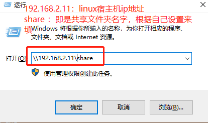
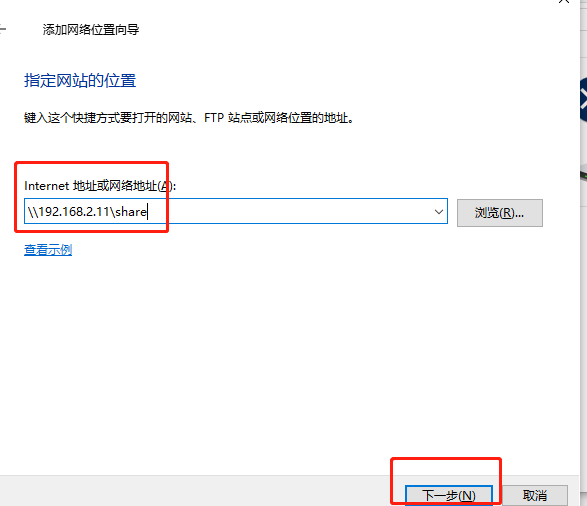

# Linux 常用嵌入式服务器搭建TFTP/NFS/SAMP

## TFTP 服务器相关 

1.安装tftp服务器：`sudo apt-get install tftp-hpa tftpd-hpa`
2.配置tftp服务器

```shell
mkdir -p /home/book/tftpboot
chmod 777 /home/book/tftpboot
sudo vim /etc/default/tftpd-hpa
		TFTP_DIRECTORY="/home/book/tftpboot" #配置tftp服务器目录
		TFTP_OPTIONS="-l -c -s"
```

3.重启TFTP服务:

```
sudo service tftpd-hpa restart
```

4.验证TFTP

```bash
# 随便在一个目录下
tftp 192.168.2.147
tftp> get b.txt
tftp> q
ls
b.txt
```


## NFS 服务器相关 

1.安装nfs服务器：

```shell
sudo apt-get install nfs-kernel-server
```

2.配置nfs服务器

```shell
sudo vim /etc/exports
	/home/book/nfs_rootfs *(rw,nohide,insecure,no_subtree_check,async,no_root_squash)
```

3.重启nfs服务:

```bash
sudo service nfs-kernel-server restart
```

4.验证nfs服务器

```bash
sudo mount -t nfs 192.168.2.101:/home/book/nfs_rootfs /mnt
```

5.开发板内核启动后挂根网络文件夹

```bash
[root@firefly-rk3288:/]# mount -t nfs  192.168.2.101:/home/book/nfs_rootfs /mnt
```

## Samb服务器

```shell
# 第一步：更新软件
sudo apt-get upgrade
sudo apt-get update
sudo apt-get dist-upgrade
# 第二步：安装samba服务器
sudo apt-get install samba samba-common
sudo chmod 777 /home/book/
# 第三步：添加用户
sudo smbpasswd -a book
# 第三步：配置samba服务器
sudo vim /etc/samba/smb.conf
# 内容如下：
[share]                           
   comment = this is a  share folder
   browseable = no
   path = /home/book/embdefire   # 需要共享的目录
   #path = /home/book/ming
   create mask = 0755
   directory mask = 0755

   valid users = book,ming
   write list = book
   force user = book
   force group = book
   public = yes
   available = yes
   writeable = yes


# 第四步：从新启动
sudo service smbd restart


# 参数说明：
[share]                           指定共享名，也就是客户端在访问时所看到的共享目录名字
   comment = this is a share      共享文件说明，有没有都可以
   browseable = no                不让匿名用户看到共享内容
   path = /home/book/embdefire    指定共享目录实际路径，要求必须使用绝对路径
   valid users = book,ming        指定的可以访问Samba 共享的用户
   write list = book              只允许book具有写权限
   create mask = 0755             设置新建文件的权限， （rwx r-x r-x）
   directory mask = 0755          设置新建文件夹的权限， （rwx r-x r-x）
    force user = book             设置用户
   force group = book             设置用户所在的组 这两项可以使在win下创建文件夹和删除文件的权限
   available = yes
   writeable = yes     共享目录是否允许Samba用户写入，虽然设置了所有Samba用户都可以写入，但由于“valid users”设置项限制了只能book,ming访问
sudo smbpasswd -a book 创建smb用户，并创建访问密码
```

win下访问samp服务器，如下图所示



添加一个网络位置，这样我们就可以在win下我的电脑里面找到共享的文件夹

