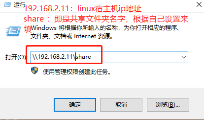
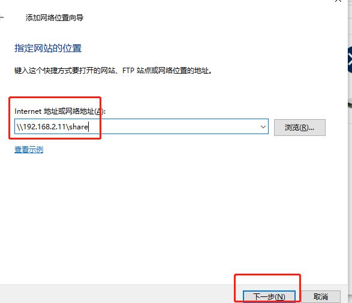

# 嵌入式Linux搭建TFTP/NFS/SAMP服务器

- **硬件平台**：

  ubuntu虚拟机：IP地址`192.168.2.11`

  window主机：IP地址：`192.168.2.10`

  注意：保证ubuntu和window在同一个网段，能互相ping即可

## TFTP 服务器相关 

目的：ubuntu下安装tftp服务器，设置共享目录为`/home/book/tftpboot`，arm板子在uboot阶段通过tftp服务下载ubuntu，tftp服务器中的内核、设备树、文件系统等到arm板子。

1. 安装tftp服务器：`sudo apt-get install tftp-hpa tftpd-hpa`

2. 配置tftp服务器

   ```bash
   mkdir -p /home/book/tftpboot
   chmod 777 /home/book/tftpboot
   sudo vim /etc/default/tftpd-hpa
   		TFTP_DIRECTORY="/home/book/tftpboot" #配置tftp服务器目录
   		TFTP_OPTIONS="-l -c -s"
   ```

   

3. 重启

   ```bash
   sudo service tftpd-hpa restart
   ```

4. 验证是否安装成功

   ```bash
   # 随便在一个目录下
   cd /home/book/tftpboot
   vim test.txt      # 在tftp共享目录下新建文件text.txt
   cd /home/book     # 切换到到它任意目录，除了tftp服务的共享目录/home/book/tftpboot
   tftp 192.168.2.11 # 连接tftp服务器
   tftp> get test.txt# 获取tftp服务器下的文件
   tftp> q           # 断开tftp连接
   ls                # 查看是否获取到文件
   b.txt
   ```

   


## NFS 服务器相关

目的：ubuntu下安装nfs服务器，设置共享文件夹`/home/book/nfs_rootfs`，方便arm板子通过挂载nfs网络文件夹，开发调试。

1. 安装nfs服务器

   ```bash
   sudo apt-get install nfs-kernel-server
   ```

2. 配置nfs服务器

   ```bash
   sudo vim /etc/exports
   	/home/book/nfs_rootfs *(rw,nohide,insecure,no_subtree_check,async,no_root_squash)
   ```

3. 重启nfs服务

   ```bash
   sudo service nfs-kernel-server restart
   ```

4. ubuntu下验证nfs服务器

   ```bash
   sudo mount -t nfs 192.168.2.11:/home/book/nfs_rootfs /mnt
   ```

5. 开发板内核启动后挂载NFS网络共享文件夹

   ```bash
   [root@firefly-rk3288:/]# mount -t nfs  192.168.2.11:/home/book/nfs_rootfs /mnt
   ```

   

## Samb服务器

```shell
# 第一步：更新软件
sudo apt-get upgrade
sudo apt-get update
sudo apt-get dist-upgrade
# 第二步：安装samba服务器
sudo apt-get install samba samba-common
sudo chmod 777 /home/book/
# 第三步：添加用户
sudo smbpasswd -a book
# 第三步：配置samba服务器
sudo vim /etc/samba/smb.conf
# 内容如下：
[share]                           
   comment = this is a  share folder
   browseable = no
   path = /home/book/embdefire   # 需要共享的目录
   #path = /home/book/ming
   create mask = 0755
   directory mask = 0755

   valid users = book,ming
   write list = book
   force user = book
   force group = book
   public = yes
   available = yes
   writeable = yes


# 第四步：从新启动
sudo service smbd restart


# 参数说明：
[share]                           指定共享名，也就是客户端在访问时所看到的共享目录名字
   comment = this is a share      共享文件说明，有没有都可以
   browseable = no                不让匿名用户看到共享内容
   path = /home/book/embdefire    指定共享目录实际路径，要求必须使用绝对路径
   valid users = book,ming        指定的可以访问Samba 共享的用户
   write list = book              只允许book具有写权限
   create mask = 0755             设置新建文件的权限， （rwx r-x r-x）
   directory mask = 0755          设置新建文件夹的权限， （rwx r-x r-x）
    force user = book             设置用户
   force group = book             设置用户所在的组 这两项可以使在win下创建文件夹和删除文件的权限
   available = yes
   writeable = yes     共享目录是否允许Samba用户写入，虽然设置了所有Samba用户都可以写入，但由于“valid users”设置项限制了只能book,ming访问
sudo smbpasswd -a book 创建smb用户，并创建访问密码
```

win下访问samp服务器，如下图所示



添加一个网络位置，这样我们就可以在win下我的电脑里面找到共享的文件夹

