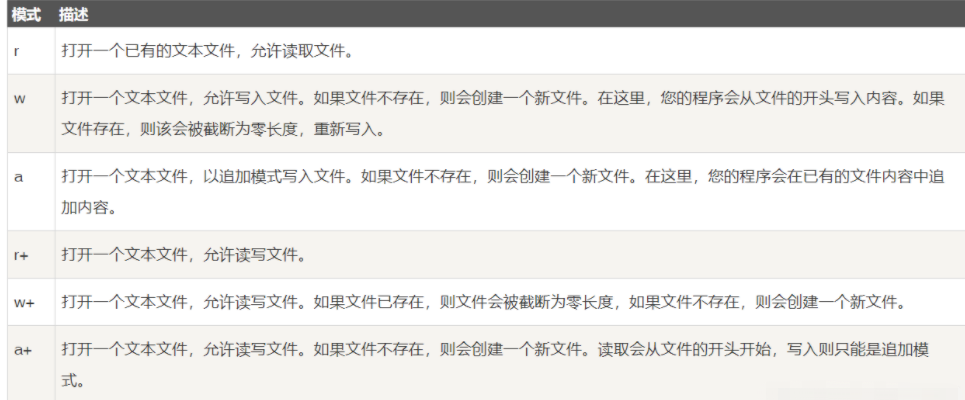

# 文件编程

在linux系统中一切皆文件，所有打开的文件都对应一个**文件描述符**。文件描述符是一个非负数的值，当打开文件时候由系统分配，文件描述符范围0-`OPEN_MAX`，`OPEN_MAX`在早起的linux中为19，现在很多系统调整到1024，即最多能打开1024个文件。

一个进程启动时，会自动打开三个流：

1. 标准输入流，文件描述符 0     宏 `STDIN_FILENO`表示
2. 标准输出流，文件描述符 1       宏 `STDOUT_FILENO` 表示
3. 标准错误处理流；文件描述符 2 宏 `STDERR_FILENO`表示

## 系统调用-文件访问

### 常用函数

1. perror函数

   ```c
   #include <stdio.h>
   void perror ( const char * str );
   描述：
       用来将上一个函数发生错误的原因输出到标准设备(stderr)。参数str 所指的字符串会先打印出，后面再加上错误原因字符串
   ```
   
   
   
2. creat函数：创建文件

   ```c
   int creat(const char *filename,mode_t mode)
   返回值：
       -1：失败 并把错误代码设给errno
       否则：返回文件描述符
   参数：
   filename：要创建的文件名，包含全路径，缺省路径的话默认为当前应用程序执行的路径
   mode：创建文件的权限
   
      	S_IRUSR 可读-文件拥有者所有者
   	S_IWUSR 可写-文件拥有者所有者
   	S_IXUSR 可执行-文件拥有者所有者
       S_IRWXU 可读、可写、可执行-文件拥有者所有者
      
       S_IRGRP 可读-组
   	S_IWGRP 可写-组
   	S_IXGRP 可执行-组
       S_IRWXG 可读、可写、可执行-组
       
       S_IROTH 可读-其它成员
   	S_IWOTH 可写-其它成员
   	S_IXOTH 可执行-其它成员
       S_IRWXO 可读、可写、可执行-其它成员
   
   注释：
       还可以直接使用数字表示访问权限
       可执行 1
       可写   2
       可读   4
       无任何权限 0
       
       例如：文件的权限组成：文件所有者-用户所在组-其它
       如果文件的属性值为 765，意思是：
       文件所有者对文件的权限是 	 7 即 可读可写可执行
       用户所在组成员对文件权限是	6  即 可读可写
       其它成员对文件的属性为5     5  即 可读可执行
   ```

3. open函数

   ```c
   #include <fcntl.h>
   int open(const char *path, int flags)		   // 如果flags没有O_CREAT时候使用
   int open(const char *path, int flags,int mode) // 如果flags有O_CREAT时候使用
       
   返回值：
       -1：失败 并把错误代码设给errno
       否则：返回文件描述符 
   参数：
       path  ：文件名,包含全路径，缺省路径，默认为可执行程序所在的路径
       flags：用于指定文件的打开标志
       	O_RDONLY       只读打开                        
           O_WRONLY       只写打开                        
           O_RDWR         读写打开
       	还可选择以下模式与以上3种基本模式相或：                    
      		O_CREAT     当打开的文件不存在的时候，创建一个文件出来，此时必须用三个参数的open
           O_EXCL      如果使用O_CREAT|O_EXCL选项，如果并且文件已存在,则出错返回            
      		O_TRUNC     打开一个已存在的文件并将文件长度设置为0，其他属性保持         
           O_NOBLOCK   非阻塞方式打开，在读取或写入的时如果没有数据，程序不会进入阻塞态 ，         
      		O_APPEND    追加打开文件                     
     		O_TEXT      打开文本文件翻译CR-LF控制字符     
      		O_BINARY    打开二进制字符，不作CR-LF翻译 
       mode：如果使用了O_CREAT的时候，才有效，此时为文件的权限，
          	S_IRUSR 可读-文件拥有者所有者
   		S_IWUSR 可写-文件拥有者所有者
   		S_IXUSR 可执行-文件拥有者所有者
       	S_IRWXU 可读、可写、可执行-文件拥有者所有者
      
       	S_IRGRP 可读-组
   		S_IWGRP 可写-组
   		S_IXGRP 可执行-组
       	S_IRWXG 可读、可写、可执行-组
       
       	S_IROTH 可读-其它成员
   		S_IWOTH 可写-其它成员
   		S_IXOTH 可执行-其它成员
       	S_IRWXO 可读、可写、可执行-其它成员
   ```

   

4. close函数

   ```c
   #include <unist.d>
   int close(int fd); 
   返回值：
       0：成功
       -1：失败
   参数：
       fd：文件描述符
   ```

   

5. read函数

   ```c
   int read(int fd,void *buff,size_t nbytes);
   描述  ：
       从当前文件偏移量开始，读取指nbyte字节到buff中；
   返回值：
       -1：出错
       0：读到文件末尾
       >0:返回实际读到的字节数
   参数：
       fd：文件描述符
       buff：读取数据到的缓存地址
       nbytes：读取的字节数
   ```

   

6. write函数

   ```c
   int write(int fd,const void *buff,size_t nbytes)
   描述  ：
       从当前文件偏移量开始，写入nbyte字节到buff中；
   返回值：
       实际写入的字节数，如果返回值等于nbytes,说明写入成功，否则失败
       
   ```

   

7. lseek函数

   ```c
   #include <unistd.h>
   #include <sys/types.h>
   off_t lseek(int fd, off_t offset, int whence);
   
   描述：
       改变文件访问位置
   参数：
       fd:文件描述符
       offset：偏移量（可正可负）
       whence：相对位置
   返回值：
       -1：失败
       否则：新的偏移量（成功）
   说明：
       1. 如果whence是 SEEK_SET，相对文件头
       2. 如果whence是 SEEK_CUR，相对当前位置
       3. 如果whence是 SEEK_END，相对文件尾
   ```

   - 利用lseek返回偏移量

     ```c
     #include <unistd.h>
     #include <sys/types.h>
     off_t curAddr;
     curAddr = lseek(fd,0,SEEK_CUR);
     ```

   - 利用lseek返回文件长度

     ```c
     #include <unistd.h>
     #include <sys/types.h>
     off_t fileLen;
     fileLen = lseek(fd,0,SEEK_END);
     ```

   

8. access函数：判断文件是否可进行某种操作

   ```c
   #include <stdio.h>
   #include <unistd.h>
   int access(const char * pathname, int mode)
   参数：
       pathname:需要检测的文件路劲名
   	mode:需要测试的操作模式。
           R_OK      测试读许可权
   		W_OK      测试写许可权
   		X_OK      测试执行许可权
   		F_OK      测试文件是否存在
   返回值：
   	成功执行时，返回0。失败返回-1，errno被设为以下的某个值 
   	EINVAL： 模式值无效 
   	EACCES： 文件或路径名中包含的目录不可访问 
   	ELOOP ： 解释路径名过程中存在太多的符号连接 
   	ENAMETOOLONG：路径名太长 
   	ENOENT：路径名中的目录不存在或是无效的符号连接 
   	ENOTDIR： 路径名中当作目录的组件并非目录 
   	EROFS： 文件系统只读 
   	EFAULT： 路径名指向可访问的空间外 
   	EIO：输入输出错误 
   	ENOMEM： 不能获取足够的内核内存 
   	ETXTBSY：对程序写入出错
   ```

### 示例


## 库函数-文件访问

库函数调用独立于操作系统， 无论是Window还是Linux或者VXworks，都是统一的接口。

### 常用函数

1. fopen函数

   ```c
   FILE *fopen( const char * filename, const char * mode );
   参数：
       filename：文件名
       mode：打开模式，特别说明：当操作的是二进制文件的时候，需要在上面的参数上加上b的后缀,
   
   返回值：
       返回一个文件描述符，用于后续其他操作
   ```

   **模式mode的取值如下**：

   

2. fclose函数

   ```c
   int fclose( FILE *fp );
   参数：
       fp即为需要关闭的文件描述符
   返回值：
       返回0关闭成功，返回-1发生错误
   ```

3. fread函数:从给定流 **stream** 读取数据到 **ptr** 所指向的数组中

   ```c
   size_t fread(void *ptr, size_t size, size_t nmemb, FILE *stream)
   参数：
   	ptr 	-- 这是指向带有最小尺寸 size*nmemb 字节的内存块的指针。
   	size 	-- 这是要读取的每个元素的大小，以字节为单位。
   	nmemb 	-- 这是元素的个数，每个元素的大小为 size 字节。
   	stream 	-- 这是指向 FILE 对象的指针，该 FILE 对象指定了一个输入流。
   返回值：
   	成功读取的元素总数会以 size_t 对象返回，size_t 对象是一个整型数据类型。如果总数与 nmemb 参数不同，则可能发生了一个错误或者到达了文件末尾
   ```

   使用示例：

   ```c
   #include <stdio.h>
   #include <string.h>
    
   int main()
   {
      FILE *fp;
      char c[] = "This is runoob";
      char buffer[20];
    
      /* 打开文件用于读写 */
      fp = fopen("file.txt", "w+");
    
      /* 写入数据到文件 */
      fwrite(c, strlen(c) + 1, 1, fp);
    
      /* 查找文件的开头 */
      fseek(fp, 0, SEEK_SET);
    
      /* 读取并显示数据 */
      fread(buffer, strlen(c)+1, 1, fp);
      printf("%s\n", buffer);
      fclose(fp);
      
      return(0);
   }
   
   运行结果：
   让我们编译并运行上面的程序，这将创建一个文件 file.txt，然后写入内容 This is runoob。接下来我们使用 fseek() 函数来重置写指针到文件的开头，文件内容如下所示：
   This is runoob
   ```

   

4. fwrite函数：把ptr所指向的内写入到流stream中

   ```c
   size_t fwrite(const void *ptr, size_t size, size_t nmemb, FILE *stream)
   参数：
   	ptr 	-- 这是指向要被写入的元素数组的指针。
   	size 	-- 这是要被写入的每个元素的大小，以字节为单位。
   	nmemb 	-- 这是元素的个数，每个元素的大小为 size 字节。
   	stream 	-- 这是指向 FILE 对象的指针，该 FILE 对象指定了一个输出流。
   返回值：
   	如果成功，该函数返回一个 size_t 对象，表示元素的总数，该对象是一个整型数据类型。如果该数字与 nmemb 参数不同，则会显示一个错误
   ```

   

   ```c
   #include<stdio.h>
    
   int main ()
   {
      FILE *fp;
      char str[] = "This is runoob.com";
    
      fp = fopen( "file.txt" , "w" );
      fwrite(str, sizeof(str) , 1, fp );
    
      fclose(fp);
     
      return(0);
   }
   
   运行结果：
       file.txt内容如下：This is runoob.com
   ```

   

5. fputc、fputs写入文件

   ```c
   int fputc( int c, FILE *fp ); 		//将单个字符写入到文件中
   int fputs( const char *s, FILE *fp );//将字符串写入文件
   
   返回值：
       如果写入成功，它会返回写入的字符，如果发生错误，则会返回-1
   ```

   

6. fprintf :发送格式化输出到流 stream 中

   ```c
   int fprintf(FILE *stream, const char *format, ...)
   参数:
       stream -- 这是指向 FILE 对象的指针，该 FILE 对象标识了流。
       format -- 这是 C 字符串，包含了要被写入到流 stream 中的文本。它可以包含嵌入的 format 标签，format 标签可被随后的附加参数中指定的值替换，并按需求进行格式化。format 标签属性是 %[flags][width][.precision][length]specifier，具体讲解如下：
   返回值:
   	如果成功，则返回写入的字符总数，否则返回一个负数
   ```

   | specifier（说明符） | 输出                                      |
   | :------------------ | :---------------------------------------- |
   | c                   | 字符                                      |
   | d 或 i              | 有符号十进制整数                          |
   | e                   | 使用 e 字符的科学科学记数法（尾数和指数） |
   | E                   | 使用 E 字符的科学科学记数法（尾数和指数） |
   | f                   | 十进制浮点数                              |
   | g                   | 自动选择 %e 或 %f 中合适的表示法          |
   | G                   | 自动选择 %E 或 %f 中合适的表示法          |
   | o                   | 有符号八进制                              |
   | s                   | 字符的字符串                              |
   | u                   | 无符号十进制整数                          |
   | x                   | 无符号十六进制整数                        |
   | X                   | 无符号十六进制整数（大写字母）            |
   | p                   | 指针地址                                  |
   | n                   | 无输出                                    |
   | %                   | 字符                                      |

   

   | flags（标识） | 描述                                                         |
   | :------------ | :----------------------------------------------------------- |
   | -             | 在给定的字段宽度内左对齐，默认是右对齐（参见 width 子说明符）。 |
   | +             | 强制在结果之前显示加号或减号（+ 或 -），即正数前面会显示 + 号。默认情况下，只有负数前面会显示一个 - 号。 |
   | (space)       | 如果没有写入任何符号，则在该值前面插入一个空格。             |
   | #             | 与 o、x 或 X 说明符一起使用时，非零值前面会分别显示 0、0x 或 0X。 与 e、E 和 f 一起使用时，会强制输出包含一个小数点，即使后边没有数字时也会显示小数点。默认情况下，如果后边没有数字时候，不会显示显示小数点。 与 g 或 G 一起使用时，结果与使用 e 或 E 时相同，但是尾部的零不会被移除。 |
   | 0             | 在指定填充 padding 的数字左边放置零（0），而不是空格（参见 width 子说明符）。 |

   

   | width（宽度） | 描述                                                         |
   | :------------ | :----------------------------------------------------------- |
   | (number)      | 要输出的字符的最小数目。如果输出的值短于该数，结果会用空格填充。如果输出的值长于该数，结果不会被截断。 |
   | *             | 宽度在 format 字符串中未指定，但是会作为附加整数值参数放置于要被格式化的参数之前。 |

   

   | .precision（精度） | 描述                                                         |
   | :----------------- | :----------------------------------------------------------- |
   | .number            | 对于整数说明符（d、i、o、u、x、X）：precision 指定了要写入的数字的最小位数。如果写入的值短于该数，结果会用前导零来填充。如果写入的值长于该数，结果不会被截断。精度为 0 意味着不写入任何字符。 对于 e、E 和 f 说明符：要在小数点后输出的小数位数。 对于 g 和 G 说明符：要输出的最大有效位数。 对于 s: 要输出的最大字符数。默认情况下，所有字符都会被输出，直到遇到末尾的空字符。 对于 c 类型：没有任何影响。 当未指定任何精度时，默认为 1。如果指定时不带有一个显式值，则假定为 0。 |
   | .*                 | 精度在 format 字符串中未指定，但是会作为附加整数值参数放置于要被格式化的参数之前。 |

   

   | length（长度） | 描述                                                         |
   | :------------- | :----------------------------------------------------------- |
   | h              | 参数被解释为短整型或无符号短整型（仅适用于整数说明符：i、d、o、u、x 和 X）。 |
   | l              | 参数被解释为长整型或无符号长整型，适用于整数说明符（i、d、o、u、x 和 X）及说明符 c（表示一个宽字符）和 s（表示宽字符字符串）。 |
   | L              | 参数被解释为长双精度型（仅适用于浮点数说明符：e、E、f、g 和 G）。 |

   **附加参数** -- 根据不同的 format 字符串，函数可能需要一系列的附加参数，每个参数包含了一个要被插入的值，替换了 format 参数中指定的每个 % 标签。参数的个数应与 % 标签的个数相同。

   使用示例：

   ```c
   #include <stdio.h>
   #include <stdlib.h>
   
   int main()
   {
      FILE * fp;
   
      fp = fopen ("file.txt", "w+");
      fprintf(fp, "%s %s %s %d", "We", "are", "in", 2014);
      
      fclose(fp);
      
      return(0);
   }
   运行结果：file.txt内容如下：
   We are in 2014
   ```

   

7. fscanf：从一个流中进行格式化输入到stream中

   ```c
    int fscanf(FILE *stream, const char *format, ...)//从一个流中格式化输入
   参数:
   	stream -- 这是指向 FILE 对象的指针，该 FILE 对象标识了流。
   	format -- 这是C字符串，
   ```

   使用示例：

   ```c
   #include <stdio.h>
   #include <stdlib.h>
   
   int main()
   {
      char str1[10], str2[10], str3[10];
      int year;
      FILE * fp;
   
      fp = fopen ("file.txt", "w+");
      fputs("We are in 2014", fp);
      
      rewind(fp);
      fscanf(fp, "%s %s %s %d", str1, str2, str3, &year);
      
      printf("Read String1 |%s|\n", str1 );
      printf("Read String2 |%s|\n", str2 );
      printf("Read String3 |%s|\n", str3 );
      printf("Read Integer |%d|\n", year );
   
      fclose(fp);
      
      return(0);
   }
   
   运行结果：
   Read String1 |We|
   Read String2 |are|
   Read String3 |in|
   Read Integer |2014|
   ```

   

8. fgetc、fgets读取文件

   ```c
   int fgetc( FILE * fp ); //读出单个字符 返回值是读取的字符，如果发生错误则返回 -1
   char *fgets( char *buf, int n, FILE *fp );//读n-1字符串并在最后追加一个 null 字符来终止字符串
   可以使用fscanf()函数读取文件中包含多个结束符'\0'的文件，因为fgets()函数遇到'\0'字符串结束符时就会退出。但是fscanf()在遇到第一个空格和换行符时，它会停止读取
   ```

   ```c
   
   ```

   ```c
   #include <stdio.h>
   #include <stdlib.h>
   #include <string.h>
   
   int main(int argc, char *argv[])
   {
       FILE *fp = NULL;
       char write_buf[]={0};
       char read_buf[] ={0};
       int count;
       int str;
       int i = 0;
       char cha = 1;
   
       fp = fopen("test.txt", "w+");
       count = fputs("This is a file operation test!\n", fp);
       if(count < 0)
           printf("write file failed!\n");
       str = fputc('9', fp);
       printf("1 str = %c\n", str);
       str = fputc('\n', fp);
       printf("2 str = %c\n", str);
       for(i=1; i<=3; i++)
       fprintf(fp, "this is NO.%d test!\n",i);
   
   
       if(0 != fclose(fp))
       {
           printf("close txt failed!\n");
           fp = 0;
       }
       fp = fopen("test.txt", "r+");//以可读写的方式打开文件
   
       //fgets()
       printf("--------------------test read!!!\n");
       printf("use fgets():\n");
       for(i = 0; i <= 5; i++)
       {
           fgets(read_buf, 60, fp);
           printf("readbud_%d = %s\n", i ,read_buf);
       }
       //fgetc()
       printf("\n--------------------------------\n");
       if(0 != fclose(fp))
       {
           printf("close txt failed!\n");
           fp = 0;
       }
       fp = fopen("test.txt", "r+");//以可读写的方式打开文件
       printf("use fgetc():\n");
       do{
           cha = fgetc(fp);
           printf("%c",cha);
       }
       while(cha > 0);
   
       //fscanf()
       printf("\n--------------------------------\n");
       if(0 != fclose(fp))
       {
           printf("close txt failed!\n");
           fp = 0;
       }
       fp = fopen("test.txt", "r+");//以可读写的方式打开文件
       printf("\nuse fscanf():\n");
       while(i>0)
       {
           i = fscanf(fp, "%s", read_buf);
           printf("%s\n", read_buf);
       }
   
       printf("file operation test finish!\n");
       fclose(fp);
       exit(0);
   }
   
   ```


