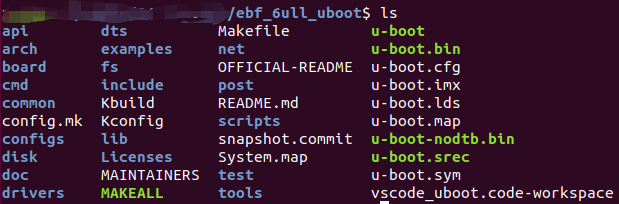
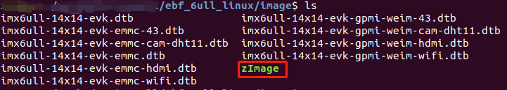
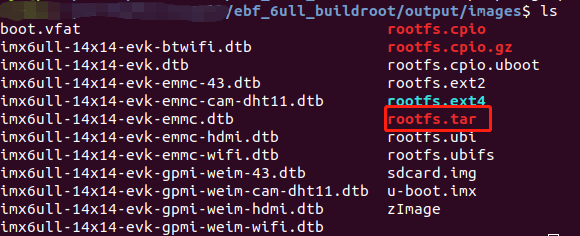

# 编译

**硬件平台**：野火i.MX6ULL Linux Pro EMMC版本

**软件平台**：Ubuntu18.04 

**约定**：默认虚拟机tftp服务器目录：`~/tftpboot` 默认虚拟机NFS服务器目录：`~/nfs_rootfs`

## boot启动方式

| 编号 | 名称   | NAND FLASH | eMMC | SD   | USB  |
| ---- | ------ | ---------- | ---- | ---- | ---- |
| 1    | MODE0  | 0          | 0    | 0    | 1    |
| 2    | MODE1  | 1          | 1    | 1    | 0    |
| 3    | CFG1-4 | 1          | 0    | 0    | X    |
| 4    | CFG1-5 | 0          | 1    | 0    | X    |
| 5    | CFG1-6 | 0          | 1    | 1    | X    |
| 6    | CFG1-7 | 1          | 0    | 0    | X    |
| 7    | CFG2-3 | 0          | 1    | 0    | X    |
| 8    | CFG2-5 | 0          | 0    | 1    | X    |

**注意**：其中的USB启动模式主要用来配合NXP官方的`mfgtool`工具烧录镜像。

## uboot编译

### 资源下载

```bash
git clone https://gitee.com/FireIMX6ULL/ebf_6ull_uboot.git
```

### 编译

```bash
cd ebf_6ull_uboot  #切换到uboot目录

make distclean 

################################
# 加载默认配置，下面根据自己硬件三选一
################################
make mx6ull_14x14_evk_nand_defconfig	#1. nand版本配置：
make mx6ull_14x14_evk_emmc_defconfig	#2. emmc版本配置：
make mx6ull_14x14_evk_defconfig			#3. sd卡版本配置：

make -j4  # 开始编译
```

编译完成后在`ebf_6ull_uboot/`目录下生成镜像文件。



## 内核编译

### 资源下载

```bash
git clone https://gitee.com/FireIMX6ULL/ebf_6ull_linux.git
```

## 编译

```bash
make  clean
make imx6_v7_ebf_defconfig         
make -j4
make dtbs  -j4 
make modules  -j4 
```

编译完后在输出镜像文件路径：

- 内核镜像zImage ：`ebf_6ull_linux/arch/arm/boot`
- 设备树镜像dtb    ：`ebf_6ull_linux/arch/arm/boot/dts`

执行`ebf_6ull_linux/copy.sh`脚本可以把内核和设备树拷贝到`ebf_6ull_linux/image`目录下。



我们可以手动把设备树和内核镜像拷贝到tftp共享目录下，以便后面通过tftp加载内核和设备树。

```bash
cd ebf_6ull_linux/image
sudo rm ~/tftpboot/* -rf
cp ./* ~/tftpboot
```


## 文件系统

### 资源下载

```bash
git clone https://gitee.com/FireIMX6ULL/ebf_6ull_buildroot.git
```

### 编译

```bash
make  clean

################################
# 加载默认配置，下面根据自己需求三选一
################################
make imx6ull_ebf_pro_defconfig     #1.带Qt Demo配置
make imx6ull_ebf_minimal_defconfig #2.最小的完整镜像配置（文件系统6M左右）
make imx6ull_ebf_pico_defconfig    #3.pico文件系统配置（不编译uboot与内核，文件系统5M左右）

make -j4
```

编译完后生成镜像文件路径：`ebf_6ull_buildroot/output/images/`



最终生成的文件系统我们可以解压到nfs的共享目录，以备后面挂载网络文件系统使用

```bash
cd ebf_6ull_buildroot/output/images
sudo rm ~/nfs_rootfs/* -rf
sudo tar -xvf rootfs.tar -C ~/nfs_rootfs

```

