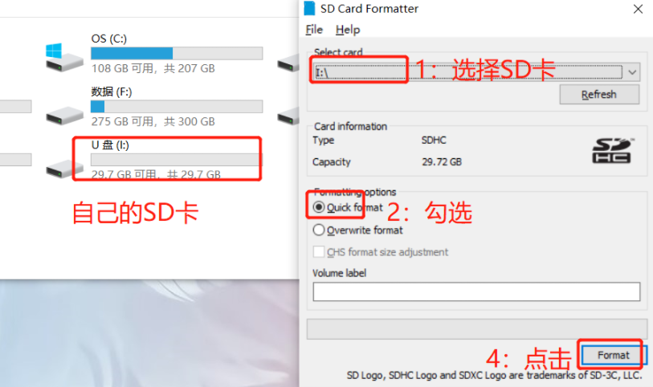
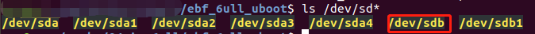

# 下载

**硬件平台**：野火i.MX6ULL Linux Pro EMMC版本

**软件平台**：Ubuntu18.04 

**约定**：默认虚拟机tftp服务器目录：`~/tftpboot` 默认虚拟机NFS服务器目录：`~/nfs_rootfs`

默认zImage加载到RAM的0x808000000地址，设备树加载到0x83000000地址。

## 挂载网络文件系统

### 烧录u-uboot-dtb.imx到SD卡

1. 使用【SD Card Formatter】工具，格式化SD卡，如下图所示;

   

2. 单独烧写uboot到SD卡

   - 挂载格式化后的SD卡到到Ubuntu虚拟机上，确定设备名：

     

   - 使用dd命令烧写镜像到sd卡中

     ```bash
     sudo dd if=u-boot.imx of=/dev/sdb bs=1k seek=1 conv=fsync
     ```

3. 使用sd卡启动后，准备修改uboot启动参数。

### 修改Uboot启动参数

约定如下：

- Ubuntu18.04虚拟机IP（TFTP和NFS服务器）：10.0.0.5
- 开发板ip地址：10.0.0.10
- 子网掩码：255.0.0.0
- 网关：10.0.0.1

修改boot启动参数如下：

```bash
setenv ethaddr 08:00:00:00:22:02
setenv gatewayip 10.0.0.1
setenv netmask 255.0.0.0
setenv ipaddr 10.0.0.10
setenv serverip 10.0.0.5
setenv nfsroot /home/xym/nfs_rootfs
setenv ip_dyn no

setenv netargs setenv bootargs console=${console},${baudrate} root=/dev/nfs ip=${ipaddr}:${serverip}:${gatewayip}:${netmask}:imx6ull:eth0:off nfsroot=${serverip}:${nfsroot},v3,tcp
#saveenv 可选项 保存环境变量 可以下次启动的时候默认运行netboot


run netboot
```

或者使用下面的配置

```bash
setenv ethaddr 08:00:00:00:22:02
setenv gatewayip 10.0.0.1
setenv netmask 255.0.0.0
setenv ipaddr 10.0.0.10
setenv serverip 10.0.0.5
setenv nfsroot /home/xym/nfs_rootfs
 

setenv bootargs console=${console},${baudrate} root=/dev/nfs ip=${ipaddr}:${serverip}:${gatewayip}:${netmask}:imx6ull:eth0:off nfsroot=${serverip}:${nfsroot},v3,tcp
setenv bootcmd 'tftp 80800000 zImage; tftp 83000000 imx6ull-14x14-evk.dtb;bootz 80800000 - 83000000' 

#saveenv 可选项 保存环境变量 可以下次启动的时候默认运行netboot

boot
```

## SD卡


## emmc


## NAND


