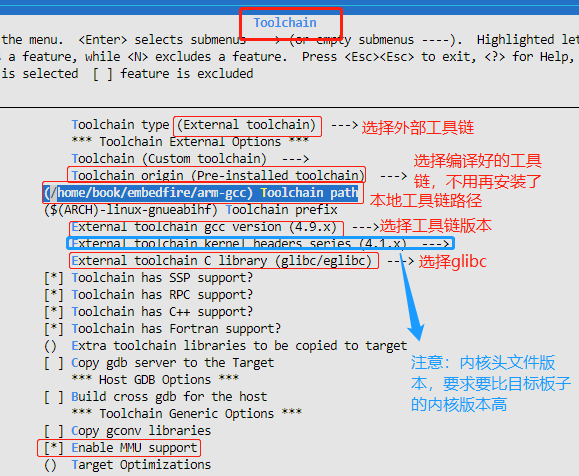
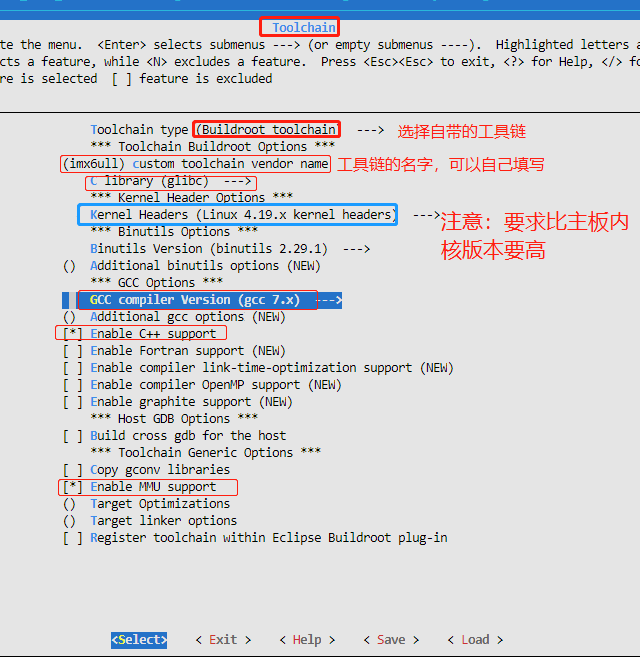
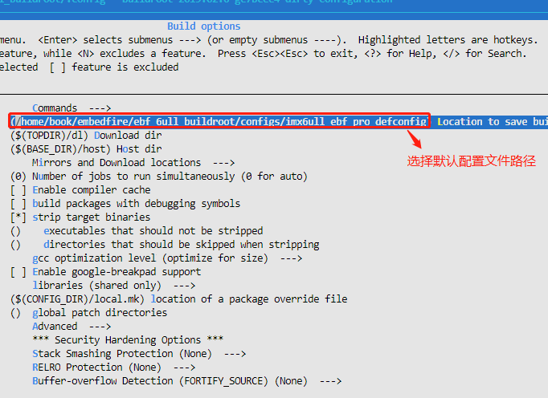
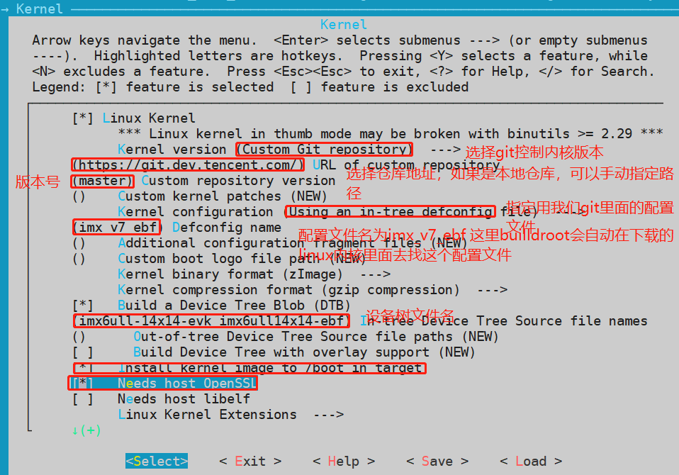
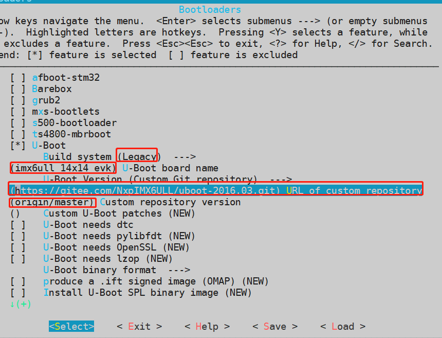

# Buildroot对工具链、内核、uboot的管理

## Toolchain

### 本地工具链



### Buildroot自带的工具链



注意：自带的工具链编译完后的输出路径

```bash
cd buildroot/output/host/usr/bin/
```

## 编译选项

buildroot默认配置文件一般位于buildroot源码路径的`configs/`路径下

我们可以自己填写默认配置文件



默认的配置文件也可以填写相对路径

```bash
$(TOPDIR)/configs/imx6ull_ebf_pro_defconfig
或者
$(CONFIG_DIR)/imx6ull_ebf_pro_defconfig
```

## 内核



**注意**：

`imx_v7_ebf_defconfig` 在linux代码的`arch/arm/configs/` 路径下，这里在填写的时候不带`_defconfig`

`imx6ull-14x14-evk.dts` 和`imx6ull-14x14-ebf.dts` 在linux代码的`arch/arm/boot/dts/`目录下，这里填写的时候不要带`.dts`

如果我们PC本地已经有了linux的内核源码，上面的git仓库地址可以填写本地的地址：

```bash
/home/book/embedfire/ebf_6ull_linux
```

buildroot在编译的时候会自动根据填写的git厂库地址和指定的版本号，指定的默认配置文件imx_v7_ebf_defconfig和设备树`imx6ull-14x14-evk.dts imx6ull-14x14-ebf.dts`编译出内核放到buildroot源码的output目录下。

uboot



同理：如果本地已经有了uboot的源码，可以指定上面的uboot的内核源码路径：

```
/home/book/embedfire/ebf_6ull_uboot
```

nxp官方给了三个默认的uboot配置：

- mx6ull_14x14_evk_defconfig                     sd卡版本
- mx6ull_14x14_evk_emmc_defconfig       emmc版本
- mx6ull_14x14_evk_nand_defconfig         nand flash版本

我们这里填了个mx6ull_14x14_evk，即默认会编译出sd卡版本的uboot

