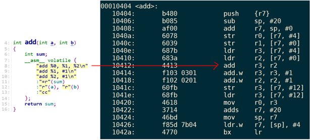
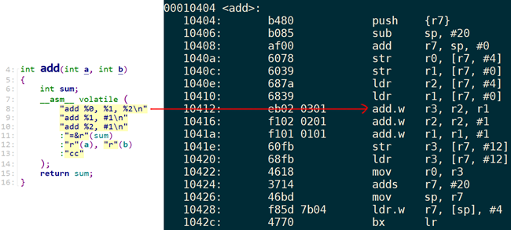

# 内敛汇编

> **内敛汇编代码清单1：**
>
> ```c
> int add(int a, int b)
> {
>     int sum;
>     __asm__ volatile (
>         "add %0, %1, %2"    // 汇编代码：实现sum=a+b
>         :"=r"(sum)          // 结果，存放在sum中，汇编代码中可以用%0引用
>         :"r"(a), "r"(b)		// 把a和b放入某些寄存器，汇编代码可以使用%1 %2引用
>         :"cc"
>     );
>     return sum;
> }
> ```

> **内敛汇编代码清单2**：
>
> ```c
> int add(int a, int b)
> {
>     int sum;
>     __asm__ volatile (
>         "add %[result], %[val1], %[val2]" // 汇编代码：实现sum=a+b
>         :[result]"=r"(sum)          // 结果，存放在sum中，汇编代码中用%[result]引用
>         :[val1]"r"(a), [val2]"r"(b)	// 把a和b放入寄存器，汇编代码使用%[val1] %[val2]引用
>         :"cc"
>     );
>     return sum;
> }
> ```


## 内敛汇编语法

```
 asm [ asm-qualifiers ] (  
         assembler template                   /* 汇编代码，每行用双引号""，换行用\n */
         [ : output operands ]                /* 输出操作 */
         [ : input operands  ]                /* 输入操作 */
         [ : list of clobbered registers ]    /* 影响的寄存器列表 */
         );
```

- `asm`：也可以写作`__asm__`，表示这是一段内联汇编；

- `asm-qualifiers`：有三个取值

  - volatile：告诉编译器不要随便优化这段代码，例如使用`mov r0, r0`用来做短暂延时。
  - inline：不讲
  - goto：不讲

- `assembler template`：具体汇编指令代码，双引号，`\n`分开；

- `output operands`：输出操作数，格式如下：

  ```
  [ [asmSymbolicName] ] constraint (cvariablename)
  ```

  - `asmSymbolicName`：符号名，随便，也可以不写；

  - `constraint`：表示约束；

    | constraint | 描述                                                         |
    | ---------- | ------------------------------------------------------------ |
    | m          | memory operand，表示要传入有效的地址，只要CPU能支持该地址，就可以传入 |
    | r          | register operand，寄存器操作数，使用寄存器来保存这些操作数   |
    | i          | immediate integer operand，表示可以传入一个立即数            |

    `constraint`前还可以加上一些修饰字符，比如“=r”、“+r”、“=&r”，含义如下：

    | constraint Modifier Characters | 描述                                         |
    | ------------------------------ | -------------------------------------------- |
    | =                              | 表示内联汇编会修改这个操作数，即：写         |
    | +                              | 这个操作数即被读，也被写                     |
    | &                              | 它是一个earlyclobber操作数  ，**后面重点讲** |

  - `cvariablename`：C语言的变量名：

    **示例1**：汇编代码中会通过某个寄存器把结果写入c语言的sum变量。在汇编代码中可以使用`“%[result]”`来引用它

    ```
    [result] "=r" (sum)
    ```

    **示例2**：变量a、b的值会放入某些寄存器。在汇编代码中可以使用%1、%2等使用它们。

    ```
    "r"(a), "r"(b)
    ```

    

- `InputOperands`：输入操作符，接收输入参数。

  格式如下：

  ```
  [ [asmSymbolicName] ] constraint (cexpression)
  ```

  - `asmSymbolicName`：符号名，随便取，也可以不写；
  - `constraint`：表示约束，参考上一小节，跟OutputOperands类似；
  - `cexpression`：C语言的表达式。

  **示例1：**它的意思变量a、b的值会放入某些寄存器。在汇编代码中可以使用%[a_val]、%[b_val]使用它们

  ```
   [a_val]"r"(a), [b_val]"r"(b)
  ```

  **示例2：**变量a、b的值会放入某些寄存器。在汇编代码中可以使用%0、%1等使用它们

  ```
  "r"(a), "r"(b)
  ```

- `Clobbers`：在汇编代码中，对于`OutputOperands`所涉及的寄存器、内存，肯定是做了修改。但是汇编代码中，也许要修改的寄存器、内存会更多。比如在计算过程中可能要用到r3保存临时结果，我们必须在`Clobbers`中声明r3会被修改。如下示例所示：

  ```
  : "r0", "r1", "r2", "r3", "r4", "r5", "memory"
  ```

  常用Clobbers如下所示：

  | Clobbers | 描述                                                         |
  | -------- | ------------------------------------------------------------ |
  | cc       | 表示汇编代码会修改`flags register`                           |
  | memory   | 表示汇编代码中，除了`InputOperands`和`OutputOperands`中指定的之外，  还会会读、写更多的内存 |

### earlyclobber

首先看下面的实例：

输出操作数%0对应的寄存器是r3，输入操作数%1对应的寄存器也是r3。第8行更新了%0的值后，第9行又修改%1的值，由于%0、%1是同一个寄存器r3，所以%0的值也被修改了。而我们的最终返回的累加值在%0中存取，所以导致返回值错误。



解决方案：在第11行加“&”就可以了，这是告诉编译器，对于%0操作数它是earlyclobber的，不能跟其他操作数共用寄存器

