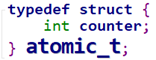
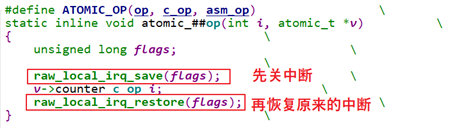
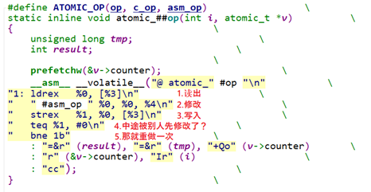
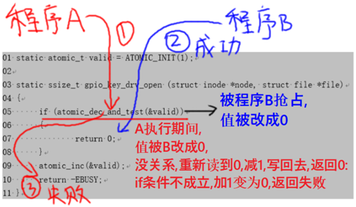
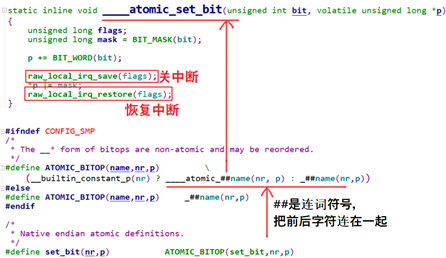
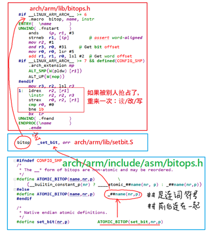
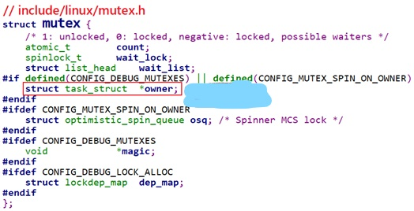

# 内核态同步与互斥

## 原子操作的实现原理与使用

**原子操作**就是这个操作不会被打断。Linux有2种原子操作：原子变量、原子位。

### 原子变量内核操作函数

原子变量的操作函数在Linux内核文件`arch\arm\include\asm\atomic.h`中。

原子变量类型如下，实际上就是一个结构体(内核文件`include/linux/types.h`)：



操作函数：下表中v都是atomic_t指针

| 函数名                 | 作用                                             |
| ---------------------- | ------------------------------------------------ |
| atomic_read(v)         | 读出原子变量的值，即v->counter                   |
| atomic_set(v,i)        | 设置原子变量的值，即v->counter = i               |
| atomic_inc(v)          | v->counter++                                     |
| atomic_dec(v)          | v->counter--                                     |
| atomic_add(i,v)        | v->counter += i                                  |
| atomic_sub(i,v)        | v->counter -= i                                  |
| atomic_inc_and_test(v) | 先加1，再判断新值是否等于0；等于0的话，返回值为1 |
| atomic_dec_and_test(v) | 先减1，再判断新值是否等于0；等于0的话，返回值为1 |

### 原子变量内核实现

**注意**：SMP就是Symmetric Multi-Processors，对称多处理器；UP即Uni-Processor，系统只有一个单核CPU。

这些函数都是在Linux内核文件`arch\arm\include\asm\atomic.h`中。

`atomic_read`，`atomic_set`这些操作都只需要一条汇编指令，所以它们本身就是不可打断的。

问题在于`atomic_inc`这类操作，要读出、修改、写回。

以`atomic_inc`为例，在`atomic.h`文件中，如下定义：

```c
#define atomic_inc(v)    atomic_add(1, v)
```

`atomic_add`又是怎样实现的呢？用下面这个宏：

```c
ATOMIC_OPS(add, +=, add)
```

把这个宏展开：

```c
#define ATOMIC_OPS(op, c_op, asm_op)  \
  ATOMIC_OP(op, c_op, asm_op)         \
  ATOMIC_OP_RETURN(op, c_op, asm_op)  \
  ATOMIC_FETCH_OP(op, c_op, asm_op)
```

从上面的宏可以知道，一个ATOMIC_OPS定义了3个函数。比如`ATOMIC_OPS(add, +=, add)`就定义了这3个函数：

```
atomic_add
atomic_add_return
atomic_atomic_fetch_add 或 atomic_fetch_add_relaxed
```

我们以`ATOMIC_OP(add, +=, add)`为例，看它是如何实现`atomic_add`函数的，对于UP系统、SMP系统，分别有不同的实现方法。

#### ATOMIC_OP在UP系统中的实现

对于ARMv6以下的CPU系统，不支持SMP。原子变量的操作简单粗暴：关中断，中断都关了，谁能来打断我？代码如下(`arch\arm\include\asm\atomic.h`)：



#### ATOMIC_OP在SMP系统中的实现

对于ARMv6及以上的CPU，有一些特殊的汇编指令来实现原子操作，不再需要关中断，代码如下(`arch\arm\include\asm\atomic.h`)：



##### ldrex、strex 指令解析

在ARMv6及以上的架构中，有`ldrex、strex`指令，`ex`表示`exclude`，意为独占地。这2条指令要配合使用，举例如下：

```asm
ldrex r0, [r1]			# 步骤1：读取r1地址值到r0寄存器，并标记r1所指的内存地址为独占模式
add r0,1                # 步骤2：修改r0的值
strex r2, r0, [r1]      # 步骤3：分两种情况
# 如果r1独占访问标记还在，则把r0的新值写入r1所指内存，并且清除独占访问的标记，把r2设为0表示成功
# 如果r1的独占访问标记不存在了，就不会更新内存，并且把r2设为1表示失败
```

假设这样的抢占场景：

- 程序A在读出、修改某个变量时(比如程序A处于步骤2)，被程序B抢占了；
-  程序B先完成了操作，程序B的`strex`操作会清除**独占访问**的标记；
-  轮到程序A执行剩下的写入操作时(步骤3)，它发现**独占访问**标记不存在了，于是取消写入操作。这就避免了这样的事情发生：**程序A、B同时修改这个变量，并且都自认为成功了**。

举报个例子，比如前面的`atomic_add`函数，假设一开始变量值为0，程序A本想把值从0变为1；但是中途被程序B先把值从0变成1了；但是没关系，程序A里会再次读出新值1、再修改、写入，最终这个值被程序A从1改为2。从整个过程看出程序A虽然被程序B打断了，但是A在被打断后，是重新读出新值再进行下面的操作，这个过程是没有被打断。对于程序B，整个add过程也是连续进行，所以，从这个角度来看，整个过程是连续的，也符合原子的定义：一个完整的**读、修改、写入**原子的，不会被别的程序打断。

在ARMv6及以上的架构中，原子操作不再需要关闭中断，关中断的花销太大了。并且关中断并不适合SMP多CPU系统，你关了CPU0的中断，CPU1也可能会来执行些操作啊。

在ARMv6及以上的架构中，原子操作的执行过程是可以被打断的，但是它的效果符合**原子**的定义：一个完整的**读、修改、写入**原子的，不会被别的程序打断。它的思路很简单：如果被别的程序打断了，那就重来，最后总会成功的。

### 原子变量使用案例

```c
static atomic_t valid = ATOMIC_INIT(1);

static ssize_t gpio_key_drv_open (struct inode *node, struct file *file)
{
      if (atomic_dec_and_test(&valid))
      {
              return 0;
      }
      atomic_inc(&valid);
      return -EBUSY;
}

static int gpio_key_drv_close (struct inode *node, struct file *file)
{
      atomic_inc(&valid);
      return 0;
}


```

第5行的**atomic_dec_and_test**，这是一个原子操作，在ARMv6以下的CPU架构中，这个函数是在关中断的情况下执行的，它确实是**原子**的，执行过程不被打断。

但是在ARMv6及以上的CPU架构中，这个函数其实是可以被打断的，但是它实现了原子操作的效果，如下图所示：



### 原子位操作

#### 原子位的内核操作函数

原子位的操作函数在Linux内核文件`arch\arm\include\asm\bitops.h`中，下表中p是一个`unsigned long`指针。

| 函数名                    | 作用                                                     |
| ------------------------- | -------------------------------------------------------- |
| set_bit(nr,p)             | 设置(*p)的bit nr为1                                      |
| clear_bit(nr,p)           | 清除(*p)的bit nr为0                                      |
| change_bit(nr,p)          | 改变(*p)的bit nr，从1变为0，或是从0变为1                 |
| test_and_set_bit(nr,p)    | 设置(*p)的bit nr为1，返回该位的老值                      |
| test_and_clear_bit(nr,p)  | 清除(*p)的bit nr为0，返回该位的老值                      |
| test_and_change_bit(nr,p) | 改变(*p)的bit nr，从1变为0，或是从0变为1；返回该位的老值 |

#### 原子位的内核实现

1. 在**ARMv6以下**的架构里，不支持SMP系统，原子位的操作函数也是简单粗暴：关中断。以`set_bit`函数为例，代码在内核文件**arch\arm\include\asm\bitops.h**中，如下：

   

2. 在**ARMv6及以上**的架构中，不需要关中断，有`ldrex、strex`等指令，这些指令的作用在前面介绍过。还是以`set_bit`函数为例，代码如下：

   


## Linux锁的介绍与使用

Linux内核提供了很多类型的锁，它们可以分为两类：

1. 自旋锁(spinning lock)；
2. 睡眠锁(sleeping lock)。

### 自旋锁

简单地说就是无法获得锁时，不会休眠，会一直循环等待。有这些自旋锁：

| 自旋锁         | 描述                     |
| -------------- | ------------------------ |
| raw_spinlock_t | 原始自旋锁(后面讲解)     |
| bit spinlocks  | 位自旋锁(似乎没什么意义) |

 

自旋锁的加锁、解锁函数是：`spin_lock`、`spin_unlock`，还可以加上各种后缀，这表示在加锁或解锁的同时，还会做额外的事情：

| 后缀               | 描述                                                     |
| ------------------ | -------------------------------------------------------- |
| _bh()              | 加锁时禁止下半部(软中断)，解锁时使能下半部(软中断)       |
| _irq()             | 加锁时禁止中断，解锁时使能中断                           |
| _irqsave/restore() | 加锁时禁止并中断并记录状态，解锁时恢复中断为所记录的状态 |

###  睡眠锁

简单地说就是无法获得锁时，当前线程就会休眠。有这些休眠锁：

| 休眠锁              | 描述                                           |
| ------------------- | ---------------------------------------------- |
| mutex               | mutual exclusion，彼此排斥，即互斥锁(后面讲解) |
| rt_mutex            |                                                |
| semaphore           | 信号量、旗语(后面讲解)                         |
| rw_semaphore        | 读写信号量，读写互斥，但是可以多人同时读       |
| ww_mutex            |                                                |
| percpu_rw_semaphore | 对rw_semaphore的改进，性能更优                 |

###  锁的内核函数

#### 自旋锁

spinlock函数在内核文件`include\linux\spinlock.h`中声明，如下表：

| 函数名                               | 作用                                         |
| ------------------------------------ | -------------------------------------------- |
| spin_lock_init(_lock)                | 初始化自旋锁为unlock状态                     |
| void spin_lock(spinlock_t *lock)     | 获取自旋锁(加锁)，返回后肯定获得了锁         |
| int spin_trylock(spinlock_t *lock)   | 尝试获得自旋锁，成功获得锁则返回1，否则返回0 |
| void spin_unlock(spinlock_t *lock)   | 释放自旋锁，或称解锁                         |
| int spin_is_locked(spinlock_t *lock) | 返回自旋锁的状态，已加锁返回1，否则返回0     |

 

自旋锁的加锁、解锁函数是：`spin_lock`、`spin_unlock`，还可以加上各种后缀，这表示在加锁或解锁的同时，还会做额外的事情：

| 后缀               | 描述                                                     |
| ------------------ | -------------------------------------------------------- |
| _bh()              | 加锁时禁止下半部(软中断)，解锁时使能下半部(软中断)       |
| _irq()             | 加锁时禁止中断，解锁时使能中断                           |
| _irqsave/restore() | 加锁时禁止并中断并记录状态，解锁时恢复中断为所记录的状态 |

####  信号量semaphore

semaphore函数在内核文件`include\linux\semaphore.h`中声明，如下表：

| 函数名                                                | 作用                                                         |
| ----------------------------------------------------- | ------------------------------------------------------------ |
| DEFINE_SEMAPHORE(name)                                | 定义一个struct semaphore name结构体，  count值设置为1        |
| void sema_init(struct semaphore *sem, int val)        | 初始化semaphore                                              |
| void down(struct semaphore *sem)                      | 获得信号量，如果暂时无法获得就会休眠  返回之后就表示肯定获得了信号量  在休眠过程中无法被唤醒，  即使有信号发给这个进程也不处理 |
| int down_interruptible(struct semaphore *sem)         | 获得信号量，如果暂时无法获得就会休眠，  休眠过程有可能收到信号而被唤醒，  要判断返回值：  0：获得了信号量  -EINTR：被信号打断 |
| int down_killable(struct semaphore *sem)              | 跟down_interruptible类似，  down_interruptible可以被任意信号唤醒，  但down_killable只能被“fatal signal”唤醒，  返回值：  0：获得了信号量  -EINTR：被信号打断 |
| int down_trylock(struct semaphore *sem)               | 尝试获得信号量，不会休眠，  返回值：  0：获得了信号量  1：没能获得信号量 |
| int down_timeout(struct semaphore *sem, long jiffies) | 获得信号量，如果不成功，休眠一段时间  返回值：  0：获得了信号量  -ETIME：这段时间内没能获取信号量，超时返回  down_timeout休眠过程中，它不会被信号唤醒 |
| void up(struct semaphore *sem)                        | 释放信号量，唤醒其他等待信号量的进程                         |

#### 互斥量mutex

mutex函数在内核文件`include\linux\mutex.h`中声明，如下表：

| 函数名                                                       | 作用                                                         |
| ------------------------------------------------------------ | ------------------------------------------------------------ |
| mutex_init(mutex)                                            | 初始化一个struct mutex指针                                   |
| DEFINE_MUTEX(mutexname)                                      | 初始化struct mutex mutexname                                 |
| int mutex_is_locked(struct mutex *lock)                      | 判断mutex的状态  1：被锁了(locked)  0：没有被锁              |
| void mutex_lock(struct mutex *lock)                          | 获得mutex，如果暂时无法获得，休眠  返回之时必定是已经获得了mutex |
| int mutex_lock_interruptible(struct mutex *lock)             | 获得mutex，如果暂时无法获得，休眠;  休眠过程中可以被信号唤醒，  返回值：  0：成功获得了mutex  -EINTR：被信号唤醒了 |
| int mutex_lock_killable(struct mutex *lock)                  | 跟mutex_lock_interruptible类似，  mutex_lock_interruptible可以被任意信号唤醒，  但mutex_lock_killable只能被“fatal signal”唤醒，  返回值：  0：获得了mutex  -EINTR：被信号打断 |
| int mutex_trylock(struct mutex *lock)                        | 尝试获取mutex，如果无法获得，不会休眠，  返回值：  1：获得了mutex，  0：没有获得  注意，这个返回值含义跟一般的mutex函数相反， |
| void mutex_unlock(struct mutex *lock)                        | 释放mutex，会唤醒其他等待同一个mutex的线程                   |
| int atomic_dec_and_mutex_lock(atomic_t *cnt, struct mutex *lock) | 让原子变量的值减1，  如果减1后等于0，则获取mutex，  返回值：  1：原子变量等于0并且获得了mutex  0：原子变量减1后并不等于0，没有获得mutex |

####  semaphore和mutex的区别

semaphore中可以指定count为任意值，而mutex的值只能设置为1或0。是不是把semaphore的值设置为1后，它就跟mutex一样了呢？不是的。看一下mutex的结构体定义，如下：

     

主要区别列表如下：

|                                | semaphore    | mutex                 |
| ------------------------------ | ------------ | --------------------- |
| 几把锁                         | 任意，可设置 | 1                     |
| 多次解锁                       | 可以         | 不可以，因为只有1把锁 |
| 循环加锁                       | 可以         | 不可以，因为只有1把锁 |
| 任务在持有锁的期间可否退出     | 可以         | 不建议，容易导致死锁  |
| 硬件中断、软件中断上下文中使用 | 可以         | 不可以                |

 

## 自旋锁spinlock的实现

## 信号量semaphore的实现

## 互斥量mutex的实现

