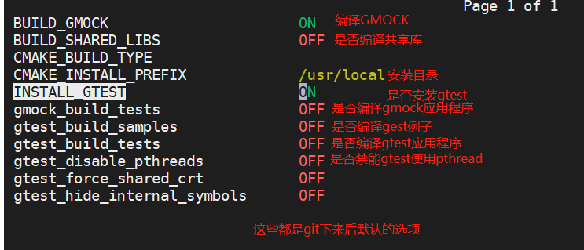
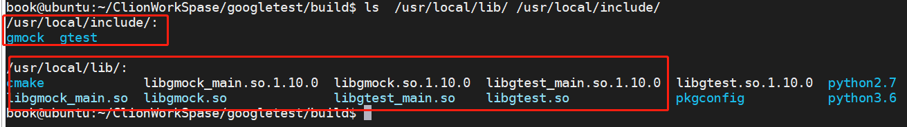
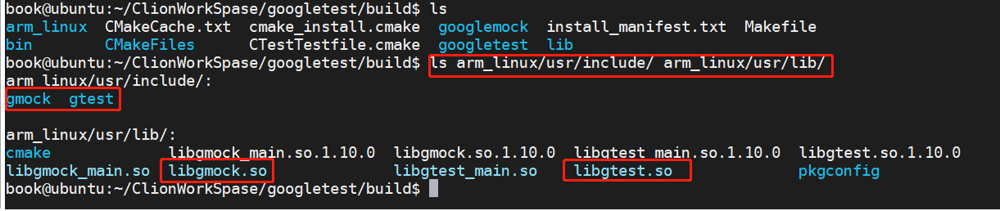

# GoogleTest

## 下载资源

```bash
git clone https://github.com/RobotFly/googletest.git
```


## 编译选项介绍

```bash
cd googletest
mkdir build
cd build
cmake ..
ccmake ..    # 执行完后会显示下图的配置选项
```

默认编译选项，我们可以在这里直接修改，也可以在cmake阶段使用-D选项指定。



-D选项如下：

```bash
-DBUILD_GMOCK=ON
-DINSTALL_GTEST=ON
-Dgmock_build_tests=OFF
-Dgtest_build_samples=OFF
-Dgtest_build_tests=OFF
-DCMAKE_INSTALL_PREFIX=/user/local
-DBUILD_SHARED_LIBS=ON
#下面是交叉编译器相关的，在arm平台使用的时候需要指定
-DCMAKE_SYSTEM_NAME=Linux 
-DCMAKE_SYSTEM_PROCESSOR=arm
-DCMAKE_C_COMPILER=/home/book/embedfire/arm-gcc/bin/arm-linux-gnueabihf-gcc
-DCMAKE_CXX_COMPILER=/home/book/embedfire/arm-gcc/bin/arm-linux-gnueabihf-g++

```

## ubuntu下安装gtest

这里默认安装目录是`/usr/local`目录

```bash
cd build
cmake -DBUILD_SHARED_LIBS=ON -DCMAKE_INSTALL_PREFIX=/usr/local ..
make
sudo make install
```

安装完后可以看到在`/usr/local`下会有`gmock`和`gtest`的头文件和库文件。



## arm平台交叉编译gtest

这里默认安装目录自己指定，我这里`./arm_linux/usr`

```bash
cd build
cmake -DBUILD_SHARED_LIBS=ON -DCMAKE_SYSTEM_NAME=Linux -DCMAKE_SYSTEM_PROCESSOR=arm -DCMAKE_C_COMPILER=/home/book/embedfire/arm-gcc/bin/arm-linux-gnueabihf-gcc -DCMAKE_CXX_COMPILER=/home/book/embedfire/arm-gcc/bin/arm-linux-gnueabihf-g++  -DCMAKE_INSTALL_PREFIX=./arm_linux/usr ..
make
sudo make install
```

执行完命令后，可以看到在当前目录`/arm_linux/usr/`存放交叉编译后的库和头文件，我们在写嵌入式程序的时候，需要把`.so`文件和头文件拷贝到我们的工程源码里面，供使用。在arm板子上需要把`.so`拷贝到开发板子上，供应用程序运行时使用。



## 应用程序使用gtest库文件

### x84下的Linux应用程序

由于我们安装到系统的/usr/local/目录下，该目录在系统的环境变量里面，所以，可以直接在应用程序里面包含头文件即可，无需在自己的工程下(cmake或者makefie)指定gtest的库路径和头文件搜索路径。

例如在cmake里面我们可以直接在CMakeLists.txt里面像添加数学库一样，添加gtest

```
LINK_LIBRARIES(-lpthread -lm -lgtest)
```

下面是一个完整的例子

- 目录结构

  ```bash
  template
  ├── build                 # 编译输出目录
  ├── CMakeLists.txt        # 顶层CMakeLists.txt
  └── main.cpp              # 主程序
  ```

- 顶层CMakeLists.txt

  ```bash
  cmake_minimum_required(VERSION 3.19)
  project(template)
  
  set(CMAKE_CXX_STANDARD 14)
  
  LINK_LIBRARIES(-lpthread -lm -lgtest)  # 链接 gtest库，该库在我们的usr/local下
  
  add_executable(template main.cpp)
   
  ```

  

- main.cpp文件 

  ```c++
  #include <iostream>
  #include <gtest/gtest.h>   // 这里直接包含头文件
  
  int add(int n1,int n2)
  {
      return n1+n2;
  }
  
  TEST(TestCase,test1 )
  {
      ASSERT_EQ(12,add(4,8));
  }
  
  TEST(TestCase,test2)
  {
      EXPECT_EQ(5,add(2,3));
  }
  
  TEST(TestCase,test3)
  {
      EXPECT_EQ(3,add(1,2));
  }
  
  int main(int argc, char **argv)
   {
      std::cout << "Hello, World!" << std::endl;
      testing::InitGoogleTest(&argc, argv);
      return RUN_ALL_TESTS();
  }
  
  ```

  

- 编译

  ```bash
  cd template
  mkdir build
  cd build
  cmake ..
  make
  cd bin
  ./template   # 运行
  ```

- 运行结果

  ```
  Hello, World!
  [==========] Running 3 tests from 1 test suite.
  [----------] Global test environment set-up.
  [----------] 3 tests from TestCase
  [ RUN      ] TestCase.test1
  [       OK ] TestCase.test1 (0 ms)
  [ RUN      ] TestCase.test2
  [       OK ] TestCase.test2 (0 ms)
  [ RUN      ] TestCase.test3
  [       OK ] TestCase.test3 (0 ms)
  [----------] 3 tests from TestCase (0 ms total)
  
  [----------] Global test environment tear-down
  [==========] 3 tests from 1 test suite ran. (0 ms total)
  [  PASSED  ] 3 tests.
  ```

  

### 嵌入式arm Linux应用程序

- 方法一：把库安装路径指定到自己的板子的文件系统上（ubuntu上存放的，一般是buildroot编译出来的），然后在工程里面指定该文件夹加入库和头文件搜索路径。

  在开发阶段，板子一般通过nfs挂载的网络文件系统，我们可以指定到该目录下，方便调试。

- 方案二：拷贝库和头文件到自己的工程下，并且在工程中(cmake或者makefie)指定库和头文件的搜索路径。

以上两种方式，无论是哪种，都必须保证，应用程序在开发阶段，交叉编译的时候，无论库和头文件在哪存放，要指定库和头文件的搜索路径，开发完后，要把库拷贝到arm板子，这样，引用程序运行的时候才能找的到动态库。

- 例如工程目录如下：

  ```bash
  template
  ├── 3rdlibs
  │   └── gtest                                   # 该目录存放我们的gtest
  │       ├── include
  │       │   └── gtest
  │       │       ├── gtest-death-test.h
  │       │       ├── gtest.h
  │       │       ├── gtest-message.h
  │       │       ├── gtest-param-test.h
  │       │       ├── gtest-param-test.h.pump
  │       │       ├── gtest_pred_impl.h
  │       │       ├── gtest-printers.h
  │       │       ├── gtest_prod.h
  │       │       ├── gtest-spi.h
  │       │       ├── gtest-test-part.h
  │       │       ├── gtest-typed-test.h
  │       │       └── internal
  │       │           ├── gtest-death-test-internal.h
  │       │           ├── gtest-filepath.h
  │       │           ├── gtest-internal.h
  │       │           ├── gtest-linked_ptr.h
  │       │           ├── gtest-param-util-generated.h
  │       │           ├── gtest-param-util-generated.h.pump
  │       │           ├── gtest-param-util.h
  │       │           ├── gtest-port.h
  │       │           ├── gtest-string.h
  │       │           ├── gtest-tuple.h
  │       │           ├── gtest-tuple.h.pump
  │       │           ├── gtest-type-util.h
  │       │           └── gtest-type-util.h.pump
  │       └── libs
  │           ├── libgtest_main.so
  │           └── libgtest.so
  ├── build
  ├── CMakeLists.txt
  └── main.cpp
  ```

- 顶层CMakeLists.txt

  ```bash
  cmake_minimum_required(VERSION 3.19)
  project(template)
  
  set(CMAKE_CXX_STANDARD 14)
  
  LINK_LIBRARIES(-lpthread -lm)
  INCLUDE_DIRECTORIES (./3rdlibs/gtest/include) # 需要指定库的头文件搜索路径
  link_directories(./3rdlibs/gtest/libs)        # 需要指定库的搜索路径
  
  add_executable(template main.cpp)
  target_link_libraries(template gtest)         # 添加连接库
  ```

  

- main.cpp文件 

  ```c++
  #include <iostream>
  #include "gtest/gtest.h"   //这里修改为双引号，不在使用<>了，意味着不会从系统库里面搜索
  
  int add(int n1,int n2)
  {
      return n1+n2;
  }
  
  TEST(TestCase,test1 )
  {
      ASSERT_EQ(12,add(4,8));
  }
  
  TEST(TestCase,test2)
  {
      EXPECT_EQ(5,add(2,3));
  }
  
  TEST(TestCase,test3)
  {
      EXPECT_EQ(3,add(1,2));
  }
  
  int main(int argc, char **argv)
   {
      std::cout << "Hello, World!" << std::endl;
      testing::InitGoogleTest(&argc, argv);
      return RUN_ALL_TESTS();
  }
  
  ```

- 交叉编译

  ```bash
  # 编译如下：
  cd template
  mkdir build
  cd build
  cmake -DCMAKE_SYSTEM_NAME=Linux -DCMAKE_SYSTEM_PROCESSOR=arm -DCMAKE_C_COMPILER=/home/book/embedfire/arm-gcc/bin/arm-linux-gnueabihf-gcc -DCMAKE_CXX_COMPILER=/home/book/embedfire/arm-gcc/bin/arm-linux-gnueabihf-g++ ..
  make
  cd bin
  ```

  拷贝bin下面的应用程序到arm板子，然后拷贝库文件到arm板子，在arm板子上执行

  ```bash
  chmod +x template
  ./template   # 运行
  ```

  运行结果如下：

  ```bash
  Hello, World!
  [==========] Running 3 tests from 1 test case.
  [----------] Global test environment set-up.
  [----------] 3 tests from TestCase
  [ RUN      ] TestCase.test1
  [       OK ] TestCase.test1 (0 ms)
  [ RUN      ] TestCase.test2
  [       OK ] TestCase.test2 (0 ms)
  [ RUN      ] TestCase.test3
  [       OK ] TestCase.test3 (0 ms)
  [----------] 3 tests from TestCase (0 ms total)
  
  [----------] Global test environment tear-down
  [==========] 3 tests from 1 test case ran. (1 ms total)
  [  PASSED  ] 3 tests.
  
  Process finished with exit code 0
  ```


## 应用程序直接嵌入gtest源代码

笔者不推荐此种做法，因为这些开源库一般都是比较稳定的，我们不需要怎么修改，如果把这些代码加入到应用程序工程，显得应用程序臃肿，应用程序应该只关系自己的业务逻辑。其他的应该交给驱动人员编写对应的库文件和接口文档以及使用说明。但是学习目的，下面作为简要介绍。

- 工程目录结构

  ```bash
  template
  ├── 3rd
  │   └── gtest                    # 存放gtest的工程源码
  │       ├── build-aux
  │       .
  │       此处省略N行
  │       .
  │       ├── include
  │       │   └── gtest
  │       .          .
  │        此处省略N行
  │       .          .
  │       此处省略N行
  │
  │
  │
  ├── build                        # 编译输出目录
  ├── CMakeLists.txt               # 顶层CmakeLists
  └── main.cpp                     # 主程序代码
  ```

  

- 顶层CMakeLists.txt

  ```bash
  cmake_minimum_required(VERSION 3.19)
  project(template)
  
  set(CMAKE_CXX_STANDARD 14)
  
  LINK_LIBRARIES(-lpthread -lm)
  
  INCLUDE_DIRECTORIES (./3rd/gtest/include)  #添加头文件
  add_subdirectory( ./3rd/gtest)             #增加子目录
  # 添加连接库
  link_directories(
          ./3rd/gtest      #同样把gtest源码编译为库文件，只不过这里和工程一起编译了
  )
  
  add_executable(template main.cpp)
  # 将目标文件与库文件进行链接
  target_link_libraries(template gtest)
  ```

- main.cpp

  保持上面的不变

- 编译运行结果

  无论是交叉编译嵌入式程序还是正常的64位的linux程序，运行结果都一样。

