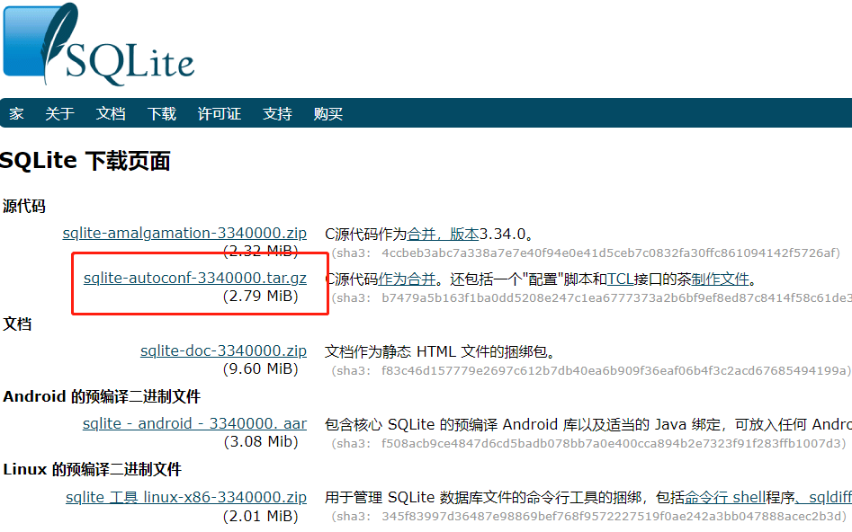
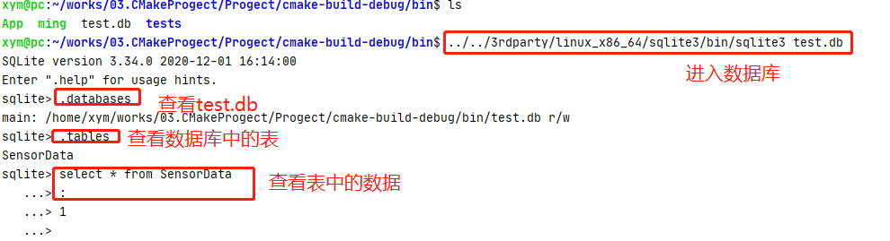
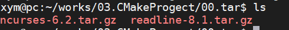

# SQlite3

## 资源下载

请访问 [SQLite 下载页面](http://www.sqlite.org/download.html)，从源代码区下载 **sqlite-autoconf-\*.tar.gz**，如下图所示



## Linux x86-64安装

### 安装依赖库

```bash
sudo apt-get install zlib1g-dev gawk libreadline-dev libncurses5-dev
```

### 编译sqlite3

默认安装目录是`/usr/local`，这里我们通过修改prefix改变自己想要的安装目录，如下所示我自己安装的目录为：`/home/xym/works/03.CMakeProgect/Progect/3rdparty/linux_x86_64/sqlite3`

```bash
tar xvzf sqlite-autoconf-3340000.tar.gz # 解压
mv sqlite-autoconf-3340000 sqlite3		# 重命名为sqlite3
cd sqlite3
gcc -o sqlite3 shell.c sqlite3.c -lpthread -ldl

mkdir build && cd build
#设置安装目录
sudo ../configure --prefix=/home/xym/works/03.CMakeProgect/Progect/3rdparty/linux_x86_64/sqlite3

sudo make
sudo make install
```

测试：



## Linux arm交叉编译安装

### 安装依赖库

由于是交叉编译，所以一些相关的依赖库，比如`libreadline`和`libncurses`就不能直接安装到系统里面了(安装了也没用不会被交叉编译器识别)，而是应该安装到交叉编译器的目录中。

先分别去下面这两个地方下载`libreadline`和`ncurses`的源码包(之所以要安装ncurses库是因为libreadline依赖于它，而且很多linux的软件都会用到这个库)，注意是下载.tar.gz为扩展名的包，一般都是下载最新版的。
http://ftp.gnu.org/gnu/readline/
http://ftp.gnu.org/gnu/ncurses/

例如我下载的版本如下图所示：



分别交叉编译这两个包:

1. 交叉编译`ncurses`

   ```bash
   mkdir build && cd build
   
   STRIP=arm-none-linux-gnueabihf-strip ../configure --host=arm-linux-gnueabihf  --with-shared --prefix=/home/xym/works/03.CMakeProgect/00.tar/ncurses-6.2/build/Install
   make
   make install
   
   RANLIB=arm-none-linux-gnueabi-ranlib
   
   ```

   

2. 交叉编译`readline`

   ```bash
   sudo ./configure --host=arm-linux--prefix=/opt/
   sudo make
   sudo make install
   ```

    --host接的是arm的交叉编译器的名称，--prefix接的是编译好之后安装到的路径，这里建议不要直接安装到交叉编译器的路径，而是安装到其它地方，等安装完之后到目标目录确认一下之后再手动拷到交叉编译器的目录里面去。

待两个包编译安装完之后，还要手动拷到交叉编译器的路径里面去，这里我以安装在/usr/local/arm/3.4.6目录里面的3.4.6版本的交叉编译器为例。进入到刚才编译安装好的那两个包的目录，里面应该有`bin include share lib`等目录，在那个目录里面，执行如下命令

```apache
         sudo cp -pR */usr/local/arm/3.4.6/arm-linux
```

 这里有两个个人认为需要注意的问题。

1. cp-p的参数是复制文件的属性、拥有者、符号链接等所有属性，而-R是递归复制，也就是拷贝下面的所有目录和文件过去。而目标目录并不是/usr/local/arm/3.4.6，而是其下面的arm-linux这个目录，需要注意一下。当然3.4.6版本的交叉编译器是这样子的，别的版本的交叉编译器请自行参考。
2. 这两个库不仅要安装到交叉编译器里面去，更是建议把它安装到开发板的根文件系统里面去，因为个人的2440的根文件系统是用nfs挂在pc上的，所以只要用cp-pR把所有东西直接拷过去就行了，其它方法做的根文件系统请自行想办法解决。至少需要把libreadline的库拷到根文件系统里面去，不然交叉编译好的sqlite3会因为缺少libreadline的库而拒绝执行。

### 交叉编译sqlite3

```bash
tar xvzf sqlite-autoconf-3340000.tar.gz # 解压
mv sqlite-autoconf-3340000 sqlite3		# 重命名为sqlite3
cd sqlite3
mkdir build && cd build
#设置安装目录
sudo ../configure --host=arm-linux-gnueabihf --prefix=/home/xym/works/03.CMakeProgect/Progect/3rdparty/linux_x86_64/sqlite3
sudo make
sudo make install
```


交叉编译应用程序：

```bash
arm-linux-gcc -o name name.c -I/opt/sqlite3/include -L /opt/sqlite3/lib -lsqlite3
```

   -I接的是交叉编译后安装的arm版的sqlite3目录里面的头文件，而-L则是包含的库文件。

   这样的编译选项编译之后，拷到开发板上去，执行，OK！