# 打造最强Vim编辑器

## 安装vimplus

```bash
git clone https://github.com/chxuan/vimplus.git ~/.vimplus
cd ~/.vimplus
./install.sh 				#不加sudo
```

安装完后会有下面的提示信息

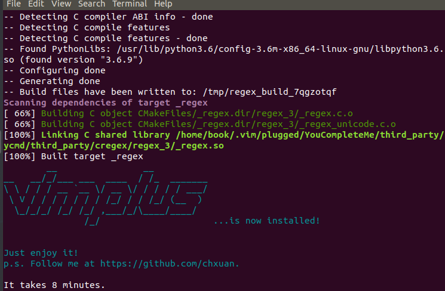

### 解决乱码

- 下载字体到任意目录：

  ```bash
  git clone https://github.com/ryanoasis/nerd-fonts.git
  ```

- 双击**Droid Sans Mono Nerd Font Complete Mono.otf**文件（ps:刚刚clone的字体项目的【nerd-fonts\patched-fonts\DroidSansMono\complete】目录下），安装即可。

- 设置终端字体，打开任意终端选择【Edit】-》【Preferences】,设置字体。

  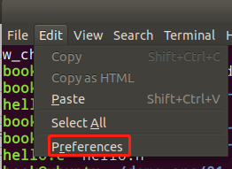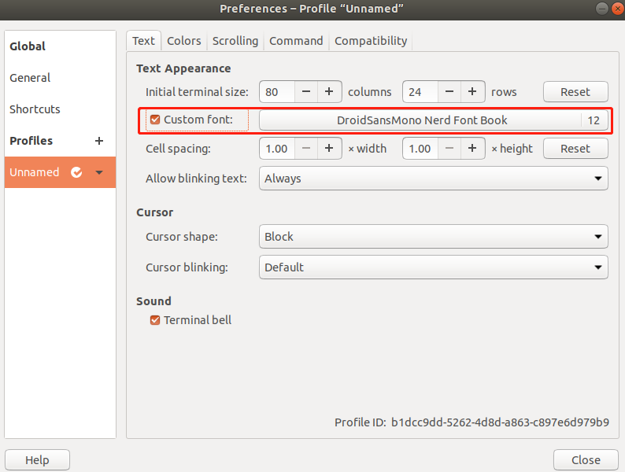

### 更新vimplus

```bash
cd ~/.vimplus
./update.sh
```

## 相关配置

> - [~/.vimrc](https://github.com/chxuan/vimplus/blob/master/.vimrc)为vimplus的默认配置，一般不做修改
> - [~/.vimrc.custom.plugins](https://github.com/chxuan/vimplus/blob/master/.vimrc.custom.plugins)为用户自定义插件列表，用户增加、卸载插件请修改该文件
> - [~/.vimrc.custom.config](https://github.com/chxuan/vimplus/blob/master/.vimrc.custom.config)为用户自定义配置文件，一般性配置请放入该文件，可覆盖[~/.vimrc](https://github.com/chxuan/vimplus/blob/master/.vimrc)里的配置

### .vimrc.custom.config配置

```bash
""""""""""""""""""""""""用户自定义配置"""""""""""""""""""""""""""""""""""
" 该文件放一般性配置，可覆盖~/.vimrc里的配置，若要增加、卸载插件，请放入~/.vimrc.custom.plugins
"""""""""""""""""""""""""""""""""""""""""""""""""""""""""""""""""""""""

set whichwrap-=<,>,h,l  " 设置光标键不跨行
set virtualedit-=block,onemore   " 不允许光标出现在最后一个字符的后面

" set helplang=cn         " 设置帮助文档为中文
set history=1000         " 最大历史记录 (default is 20)
set splitright           " 在当前文档右边打开新的编辑窗口 (默认:左边)
" set splitbelow         " 在当前文档下面打开新的编辑窗口 (默认:上面)
set clipboard+=unnamed        " 与windows共享剪切板

" 开启相对行号
" set relativenumber

" "开启鼠标"
" 已设置为leader快捷键，见下面 leader设置
" set mouse=a        " 支持鼠标操作，用鼠标选中文本，按y键复制，
" 然后点击要粘贴的地方，使用鼠标中键粘贴
" 支持夸文件粘贴

" 设置光标所在列高亮
" set cursorcolumn

set foldenable         " 启用折叠代码
"   manual  手工定义折叠
"   indent  更多的缩进表示更高级别的折叠
"   expr    用表达式来定义折叠
"   syntax  用语法高亮来定义折叠
"   diff    对没有更改的文本进行折叠
"   marker  对文中的标志折叠
"set foldmethod=syntax    "开启代码折叠，并保存折叠信息
"set foldlevel=100        "启动时不要自动折叠代码
set foldmethod=marker     "开启代码折叠，并保存折叠信息
" set foldopen=all  "光标遇到折叠，折叠就打开
" set foldclose=all  "光标移开折叠，自动关闭折叠

" indentLine 开启代码对齐线
" let g:indentLine_enabled = 1

" ********** "markdown设置" **********
let system = system('uname -s')
if system == "Darwin\n"
    let g:mkdp_path_to_chrome = "/Applications/Google\\ Chrome.app/Contents/MacOS/Google\\ Chrome"
else
    let g:mkdp_path_to_chrome = '/usr/bin/google-chrome-stable %U'
endif
nmap <silent> <F7> <Plug>MarkdownPreview
imap <silent> <F7> <Plug>MarkdownPreview
nmap <silent> <F8> <Plug>StopMarkdownPreview
imap <silent> <F8> <Plug>StopMarkdownPreview


" ********** "vim-trailing-whitespace" **********
" <leader> + space 去掉末尾空格快捷键
nnoremap <leader><space> :FixWhitespace<cr>


" ********** "rainbow_parentheses 括号高亮增强版" **********
let g:rbpt_colorpairs = [
    \ ['brown',       'RoyalBlue3'],
    \ ['gray',        'RoyalBlue3'],
    \ ['Darkblue',    'SeaGreen3'],
    \ ['darkgreen',   'firebrick3'],
    \ ['darkcyan',    'RoyalBlue3'],
    \ ['darkred',     'SeaGreen3'],
    \ ['gray',        'RoyalBlue3'],
    \ ]

" let g:rbpt_colorpairs = [
"     \ ['gray',        'RoyalBlue3'],
"     \ ['brown',       'RoyalBlue3'],
"     \ ['Darkblue',    'SeaGreen3'],
"     \ ['darkgray',    'DarkOrchid3'],
"     \ ['darkgreen',   'firebrick3'],
"     \ ['darkcyan',    'RoyalBlue3'],
"     \ ['darkred',     'SeaGreen3'],
"     \ ['darkmagenta', 'DarkOrchid3'],
"     \ ['brown',       'firebrick3'],
"     \ ['darkmagenta', 'DarkOrchid3'],
"     \ ['Darkblue',    'firebrick3'],
"     \ ['darkgreen',   'RoyalBlue3'],
"     \ ['darkcyan',    'SeaGreen3'],
"     \ ['darkred',     'DarkOrchid3'],
"     \ ]

" 不加入这行, 防止黑色括号出现, 很难识别
"    \ ['black',       'SeaGreen3'],

let g:rbpt_max = 16   " 开启16对括号匹配
let g:rbpt_loadcmd_toggle = 0

au VimEnter * RainbowParenthesesToggle
au Syntax * RainbowParenthesesLoadRound
au Syntax * RainbowParenthesesLoadSquare
au Syntax * RainbowParenthesesLoadBraces


" ********** "vim-gutentags 函数跳转" **********
" gutentags搜索工程目录的标志，碰到这些文件/目录名就停止向上一级目录递归
let g:gutentags_project_root = ['.root', '.svn', '.git', '.proj', '.project']

" 所生成的数据文件的名称
let g:gutentags_ctags_tagfile = '.tags'

" 将自动生成的 tags 文件全部放入 ~/.cache/tags 目录中，避免污染工程目录
let s:vim_tags = expand('~/.cache/tags')
let g:gutentags_cache_dir = s:vim_tags
" 检测 ~/.cache/tags 不存在就新建
if !isdirectory(s:vim_tags)
   silent! call mkdir(s:vim_tags, 'p')
endif


" ********** "indexer 函数跳转" **********
" 设置indexer 调用 ctags 的参数
" 默认 --c++-kinds=+p+l，重新设置为 --c++-kinds=+p+l+x+c+d+e+f+g+m+n+s+t+u+v
" 默认 --fields=+iaS 不满足 YCM 要求，需改为 --fields=+iaSl
let g:indexer_ctagsCommandLineOptions="--c++-kinds=+p+l+x+c+d+e+f+g+m+n+s+t+u+v --fields=+iaSl --extra=+q"


" ********** "配置 ctags 的参数" **********
let g:gutentags_ctags_extra_args = ['--fields=+niazS', '--extra=+q']
let g:gutentags_ctags_extra_args += ['--c++-kinds=+p+l+x+c+d+e+f+g+m+n+s+t+u+vI']
let g:gutentags_ctags_extra_args += ['--c-kinds=+p+l+x+c+d+e+f+g+m+n+s+t+u+vI']

" 参数详解
" c   类(classes)
" d   宏定义(macro definitions)
" e   枚举变量(enumerators)
" f   函数定义(function definitions)
" g   枚举类型(enumeration names)
" l   局部变量(local variables)，默认不提取
" m   类、结构体、联合体(class, struct, and union members)
" n   命名空间(namespaces)
" p   函数原型(function prototypes)，默认不提取
" s   结构体类型(structure names)
" t   (typedefs)
" u   联合体类型(union names)
" v   变量定义(variable definitions)
" x   外部变量(external and forward variable declarations)，默认不提取

" 函数跳转快捷键
nnoremap <leader>] <C-]>:ts <cr>


" ********** "vim-autoformat 代码格式化" **********
" style风格:  allman  java  kr

" 格式化为allman风格
nnoremap <leader>fa :call RunFormatAllman() <cr>
" 格式化为kr风格
nnoremap <leader>fk :call RunFormatKr() <cr>

func! RunFormatAllman()
    " exec "w" " 这2条命令是利用vim外部调用功能, 二选一
    " exec "!astyle --mode=c --style=allman -S -Y -p -xg -U -k3 -W3 -n %"
    let g:formatdef_my_fmt = '"astyle --mode=c --style=allman -S -Y -p -xg -U -k3 -W3 -n "'
    silent exec "Autoformat"
endfunc

func! RunFormatKr()
    " exec "w"   " 这2条命令是利用vim外部调用功能, 二选一
    " exec "!astyle --mode=c --style=kr -S -Y -p -xg -U -k3 -W3 -n %"
    let g:formatdef_my_fmt = '"astyle --mode=c --style=kr -S -Y -p -xg -U -k3 -W3 -n "'
    silent exec "Autoformat"
endfunc

let g:formatters_c = ['my_fmt']
let g:formatters_cpp = ['my_fmt']
let g:formatters_java = ['my_fmt']
" au BufWrite * :Autoformat
let g:autoformat_autoindent = 0
let g:autoformat_retab = 0
let g:autoformat_remove_trailing_spaces = 0


" ********** "ultisnips 代码补齐插件" **********
" Trigger configuration. Do not use <tab> if you use https://github.com/Valloric/YouCompleteMe.
let g:UltiSnipsExpandTrigger="<tab>"
let g:UltiSnipsJumpForwardTrigger="<c-b>"
let g:UltiSnipsJumpBackwardTrigger="<c-z>"
" If you want :UltiSnipsEdit to split your window.
let g:UltiSnipsEditSplit="vertical"


" ********** "snipMate 代码补齐插件" **********
" let g:snipMate = get(g:, 'snipMate', {})    " Allow for vimrc re-sourcing
" let g:snipMate.scope_aliases = {}
" let g:snipMate.scope_aliases['ruby'] = 'ruby,rails'


" ********** "ChangesPlugin 文件显示修改痕迹" **********
let g:changes_autocmd=1
let g:changes_use_icons = 0
" let g:changes_respect_SignColumn = 1
let g:changes_sign_text_utf8 = 1

" let g:changes_linehi_diff = 1
" hi ChangesSignTextAdd ctermbg=yellow ctermfg=black guibg=green
" hi ChangesSignTextDel ctermbg=white  ctermfg=black guibg=red
" hi ChangesSignTextCh  ctermbg=black  ctermfg=white guibg=blue


" ********** "vim-commentary 注释风格" **********
" 为python和shell等添加注释
autocmd FileType python,shell,coffee set commentstring=#\ %s
" 修改注释风格
autocmd FileType java,c,cpp set commentstring=//\ %s

" ********** "vim-indent-guides 显示缩进线" **********
let g:indent_guides_enable_on_vim_startup = 1    "set indent guides enabled by default
let g:indent_guides_auto_colors = 0   "Setting custom indent colors
let g:indent_guides_guide_size = 1
let g:indent_guides_start_level = 1
let g:indent_guides_space_guides = 1
let g:indent_guides_tab_guides = 0

autocmd VimEnter,Colorscheme * :hi IndentGuidesOdd  guibg=red   ctermbg=238
autocmd VimEnter,Colorscheme * :hi IndentGuidesEven guibg=green ctermbg=darkgray

" hi IndentGuidesOdd  guibg=red   ctermbg=0
" hi IndentGuidesEven guibg=green   ctermbg=8


" ********** "delimitMate settings 括号自动补全" **********
" set backspace=start,eol
" let delimitMate_expand_cr = 1      " 需要backspace包含start,eol
" let delimitMate_expand_space = 1   " 需要backspace包含start,eol


" ********** "CSS" **********
augroup VimCSS3Syntax
  autocmd!
  autocmd FileType css setlocal iskeyword+=-
augroup END


" ********** "DoxygenToolkit" **********
let g:DoxygenToolkit_blockHeader  = "************************************************************"
let g:DoxygenToolkit_briefTag_pre = "@Brief: "
let g:DoxygenToolkit_paramTag_pre = "@Param: "
let g:DoxygenToolkit_returnTag    = "@Returns: "
let g:DoxygenToolkit_versionTag    = "@Version: "
let g:DoxygenToolkit_versionString = "1.0"
let g:DoxygenToolkit_authorTag    = "@Author: "
let g:DoxygenToolkit_authorName   = "WYB"
let g:DoxygenToolkit_dateTag      = "@Date: "
let g:DoxygenToolkit_blockFooter  = "************************************************************"
" let g:DoxygenToolkit_briefTag_funcName = "yes"  " 显示函数名称
let g:DoxygenToolkit_commentType = "C++"
let g:DoxygenToolkit_compactDoc = "yes"   " 单行模式
" let g:Doxygen_enhanced_color = 1

" 快捷键
nnoremap fcb :Dox<cr>
nnoremap fca :DoxAll<cr>
nnoremap fcv :DoxAuthor<cr>


" ********** "vim-man" **********
" <leader>m 新建水平窗口打开man
map <leader>m <Plug>(Man)
" <leader>v 新建垂直窗口打开man
map <leader>v <Plug>(Vman)

" ********** "分屏窗口大小调整" **********
nnoremap <c-up> <c-w>-
nnoremap <c-down> <c-w>+
nnoremap <c-left> <c-w><
nnoremap <c-right> <c-w>>

" ********** "鼠标控制设置" **********
" 启用鼠标的支持
nnoremap <leader>ma :set mouse=a<cr>
" 关闭鼠标的支持
nnoremap <leader>mu :set mouse=<cr>

" ********** "标签页切换" **********
nnoremap <leader>tn :tabn <cr>
nnoremap <leader>tp :tabp <cr>


" ********** "NerdTree" **********
" autocmd vimenter * NERDTree  "自动开启Nerdtree
" inoremap <silent> <leader>n <esc> :NERDTreeToggle<cr>   " 不用
let NERDTreeMinimalUI = 1
let NERDTreeShowHidden = 1
" let g:nerdtree_tabs_open_on_console_startup = 1  " 打开vim后自动开启目录树
let g:nerdtree_tabs_focus_on_files = 1
let g:nerdtree_tabs_autofind = 1
let NERDTreeAutoDeleteBuffer = 1  " Auto delete buffer deleted with NerdTree
let NERDTreeWinSize=16     " Initial NERDTree width


" ********** "YCM" **********
let g:ycm_warning_symbol = '✹'                          " 设置语法警告图案
let g:ycm_show_diagnostics_ui = 1                       " 1:开启语法提示
let g:ycm_min_num_of_chars_for_completion=1             " 从第1个键入字符就开始罗列匹配项
let g:ycm_cache_omnifunc=0                              " 0:禁止缓存匹配项，每次都重新生成匹配项
" let g:ycm_goto_buffer_command = 'horizontal-split'    " 跳转打开上下分屏
let g:ycm_goto_buffer_command = 'vertical-split'        " 跳转打开左右分屏
let g:ycm_key_list_stop_completion = ['<C-y>']
let g:ycm_key_list_select_completion = ['<Down>']
let g:ycm_key_list_previous_completion = ['<Up>']
" let g:ycm_global_ycm_extra_conf = '~/.ycm_extra_conf.py'
" let g:ycm_python_binary_path = 'python'               " 不用
" 设置YCM检错快捷键
nmap <F4> :YcmDiags<cr>


" ********** "Ctags" **********
" set tags+=/usr/include/tags
" set tags+=~/.vim/systags
" set tags+=~/.vim/x86_64-linux-gnu-systags
" let g:ycm_semantic_triggers.c = ['->', '.', ' ', '(', '[', '&',']']


" ********** "Tagbar" **********
inoremap <silent> <leader>t <esc> :TagbarToggle<cr>
let g:tagbar_sort = 0   " 不排序
let g:tagbar_autofocus = 1   " 打开列表后自动跳转到列表


" ********** "其他设置" **********

" F12 格式化代码，已经用vim-autoformat代替
" map <F12> gg=G

" ********** "C,C++ 按F5编译运行" **********
map <F5> :call Compile_Run()<CR>
func! Compile_Run()
    silent exec "w"
    exec "redraw!"
    " silent exec "!clear"
    silent exec "!echo"
    " silent exec "!echo -n '____________________________'"

    if &filetype == 'c'
        " silent exec "!gcc % -o %<"
        exec "call CompileGcc()"
        exec "redraw!"
        exec "! ./%<"
        exec "redraw!"
        " exec "!time ./%<"  "显示程序运行时间
    elseif &filetype == 'cpp'
        " silent exec "!g++ % -o %<"   " !: 忽略编译器产生的错误信息
        exec "call CompileGpp()"
        exec "redraw!"
        exec "! ./%<"
        exec "redraw!"
        " exec "!time ./%<"
    elseif &filetype == 'java'
        exec "!javac %"
        exec "! java %<"
        " exec "!time ./%<"
    endif
endfunc

" ********** "C,C++的调试" **********
" map <F6> :call Rungdb()<CR>
func! Rungdb()
    exec "w"
    if &filetype == 'c'
        exec "!gcc % -g -o %<"
        exec "!gdb ./%<"
    elseif &filetype == 'cpp'
        exec "!g++ % -g -o %<"
        exec "!gdb ./%<"
    endif
endfunc

" 函数实现
func! CompileGcc()
    exec "w"
    let compilecmd="!gcc "
    let compileflag="-o %< "
    if search("mpi\.h") != 0
        let compilecmd = "!mpicc "
    endif
    if search("glut\.h") != 0
        let compileflag .= " -lglut -lGLU -lGL "
    endif
    if search("cv\.h") != 0
        let compileflag .= " -lcv -lhighgui -lcvaux "
    endif
    if search("omp\.h") != 0
        let compileflag .= " -fopenmp "
    endif
    if search("math\.h") != 0
        let compileflag .= " -lm "
    endif
    if search("pthread\.h") != 0
        let compileflag .= " -lpthread "
    endif
    silent exec compilecmd." % ".compileflag
endfunc

func! CompileGpp()
    exec "w"
    let compilecmd="!g++ "
    let compileflag="-o %< -std=c++11"
    if search("mpi\.h") != 0
        let compilecmd = "!mpic++ "
    endif
    if search("glut\.h") != 0
        let compileflag .= " -lglut -lGLU -lGL "
    endif
    if search("cv\.h") != 0
        let compileflag .= " -lcv -lhighgui -lcvaux "
    endif
    if search("omp\.h") != 0
        let compileflag .= " -fopenmp "
    endif
    if search("math\.h") != 0
        let compileflag .= " -lm "
    endif
    if search("pthread\.h") != 0
        let compileflag .= " -lpthread "
    endif
    silent exec compilecmd." % ".compileflag
endfunc
```

### .vimrc.custom.plugins配置

```bash
""""""""""""""""""""""增加~/.vimrc里没有的插件"""""""""""""""""""""""""""""
" 用户自定义插件列表（该文件只放插件，若要增加其他配置，请放入~/.vimrc.custom.config）
"""""""""""""""""""""""""""""""""""""""""""""""""""""""""""""""""""""""
" 增加插件后需要进行插件安装，安装步骤如下：
" 1.执行:w保存修改
" 2.执行,s重新加载vim配置
" 3.执行,,i进行插件安装
" ====================================================================

Plug 'iamcco/mathjax-support-for-mkdp'
Plug 'iamcco/markdown-preview.vim'
Plug 'gorodinskiy/vim-coloresque'
Plug 'vim-scripts/DoxygenToolkit.vim'    " 快速添加函数注释

Plug 'bronson/vim-trailing-whitespace'   " 显示多余空格
Plug 'kien/rainbow_parentheses.vim'      " 括号层次增强

" Plug 'vim-scripts/vimprj'              " tags标签生成插件1
" Plug 'vim-scripts/indexer.tar.gz'
" Plug 'vim-scripts/DfrankUtil'

Plug 'ludovicchabant/vim-gutentags'      " tags标签生成插件2

Plug 'chiel92/vim-autoformat'            " 代码格式化
Plug 'chrisbra/changesPlugin'            " 文件改动高亮
Plug 'vim-utils/vim-man'                 " 在vim里调用man手册
Plug 'nathanaelkane/vim-indent-guides'   " 缩进高亮

" Plug 'honza/vim-snippets'                " 代码片段模板
" Plug 'sirver/ultisnips'                  " 插入代码片段引擎，插件1

" Plug 'MarcWeber/vim-addon-mw-utils'    " 插入代码片段引擎，插件2
" Plug 'tomtom/tlib_vim'
" Plug 'garbas/vim-snipmate'

" Plug 'hail2u/vim-css3-syntax'          " CSS高亮，颜色提示
" Plug 'ap/vim-css-color'

" Plug 'Raimondi/delimitMate'  " 括号补全插件1, 后加的，二选一


" ====================================================================
" 卸载/禁用~/.vimrc里的默认插件
" UnPlug 'chxuan/prepare-code'
" UnPlug 'Yggdroot/indentLine'
UnPlug 'chxuan/change-colorscheme'
```

### .vimrc配置

```bash
"   .  . .  .  . .  . S@t.. .  .  . .  .  . .  .  . .  .  . .  .  . .  .  . .  .  . .  .  . .  .  . .  .  . .  .  . .  ..
"    .     ..t%SXSS%:;t.X8S% .   .      .       .       .       .       .       .       .       .       .       .       .
"      . %St8;8:X;8:8:8%8;%%:@S:    . .    . .    ....    .  .    .  .    .  .    .  .    .  .    .  .    .  .    .  ....
"  .    8: %.;t;S;%@88:X.8X8%;8S t@@%   .  %@@t  .X88X .      .       .   %@@@@@@@@@X:  .     .       .       .       .
"    ..X.;X%8t8%8ttX.88;8.8%:;% ;8:SX%.   SX.8S.  St88:  .  .   .  .    ..XS.@%SSS88S@:. X@@%  . . .    .  .    .  ......
"   . X;:;8SS888;8tt;8:8:8; t:t8S 8:Xt.  :8888: .%888:.  .SSSSSSSSSSS%:  .S888t   @@8X: .%.88  .SSt  .:SS;  .%SSSSSSSS%.
"    :t8 :;X8S;8.8S;8S.8.t8:%8XS.. S8.8:.S8;8;  :@;@88 . S:88 X.88@88:@t..%S.  .. X;8@: :%:;8. X%:X;. 8;.;  %S8@XXSXSS8..
"  .t88; X;8S8888;8S8t 8S88SSStt:. @.%8St;@8X  . t .8S   S:88:%888%;8t8:..S.S@%SSS8S88t .% @;  X:.X.  88t :.t@t8@ .......
"  8; :888XSStS;88;88X%;;tt::;;8@ ..%X88:88Xt    .S@.::. S@8% X8.@;S888X .%;88SSSS.SX.:. 8S88: @;88t. 8.S8  t;@8@88@88S..
"  S. :tX: ;%8S8 : .::. %8t  %S 8.  @88t8 8t.  . . .@8;  8888 @@%S;t8.8S .:SX8; .:.... . S8; ..8888:..8:8@: ;St@@888.@@..
"    :8:;888888 .; .     8%8@       .8X.@8X  .    X%8@  .t@8S X88X:%888X .@8@8t  ..  .   SX%X .X;;S@%tS8; ;..SttSXS8888S.
"    t.8XX;;8X% XX.  .    %8X8;   . :tX8@t     .  t8X8:  %@@S X8@@:t8tXt...:%t..       . X:8X  X8@@88@888t. %88t888 888t.
"  .    :8;S: . S@.       t8;8:: .   .;:;. . .   .%@%:   t%%; .%%;..: t. .;  :  . . .    %;8.  ;X;X%.:.: t  ;t  ;:: :t;..
"     :%@t%8   88.  .  .  :: . ..   .   .          .   . ..  .      ..   .    .       . . ... .   . .   .        ..
"      .. 8888   ..      ...   . .    .   .  . .     .   ..    .  .    .        .   .   . ..    .  .  .   .  . .     ....
"
" Author: chxuan <787280310@qq.com>
" Repository: https://github.com/chxuan/vimplus
" Create Date: 2016-04-10
" License: MIT

"""""""""""""""""""""""""""""""""""""""""""""""""""""""""""""""""""""""
" 通用设置
"""""""""""""""""""""""""""""""""""""""""""""""""""""""""""""""""""""""
let mapleader = ","      " 定义<leader>键
set nocompatible         " 设置不兼容原始vi模式
filetype on              " 设置开启文件类型侦测
filetype plugin on       " 设置加载对应文件类型的插件
set noeb                 " 关闭错误的提示
syntax enable            " 开启语法高亮功能
syntax on                " 自动语法高亮
set t_Co=256             " 开启256色支持
set cmdheight=2          " 设置命令行的高度
set showcmd              " select模式下显示选中的行数
set ruler                " 总是显示光标位置
set laststatus=2         " 总是显示状态栏
set number               " 开启行号显示
set cursorline           " 高亮显示当前行
set whichwrap+=<,>,h,l   " 设置光标键跨行
set ttimeoutlen=0        " 设置<ESC>键响应时间
set virtualedit=block,onemore   " 允许光标出现在最后一个字符的后面

"""""""""""""""""""""""""""""""""""""""""""""""""""""""""""""""""""""""
" 代码缩进和排版
"""""""""""""""""""""""""""""""""""""""""""""""""""""""""""""""""""""""
set autoindent           " 设置自动缩进
set cindent              " 设置使用C/C++语言的自动缩进方式
set cinoptions=g0,:0,N-s,(0    " 设置C/C++语言的具体缩进方式
set smartindent          " 智能的选择对其方式
filetype indent on       " 自适应不同语言的智能缩进
set expandtab            " 将制表符扩展为空格
set tabstop=4            " 设置编辑时制表符占用空格数
set shiftwidth=4         " 设置格式化时制表符占用空格数
set softtabstop=4        " 设置4个空格为制表符
set smarttab             " 在行和段开始处使用制表符
set nowrap               " 禁止折行
set backspace=2          " 使用回车键正常处理indent,eol,start等
set sidescroll=10        " 设置向右滚动字符数
set nofoldenable         " 禁用折叠代码

"""""""""""""""""""""""""""""""""""""""""""""""""""""""""""""""""""""""
" 代码补全
"""""""""""""""""""""""""""""""""""""""""""""""""""""""""""""""""""""""
set wildmenu             " vim自身命名行模式智能补全
set completeopt-=preview " 补全时不显示窗口，只显示补全列表

"""""""""""""""""""""""""""""""""""""""""""""""""""""""""""""""""""""""
" 搜索设置
"""""""""""""""""""""""""""""""""""""""""""""""""""""""""""""""""""""""
set hlsearch            " 高亮显示搜索结果
set incsearch           " 开启实时搜索功能
set ignorecase          " 搜索时大小写不敏感

"""""""""""""""""""""""""""""""""""""""""""""""""""""""""""""""""""""""
" 缓存设置
"""""""""""""""""""""""""""""""""""""""""""""""""""""""""""""""""""""""
set nobackup            " 设置不备份
set noswapfile          " 禁止生成临时文件
set autoread            " 文件在vim之外修改过，自动重新读入
set autowrite           " 设置自动保存
set confirm             " 在处理未保存或只读文件的时候，弹出确认

"""""""""""""""""""""""""""""""""""""""""""""""""""""""""""""""""""""""
" 编码设置
"""""""""""""""""""""""""""""""""""""""""""""""""""""""""""""""""""""""
set langmenu=zh_CN.UTF-8
set helplang=cn
set termencoding=utf-8
set encoding=utf8
set fileencodings=utf8,ucs-bom,gbk,cp936,gb2312,gb18030

"""""""""""""""""""""""""""""""""""""""""""""""""""""""""""""""""""""""
" gvim/macvim设置
"""""""""""""""""""""""""""""""""""""""""""""""""""""""""""""""""""""""
if has("gui_running")
    let system = system('uname -s')
    if system == "Darwin\n"
        set guifont=Droid\ Sans\ Mono\ Nerd\ Font\ Complete:h18 " 设置字体
    else
        set guifont=DroidSansMono\ Nerd\ Font\ Regular\ 18      " 设置字体
    endif
    set guioptions-=m           " 隐藏菜单栏
    set guioptions-=T           " 隐藏工具栏
    set guioptions-=L           " 隐藏左侧滚动条
    set guioptions-=r           " 隐藏右侧滚动条
    set guioptions-=b           " 隐藏底部滚动条
    set showtabline=0           " 隐藏Tab栏
    set guicursor=n-v-c:ver5    " 设置光标为竖线
endif

"""""""""""""""""""""""""""""""""""""""""""""""""""""""""""""""""""""""
" 卸载默认插件UnPlug
"""""""""""""""""""""""""""""""""""""""""""""""""""""""""""""""""""""""
function! s:deregister(repo)
  let repo = substitute(a:repo, '[\/]\+$', '', '')
  let name = fnamemodify(repo, ':t:s?\.git$??')
  call remove(g:plugs, name)
endfunction
command! -nargs=1 -bar UnPlug call s:deregister(<args>)

"""""""""""""""""""""""""""""""""""""""""""""""""""""""""""""""""""""""
" 插件列表
"""""""""""""""""""""""""""""""""""""""""""""""""""""""""""""""""""""""
call plug#begin('~/.vim/plugged')

Plug 'chxuan/cpp-mode'
Plug 'chxuan/vim-edit'
Plug 'chxuan/change-colorscheme'
Plug 'chxuan/prepare-code'
Plug 'chxuan/vim-buffer'
Plug 'chxuan/vimplus-startify'
Plug 'chxuan/tagbar'
Plug 'Valloric/YouCompleteMe'
Plug 'Yggdroot/LeaderF'
Plug 'mileszs/ack.vim'
Plug 'easymotion/vim-easymotion'
Plug 'haya14busa/incsearch.vim'
Plug 'jiangmiao/auto-pairs'
Plug 'scrooloose/nerdtree'
Plug 'tiagofumo/vim-nerdtree-syntax-highlight'
Plug 'Xuyuanp/nerdtree-git-plugin'
Plug 'godlygeek/tabular'
Plug 'tpope/vim-fugitive'
Plug 'tpope/vim-surround'
Plug 'tpope/vim-commentary'
Plug 'tpope/vim-repeat'
Plug 'tpope/vim-endwise'
Plug 'octol/vim-cpp-enhanced-highlight'
Plug 'vim-airline/vim-airline'
Plug 'vim-airline/vim-airline-themes'
Plug 'ryanoasis/vim-devicons'
Plug 'junegunn/vim-slash'
Plug 'junegunn/gv.vim'
Plug 'kana/vim-textobj-user'
Plug 'kana/vim-textobj-indent'
Plug 'kana/vim-textobj-syntax'
Plug 'kana/vim-textobj-function'
Plug 'sgur/vim-textobj-parameter'
Plug 'Shougo/echodoc.vim'
Plug 'terryma/vim-smooth-scroll'
Plug 'rhysd/clever-f.vim'
Plug 'vim-scripts/indentpython.vim'
Plug 'docunext/closetag.vim'

" 加载自定义插件
if filereadable(expand($HOME . '/.vimrc.custom.plugins'))
    source $HOME/.vimrc.custom.plugins
endif

call plug#end()

" load vim default plugin
runtime macros/matchit.vim

" 编辑vimrc相关配置文件
nnoremap <leader>e :edit $MYVIMRC<cr>
nnoremap <leader>vc :edit ~/.vimrc.custom.config<cr>
nnoremap <leader>vp :edit ~/.vimrc.custom.plugins<cr>

" 查看vimplus的help文件
nnoremap <leader>h :view +let\ &l:modifiable=0 ~/.vimplus/help.md<cr>

" 打开当前光标所在单词的vim帮助文档
nnoremap <leader>H :execute ":help " . expand("<cword>")<cr>

" 重新加载vimrc文件
nnoremap <leader>s :source $MYVIMRC<cr>

" 安装、更新、删除插件
nnoremap <leader><leader>i :PlugInstall<cr>
nnoremap <leader><leader>u :PlugUpdate<cr>
nnoremap <leader><leader>c :PlugClean<cr>

" 分屏窗口移动
nnoremap <c-j> <c-w>j
nnoremap <c-k> <c-w>k
nnoremap <c-h> <c-w>h
nnoremap <c-l> <c-w>l

" 复制当前选中到系统剪切板
vmap <leader><leader>y "+y

" 将系统剪切板内容粘贴到vim
nnoremap <leader><leader>p "+p

" 打开文件自动定位到最后编辑的位置
autocmd BufReadPost * if line("'\"") > 1 && line("'\"") <= line("$") | execute "normal! g'\"" | endif

" 主题
set background=dark
let g:onedark_termcolors=256
colorscheme onedark

" airline
let g:airline_theme="onedark"
let g:airline_powerline_fonts = 1
let g:airline#extensions#tabline#enabled = 1
if !exists('g:airline_symbols')
    let g:airline_symbols = {}
endif
let g:airline_left_sep = ''
let g:airline_left_alt_sep = ''
let g:airline_right_sep = ''
let g:airline_right_alt_sep = ''

" cpp-mode
" 拷贝函数或变量，和:PasteCode结合使用
nnoremap <leader>y :CopyCode<cr>

" 生成函数实现或变量定义，和:CopyCode结合使用
nnoremap <leader>p :PasteCode<cr>

" 转到函数实现，该功能可替代ycm提供的转到函数实现（因为ycm转到函数实现经常不成功）
nnoremap <leader>U :GoToFunImpl<cr>

" c++头文件和实现文件切换
nnoremap <silent> <leader>a :Switch<cr>

" 格式化函数参数，用于函数参数列表过多的情况
nnoremap <leader><leader>fp :FormatFunParam<cr>

" 格式化if条件，用于if条件判断过多的情况
nnoremap <leader><leader>if :FormatIf<cr>

" change-colorscheme
nnoremap <silent> <F9> :PreviousColorScheme<cr>
inoremap <silent> <F9> <esc> :PreviousColorScheme<cr>
nnoremap <silent> <F10> :NextColorScheme<cr>
inoremap <silent> <F10> <esc> :NextColorScheme<cr>
nnoremap <silent> <F11> :RandomColorScheme<cr>
inoremap <silent> <F11> <esc> :RandomColorScheme<cr>
nnoremap <silent> <F12> :ShowColorScheme<cr>
inoremap <silent> <F12> <esc> :ShowColorScheme<cr>

" prepare-code
let g:prepare_code_plugin_path = expand($HOME . "/.vim/plugged/prepare-code")

" vim-buffer
nnoremap <silent> <c-p> :PreviousBuffer<cr>
nnoremap <silent> <c-n> :NextBuffer<cr>
nnoremap <silent> <leader>d :CloseBuffer<cr>
nnoremap <silent> <leader>D :BufOnly<cr>

" vim-edit
nnoremap Y :CopyText<cr>
nnoremap D :DeleteText<cr>
nnoremap C :ChangeText<cr>
nnoremap <leader>r :ReplaceTo<space>

" nerdtree
nnoremap <silent> <leader>n :NERDTreeToggle<cr>
let g:NERDTreeFileExtensionHighlightFullName = 1
let g:NERDTreeExactMatchHighlightFullName = 1
let g:NERDTreePatternMatchHighlightFullName = 1
let g:NERDTreeHighlightFolders = 1
let g:NERDTreeHighlightFoldersFullName = 1
let g:NERDTreeDirArrowExpandable='▷'
let g:NERDTreeDirArrowCollapsible='▼'

" YCM
" 如果不指定python解释器路径，ycm会自己搜索一个合适的(与编译ycm时使用的python版本匹配)
" let g:ycm_server_python_interpreter = '/usr/bin/python2.7'
let g:ycm_confirm_extra_conf = 0
let g:ycm_error_symbol = '✗'
let g:ycm_warning_symbol = '✹'
let g:ycm_seed_identifiers_with_syntax = 1
let g:ycm_complete_in_comments = 1
let g:ycm_complete_in_strings = 1
let g:ycm_collect_identifiers_from_tags_files = 1
let g:ycm_semantic_triggers =  {
            \   'c' : ['->', '.','re![_a-zA-z0-9]'],
            \   'objc' : ['->', '.', 're!\[[_a-zA-Z]+\w*\s', 're!^\s*[^\W\d]\w*\s',
            \             're!\[.*\]\s'],
            \   'ocaml' : ['.', '#'],
            \   'cpp,objcpp' : ['->', '.', '::','re![_a-zA-Z0-9]'],
            \   'perl' : ['->'],
            \   'php' : ['->', '::'],
            \   'cs,java,javascript,typescript,d,python,perl6,scala,vb,elixir,go' : ['.'],
            \   'ruby' : ['.', '::'],
            \   'lua' : ['.', ':'],
            \   'erlang' : [':'],
            \ }
nnoremap <leader>u :YcmCompleter GoToDeclaration<cr>
" 已经使用cpp-mode插件提供的转到函数实现的功能
" nnoremap <leader>i :YcmCompleter GoToDefinition<cr>
nnoremap <leader>o :YcmCompleter GoToInclude<cr>
nnoremap <leader>ff :YcmCompleter FixIt<cr>
nmap <F5> :YcmDiags<cr>

" tagbar
let g:tagbar_width = 30
nnoremap <silent> <leader>t :TagbarToggle<cr>

" incsearch.vim
map /  <Plug>(incsearch-forward)
map ?  <Plug>(incsearch-backward)
map g/ <Plug>(incsearch-stay)

" vim-easymotion
let g:EasyMotion_smartcase = 1
map <leader>w <Plug>(easymotion-bd-w)
nmap <leader>w <Plug>(easymotion-overwin-w)

" nerdtree-git-plugin
let g:NERDTreeIndicatorMapCustom = {
            \ "Modified"  : "✹",
            \ "Staged"    : "✚",
            \ "Untracked" : "✭",
            \ "Renamed"   : "➜",
            \ "Unmerged"  : "═",
            \ "Deleted"   : "✖",
            \ "Dirty"     : "✗",
            \ "Clean"     : "✔︎",
            \ 'Ignored'   : '☒',
            \ "Unknown"   : "?"
            \ }

" LeaderF
nnoremap <leader>f :LeaderfFile ~<cr>
let g:Lf_WildIgnore = {
            \ 'dir': ['.svn','.git','.hg','.vscode','.wine','.deepinwine','.oh-my-zsh'],
            \ 'file': ['*.sw?','~$*','*.bak','*.exe','*.o','*.so','*.py[co]']
            \}
let g:Lf_UseCache = 0

" ack
nnoremap <leader>F :Ack!<space>

" echodoc.vim
let g:echodoc_enable_at_startup = 1

" tabular
nnoremap <leader>l :Tab /\|<cr>
nnoremap <leader>= :Tab /=<cr>

" vim-smooth-scroll
noremap <silent> <c-u> :call smooth_scroll#up(&scroll, 0, 2)<CR>
noremap <silent> <c-d> :call smooth_scroll#down(&scroll, 0, 2)<CR>
noremap <silent> <c-b> :call smooth_scroll#up(&scroll*2, 0, 4)<CR>
noremap <silent> <c-f> :call smooth_scroll#down(&scroll*2, 0, 4)<CR>

" gv
nnoremap <leader>g :GV<cr>
nnoremap <leader>G :GV!<cr>
nnoremap <leader>gg :GV?<cr>

" 加载自定义配置
if filereadable(expand($HOME . '/.vimrc.custom.config'))
    source $HOME/.vimrc.custom.config
endif
```

## 插件列表

| 插件                                                         | 说明                                                         |
| ------------------------------------------------------------ | ------------------------------------------------------------ |
| [cpp-mode](https://github.com/chxuan/cpp-mode)               | 提供生成函数实现、函数声明/实现跳转、.h .cpp切换等功能(I'm author😄) |
| [vim-edit](https://github.com/chxuan/vim-edit)               | 方便的文本编辑插件(I'm author😄)                              |
| [change-colorscheme](https://github.com/chxuan/change-colorscheme) | 随心所欲切换主题(I'm author😄)                                |
| [prepare-code](https://github.com/chxuan/prepare-code)       | 新建文件时，生成预定义代码片段(I'm author😄)                  |
| [vim-buffer](https://github.com/chxuan/vim-buffer)           | vim缓存操作(I'm author😄)                                     |
| [vimplus-startify](https://github.com/chxuan/vimplus-startify) | vimplus开始页面(修改自[mhinz/vim-startify](https://github.com/mhinz/vim-startify)) |
| [tagbar](https://github.com/chxuan/tagbar)                   | 使用[majutsushi/tagbar](https://github.com/majutsushi/tagbar)的v2.3版本，[taglist](https://github.com/vim-scripts/taglist.vim)的替代品，显示类/方法/变量 |
| [vim-plug](https://github.com/junegunn/vim-plug)             | 比[Vundle](https://github.com/VundleVim/Vundle.vim)下载更快的插件管理软件 |
| [YouCompleteMe](https://github.com/Valloric/YouCompleteMe)   | 史上最强大的基于语义的自动补全插件，支持C/C++、C#、Python、PHP等语言 |
| [NerdTree](https://github.com/scrooloose/nerdtree)           | 代码资源管理器                                               |
| [vim-nerdtree-syntax-highlight](https://github.com/tiagofumo/vim-nerdtree-syntax-highlight) | NerdTree文件类型高亮                                         |
| [nerdtree-git-plugin](https://github.com/Xuyuanp/nerdtree-git-plugin) | NerdTree显示git状态                                          |
| [vim-devicons](https://github.com/ryanoasis/vim-devicons)    | 显示文件类型图标                                             |
| [Airline](https://github.com/vim-airline/vim-airline)        | 可以取代[powerline](https://github.com/powerline/powerline)的状态栏美化插件 |
| [auto-pairs](https://github.com/jiangmiao/auto-pairs)        | 自动补全引号、圆括号、花括号等                               |
| [LeaderF](https://github.com/Yggdroot/LeaderF)               | 比[ctrlp](https://github.com/ctrlpvim/ctrlp.vim)更强大的文件的模糊搜索工具 |
| [ack](https://github.com/mileszs/ack.vim)                    | 强大的文本搜索工具                                           |
| [vim-surround](https://github.com/tpope/vim-surround)        | 自动增加、替换配对符的插件                                   |
| [vim-commentary](https://github.com/tpope/vim-commentary)    | 快速注释代码插件                                             |
| [vim-repeat](https://github.com/tpope/vim-repeat)            | 重复上一次操作                                               |
| [vim-endwise](https://github.com/tpope/vim-endwise)          | if/end/endif/endfunction补全                                 |
| [tabular](https://github.com/godlygeek/tabular)              | 代码、注释、表格对齐                                         |
| [vim-easymotion](https://github.com/easymotion/vim-easymotion) | 强大的光标快速移动工具，强大到颠覆你的插件观                 |
| [incsearch.vim](https://github.com/haya14busa/incsearch.vim) | 模糊字符搜索插件                                             |
| [vim-fugitive](https://github.com/tpope/vim-fugitive)        | 集成Git                                                      |
| [gv](https://github.com/junegunn/gv.vim)                     | 显示git提交记录                                              |
| [vim-slash](https://github.com/junegunn/vim-slash)           | 优化搜索，移动光标后清除高亮                                 |
| [echodoc](https://github.com/Shougo/echodoc.vim)             | 补全函数时在命令栏显示函数签名                               |
| [vim-smooth-scroll](https://github.com/terryma/vim-smooth-scroll) | 让翻页更顺畅                                                 |
| [clever-f.vim](https://github.com/rhysd/clever-f.vim)        | 强化f和F键                                                   |

## 快捷键

以下是部分快捷键，可通过vimplus的`,h`命令查看[vimplus帮助文档](https://github.com/chxuan/vimplus/blob/master/help.md)。

| 快捷键 | 说明                                      |
| ------ | ----------------------------------------- |
| `,`    | Leader Key                                |
| `n`    | 打开/关闭代码资源管理器                   |
| `t`    | 打开/关闭函数列表                         |
| `a`    | .h .cpp 文件切换                          |
| `u`    | 转到函数声明                              |
| `U`    | 转到函数实现                              |
| `u`    | 转到变量声明                              |
| `o`    | 打开include文件                           |
| `y`    | 拷贝函数声明                              |
| `p`    | 生成函数实现                              |
| `w`    | 单词跳转                                  |
| `f`    | 搜索~目录下的文件                         |
| `F`    | 搜索当前目录下的文本                      |
| `g`    | 显示git仓库提交记录                       |
| `G`    | 显示当前文件提交记录                      |
| `gg`   | 显示当前文件在某个commit下的完整内容      |
| `ff`   | 语法错误自动修复(FixIt)                   |
| ``     | 切换到上一个buffer                        |
| ``     | 切换到下一个buffer                        |
| `d`    | 删除当前buffer                            |
| `D`    | 删除当前buffer外的所有buffer              |
| `vim`  | 运行vim编辑器时,默认启动开始页面          |
| ``     | 显示语法错误提示窗口                      |
| ``     | 显示上一主题                              |
| ``     | 显示下一主题                              |
| `l`    | 按竖线对齐                                |
| `=`    | 按等号对齐                                |
| `Ya`   | 复制行文本到字母a                         |
| `Da`   | 剪切行文本到字母a                         |
| `Ca`   | 改写行文本到字母a                         |
| `rr`   | 替换文本                                  |
| `r`    | 全局替换，目前只支持单个文件              |
| `rev`  | 翻转当前光标下的单词或使用V模式选择的文本 |
| `gcc`  | 注释代码                                  |
| `gcap` | 注释段落                                  |
| `vif`  | 选中函数内容                              |
| `dif`  | 删除函数内容                              |
| `cif`  | 改写函数内容                              |
| `vaf`  | 选中函数内容（包括函数名 花括号）         |
| `daf`  | 删除函数内容（包括函数名 花括号）         |
| `caf`  | 改写函数内容（包括函数名 花括号）         |
| `fa`   | 查找字母a，然后再按f键查找下一个          |
| `e`    | 快速编辑~/.vimrc文件                      |
| `s`    | 重新加载~/.vimrc文件                      |
| `vp`   | 快速编辑~/.vimrc.custom.plugins文件       |
| `vc`   | 快速编辑~/.vimrc.custom.config文件        |
| `h`    | 打开vimplus帮助文档                       |
| `H`    | 打开当前光标所在单词的vim帮助文档         |
| `t`    | 生成try-catch代码块                       |
| `y`    | 复制当前选中到系统剪切板                  |
| `i`    | 安装插件                                  |
| `u`    | 更新插件                                  |
| `c`    | 删除插件                                  |

## 插件介绍

### chrisbra/changesPlugin插件

**作用**：显示vim文档哪些行被修改的插件

```bash
https://github.com/chrisbra/changesPlugin.git
```

```
Plug 'chrisbra/changesPlugin'
```

**说明**：

- 红色：删除
- 蓝色：修改
- 绿色：新增

**脚本配置**

```bash
" ********** "ChangesPlugin 文件显示修改痕迹" **********
  let g:changes_autocmd=1
  let g:changes_use_icons = 0
  " let g:changes_respect_SignColumn = 1
  let g:changes_sign_text_utf8 = 1
  
  " let g:changes_linehi_diff = 1
  " hi ChangesSignTextAdd ctermbg=yellow ctermfg=black guibg=green
  " hi ChangesSignTextDel ctermbg=white  ctermfg=black guibg=red
  " hi ChangesSignTextCh  ctermbg=black  ctermfg=white guibg=blue
```

### vim-man插件

**作用**：在vim中查看相关函数等的man手册，支持水平窗口和垂直窗口打开。

```bash
https://github.com/vim-utils/vim-man
```

```bash
Plug 'vim-utils/vim-man'
```

**脚本配置**

```bash
" ********** "vim-man" **********
" <leader>m 新建水平窗口打开man
map <leader>m <Plug>(Man)
" <leader>v 新建垂直窗口打开man
map <leader>v <Plug>(Vman)
```

效果图1：垂直窗口打开

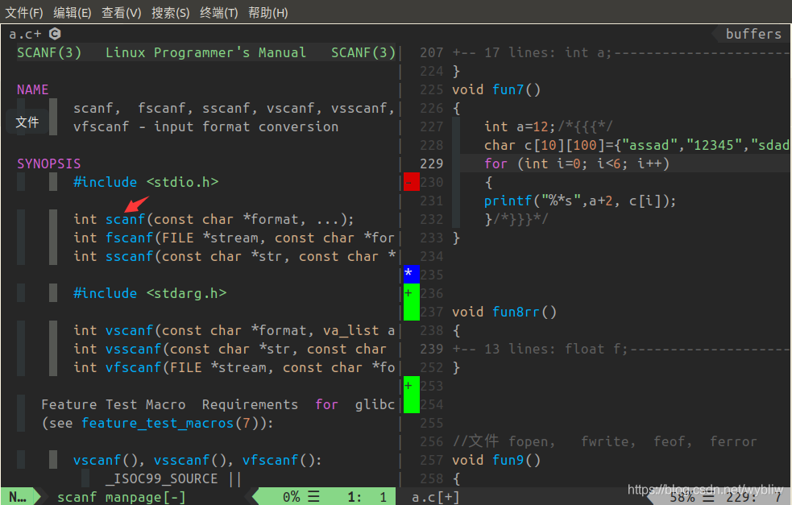

效果图2：水平窗口打开

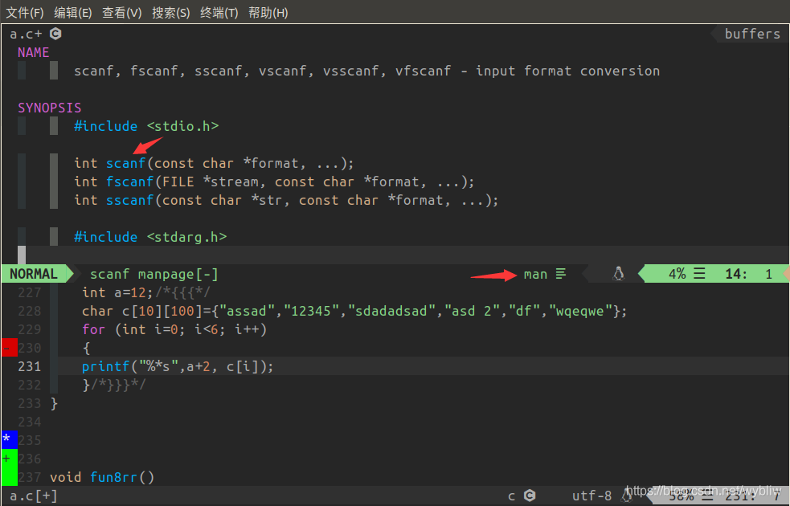

**设置 终端 以vim的方式打开man手册**

- 用vim新建viman文件，文件里输入以下内容：

  ```bash
  #! /bin/sh
  vim -c "Man $1 $2" -c 'silent only'
  ```

- 保存，执行以下命令，给viman一个可执行权限。

  ```bash
  $ sudo cp viman /usr/bin
  $ sudo chmod +x /usr/bin/viman
  ```

- 映射man命令为viman， 编辑用户主目录下的 .bashrc文件，

  ```bash
  在 alias l='ls -CF' 下面添加
  alias man='viman'
  ```

### vim-indent-guides插件

**作用**：显示 缩进线

```bash
https://github.com/nathanaelkane/vim-indent-guides
```

```bash
Plug 'nathanaelkane/vim-indent-guides'
```

**脚本配置**

```bash
" ********** "vim-indent-guides 显示缩进线" **********
  let g:indent_guides_enable_on_vim_startup = 1    "set indent guides enabled by default
  let g:indent_guides_auto_colors = 0   "Setting custom indent colors
  let g:indent_guides_guide_size = 1
  let g:indent_guides_start_level = 1
  let g:indent_guides_space_guides = 1
  let g:indent_guides_tab_guides = 0
  
  autocmd VimEnter,Colorscheme * :hi IndentGuidesOdd  guibg=red   ctermbg=238
  autocmd VimEnter,Colorscheme * :hi IndentGuidesEven guibg=green ctermbg=darkgray
  
  " hi IndentGuidesOdd  guibg=red   ctermbg=0
  " hi IndentGuidesEven guibg=green   ctermbg=8
```

效果图

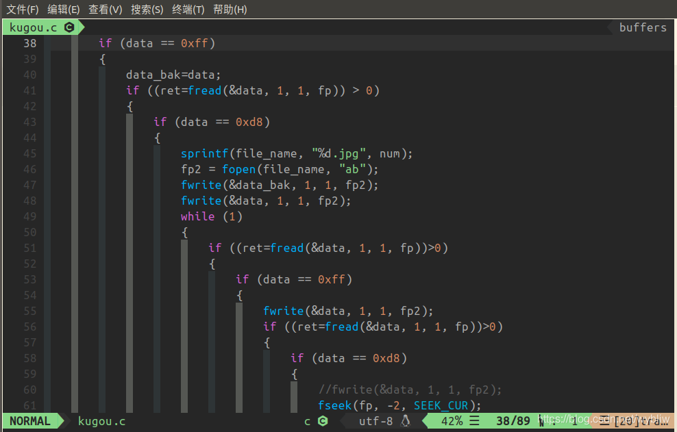

### ultisnips 插件

**作用**：Tab键快速插入断码片段

Github网址：

```
https://github.com/sirver/ultisnips
```

```
  Plug 'honza/vim-snippets'                " 代码片段模板
  Plug 'sirver/ultisnips'                  " 插入代码片段引擎，插件1
  
  " Plug 'MarcWeber/vim-addon-mw-utils'    " 插入代码片段引擎，插件2
  " Plug 'tomtom/tlib_vim'
  " Plug 'garbas/vim-snipmate'
```

**注意**：代码插入引擎 二选其一 即可，下面的脚本配置必须跟随修改

**配置脚本**

```bash
" ********** "ultisnips 代码补齐插件" **********
  " Trigger configuration. Do not use <tab> if you use https://github.com/Valloric/YouCompleteMe.
  let g:UltiSnipsExpandTrigger="<tab>"
  let g:UltiSnipsJumpForwardTrigger="<c-b>"
  let g:UltiSnipsJumpBackwardTrigger="<c-z>"
  " If you want :UltiSnipsEdit to split your window.
  let g:UltiSnipsEditSplit="vertical"
  
  
  " ********** "snipMate 代码补齐插件" **********
  " let g:snipMate = get(g:, 'snipMate', {})    " Allow for vimrc re-sourcing
  " let g:snipMate.scope_aliases = {}
  " let g:snipMate.scope_aliases['ruby'] = 'ruby,rails'
```

效果图


### YouCompleteMe插件

很多设置参见官方网站

```
https://github.com/Valloric/YouCompleteMe#linux-64-bit
```

**脚本配置**

```bash
" ********** "YCM" **********
  let g:ycm_warning_symbol = '✹'                          " 设置语法警告图案
  let g:ycm_show_diagnostics_ui = 1                       " 1:开启语法提示
  let g:ycm_min_num_of_chars_for_completion=1             " 从第1个键入字符就开始罗列匹配项
  let g:ycm_cache_omnifunc=0                              " 0:禁止缓存匹配项，每次都重新生成匹配项
  " let g:ycm_goto_buffer_command = 'horizontal-split'    " 跳转打开上下分屏
  let g:ycm_goto_buffer_command = 'vertical-split'        " 跳转打开左右分屏
  let g:ycm_key_list_stop_completion = ['<C-y>']
  let g:ycm_key_list_select_completion = ['<Down>']
  let g:ycm_key_list_previous_completion = ['<Up>']
  " let g:ycm_global_ycm_extra_conf = '~/.ycm_extra_conf.py'
  " let g:ycm_python_binary_path = 'python'               " 不用
  " 设置YCM检错快捷键
  nmap <F4> :YcmDiags<cr>
```

并将.ycm_extra_conf 文件中的 -Werror 注释掉，这样语法检查错误是X，警告是✹，区分度较好。

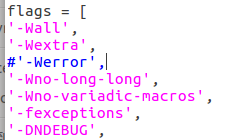

**.ycm_extra_conf文件说明：**改文件配置关系到YCM的补全功能和语法错误提示功能，若当前工程文件是c工程，则-std=c99，否则不能补全宏定义等。

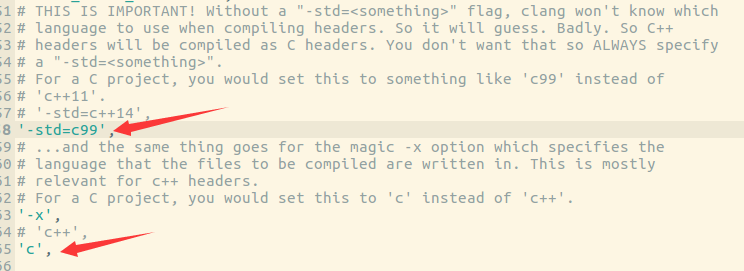

若当前工程文件是c++工程，则-std=c++14 。

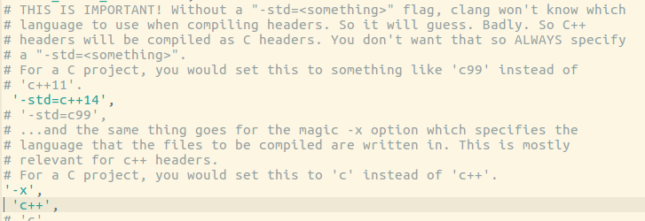

### vim-autoformat" 

**作用**：vim代码格式化插件

```
https://github.com/chiel92/vim-autoformat
```

```
Plug 'chiel92/vim-autoformat'
```

vim-autoformat 插件添加完成后，需要再安装 astyle 格式化工具。

格式化工具有很多种：

（1）astyle（支持C, C++, C++/CLI, Objective‑C, C#和Java）；

（2）clang-format（支持C, C++,和Objective-C ）；

（3）python-pep8,python3-pep8,python-autopep8；

（4）yapf（Google开发的Python格式化工具）

在这里，我只安装了第1种。

ubuntu系统 安装 astyle ：

```
sudo apt-get install astyle
```

**脚本配置**

 **方案1（不再更新）**

```bash
方案1（不再更新）：
 "一般的配置方案，按F12 格式化 代码,  格式化风格为:allman

 " vim-autoformat
  let g:formatdef_my_custom_c = '"astyle --mode=c --style=allman"'
  let g:formatters_c = ['my_custom_c']
  "au BufWrite * :Autoformat
  let g:autoformat_autoindent = 0
  let g:autoformat_retab = 0
  let g:autoformat_remove_trailing_spaces = 0
  noremap <F12> :Autoformat<CR>
 
```

 **方案2推荐使用**

```bash

" ********** "vim-autoformat 代码格式化" **********
  " style风格:  allman  java  kr
  
  " 格式化为allman风格
  nnoremap <leader>fa :call RunFormatAllman() <cr>
  " 格式化为kr风格
  nnoremap <leader>fk :call RunFormatKr() <cr>
  
  func! RunFormatAllman()
      " exec "w" " 这2条命令是利用vim外部调用功能, 二选一
      " exec "!astyle --mode=c --style=allman -S -Y -p -xg -U -k3 -W3 -n %"
      let g:formatdef_my_fmt = '"astyle --mode=c --style=allman -S -Y -p -xg -U -k3 -W3 -n "'
      silent exec "Autoformat"
  endfunc
  
  func! RunFormatKr()
      " exec "w"   " 这2条命令是利用vim外部调用功能, 二选一
      " exec "!astyle --mode=c --style=kr -S -Y -p -xg -U -k3 -W3 -n %"
      let g:formatdef_my_fmt = '"astyle --mode=c --style=kr -S -Y -p -xg -U -k3 -W3 -n "'
      silent exec "Autoformat"
  endfunc
  
  let g:formatters_c = ['my_fmt']
  let g:formatters_cpp = ['my_fmt']
  let g:formatters_java = ['my_fmt']
  " au BufWrite * :Autoformat
  let g:autoformat_autoindent = 0
  let g:autoformat_retab = 0
  let g:autoformat_remove_trailing_spaces = 0
```

### vim-trailing-whitespace插件

**作用**：去除文档多余的空白符

```
https://github.com/bronson/vim-trailing-whitespace
```

```
Plug 'bronson/vim-trailing-whitespace'
```

**脚本配置**

```bash
" ********** "vim-trailing-whitespace" **********
  " <leader> + space 去掉末尾空格快捷键
  nnoremap <leader><space> :FixWhitespace<cr>
```

### rainbow_parentheses.vim插件

**作用**：彩虹括号

```bash
https://github.com/kien/rainbow_parentheses.vim
```


```bash
  Plug 'kien/rainbow_parentheses.vim'
```

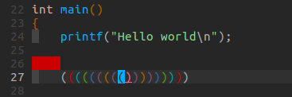

**脚本配置**

```bash
" ********** "rainbow_parentheses 括号高亮增强版" **********
  let g:rbpt_colorpairs = [
      \ ['brown',       'RoyalBlue3'],
      \ ['gray',        'RoyalBlue3'],
      \ ['Darkblue',    'SeaGreen3'],
      \ ['darkgreen',   'firebrick3'],
      \ ['darkcyan',    'RoyalBlue3'],
      \ ['darkred',     'SeaGreen3'],
      \ ['gray',        'RoyalBlue3'],
      \ ]
  
  " let g:rbpt_colorpairs = [
  "     \ ['gray',        'RoyalBlue3'],
  "     \ ['brown',       'RoyalBlue3'],
  "     \ ['Darkblue',    'SeaGreen3'],
  "     \ ['darkgray',    'DarkOrchid3'],
  "     \ ['darkgreen',   'firebrick3'],
  "     \ ['darkcyan',    'RoyalBlue3'],
  "     \ ['darkred',     'SeaGreen3'],
  "     \ ['darkmagenta', 'DarkOrchid3'],
  "     \ ['brown',       'firebrick3'],
  "     \ ['darkmagenta', 'DarkOrchid3'],
  "     \ ['Darkblue',    'firebrick3'],
  "     \ ['darkgreen',   'RoyalBlue3'],
  "     \ ['darkcyan',    'SeaGreen3'],
  "     \ ['darkred',     'DarkOrchid3'],
  "     \ ]
  
  " 不加入这行, 防止黑色括号出现, 很难识别
  "    \ ['black',       'SeaGreen3'],
  
  let g:rbpt_max = 16   " 开启16对括号匹配
  let g:rbpt_loadcmd_toggle = 0
  
  au VimEnter * RainbowParenthesesToggle
  au Syntax * RainbowParenthesesLoadRound
  au Syntax * RainbowParenthesesLoadSquare
  au Syntax * RainbowParenthesesLoadBraces
```

### ctags插件

**作用**：索引生成插件，方便变量、函数的跳转查询

```
  " Plug 'vim-scripts/vimprj'                        " tags标签生成插件1
  " Plug 'vim-scripts/indexer.tar.gz'
  " Plug 'vim-scripts/DfrankUtil'
  
  Plug 'ludovicchabant/vim-gutentags'      " tags标签生成插件2
```

以上插件二选一。

- 使用 **indexer** 插件时，需要在**用户主目录**下新建 **.indexer_files **文件，该文件内容为：

  ```bash
  [PROJECTS_PARENT]
  option:ctags_params="--languages=c++,c,python,java"
  ```

- 使用 **vim-gutentags** 插件时，需要在 **工程目录** 下，用 **touch命令** 新建 **.porj **文件没有内容

  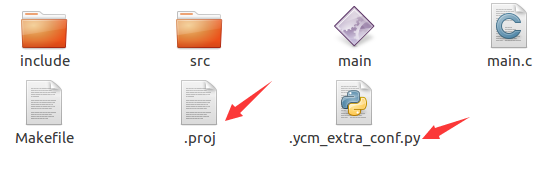

**脚本配置**

```bash
" ********** "vim-gutentags 函数跳转" **********
  " gutentags搜索工程目录的标志，碰到这些文件/目录名就停止向上一级目录递归
  let g:gutentags_project_root = ['.root', '.svn', '.git', '.proj', '.project']
  
  " 所生成的数据文件的名称
  let g:gutentags_ctags_tagfile = '.tags'
  
  " 将自动生成的 tags 文件全部放入 ~/.cache/tags 目录中，避免污染工程目录
  let s:vim_tags = expand('~/.cache/tags')
  let g:gutentags_cache_dir = s:vim_tags
  " 检测 ~/.cache/tags 不存在就新建
  if !isdirectory(s:vim_tags)
     silent! call mkdir(s:vim_tags, 'p')
  endif
  
  
  " ********** "indexer 函数跳转" **********
  " 设置indexer 调用 ctags 的参数
  " 默认 --c++-kinds=+p+l，重新设置为 --c++-kinds=+p+l+x+c+d+e+f+g+m+n+s+t+u+v
  " 默认 --fields=+iaS 不满足 YCM 要求，需改为 --fields=+iaSl
  let g:indexer_ctagsCommandLineOptions="--c++-kinds=+p+l+x+c+d+e+f+g+m+n+s+t+u+v --fields=+iaSl --extra=+q"
  
  
  " ********** "配置 ctags 的参数" **********
  let g:gutentags_ctags_extra_args = ['--fields=+niazS', '--extra=+q']
  let g:gutentags_ctags_extra_args += ['--c++-kinds=+p+l+x+c+d+e+f+g+m+n+s+t+u+vI']
  let g:gutentags_ctags_extra_args += ['--c-kinds=+p+l+x+c+d+e+f+g+m+n+s+t+u+vI']
  
  " 参数详解
  " c   类(classes)
  " d   宏定义(macro definitions)
  " e   枚举变量(enumerators)
  " f   函数定义(function definitions)
  " g   枚举类型(enumeration names)
  " l   局部变量(local variables)，默认不提取
  " m   类、结构体、联合体(class, struct, and union members)
  " n   命名空间(namespaces)
  " p   函数原型(function prototypes)，默认不提取
  " s   结构体类型(structure names)
  " t   (typedefs)
  " u   联合体类型(union names)
  " v   变量定义(variable definitions)
  " x   外部变量(external and forward variable declarations)，默认不提取
  
  " 函数跳转快捷键
  nnoremap <leader>] <C-]>:ts <cr>
```

### DoxygenToolkit.vim插件

作用：函数注释生成插件，快速添加函数注释

```
Plug 'vim-scripts/DoxygenToolkit.vim'    " 快速添加函数注释
```

**配置脚本**

```bash
" ********** "DoxygenToolkit" **********
  let g:DoxygenToolkit_blockHeader  = "************************************************************"
  let g:DoxygenToolkit_briefTag_pre = "@Brief: "
  let g:DoxygenToolkit_paramTag_pre = "@Param: "
  let g:DoxygenToolkit_returnTag    = "@Returns: "
  let g:DoxygenToolkit_versionTag    = "@Version: "
  let g:DoxygenToolkit_versionString = "1.0"
  let g:DoxygenToolkit_authorTag    = "@Author: "
  let g:DoxygenToolkit_authorName   = "Bob"
  let g:DoxygenToolkit_dateTag      = "@Date: "
  let g:DoxygenToolkit_blockFooter  = "************************************************************"
  " let g:DoxygenToolkit_briefTag_funcName = "yes"  " 显示函数名称
  let g:DoxygenToolkit_commentType = "C++"
  let g:DoxygenToolkit_compactDoc = "yes"   " 单行模式
  " let g:Doxygen_enhanced_color = 1
  
  " 快捷键
  nnoremap fcb :Dox<cr>
  nnoremap fca :DoxAll<cr>
  nnoremap fcv :DoxAuthor<cr>
```

Vim插件DoxygenToolkit.vim修改：在DoxygenToolkit.vim文件最后第1150行附近，增加：

```bash
command! -nargs=0 DoxAll :call <SID>DoxygenCommentAll()
```

在DoxygenToolkit.vim文件中第547行，DoxygenCommentFunc()函数前，增加：

```bash
" 注释函数、作者
 function! <SID>DoxygenCommentAll()
 call s:DoxygenCommentFunc()
 exec "normal 2j"
 call s:DoxygenAuthorFunc()
 exec "normal 2k"
 endfunction
```

在DoxygenToolkit.vim文件中第480行，DoxygenAuthorFunc()函数中，注释以下代码，取消文件名，简介：

```bash
" Get file name
   " let l:fileName = expand('%:t')
 
   " Begin to write skeleton
   " let l:insertionMode = s:StartDocumentationBlock()
   " exec "normal ".l:insertionMode.s:interCommentTag.g:DoxygenToolkit_fileTag.l:fileName
   " exec "normal o".s:interCommentTag.g:DoxygenToolkit_briefTag_pre
```

### vim-commentary插件

作用：注释风格 vimplus自带该插件

配置：

```bash
 " ********** "vim-commentary 注释风格" **********
  " 为python和shell等添加注释
  autocmd FileType python,shell,coffee set commentstring=#\ %s
  " 修改注释风格
  autocmd FileType java,c,cpp set commentstring=//\ %s
```

### 关于脚本的其它配置

注意F5按键和YouCompleteMe的查错按键映射有冲突，需要修改

```
" ********** "其他设置" **********

" F12 格式化代码，已经用vim-autoformat代替
" map <F12> gg=G

" ********** "C,C++ 按F5编译运行" **********
map <F5> :call Compile_Run()<CR>
func! Compile_Run()
    silent exec "w"
    exec "redraw!"
    " silent exec "!clear"
    silent exec "!echo"
    " silent exec "!echo -n '____________________________'"

    if &filetype == 'c'
        " silent exec "!gcc % -o %<"
        exec "call CompileGcc()"
        exec "redraw!"
        exec "! ./%<"
        exec "redraw!"
        " exec "!time ./%<"  "显示程序运行时间
    elseif &filetype == 'cpp'
        " silent exec "!g++ % -o %<"   " !: 忽略编译器产生的错误信息
        exec "call CompileGpp()"
        exec "redraw!"
        exec "! ./%<"
        exec "redraw!"
        " exec "!time ./%<"
    elseif &filetype == 'java'
        exec "!javac %"
        exec "! java %<"
        " exec "!time ./%<"
    endif
endfunc

" ********** "C,C++的调试" **********
" map <F6> :call Rungdb()<CR>
func! Rungdb()
    exec "w"
    if &filetype == 'c'
        exec "!gcc % -g -o %<"
        exec "!gdb ./%<"
    elseif &filetype == 'cpp'
        exec "!g++ % -g -o %<"
        exec "!gdb ./%<"
    endif
endfunc

" 函数实现
func! CompileGcc()
    exec "w"
    let compilecmd="!gcc "
    let compileflag="-o %< "
    if search("mpi\.h") != 0
        let compilecmd = "!mpicc "
    endif
    if search("glut\.h") != 0
        let compileflag .= " -lglut -lGLU -lGL "
    endif
    if search("cv\.h") != 0
        let compileflag .= " -lcv -lhighgui -lcvaux "
    endif
    if search("omp\.h") != 0
        let compileflag .= " -fopenmp "
    endif
    if search("math\.h") != 0
        let compileflag .= " -lm "
    endif
    if search("pthread\.h") != 0
        let compileflag .= " -lpthread "
    endif
    silent exec compilecmd." % ".compileflag
endfunc

func! CompileGpp()
    exec "w"
    let compilecmd="!g++ "
    let compileflag="-o %< -std=c++11"
    if search("mpi\.h") != 0
        let compilecmd = "!mpic++ "
    endif
    if search("glut\.h") != 0
        let compileflag .= " -lglut -lGLU -lGL "
    endif
    if search("cv\.h") != 0
        let compileflag .= " -lcv -lhighgui -lcvaux "
    endif
    if search("omp\.h") != 0
        let compileflag .= " -fopenmp "
    endif
    if search("math\.h") != 0
        let compileflag .= " -lm "
    endif
    if search("pthread\.h") != 0
        let compileflag .= " -lpthread "
    endif
    silent exec compilecmd." % ".compileflag
endfunc
```

## 常见问题

### 问题1

#### 问题描述

- [nerdtree-git-status] option ‘g:NERDTreeIndicatorMapCustom’ is deprecated, please use ‘g:NERDTreeGitStatusIndicatorMapCustom’ Press ENTER or type command to continue
- 解决办法引用自[@chxuan](https://www.gitmemory.com/issue/chxuan/vimplus/292/675460589)
- 问题产生原因本插件的原作者[@Xuyuanp](https://github.com/Xuyuanp/nerdtree-git-plugin/issues/154)在更新版本后改变了变量的名字

#### 问题定位

执行： sudo vim ~/.vimrc
在文件中找到如下代码（行号为我的文件中的行号）

```
308 let g:NERDTreeIndicatorMapCustom = {                                                                                                                          
309     \ "Modified"  : "✹",
310     \ "Staged"    : "✚",
311     \ "Untracked" : "✭",
312     \ "Renamed"   : "➜",
313     \ "Unmerged"  : "═",
314     \ "Deleted"   : "✖",
315     \ "Dirty"     : "✗",
316     \ "Clean"     : "✔︎",
317     \ 'Ignored'   : '☒',
318     \ "Unknown"   : "?"
319     \ }
```

修改line 308 “g:NERDTreeIndicatorMapCustom”
为      “g:NERDTreeGitStatusIndicatorMapCustom”

```
307 " nerdtree-git-plugin
308 let g:NERDTreeGitStatusIndicatorMapCustom = {                                                                                                                          
309     \ "Modified"  : "✹",
310     \ "Staged"    : "✚",
311     \ "Untracked" : "✭",
312     \ "Renamed"   : "➜",
313     \ "Unmerged"  : "═",
314     \ "Deleted"   : "✖",
315     \ "Dirty"     : "✗",
316     \ "Clean"     : "✔︎",
317     \ 'Ignored'   : '☒',
318     \ "Unknown"   : "?"
319     \ }
```

问题结束