Eclipse 开发嵌入式Linux驱动程序


## Ubuntu安装Eclipse


1. 下载Eclipse：Eclipse官网下载链接: https://www.eclipse.org/downloads/packages/

   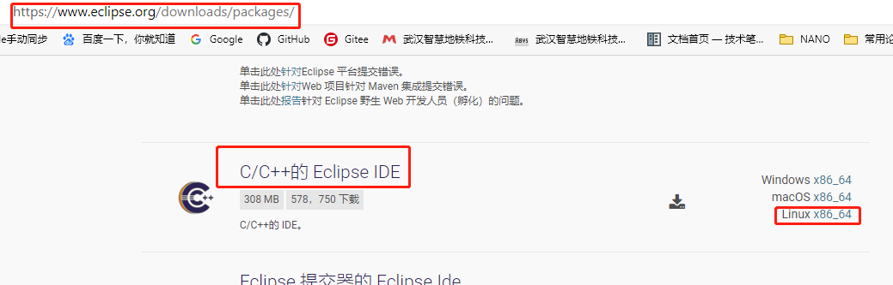

   **解压安装包到 /opt目录下**

   ```bash
   sudo tar -zxvf eclipse-cpp-2020-09-R-linux-gtk-x86_64.tar.gz -C /opt/
   ```

   **创建桌面快捷方式**

   ```c
    
   cd /usr/share/applications
   sudo vim eclipse.desktop
   
   # 文件内容如下：
   [Desktop Entry]
   Encoding=UTF-8
   Name=Eclipse
   Comment=Eclipse
   Exec=/opt/eclipse/eclipse
   Icon=/opt/eclipse/icon.xpm
   Terminal=false
   StartupNotify=true
   Type=Application
   Categories=Application;Development;
   
   # 给文件加权限
   sudo chmod u+x eclipse.desktop
       
   # 在/usr/share/applications目录下将Eclipse图标复制到桌面即可
   ```

   

2. 下载JDK：Eclipse必要的运行环境

   下载地址：http://www.oracle.com/technetwork/java/javase/downloads/jdk8-downloads-2133151.html

   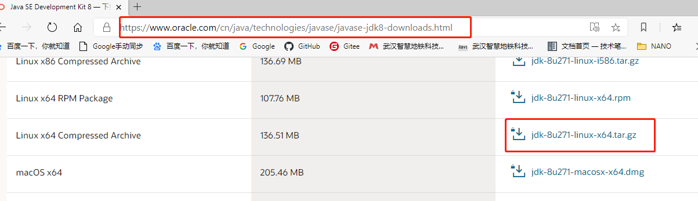

   **配置JDK**

   ```bash
   sudo mkdir /opt/jvm
   sudo tar zxvf jdk-8u271-linux-x64.tar.gz -C /opt/jvm
   ```

   **配置环境变量**

   ```bash
   sudo vim /etc/profile
   
   # 添加下面的代码
   export JAVA_HOME=/opt/jvm/jdk1.8.0_271
   export JRE_HOME=${JAVA_HOME}/jre
   export CLASSPATH=.:%{JAVA_HOME}/lib:%{JRE_HOME}/lib
   export PATH=${JAVA_HOME}/bin:$PATH
   ```

   验证jdk是否安装成功

   ```bash
   java -version
   ```

## Ubuntu使用Eclipse

1. 打开Eclipse新建一个C Project，在以下界面需要注意Toolchains栏目选择交叉编译环境Cross GCC 。注意：Linux Gcc是ubuntu自带的编译器。

   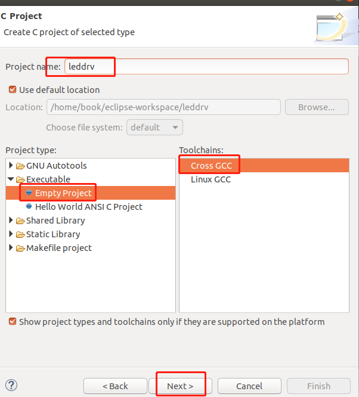

2. 下一步到到Cross GCC Command窗口，做以下配置，选择自己的交叉编译器的安装路径

   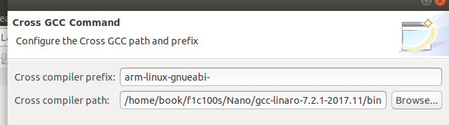

3. 建立好工程后,按"ALT+ENTER"快捷键，调出Properties窗口,选中"C/C++ Build"

   修改：不勾选Generate Makefiles automatically(不自动生成Makefile,使用自己编写的) 

   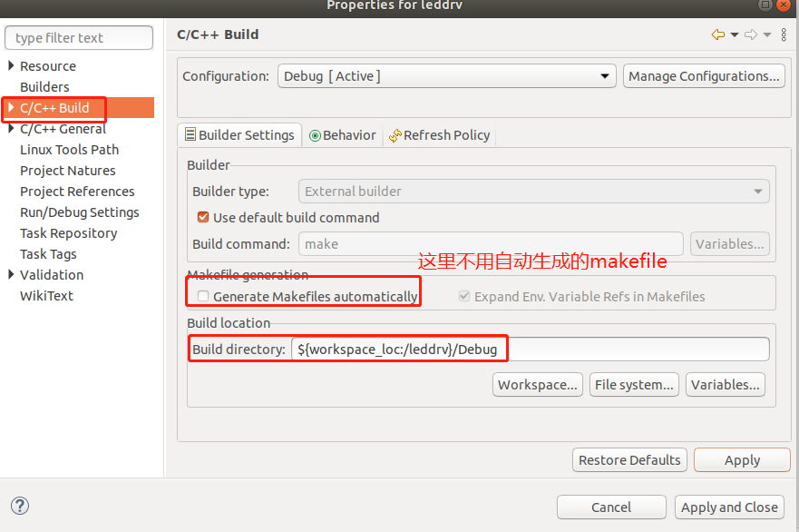

4. 添加linux内核头文件，下面以IMX6ull说明。

   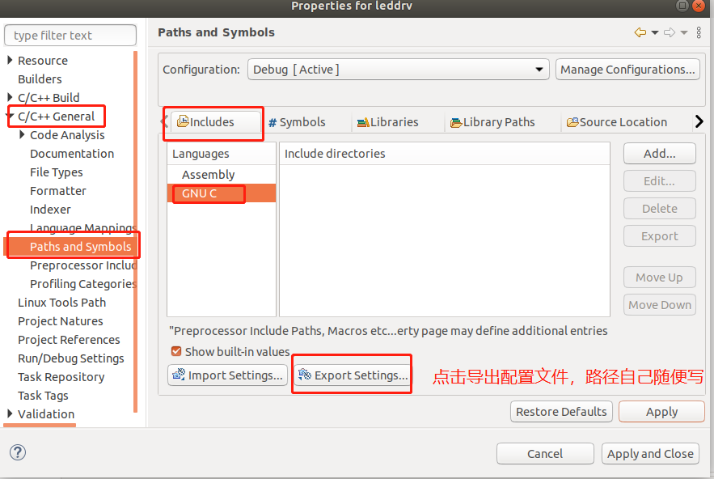

   点击【C/C++ General 】->【 Paths and Symbols】 -> 【Export Setting...】将当前配置导出为symbols.xml文件进行保存(该文件修改好后，还需要从Import Setting导入进来)

   

5. 在 【ebf_6ull_linux/include/generated/ 】目录下执行命令, 完成后在该目录下生成一个symbols_linux.xml文件

   ```bash
   cd ebf_6ull_linux/include/generated/ 
   
   cat autoconf.h |grep define |awk '{print "<macro><name>" $2 "</name><value>" $3 "</value></macro>"}' > symbols_linux.xml
   ```

   执行过程如下

   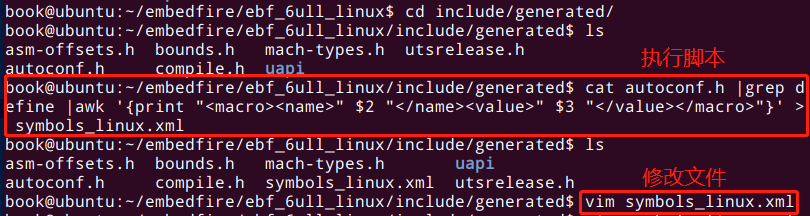

   在symbols_linux.xml文件的开头增加语句:

   ```bash
   <macro><name>__KERNEL__</name><value>1</value></macro> 
   ```

   修改后的截图如下：

   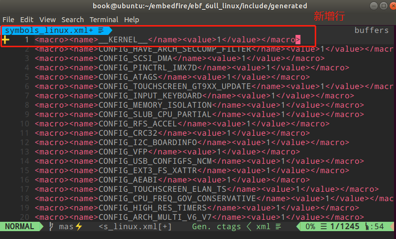

6. 打开之前从eclipse导出的symbols.xml文件如下两处进行修改:

   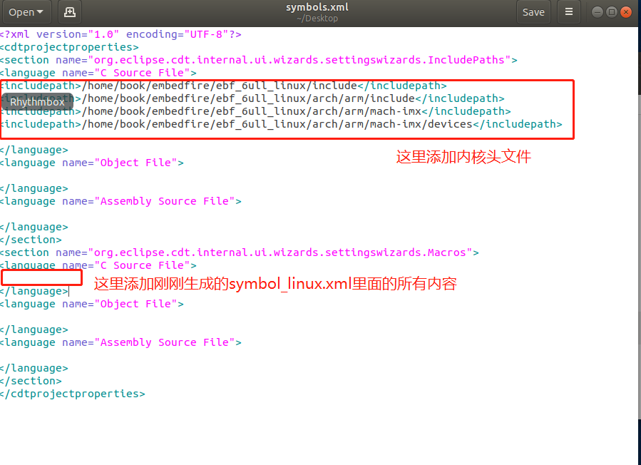

   上图中，第一部分修改添加内核头文件，根据自己的情况添加，我的内容如下：

   ```
   <includepath>/home/book/embedfire/ebf_6ull_linux/include</includepath>
   <includepath>/home/book/embedfire/ebf_6ull_linux/arch/arm/include</includepath>
   <includepath>/home/book/embedfire/ebf_6ull_linux/arch/arm/mach-imx</includepath>
   <includepath>/home/book/embedfire/ebf_6ull_linux/arch/arm/mach-imx/devices</includepath>
   ```

   修改后symbols.xml文件内容如下：

   ```bash
   <?xml version="1.0" encoding="UTF-8"?>
   <cdtprojectproperties>
   <section name="org.eclipse.cdt.internal.ui.wizards.settingswizards.IncludePaths">
   <language name="C Source File">
   <includepath>/home/book/embedfire/ebf_6ull_linux/include</includepath>
   <includepath>/home/book/embedfire/ebf_6ull_linux/arch/arm/include</includepath>
   <includepath>/home/book/embedfire/ebf_6ull_linux/arch/arm/mach-imx</includepath>
   <includepath>/home/book/embedfire/ebf_6ull_linux/arch/arm/mach-imx/devices</includepath>
   
   </language>
   <language name="Object File">
   
   </language>
   <language name="Assembly Source File">
   
   </language>
   </section>
   <section name="org.eclipse.cdt.internal.ui.wizards.settingswizards.Macros">
   <language name="C Source File">
   <macro><name>__KERNEL__</name><value>1</value></macro>
   <macro><name>CONFIG_HAVE_ARCH_SECCOMP_FILTER</name><value>1</value></macro>
   <macro><name>CONFIG_SCSI_DMA</name><value>1</value></macro>
   <macro><name>CONFIG_PINCTRL_IMX7D</name><value>1</value></macro>
   <macro><name>CONFIG_ATAGS</name><value>1</value></macro>
   <macro><name>CONFIG_TOUCHSCREEN_GT9XX_UPDATE</name><value>1</value></macro>
   <macro><name>CONFIG_INPUT_KEYBOARD</name><value>1</value></macro>
   <macro><name>CONFIG_MEMORY_ISOLATION</name><value>1</value></macro>
   <macro><name>CONFIG_SLUB_CPU_PARTIAL</name><value>1</value></macro>
   <macro><name>CONFIG_RFS_ACCEL</name><value>1</value></macro>
   <macro><name>CONFIG_CRC32</name><value>1</value></macro>
   <macro><name>CONFIG_I2C_BOARDINFO</name><value>1</value></macro>
   <macro><name>CONFIG_VFP</name><value>1</value></macro>
   <macro><name>CONFIG_USB_CONFIGFS_NCM</name><value>1</value></macro>
   <macro><name>CONFIG_EXT3_FS_XATTR</name><value>1</value></macro>
   <macro><name>CONFIG_AEABI</name><value>1</value></macro>
   <macro><name>CONFIG_TOUCHSCREEN_ELAN_TS</name><value>1</value></macro>
   <macro><name>CONFIG_CPU_FREQ_GOV_CONSERVATIVE</name><value>1</value></macro>
   <macro><name>CONFIG_HIGH_RES_TIMERS</name><value>1</value></macro>
   <macro><name>CONFIG_ARCH_MULTI_V6_V7</name><value>1</value></macro>
   <macro><name>CONFIG_VLAN_8021Q</name><value>1</value></macro>
   <macro><name>CONFIG_UEVENT_HELPER</name><value>1</value></macro>
   <macro><name>CONFIG_BT_RFCOMM</name><value>1</value></macro>
   <macro><name>CONFIG_LEDS_TRIGGER_HEARTBEAT</name><value>1</value></macro>
   <macro><name>CONFIG_EXT3_DEFAULTS_TO_ORDERED</name><value>1</value></macro>
   <macro><name>CONFIG_XZ_DEC_IA64</name><value>1</value></macro>
   <macro><name>CONFIG_SERIAL_IMX</name><value>1</value></macro>
   <macro><name>CONFIG_INOTIFY_USER</name><value>1</value></macro>
   <macro><name>CONFIG_I2C_IMX</name><value>1</value></macro>
   <macro><name>CONFIG_HDMI</name><value>1</value></macro>
   <macro><name>CONFIG_SCSI_LOGGING</name><value>1</value></macro>
   <macro><name>CONFIG_NETWORK_FILESYSTEMS</name><value>1</value></macro>
   <macro><name>CONFIG_CRYPTO_MD4</name><value>1</value></macro>
   <macro><name>CONFIG_SATA_AHCI_PLATFORM</name><value>1</value></macro>
   <macro><name>CONFIG_CPU_FREQ_GOV_ONDEMAND</name><value>1</value></macro>
   <macro><name>CONFIG_RTC_DRV_MC13XXX</name><value>1</value></macro>
   <macro><name>CONFIG_GLOB</name><value>1</value></macro>
   <macro><name>CONFIG_PPP_SYNC_TTY</name><value>1</value></macro>
   <macro><name>CONFIG_ARCH_SUSPEND_POSSIBLE</name><value>1</value></macro>
   <macro><name>CONFIG_RC_CORE</name><value>1</value></macro>
   <macro><name>CONFIG_USB_G_SERIAL_MODULE</name><value>1</value></macro>
   <macro><name>CONFIG_DRM_VIVANTE</name><value>1</value></macro>
   <macro><name>CONFIG_ARM_UNWIND</name><value>1</value></macro>
   <macro><name>CONFIG_EXT4_FS_POSIX_ACL</name><value>1</value></macro>
   <macro><name>CONFIG_BINFMT_MISC_MODULE</name><value>1</value></macro>
   <macro><name>CONFIG_MXC_GPU_VIV</name><value>1</value></macro>
   <macro><name>CONFIG_SSB_POSSIBLE</name><value>1</value></macro>
   <macro><name>CONFIG_USB_F_EEM_MODULE</name><value>1</value></macro>
   <macro><name>CONFIG_MTD_CMDLINE_PARTS</name><value>1</value></macro>
   <macro><name>CONFIG_MXC_TVIN_ADV7180_MODULE</name><value>1</value></macro>
   <macro><name>CONFIG_USB_OHCI_LITTLE_ENDIAN</name><value>1</value></macro>
   <macro><name>CONFIG_FSNOTIFY</name><value>1</value></macro>
   <macro><name>CONFIG_CRYPTO_RMD128</name><value>1</value></macro>
   <macro><name>CONFIG_BLK_DEV_LOOP_MIN_COUNT</name><value>8</value></macro>
   <macro><name>CONFIG_MEDIA_ATTACH</name><value>1</value></macro>
   <macro><name>CONFIG_CRYPTO_MANAGER_DISABLE_TESTS</name><value>1</value></macro>
   <macro><name>CONFIG_HAVE_KERNEL_LZMA</name><value>1</value></macro>
   <macro><name>CONFIG_ARCH_WANT_IPC_PARSE_VERSION</name><value>1</value></macro>
   <macro><name>CONFIG_NET_PTP_CLASSIFY</name><value>1</value></macro>
   <macro><name>CONFIG_GENERIC_SMP_IDLE_THREAD</name><value>1</value></macro>
   <macro><name>CONFIG_NET_VENDOR_QUALCOMM</name><value>1</value></macro>
   <macro><name>CONFIG_MTD_SST25L</name><value>1</value></macro>
   <macro><name>CONFIG_USB_SERIAL_FTDI_SIO_MODULE</name><value>1</value></macro>
   <macro><name>CONFIG_DEFAULT_SECURITY_DAC</name><value>1</value></macro>
   <macro><name>CONFIG_CRYPTO_CRCT10DIF</name><value>1</value></macro>
   <macro><name>CONFIG_USB_CONFIGFS_OBEX</name><value>1</value></macro>
   <macro><name>CONFIG_SCSI_CONSTANTS</name><value>1</value></macro>
   <macro><name>CONFIG_HAVE_IRQ_TIME_ACCOUNTING</name><value>1</value></macro>
   <macro><name>CONFIG_IPV6</name><value>1</value></macro>
   <macro><name>CONFIG_CRYPTO_AEAD</name><value>1</value></macro>
   <macro><name>CONFIG_BQL</name><value>1</value></macro>
   <macro><name>CONFIG_DEFAULT_TCP_CONG</name><value>"cubic"</value></macro>
   <macro><name>CONFIG_UEVENT_HELPER_PATH</name><value>""</value></macro>
   <macro><name>CONFIG_DEVTMPFS</name><value>1</value></macro>
   <macro><name>CONFIG_MFD_MAX17135</name><value>1</value></macro>
   <macro><name>CONFIG_IR_NEC_DECODER</name><value>1</value></macro>
   <macro><name>CONFIG_HOTPLUG_CPU</name><value>1</value></macro>
   <macro><name>CONFIG_SND_SOC_GENERIC_DMAENGINE_PCM</name><value>1</value></macro>
   <macro><name>CONFIG_PM_SLEEP_DEBUG</name><value>1</value></macro>
   <macro><name>CONFIG_WLAN</name><value>1</value></macro>
   <macro><name>CONFIG_FRAMEBUFFER_CONSOLE_DETECT_PRIMARY</name><value>1</value></macro>
   <macro><name>CONFIG_HAVE_ARM_SCU</name><value>1</value></macro>
   <macro><name>CONFIG_USB_CONFIGFS_MODULE</name><value>1</value></macro>
   <macro><name>CONFIG_CRYPTO_DEV_FSL_CAAM_SM_TEST</name><value>1</value></macro>
   <macro><name>CONFIG_CONNECTOR</name><value>1</value></macro>
   <macro><name>CONFIG_CRYPTO_DEV_FSL_CAAM</name><value>1</value></macro>
   <macro><name>CONFIG_MEDIA_USB_SUPPORT</name><value>1</value></macro>
   <macro><name>CONFIG_IMX_SEMA4</name><value>1</value></macro>
   <macro><name>CONFIG_RTC_DRV_SNVS</name><value>1</value></macro>
   <macro><name>CONFIG_HAVE_IMX_MMDC</name><value>1</value></macro>
   <macro><name>CONFIG_CRYPTO_RNG2</name><value>1</value></macro>
   <macro><name>CONFIG_MFD_MC13XXX</name><value>1</value></macro>
   <macro><name>CONFIG_MSDOS_FS_MODULE</name><value>1</value></macro>
   <macro><name>CONFIG_USB_U_SERIAL_MODULE</name><value>1</value></macro>
   <macro><name>CONFIG_IIO_KFIFO_BUF</name><value>1</value></macro>
   <macro><name>CONFIG_FB_MXC</name><value>1</value></macro>
   <macro><name>CONFIG_CAN</name><value>1</value></macro>
   <macro><name>CONFIG_SOC_IMX7</name><value>1</value></macro>
   <macro><name>CONFIG_CFG80211</name><value>1</value></macro>
   <macro><name>CONFIG_OF_RESERVED_MEM</name><value>1</value></macro>
   <macro><name>CONFIG_MXC_IPU_CSI_ENC_MODULE</name><value>1</value></macro>
   <macro><name>CONFIG_FB_MXS_SII902X</name><value>1</value></macro>
   <macro><name>CONFIG_MXC_VADC_MODULE</name><value>1</value></macro>
   <macro><name>CONFIG_BCMDHD</name><value>1</value></macro>
   <macro><name>CONFIG_HAVE_PROC_CPU</name><value>1</value></macro>
   <macro><name>CONFIG_LZO_DECOMPRESS</name><value>1</value></macro>
   <macro><name>CONFIG_USB_EHCI_ROOT_HUB_TT</name><value>1</value></macro>
   <macro><name>CONFIG_VIDEO_IR_I2C</name><value>1</value></macro>
   <macro><name>CONFIG_USB_SERIAL_OPTION_MODULE</name><value>1</value></macro>
   <macro><name>CONFIG_RD_LZMA</name><value>1</value></macro>
   <macro><name>CONFIG_USB</name><value>1</value></macro>
   <macro><name>CONFIG_ETHERNET</name><value>1</value></macro>
   <macro><name>CONFIG_SCSI_SCAN_ASYNC</name><value>1</value></macro>
   <macro><name>CONFIG_CRC_ITU_T_MODULE</name><value>1</value></macro>
   <macro><name>CONFIG_SOC_VF610</name><value>1</value></macro>
   <macro><name>CONFIG_SOC_IMX6SLL</name><value>1</value></macro>
   <macro><name>CONFIG_HAVE_DMA_CONTIGUOUS</name><value>1</value></macro>
   <macro><name>CONFIG_DQL</name><value>1</value></macro>
   <macro><name>CONFIG_FRAMEBUFFER_CONSOLE</name><value>1</value></macro>
   <macro><name>CONFIG_COREDUMP</name><value>1</value></macro>
   <macro><name>CONFIG_GPIO_74X164</name><value>1</value></macro>
   <macro><name>CONFIG_USB_SERIAL_GENERIC</name><value>1</value></macro>
   <macro><name>CONFIG_SND_SOC_IMX_AUDMUX</name><value>1</value></macro>
   <macro><name>CONFIG_BCMA_POSSIBLE</name><value>1</value></macro>
   <macro><name>CONFIG_USB_CONFIGFS_RNDIS</name><value>1</value></macro>
   <macro><name>CONFIG_NET_VENDOR_CIRRUS</name><value>1</value></macro>
   <macro><name>CONFIG_FORCE_MAX_ZONEORDER</name><value>14</value></macro>
   <macro><name>CONFIG_SND_SOC</name><value>1</value></macro>
   <macro><name>CONFIG_MODULES_USE_ELF_REL</name><value>1</value></macro>
   <macro><name>CONFIG_MX3_IPU</name><value>1</value></macro>
   <macro><name>CONFIG_MEDIA_TUNER_XC5000</name><value>1</value></macro>
   <macro><name>CONFIG_PRINTK</name><value>1</value></macro>
   <macro><name>CONFIG_ARM_IMX6Q_CPUFREQ</name><value>1</value></macro>
   <macro><name>CONFIG_SOC_IMX7D</name><value>1</value></macro>
   <macro><name>CONFIG_USB_OTG_WHITELIST</name><value>1</value></macro>
   <macro><name>CONFIG_TIMERFD</name><value>1</value></macro>
   <macro><name>CONFIG_DNS_RESOLVER</name><value>1</value></macro>
   <macro><name>CONFIG_MTD_CFI_I2</name><value>1</value></macro>
   <macro><name>CONFIG_CRYPTO_AUTHENC</name><value>1</value></macro>
   <macro><name>CONFIG_BOUNCE</name><value>1</value></macro>
   <macro><name>CONFIG_PATA_IMX</name><value>1</value></macro>
   <macro><name>CONFIG_MX3_IPU_IRQS</name><value>4</value></macro>
   <macro><name>CONFIG_SHMEM</name><value>1</value></macro>
   <macro><name>CONFIG_MTD</name><value>1</value></macro>
   <macro><name>CONFIG_MIGRATION</name><value>1</value></macro>
   <macro><name>CONFIG_HAVE_ARCH_JUMP_LABEL</name><value>1</value></macro>
   <macro><name>CONFIG_MMC_BLOCK_MINORS</name><value>8</value></macro>
   <macro><name>CONFIG_DECOMPRESS_LZMA</name><value>1</value></macro>
   <macro><name>CONFIG_DEVTMPFS_MOUNT</name><value>1</value></macro>
   <macro><name>CONFIG_MFD_SI476X_CORE</name><value>1</value></macro>
   <macro><name>CONFIG_DNOTIFY</name><value>1</value></macro>
   <macro><name>CONFIG_CRYPTO_CTS</name><value>1</value></macro>
   <macro><name>CONFIG_SND_SOC_IMX_WM8958</name><value>1</value></macro>
   <macro><name>CONFIG_FB_MXC_TRULY_WVGA_SYNC_PANEL</name><value>1</value></macro>
   <macro><name>CONFIG_INPUT_MOUSEDEV</name><value>1</value></macro>
   <macro><name>CONFIG_GENERIC_NET_UTILS</name><value>1</value></macro>
   <macro><name>CONFIG_REGULATOR_MC13XXX_CORE</name><value>1</value></macro>
   <macro><name>CONFIG_ATA</name><value>1</value></macro>
   <macro><name>CONFIG_SND_SOC_CS42XX8</name><value>1</value></macro>
   <macro><name>CONFIG_MFD_WM8994</name><value>1</value></macro>
   <macro><name>CONFIG_CRYPTO_DES</name><value>1</value></macro>
   <macro><name>CONFIG_ENABLE_MUST_CHECK</name><value>1</value></macro>
   <macro><name>CONFIG_VDSO</name><value>1</value></macro>
   <macro><name>CONFIG_FW_LOADER_USER_HELPER_FALLBACK</name><value>1</value></macro>
   <macro><name>CONFIG_NLS_CODEPAGE_437</name><value>1</value></macro>
   <macro><name>CONFIG_MTD_NAND_IDS</name><value>1</value></macro>
   <macro><name>CONFIG_MXC_VPU</name><value>1</value></macro>
   <macro><name>CONFIG_EXPORTFS</name><value>1</value></macro>
   <macro><name>CONFIG_MTD_UBI_WL_THRESHOLD</name><value>4096</value></macro>
   <macro><name>CONFIG_ARM_GIC</name><value>1</value></macro>
   <macro><name>CONFIG_OLD_SIGSUSPEND3</name><value>1</value></macro>
   <macro><name>CONFIG_SERIO</name><value>1</value></macro>
   <macro><name>CONFIG_INPUT_MOUSE</name><value>1</value></macro>
   <macro><name>CONFIG_ARCH_HAS_SG_CHAIN</name><value>1</value></macro>
   <macro><name>CONFIG_SUNRPC_GSS</name><value>1</value></macro>
   <macro><name>CONFIG_CORE_DUMP_DEFAULT_ELF_HEADERS</name><value>1</value></macro>
   <macro><name>CONFIG_RTC_INTF_SYSFS</name><value>1</value></macro>
   <macro><name>CONFIG_CPU_FREQ_GOV_COMMON</name><value>1</value></macro>
   <macro><name>CONFIG_BLK_DEV_INITRD</name><value>1</value></macro>
   <macro><name>CONFIG_I2C_ALGOPCA_MODULE</name><value>1</value></macro>
   <macro><name>CONFIG_BT_ATH3K</name><value>1</value></macro>
   <macro><name>CONFIG_LEDS_TRIGGER_TIMER</name><value>1</value></macro>
   <macro><name>CONFIG_MXC_IPU_V3_PRE</name><value>1</value></macro>
   <macro><name>CONFIG_CRYPTO_BLOWFISH_COMMON</name><value>1</value></macro>
   <macro><name>CONFIG_BT_INTEL</name><value>1</value></macro>
   <macro><name>CONFIG_HAVE_BPF_JIT</name><value>1</value></macro>
   <macro><name>CONFIG_USB_OTG</name><value>1</value></macro>
   <macro><name>CONFIG_ZLIB_INFLATE</name><value>1</value></macro>
   <macro><name>CONFIG_CRC_T10DIF</name><value>1</value></macro>
   <macro><name>CONFIG_THERMAL_OF</name><value>1</value></macro>
   <macro><name>CONFIG_HWMON</name><value>1</value></macro>
   <macro><name>CONFIG_SOC_IMX6SX</name><value>1</value></macro>
   <macro><name>CONFIG_ARM_ERRATA_764369</name><value>1</value></macro>
   <macro><name>CONFIG_CRYPTO_TWOFISH_COMMON</name><value>1</value></macro>
   <macro><name>CONFIG_LOGO_LINUX_CLUT224</name><value>1</value></macro>
   <macro><name>CONFIG_USB_PHY</name><value>1</value></macro>
   <macro><name>CONFIG_MFD_DA9052_I2C</name><value>1</value></macro>
   <macro><name>CONFIG_IP_PNP</name><value>1</value></macro>
   <macro><name>CONFIG_RC_DEVICES</name><value>1</value></macro>
   <macro><name>CONFIG_USB_VIDEO_CLASS_MODULE</name><value>1</value></macro>
   <macro><name>CONFIG_RTC_INTF_PROC</name><value>1</value></macro>
   <macro><name>CONFIG_PM_CLK</name><value>1</value></macro>
   <macro><name>CONFIG_ARCH_USE_BUILTIN_BSWAP</name><value>1</value></macro>
   <macro><name>CONFIG_CMA_SIZE_SEL_MBYTES</name><value>1</value></macro>
   <macro><name>CONFIG_CPU_IDLE_GOV_MENU</name><value>1</value></macro>
   <macro><name>CONFIG_USB_EHSET_TEST_FIXTURE</name><value>1</value></macro>
   <macro><name>CONFIG_STACKTRACE_SUPPORT</name><value>1</value></macro>
   <macro><name>CONFIG_RESET_CONTROLLER</name><value>1</value></macro>
   <macro><name>CONFIG_ARM_CCI400_PMU</name><value>1</value></macro>
   <macro><name>CONFIG_FB_MXC_MIPI_DSI</name><value>1</value></macro>
   <macro><name>CONFIG_SENSORS_FXOS8700</name><value>1</value></macro>
   <macro><name>CONFIG_LOCKD</name><value>1</value></macro>
   <macro><name>CONFIG_USB_F_FS_MODULE</name><value>1</value></macro>
   <macro><name>CONFIG_USB_CHIPIDEA_UDC</name><value>1</value></macro>
   <macro><name>CONFIG_ARM</name><value>1</value></macro>
   <macro><name>CONFIG_JFFS2_FS</name><value>1</value></macro>
   <macro><name>CONFIG_ARM_L1_CACHE_SHIFT</name><value>6</value></macro>
   <macro><name>CONFIG_USB_G_NCM_MODULE</name><value>1</value></macro>
   <macro><name>CONFIG_MFD_MC13XXX_I2C</name><value>1</value></macro>
   <macro><name>CONFIG_BT_RFCOMM_TTY</name><value>1</value></macro>
   <macro><name>CONFIG_MTD_CFI_UTIL</name><value>1</value></macro>
   <macro><name>CONFIG_NO_HZ_IDLE</name><value>1</value></macro>
   <macro><name>CONFIG_ARM_CPU_TOPOLOGY</name><value>1</value></macro>
   <macro><name>CONFIG_MTD_CFI_INTELEXT</name><value>1</value></macro>
   <macro><name>CONFIG_LLC2</name><value>1</value></macro>
   <macro><name>CONFIG_USB_F_SERIAL_MODULE</name><value>1</value></macro>
   <macro><name>CONFIG_LOGO</name><value>1</value></macro>
   <macro><name>CONFIG_USB_STORAGE</name><value>1</value></macro>
   <macro><name>CONFIG_SERIAL_FSL_LPUART</name><value>1</value></macro>
   <macro><name>CONFIG_SND_KCTL_JACK</name><value>1</value></macro>
   <macro><name>CONFIG_CPU_FREQ_GOV_PERFORMANCE</name><value>1</value></macro>
   <macro><name>CONFIG_RATIONAL</name><value>1</value></macro>
   <macro><name>CONFIG_I2C_MUX</name><value>1</value></macro>
   <macro><name>CONFIG_KEYBOARD_SNVS_PWRKEY</name><value>1</value></macro>
   <macro><name>CONFIG_WATCHDOG_CORE</name><value>1</value></macro>
   <macro><name>CONFIG_SND_SOC_FSL_SPDIF</name><value>1</value></macro>
   <macro><name>CONFIG_SND_USB_AUDIO_MODULE</name><value>1</value></macro>
   <macro><name>CONFIG_CS89x0_PLATFORM</name><value>1</value></macro>
   <macro><name>CONFIG_BLOCK</name><value>1</value></macro>
   <macro><name>CONFIG_MEDIA_TUNER_TDA827X</name><value>1</value></macro>
   <macro><name>CONFIG_INIT_ENV_ARG_LIMIT</name><value>32</value></macro>
   <macro><name>CONFIG_ROOT_NFS</name><value>1</value></macro>
   <macro><name>CONFIG_CRYPTO_USER</name><value>1</value></macro>
   <macro><name>CONFIG_BUG</name><value>1</value></macro>
   <macro><name>CONFIG_DEBUG_IMX_UART_PORT</name><value>1</value></macro>
   <macro><name>CONFIG_MAC80211_HAS_RC</name><value>1</value></macro>
   <macro><name>CONFIG_SND_SOC_IMX_SI476X</name><value>1</value></macro>
   <macro><name>CONFIG_CLKSRC_OF</name><value>1</value></macro>
   <macro><name>CONFIG_PANTHERLORD_FF</name><value>1</value></macro>
   <macro><name>CONFIG_PM</name><value>1</value></macro>
   <macro><name>CONFIG_PPS</name><value>1</value></macro>
   <macro><name>CONFIG_SPI</name><value>1</value></macro>
   <macro><name>CONFIG_V4L_MEM2MEM_DRIVERS</name><value>1</value></macro>
   <macro><name>CONFIG_ARCH_MXC</name><value>1</value></macro>
   <macro><name>CONFIG_RADIO_SI476X</name><value>1</value></macro>
   <macro><name>CONFIG_OF_IRQ</name><value>1</value></macro>
   <macro><name>CONFIG_LIBFDT</name><value>1</value></macro>
   <macro><name>CONFIG_SERIAL_IMX_CONSOLE</name><value>1</value></macro>
   <macro><name>CONFIG_PPP_DEFLATE</name><value>1</value></macro>
   <macro><name>CONFIG_USELIB</name><value>1</value></macro>
   <macro><name>CONFIG_MXC_CAMERA_OV5642_MODULE</name><value>1</value></macro>
   <macro><name>CONFIG_BCMDHD_SDIO_IRQ</name><value>1</value></macro>
   <macro><name>CONFIG_VT</name><value>1</value></macro>
   <macro><name>CONFIG_USB_NET_NET1080</name><value>1</value></macro>
   <macro><name>CONFIG_DTC</name><value>1</value></macro>
   <macro><name>CONFIG_REGMAP_SPI</name><value>1</value></macro>
   <macro><name>CONFIG_BT_BREDR</name><value>1</value></macro>
   <macro><name>CONFIG_SPLIT_PTLOCK_CPUS</name><value>4</value></macro>
   <macro><name>CONFIG_POWER_SUPPLY</name><value>1</value></macro>
   <macro><name>CONFIG_CPU_CACHE_VIPT</name><value>1</value></macro>
   <macro><name>CONFIG_SND_DMAENGINE_PCM</name><value>1</value></macro>
   <macro><name>CONFIG_GENERIC_IRQ_CHIP</name><value>1</value></macro>
   <macro><name>CONFIG_NLS</name><value>1</value></macro>
   <macro><name>CONFIG_FB_MXS</name><value>1</value></macro>
   <macro><name>CONFIG_MEDIA_CAMERA_SUPPORT</name><value>1</value></macro>
   <macro><name>CONFIG_USB_CONFIGFS_ACM</name><value>1</value></macro>
   <macro><name>CONFIG_PPPOE</name><value>1</value></macro>
   <macro><name>CONFIG_MTD_DATAFLASH</name><value>1</value></macro>
   <macro><name>CONFIG_CPU_THERMAL</name><value>1</value></macro>
   <macro><name>CONFIG_IRQ_WORK</name><value>1</value></macro>
   <macro><name>CONFIG_MXC_CAMERA_OV5640_MIPI_MODULE</name><value>1</value></macro>
   <macro><name>CONFIG_ENABLE_WARN_DEPRECATED</name><value>1</value></macro>
   <macro><name>CONFIG_SPI_BITBANG</name><value>1</value></macro>
   <macro><name>CONFIG_USB_COMMON</name><value>1</value></macro>
   <macro><name>CONFIG_MEDIA_TUNER_TDA18271</name><value>1</value></macro>
   <macro><name>CONFIG_PINCTRL_IMX</name><value>1</value></macro>
   <macro><name>CONFIG_CPU_FREQ_GOV_USERSPACE</name><value>1</value></macro>
   <macro><name>CONFIG_LOG_CPU_MAX_BUF_SHIFT</name><value>12</value></macro>
   <macro><name>CONFIG_OF_NET</name><value>1</value></macro>
   <macro><name>CONFIG_ARM_ARCH_TIMER</name><value>1</value></macro>
   <macro><name>CONFIG_NET_CADENCE</name><value>1</value></macro>
   <macro><name>CONFIG_SND_SOC_EUKREA_TLV320</name><value>1</value></macro>
   <macro><name>CONFIG_ARCH_WANT_OPTIONAL_GPIOLIB</name><value>1</value></macro>
   <macro><name>CONFIG_NLS_ISO8859_1</name><value>1</value></macro>
   <macro><name>CONFIG_CRYPTO_WORKQUEUE</name><value>1</value></macro>
   <macro><name>CONFIG_BACKLIGHT_GENERIC</name><value>1</value></macro>
   <macro><name>CONFIG_USB_EHCI_HCD</name><value>1</value></macro>
   <macro><name>CONFIG_BCMDHD_FW_PATH</name><value>"/lib/firmware/bcm/AP6236/Wi-Fi/fw_bcm43436b0.bin"</value></macro>
   <macro><name>CONFIG_MXC_MIPI_CSI_MODULE</name><value>1</value></macro>
   <macro><name>CONFIG_HAVE_IMX_ANATOP</name><value>1</value></macro>
   <macro><name>CONFIG_PPP_MPPE</name><value>1</value></macro>
   <macro><name>CONFIG_CAN_CALC_BITTIMING</name><value>1</value></macro>
   <macro><name>CONFIG_SND_SOC_WM8960</name><value>1</value></macro>
   <macro><name>CONFIG_RFKILL</name><value>1</value></macro>
   <macro><name>CONFIG_NETDEVICES</name><value>1</value></macro>
   <macro><name>CONFIG_HAVE_CONTEXT_TRACKING</name><value>1</value></macro>
   <macro><name>CONFIG_IOSCHED_DEADLINE</name><value>1</value></macro>
   <macro><name>CONFIG_CPU_TLB_V7</name><value>1</value></macro>
   <macro><name>CONFIG_EVENTFD</name><value>1</value></macro>
   <macro><name>CONFIG_FS_POSIX_ACL</name><value>1</value></macro>
   <macro><name>CONFIG_IPV6_SIT</name><value>1</value></macro>
   <macro><name>CONFIG_XFRM</name><value>1</value></macro>
   <macro><name>CONFIG_DEFCONFIG_LIST</name><value>"/lib/modules/$UNAME_RELEASE/.config"</value></macro>
   <macro><name>CONFIG_HW_RANDOM_IMX_RNG</name><value>1</value></macro>
   <macro><name>CONFIG_HZ_100</name><value>1</value></macro>
   <macro><name>CONFIG_PROC_PAGE_MONITOR</name><value>1</value></macro>
   <macro><name>CONFIG_USB_CONFIGFS_ECM</name><value>1</value></macro>
   <macro><name>CONFIG_RCU_FANOUT_LEAF</name><value>16</value></macro>
   <macro><name>CONFIG_MTD_SPI_NOR_USE_4K_SECTORS</name><value>1</value></macro>
   <macro><name>CONFIG_BPF</name><value>1</value></macro>
   <macro><name>CONFIG_USB_VIDEO_CLASS_INPUT_EVDEV</name><value>1</value></macro>
   <macro><name>CONFIG_FB_MXC_LDB</name><value>1</value></macro>
   <macro><name>CONFIG_DEBUG_VF_UART_PORT</name><value>1</value></macro>
   <macro><name>CONFIG_RD_LZO</name><value>1</value></macro>
   <macro><name>CONFIG_CRYPTO_SHA512</name><value>1</value></macro>
   <macro><name>CONFIG_BACKLIGHT_CLASS_DEVICE</name><value>1</value></macro>
   <macro><name>CONFIG_MTD_OF_PARTS</name><value>1</value></macro>
   <macro><name>CONFIG_CRYPTO_NULL</name><value>1</value></macro>
   <macro><name>CONFIG_MIGHT_HAVE_PCI</name><value>1</value></macro>
   <macro><name>CONFIG_HAVE_ARCH_PFN_VALID</name><value>1</value></macro>
   <macro><name>CONFIG_CPU_COPY_V6</name><value>1</value></macro>
   <macro><name>CONFIG_PM_DEBUG</name><value>1</value></macro>
   <macro><name>CONFIG_CRYPTO_DEFLATE</name><value>1</value></macro>
   <macro><name>CONFIG_GENERIC_STRNLEN_USER</name><value>1</value></macro>
   <macro><name>CONFIG_MTD_CFI</name><value>1</value></macro>
   <macro><name>CONFIG_JFFS2_FS_DEBUG</name><value>0</value></macro>
   <macro><name>CONFIG_CRYPTO_GCM</name><value>1</value></macro>
   <macro><name>CONFIG_HAVE_DYNAMIC_FTRACE</name><value>1</value></macro>
   <macro><name>CONFIG_MAGIC_SYSRQ</name><value>1</value></macro>
   <macro><name>CONFIG_USB_CONFIGFS_F_FS</name><value>1</value></macro>
   <macro><name>CONFIG_PGTABLE_LEVELS</name><value>2</value></macro>
   <macro><name>CONFIG_MAC80211_RC_DEFAULT_MINSTREL</name><value>1</value></macro>
   <macro><name>CONFIG_ARM_VIRT_EXT</name><value>1</value></macro>
   <macro><name>CONFIG_SPARSE_IRQ</name><value>1</value></macro>
   <macro><name>CONFIG_HAVE_ARM_TWD</name><value>1</value></macro>
   <macro><name>CONFIG_MXC_SIM</name><value>1</value></macro>
   <macro><name>CONFIG_USB_MASS_STORAGE_MODULE</name><value>1</value></macro>
   <macro><name>CONFIG_SECURITYFS</name><value>1</value></macro>
   <macro><name>CONFIG_DEFAULT_CFQ</name><value>1</value></macro>
   <macro><name>CONFIG_RCU_STALL_COMMON</name><value>1</value></macro>
   <macro><name>CONFIG_BT_DEBUGFS</name><value>1</value></macro>
   <macro><name>CONFIG_INET6_XFRM_MODE_TUNNEL</name><value>1</value></macro>
   <macro><name>CONFIG_MEDIA_SUPPORT</name><value>1</value></macro>
   <macro><name>CONFIG_EXT3_FS</name><value>1</value></macro>
   <macro><name>CONFIG_SND_SOC_FSL_HDMI</name><value>1</value></macro>
   <macro><name>CONFIG_FAT_FS</name><value>1</value></macro>
   <macro><name>CONFIG_MXC_TZIC</name><value>1</value></macro>
   <macro><name>CONFIG_HIGHMEM</name><value>1</value></macro>
   <macro><name>CONFIG_INET_TUNNEL</name><value>1</value></macro>
   <macro><name>CONFIG_PINCONF</name><value>1</value></macro>
   <macro><name>CONFIG_MMC_BLOCK_BOUNCE</name><value>1</value></macro>
   <macro><name>CONFIG_GPIO_MXC</name><value>1</value></macro>
   <macro><name>CONFIG_GENERIC_CLOCKEVENTS</name><value>1</value></macro>
   <macro><name>CONFIG_IOSCHED_CFQ</name><value>1</value></macro>
   <macro><name>CONFIG_OID_REGISTRY</name><value>1</value></macro>
   <macro><name>CONFIG_RWSEM_XCHGADD_ALGORITHM</name><value>1</value></macro>
   <macro><name>CONFIG_MFD_CORE</name><value>1</value></macro>
   <macro><name>CONFIG_HAVE_KERNEL_XZ</name><value>1</value></macro>
   <macro><name>CONFIG_CPU_CP15_MMU</name><value>1</value></macro>
   <macro><name>CONFIG_RFKILL_LEDS</name><value>1</value></macro>
   <macro><name>CONFIG_BT_HCIBTUSB_BCM</name><value>1</value></macro>
   <macro><name>CONFIG_CONSOLE_TRANSLATIONS</name><value>1</value></macro>
   <macro><name>CONFIG_MTD_CFI_STAA</name><value>1</value></macro>
   <macro><name>CONFIG_ARCH_SUPPORTS_ATOMIC_RMW</name><value>1</value></macro>
   <macro><name>CONFIG_SOC_IMX53</name><value>1</value></macro>
   <macro><name>CONFIG_STOP_MACHINE</name><value>1</value></macro>
   <macro><name>CONFIG_LEDS_TRIGGER_BACKLIGHT</name><value>1</value></macro>
   <macro><name>CONFIG_CPU_FREQ</name><value>1</value></macro>
   <macro><name>CONFIG_USB_GSPCA_MODULE</name><value>1</value></macro>
   <macro><name>CONFIG_CRYPTO_BLOWFISH</name><value>1</value></macro>
   <macro><name>CONFIG_DUMMY_CONSOLE</name><value>1</value></macro>
   <macro><name>CONFIG_NLS_ASCII</name><value>1</value></macro>
   <macro><name>CONFIG_SND_SOC_FSL_SSI</name><value>1</value></macro>
   <macro><name>CONFIG_TRACE_IRQFLAGS_SUPPORT</name><value>1</value></macro>
   <macro><name>CONFIG_MFD_SYSCON</name><value>1</value></macro>
   <macro><name>CONFIG_NFS_V3_ACL</name><value>1</value></macro>
   <macro><name>CONFIG_CRYPTO_CCM</name><value>1</value></macro>
   <macro><name>CONFIG_USB_NET_CDC_SUBSET</name><value>1</value></macro>
   <macro><name>CONFIG_LEDS_TRIGGERS</name><value>1</value></macro>
   <macro><name>CONFIG_CRYPTO_RNG</name><value>1</value></macro>
   <macro><name>CONFIG_W1_MASTER_GPIO</name><value>1</value></macro>
   <macro><name>CONFIG_SND_USB</name><value>1</value></macro>
   <macro><name>CONFIG_VIDEOBUF2_MEMOPS</name><value>1</value></macro>
   <macro><name>CONFIG_RD_GZIP</name><value>1</value></macro>
   <macro><name>CONFIG_HAVE_REGS_AND_STACK_ACCESS_API</name><value>1</value></macro>
   <macro><name>CONFIG_TOUCHSCREEN_GT9XX_DEBUG</name><value>1</value></macro>
   <macro><name>CONFIG_PWM_SYSFS</name><value>1</value></macro>
   <macro><name>CONFIG_ALLOW_DEV_COREDUMP</name><value>1</value></macro>
   <macro><name>CONFIG_LBDAF</name><value>1</value></macro>
   <macro><name>CONFIG_SWIOTLB</name><value>1</value></macro>
   <macro><name>CONFIG_EXT4_FS_SECURITY</name><value>1</value></macro>
   <macro><name>CONFIG_HAVE_VIRT_CPU_ACCOUNTING_GEN</name><value>1</value></macro>
   <macro><name>CONFIG_CRYPTO_MD5</name><value>1</value></macro>
   <macro><name>CONFIG_USB_F_SS_LB_MODULE</name><value>1</value></macro>
   <macro><name>CONFIG_USB_CHIPIDEA</name><value>1</value></macro>
   <macro><name>CONFIG_MEDIA_TUNER_TEA5767</name><value>1</value></macro>
   <macro><name>CONFIG_CS89x0</name><value>1</value></macro>
   <macro><name>CONFIG_BINFMT_ELF</name><value>1</value></macro>
   <macro><name>CONFIG_IIO_TRIGGER</name><value>1</value></macro>
   <macro><name>CONFIG_UDF_NLS</name><value>1</value></macro>
   <macro><name>CONFIG_HAVE_PERF_REGS</name><value>1</value></macro>
   <macro><name>CONFIG_CPU_CP15</name><value>1</value></macro>
   <macro><name>CONFIG_CC_STACKPROTECTOR_NONE</name><value>1</value></macro>
   <macro><name>CONFIG_HZ_FIXED</name><value>0</value></macro>
   <macro><name>CONFIG_FB_MXC_MIPI_DSI_SAMSUNG</name><value>1</value></macro>
   <macro><name>CONFIG_USB_SERIAL_MODULE</name><value>1</value></macro>
   <macro><name>CONFIG_REGULATOR_FIXED_VOLTAGE</name><value>1</value></macro>
   <macro><name>CONFIG_LCD_L4F00242T03</name><value>1</value></macro>
   <macro><name>CONFIG_PINCTRL_IMX6UL</name><value>1</value></macro>
   <macro><name>CONFIG_VF_USE_ARM_GLOBAL_TIMER</name><value>1</value></macro>
   <macro><name>CONFIG_KEYS</name><value>1</value></macro>
   <macro><name>CONFIG_SPI_FSL_QUADSPI</name><value>1</value></macro>
   <macro><name>CONFIG_HAVE_IMX_RPMSG</name><value>1</value></macro>
   <macro><name>CONFIG_MFD_STMPE</name><value>1</value></macro>
   <macro><name>CONFIG_HAVE_ARCH_AUDITSYSCALL</name><value>1</value></macro>
   <macro><name>CONFIG_TOUCHSCREEN_MC13783</name><value>1</value></macro>
   <macro><name>CONFIG_PM_SLEEP_SMP</name><value>1</value></macro>
   <macro><name>CONFIG_CRYPTO_HW</name><value>1</value></macro>
   <macro><name>CONFIG_MAC80211_RC_MINSTREL_HT</name><value>1</value></macro>
   <macro><name>CONFIG_USE_OF</name><value>1</value></macro>
   <macro><name>CONFIG_LOGO_LINUX_MONO</name><value>1</value></macro>
   <macro><name>CONFIG_FB_MXC_HDMI</name><value>1</value></macro>
   <macro><name>CONFIG_MAGIC_SYSRQ_DEFAULT_ENABLE</name><value>0x1</value></macro>
   <macro><name>CONFIG_PINCTRL_IMX6Q</name><value>1</value></macro>
   <macro><name>CONFIG_SND_SOC_FSL_ESAI</name><value>1</value></macro>
   <macro><name>CONFIG_HARDIRQS_SW_RESEND</name><value>1</value></macro>
   <macro><name>CONFIG_JFFS2_FS_WRITEBUFFER</name><value>1</value></macro>
   <macro><name>CONFIG_SPI_MASTER</name><value>1</value></macro>
   <macro><name>CONFIG_VT_HW_CONSOLE_BINDING</name><value>1</value></macro>
   <macro><name>CONFIG_MXC_IPU_PRP_ENC_MODULE</name><value>1</value></macro>
   <macro><name>CONFIG_SND_SOC_WM8994</name><value>1</value></macro>
   <macro><name>CONFIG_ARCH_MULTI_V7</name><value>1</value></macro>
   <macro><name>CONFIG_SRAM</name><value>1</value></macro>
   <macro><name>CONFIG_BT_HCIBCM203X</name><value>1</value></macro>
   <macro><name>CONFIG_THERMAL_HWMON</name><value>1</value></macro>
   <macro><name>CONFIG_XZ_DEC_X86</name><value>1</value></macro>
   <macro><name>CONFIG_INPUT_JOYDEV_MODULE</name><value>1</value></macro>
   <macro><name>CONFIG_USB_ACM_MODULE</name><value>1</value></macro>
   <macro><name>CONFIG_USB_RTL8150_MODULE</name><value>1</value></macro>
   <macro><name>CONFIG_CRC16</name><value>1</value></macro>
   <macro><name>CONFIG_USB_NET_AX8817X</name><value>1</value></macro>
   <macro><name>CONFIG_GENERIC_CALIBRATE_DELAY</name><value>1</value></macro>
   <macro><name>CONFIG_IMX_RPMSG_TTY_MODULE</name><value>1</value></macro>
   <macro><name>CONFIG_CRYPTO_GF128MUL</name><value>1</value></macro>
   <macro><name>CONFIG_ARCH_REQUIRE_GPIOLIB</name><value>1</value></macro>
   <macro><name>CONFIG_CRYPTO_DEV_FSL_CAAM_SECVIO</name><value>1</value></macro>
   <macro><name>CONFIG_TMPFS</name><value>1</value></macro>
   <macro><name>CONFIG_SENSORS_FXAS2100X</name><value>1</value></macro>
   <macro><name>CONFIG_ANON_INODES</name><value>1</value></macro>
   <macro><name>CONFIG_FUTEX</name><value>1</value></macro>
   <macro><name>CONFIG_IP_PNP_DHCP</name><value>1</value></macro>
   <macro><name>CONFIG_REGMAP_I2C</name><value>1</value></macro>
   <macro><name>CONFIG_GENERIC_SCHED_CLOCK</name><value>1</value></macro>
   <macro><name>CONFIG_INPUT_MATRIXKMAP</name><value>1</value></macro>
   <macro><name>CONFIG_PM_TEST_SUSPEND</name><value>1</value></macro>
   <macro><name>CONFIG_RTC_HCTOSYS</name><value>1</value></macro>
   <macro><name>CONFIG_HAVE_ARCH_BITREVERSE</name><value>1</value></macro>
   <macro><name>CONFIG_SERIAL_CORE_CONSOLE</name><value>1</value></macro>
   <macro><name>CONFIG_REGMAP_IRQ</name><value>1</value></macro>
   <macro><name>CONFIG_USB_HID</name><value>1</value></macro>
   <macro><name>CONFIG_UBIFS_FS</name><value>1</value></macro>
   <macro><name>CONFIG_CRYPTO_TGR192</name><value>1</value></macro>
   <macro><name>CONFIG_USB_F_RNDIS_MODULE</name><value>1</value></macro>
   <macro><name>CONFIG_CRYPTO_DEV_FSL_CAAM_JR</name><value>1</value></macro>
   <macro><name>CONFIG_DMADEVICES</name><value>1</value></macro>
   <macro><name>CONFIG_HAVE_IMX_RNG</name><value>1</value></macro>
   <macro><name>CONFIG_SOC_IMX6</name><value>1</value></macro>
   <macro><name>CONFIG_MOUSE_PS2_ELANTECH</name><value>1</value></macro>
   <macro><name>CONFIG_SOC_IMX50</name><value>1</value></macro>
   <macro><name>CONFIG_PINCTRL</name><value>1</value></macro>
   <macro><name>CONFIG_IPV6_NDISC_NODETYPE</name><value>1</value></macro>
   <macro><name>CONFIG_SMC911X</name><value>1</value></macro>
   <macro><name>CONFIG_SYSVIPC</name><value>1</value></macro>
   <macro><name>CONFIG_CRYPTO_PCOMP2</name><value>1</value></macro>
   <macro><name>CONFIG_USB_CONFIGFS_ECM_SUBSET</name><value>1</value></macro>
   <macro><name>CONFIG_HAVE_DEBUG_KMEMLEAK</name><value>1</value></macro>
   <macro><name>CONFIG_SMSC911X</name><value>1</value></macro>
   <macro><name>CONFIG_KEYBOARD_GPIO</name><value>1</value></macro>
   <macro><name>CONFIG_SND_SOC_IMX_CS42888</name><value>1</value></macro>
   <macro><name>CONFIG_MODULES</name><value>1</value></macro>
   <macro><name>CONFIG_CPU_HAS_ASID</name><value>1</value></macro>
   <macro><name>CONFIG_RPMSG</name><value>1</value></macro>
   <macro><name>CONFIG_USB_GADGET</name><value>1</value></macro>
   <macro><name>CONFIG_USB_ETH_RNDIS</name><value>1</value></macro>
   <macro><name>CONFIG_SOUND</name><value>1</value></macro>
   <macro><name>CONFIG_JOLIET</name><value>1</value></macro>
   <macro><name>CONFIG_MEDIA_TUNER_TDA9887</name><value>1</value></macro>
   <macro><name>CONFIG_ARCH_HIBERNATION_POSSIBLE</name><value>1</value></macro>
   <macro><name>CONFIG_SND_SOC_SI476X</name><value>1</value></macro>
   <macro><name>CONFIG_UNIX</name><value>1</value></macro>
   <macro><name>CONFIG_USB_NET_DRIVERS</name><value>1</value></macro>
   <macro><name>CONFIG_MXC_HDMI_CEC</name><value>1</value></macro>
   <macro><name>CONFIG_NO_HZ_COMMON</name><value>1</value></macro>
   <macro><name>CONFIG_HAVE_CLK</name><value>1</value></macro>
   <macro><name>CONFIG_CRYPTO_HASH2</name><value>1</value></macro>
   <macro><name>CONFIG_THERMAL_GOV_STEP_WISE</name><value>1</value></macro>
   <macro><name>CONFIG_DEFAULT_HOSTNAME</name><value>"(none)"</value></macro>
   <macro><name>CONFIG_SRCU</name><value>1</value></macro>
   <macro><name>CONFIG_USB_GADGET_STORAGE_NUM_BUFFERS</name><value>2</value></macro>
   <macro><name>CONFIG_FB_MXC_EDID</name><value>1</value></macro>
   <macro><name>CONFIG_SND_SOC_IMX_SII902X</name><value>1</value></macro>
   <macro><name>CONFIG_CPU_FREQ_GOV_POWERSAVE</name><value>1</value></macro>
   <macro><name>CONFIG_NFS_FS</name><value>1</value></macro>
   <macro><name>CONFIG_XPS</name><value>1</value></macro>
   <macro><name>CONFIG_LZ4_DECOMPRESS</name><value>1</value></macro>
   <macro><name>CONFIG_GPIO_MAX732X</name><value>1</value></macro>
   <macro><name>CONFIG_FONT_SUPPORT</name><value>1</value></macro>
   <macro><name>CONFIG_TOUCHSCREEN_IMX6UL_TSC</name><value>1</value></macro>
   <macro><name>CONFIG_ADVISE_SYSCALLS</name><value>1</value></macro>
   <macro><name>CONFIG_CRYPTO_ALGAPI</name><value>1</value></macro>
   <macro><name>CONFIG_GENERIC_IRQ_SHOW_LEVEL</name><value>1</value></macro>
   <macro><name>CONFIG_NET_VENDOR_WIZNET</name><value>1</value></macro>
   <macro><name>CONFIG_FONTS</name><value>1</value></macro>
   <macro><name>CONFIG_MEDIA_TUNER</name><value>1</value></macro>
   <macro><name>CONFIG_HAVE_IMX_GPCV2</name><value>1</value></macro>
   <macro><name>CONFIG_EEPROM_AT25</name><value>1</value></macro>
   <macro><name>CONFIG_RD_BZIP2</name><value>1</value></macro>
   <macro><name>CONFIG_PM_OPP</name><value>1</value></macro>
   <macro><name>CONFIG_LEDS_TRIGGER_GPIO</name><value>1</value></macro>
   <macro><name>CONFIG_MEDIA_TUNER_SIMPLE</name><value>1</value></macro>
   <macro><name>CONFIG_KEYBOARD_ATKBD</name><value>1</value></macro>
   <macro><name>CONFIG_NET_IP_TUNNEL</name><value>1</value></macro>
   <macro><name>CONFIG_MTD_CFI_I1</name><value>1</value></macro>
   <macro><name>CONFIG_LEDS_PWM</name><value>1</value></macro>
   <macro><name>CONFIG_UBIFS_FS_ZLIB</name><value>1</value></macro>
   <macro><name>CONFIG_CPU_IDLE</name><value>1</value></macro>
   <macro><name>CONFIG_NFS_COMMON</name><value>1</value></macro>
   <macro><name>CONFIG_REGULATOR</name><value>1</value></macro>
   <macro><name>CONFIG_ARCH_HAS_ATOMIC64_DEC_IF_POSITIVE</name><value>1</value></macro>
   <macro><name>CONFIG_IMX_THERMAL</name><value>1</value></macro>
   <macro><name>CONFIG_CRYPTO_HASH</name><value>1</value></macro>
   <macro><name>CONFIG_EFI_PARTITION</name><value>1</value></macro>
   <macro><name>CONFIG_LOG_BUF_SHIFT</name><value>17</value></macro>
   <macro><name>CONFIG_HAVE_IMX_DDRC</name><value>1</value></macro>
   <macro><name>CONFIG_EXTRA_FIRMWARE</name><value>""</value></macro>
   <macro><name>CONFIG_CACHE_L2X0</name><value>1</value></macro>
   <macro><name>CONFIG_CPU_FREQ_GOV_INTERACTIVE</name><value>1</value></macro>
   <macro><name>CONFIG_PROC_EVENTS</name><value>1</value></macro>
   <macro><name>CONFIG_VFAT_FS</name><value>1</value></macro>
   <macro><name>CONFIG_CRC32_SLICEBY8</name><value>1</value></macro>
   <macro><name>CONFIG_USB_LIBCOMPOSITE_MODULE</name><value>1</value></macro>
   <macro><name>CONFIG_CPU_RMAP</name><value>1</value></macro>
   <macro><name>CONFIG_SND_HWDEP_MODULE</name><value>1</value></macro>
   <macro><name>CONFIG_AHCI_IMX</name><value>1</value></macro>
   <macro><name>CONFIG_BLK_DEV_LOOP</name><value>1</value></macro>
   <macro><name>CONFIG_HAVE_OPTPROBES</name><value>1</value></macro>
   <macro><name>CONFIG_USB_HCD_TEST_MODE</name><value>1</value></macro>
   <macro><name>CONFIG_MEDIA_TUNER_XC2028</name><value>1</value></macro>
   <macro><name>CONFIG_SND_SOC_IMX_WM8962</name><value>1</value></macro>
   <macro><name>CONFIG_INPUT_MISC</name><value>1</value></macro>
   <macro><name>CONFIG_SND_COMPRESS_OFFLOAD</name><value>1</value></macro>
   <macro><name>CONFIG_AUTO_ZRELADDR</name><value>1</value></macro>
   <macro><name>CONFIG_CPU_PABRT_V7</name><value>1</value></macro>
   <macro><name>CONFIG_MULTIUSER</name><value>1</value></macro>
   <macro><name>CONFIG_DMA_OF</name><value>1</value></macro>
   <macro><name>CONFIG_SOC_CAMERA</name><value>1</value></macro>
   <macro><name>CONFIG_SUSPEND</name><value>1</value></macro>
   <macro><name>CONFIG_CROSS_MEMORY_ATTACH</name><value>1</value></macro>
   <macro><name>CONFIG_MTD_NAND_ECC</name><value>1</value></macro>
   <macro><name>CONFIG_CRYPTO_CBC</name><value>1</value></macro>
   <macro><name>CONFIG_INPUT_MMA8450</name><value>1</value></macro>
   <macro><name>CONFIG_IMX_RPMSG_PINGPONG_MODULE</name><value>1</value></macro>
   <macro><name>CONFIG_I2C_ALGOPCF_MODULE</name><value>1</value></macro>
   <macro><name>CONFIG_FS_MBCACHE</name><value>1</value></macro>
   <macro><name>CONFIG_RTC_CLASS</name><value>1</value></macro>
   <macro><name>CONFIG_CRC7_MODULE</name><value>1</value></macro>
   <macro><name>CONFIG_MXC_PXP_V3</name><value>1</value></macro>
   <macro><name>CONFIG_PINCTRL_IMX6SL</name><value>1</value></macro>
   <macro><name>CONFIG_HAVE_IMX_GPC</name><value>1</value></macro>
   <macro><name>CONFIG_TOUCHSCREEN_TSC2007</name><value>1</value></macro>
   <macro><name>CONFIG_BCMDHD_NVRAM_PATH</name><value>"/lib/firmware/bcm/AP6236/Wi-Fi/nvram_ap6236.txt"</value></macro>
   <macro><name>CONFIG_W1</name><value>1</value></macro>
   <macro><name>CONFIG_CPU_PM</name><value>1</value></macro>
   <macro><name>CONFIG_IOMMU_HELPER</name><value>1</value></macro>
   <macro><name>CONFIG_CRYPTO_DEV_FSL_CAAM_CRYPTO_API</name><value>1</value></macro>
   <macro><name>CONFIG_HAVE_FUNCTION_TRACER</name><value>1</value></macro>
   <macro><name>CONFIG_REGULATOR_MAX17135</name><value>1</value></macro>
   <macro><name>CONFIG_MTD_SPI_NOR</name><value>1</value></macro>
   <macro><name>CONFIG_OUTER_CACHE</name><value>1</value></macro>
   <macro><name>CONFIG_CRYPTO_CAMELLIA</name><value>1</value></macro>
   <macro><name>CONFIG_CPU_CACHE_V7</name><value>1</value></macro>
   <macro><name>CONFIG_HANNSTAR_CABC</name><value>1</value></macro>
   <macro><name>CONFIG_CRYPTO_MANAGER2</name><value>1</value></macro>
   <macro><name>CONFIG_KEYBOARD_IMX</name><value>1</value></macro>
   <macro><name>CONFIG_USB_GADGET_VBUS_DRAW</name><value>2</value></macro>
   <macro><name>CONFIG_PM_GENERIC_DOMAINS_OF</name><value>1</value></macro>
   <macro><name>CONFIG_GENERIC_PCI_IOMAP</name><value>1</value></macro>
   <macro><name>CONFIG_SLUB</name><value>1</value></macro>
   <macro><name>CONFIG_CONFIGFS_FS_MODULE</name><value>1</value></macro>
   <macro><name>CONFIG_CRYPTO_TEST_MODULE</name><value>1</value></macro>
   <macro><name>CONFIG_MTD_UBI</name><value>1</value></macro>
   <macro><name>CONFIG_XZ_DEC_BCJ</name><value>1</value></macro>
   <macro><name>CONFIG_PM_SLEEP</name><value>1</value></macro>
   <macro><name>CONFIG_I2C</name><value>1</value></macro>
   <macro><name>CONFIG_JFFS2_ZLIB</name><value>1</value></macro>
   <macro><name>CONFIG_PPP_MULTILINK</name><value>1</value></macro>
   <macro><name>CONFIG_RCU_KTHREAD_PRIO</name><value>0</value></macro>
   <macro><name>CONFIG_BINFMT_SCRIPT</name><value>1</value></macro>
   <macro><name>CONFIG_MTD_NAND_GPMI_NAND</name><value>1</value></macro>
   <macro><name>CONFIG_MOUSE_PS2_CYPRESS</name><value>1</value></macro>
   <macro><name>CONFIG_VIDEO_MXC_OUTPUT</name><value>1</value></macro>
   <macro><name>CONFIG_MXC_MLB</name><value>1</value></macro>
   <macro><name>CONFIG_BT_HIDP</name><value>1</value></macro>
   <macro><name>CONFIG_CPU_ABRT_EV7</name><value>1</value></macro>
   <macro><name>CONFIG_MOUSE_PS2_LOGIPS2PP</name><value>1</value></macro>
   <macro><name>CONFIG_TICK_CPU_ACCOUNTING</name><value>1</value></macro>
   <macro><name>CONFIG_VM_EVENT_COUNTERS</name><value>1</value></macro>
   <macro><name>CONFIG_MXC_IPU</name><value>1</value></macro>
   <macro><name>CONFIG_RELAY</name><value>1</value></macro>
   <macro><name>CONFIG_CRYPTO_ECB</name><value>1</value></macro>
   <macro><name>CONFIG_SOC_IMX5</name><value>1</value></macro>
   <macro><name>CONFIG_BT_HCIUART_ATH3K</name><value>1</value></macro>
   <macro><name>CONFIG_SND_SOC_IMX_SSI</name><value>1</value></macro>
   <macro><name>CONFIG_DEBUG_FS</name><value>1</value></macro>
   <macro><name>CONFIG_HAVE_KERNEL_LZ4</name><value>1</value></macro>
   <macro><name>CONFIG_BASE_FULL</name><value>1</value></macro>
   <macro><name>CONFIG_FB_CFB_IMAGEBLIT</name><value>1</value></macro>
   <macro><name>CONFIG_ZLIB_DEFLATE</name><value>1</value></macro>
   <macro><name>CONFIG_SUNRPC</name><value>1</value></macro>
   <macro><name>CONFIG_IIO_BUFFER</name><value>1</value></macro>
   <macro><name>CONFIG_GPIO_SYSFS</name><value>1</value></macro>
   <macro><name>CONFIG_FW_LOADER</name><value>1</value></macro>
   <macro><name>CONFIG_KALLSYMS</name><value>1</value></macro>
   <macro><name>CONFIG_COMMON_CLK</name><value>1</value></macro>
   <macro><name>CONFIG_CAN_FLEXCAN</name><value>1</value></macro>
   <macro><name>CONFIG_FB_MX3</name><value>1</value></macro>
   <macro><name>CONFIG_RTC_HCTOSYS_DEVICE</name><value>"rtc0"</value></macro>
   <macro><name>CONFIG_CRYPTO_XTS</name><value>1</value></macro>
   <macro><name>CONFIG_PWM</name><value>1</value></macro>
   <macro><name>CONFIG_DECOMPRESS_XZ</name><value>1</value></macro>
   <macro><name>CONFIG_BT_BCM</name><value>1</value></macro>
   <macro><name>CONFIG_MII</name><value>1</value></macro>
   <macro><name>CONFIG_SIGNALFD</name><value>1</value></macro>
   <macro><name>CONFIG_NET_CORE</name><value>1</value></macro>
   <macro><name>CONFIG_FSL_OTP</name><value>1</value></macro>
   <macro><name>CONFIG_MOUSE_PS2_ALPS</name><value>1</value></macro>
   <macro><name>CONFIG_EXT4_FS</name><value>1</value></macro>
   <macro><name>CONFIG_SND_SOC_IMX_SGTL5000</name><value>1</value></macro>
   <macro><name>CONFIG_UNINLINE_SPIN_UNLOCK</name><value>1</value></macro>
   <macro><name>CONFIG_HAVE_HW_BREAKPOINT</name><value>1</value></macro>
   <macro><name>CONFIG_ARM_DMA_MEM_BUFFERABLE</name><value>1</value></macro>
   <macro><name>CONFIG_CRYPTO_SHA1</name><value>1</value></macro>
   <macro><name>CONFIG_ARCH_WANT_GENERAL_HUGETLB</name><value>1</value></macro>
   <macro><name>CONFIG_XZ_DEC</name><value>1</value></macro>
   <macro><name>CONFIG_USB_BELKIN</name><value>1</value></macro>
   <macro><name>CONFIG_SATA_PMP</name><value>1</value></macro>
   <macro><name>CONFIG_LOCKD_V4</name><value>1</value></macro>
   <macro><name>CONFIG_WATCHDOG</name><value>1</value></macro>
   <macro><name>CONFIG_ARM_ERRATA_775420</name><value>1</value></macro>
   <macro><name>CONFIG_HAS_IOMEM</name><value>1</value></macro>
   <macro><name>CONFIG_SND_RAWMIDI_MODULE</name><value>1</value></macro>
   <macro><name>CONFIG_KERNEL_LZO</name><value>1</value></macro>
   <macro><name>CONFIG_GPIO_DEVRES</name><value>1</value></macro>
   <macro><name>CONFIG_GENERIC_IRQ_PROBE</name><value>1</value></macro>
   <macro><name>CONFIG_USB_NET_CDC_EEM_MODULE</name><value>1</value></macro>
   <macro><name>CONFIG_VIDEOMODE_HELPERS</name><value>1</value></macro>
   <macro><name>CONFIG_HAVE_IMX_AMP</name><value>1</value></macro>
   <macro><name>CONFIG_RCU_CPU_STALL_INFO</name><value>1</value></macro>
   <macro><name>CONFIG_ARM_ERRATA_814220</name><value>1</value></macro>
   <macro><name>CONFIG_USB_GADGETFS_MODULE</name><value>1</value></macro>
   <macro><name>CONFIG_CPU_FREQ_DEFAULT_GOV_ONDEMAND</name><value>1</value></macro>
   <macro><name>CONFIG_MTD_MAP_BANK_WIDTH_1</name><value>1</value></macro>
   <macro><name>CONFIG_SCHED_HRTICK</name><value>1</value></macro>
   <macro><name>CONFIG_EPOLL</name><value>1</value></macro>
   <macro><name>CONFIG_CRYPTO_LZO</name><value>1</value></macro>
   <macro><name>CONFIG_SND_PCM</name><value>1</value></macro>
   <macro><name>CONFIG_ARM_CCI400_COMMON</name><value>1</value></macro>
   <macro><name>CONFIG_USB_U_ETHER_MODULE</name><value>1</value></macro>
   <macro><name>CONFIG_BT_BNEP_MC_FILTER</name><value>1</value></macro>
   <macro><name>CONFIG_HAVE_NET_DSA</name><value>1</value></macro>
   <macro><name>CONFIG_NET</name><value>1</value></macro>
   <macro><name>CONFIG_HAVE_IMX_SRC</name><value>1</value></macro>
   <macro><name>CONFIG_INPUT_EVDEV</name><value>1</value></macro>
   <macro><name>CONFIG_SND_JACK</name><value>1</value></macro>
   <macro><name>CONFIG_EXT2_FS</name><value>1</value></macro>
   <macro><name>CONFIG_CRYPTO_WP512</name><value>1</value></macro>
   <macro><name>CONFIG_CRYPTO_DEV_FSL_CAAM_RINGSIZE</name><value>9</value></macro>
   <macro><name>CONFIG_FEC</name><value>1</value></macro>
   <macro><name>CONFIG_ARM_ARCH_TIMER_EVTSTREAM</name><value>1</value></macro>
   <macro><name>CONFIG_VFPv3</name><value>1</value></macro>
   <macro><name>CONFIG_FW_LOADER_USER_HELPER</name><value>1</value></macro>
   <macro><name>CONFIG_PINMUX</name><value>1</value></macro>
   <macro><name>CONFIG_MTD_GEN_PROBE</name><value>1</value></macro>
   <macro><name>CONFIG_CRYPTO_DEV_MXS_DCP</name><value>1</value></macro>
   <macro><name>CONFIG_IRQ_DOMAIN_HIERARCHY</name><value>1</value></macro>
   <macro><name>CONFIG_USB_NET_CDCETHER</name><value>1</value></macro>
   <macro><name>CONFIG_PACKET</name><value>1</value></macro>
   <macro><name>CONFIG_MODULE_SRCVERSION_ALL</name><value>1</value></macro>
   <macro><name>CONFIG_HAVE_CLK_PREPARE</name><value>1</value></macro>
   <macro><name>CONFIG_ARM_IMX7D_CPUFREQ</name><value>1</value></macro>
   <macro><name>CONFIG_MXC_IPU_V3_PRG</name><value>1</value></macro>
   <macro><name>CONFIG_SND_SOC_TLV320AIC23_I2C</name><value>1</value></macro>
   <macro><name>CONFIG_NFS_V3</name><value>1</value></macro>
   <macro><name>CONFIG_BACKLIGHT_LCD_SUPPORT</name><value>1</value></macro>
   <macro><name>CONFIG_INET</name><value>1</value></macro>
   <macro><name>CONFIG_XZ_DEC_POWERPC</name><value>1</value></macro>
   <macro><name>CONFIG_PREVENT_FIRMWARE_BUILD</name><value>1</value></macro>
   <macro><name>CONFIG_GPIO_VF610</name><value>1</value></macro>
   <macro><name>CONFIG_CRYPTO_TWOFISH</name><value>1</value></macro>
   <macro><name>CONFIG_FREEZER</name><value>1</value></macro>
   <macro><name>CONFIG_USB_F_SUBSET_MODULE</name><value>1</value></macro>
   <macro><name>CONFIG_TOUCHSCREEN_MAX11801</name><value>1</value></macro>
   <macro><name>CONFIG_BT</name><value>1</value></macro>
   <macro><name>CONFIG_PINCTRL_VF610</name><value>1</value></macro>
   <macro><name>CONFIG_LCD_PLATFORM</name><value>1</value></macro>
   <macro><name>CONFIG_USB_F_ACM_MODULE</name><value>1</value></macro>
   <macro><name>CONFIG_RTC_LIB</name><value>1</value></macro>
   <macro><name>CONFIG_HAVE_KPROBES</name><value>1</value></macro>
   <macro><name>CONFIG_CRYPTO_AES</name><value>1</value></macro>
   <macro><name>CONFIG_FB_MXC_SYNC_PANEL</name><value>1</value></macro>
   <macro><name>CONFIG_GPIOLIB</name><value>1</value></macro>
   <macro><name>CONFIG_GAMEPORT</name><value>1</value></macro>
   <macro><name>CONFIG_ISO9660_FS_MODULE</name><value>1</value></macro>
   <macro><name>CONFIG_BT_HCIUART_H4</name><value>1</value></macro>
   <macro><name>CONFIG_REGULATOR_MC13783</name><value>1</value></macro>
   <macro><name>CONFIG_SENSORS_MAX17135</name><value>1</value></macro>
   <macro><name>CONFIG_CLKSRC_MMIO</name><value>1</value></macro>
   <macro><name>CONFIG_UIO_MODULE</name><value>1</value></macro>
   <macro><name>CONFIG_SND_ARM</name><value>1</value></macro>
   <macro><name>CONFIG_NET_VENDOR_SMSC</name><value>1</value></macro>
   <macro><name>CONFIG_SERIO_SERPORT_MODULE</name><value>1</value></macro>
   <macro><name>CONFIG_CLONE_BACKWARDS</name><value>1</value></macro>
   <macro><name>CONFIG_LEDS_TRIGGER_ONESHOT</name><value>1</value></macro>
   <macro><name>CONFIG_BT_BNEP</name><value>1</value></macro>
   <macro><name>CONFIG_BLK_DEV_RAM_COUNT</name><value>16</value></macro>
   <macro><name>CONFIG_RD_XZ</name><value>1</value></macro>
   <macro><name>CONFIG_PREEMPT_RCU</name><value>1</value></macro>
   <macro><name>CONFIG_SND_SOC_TLV320AIC23</name><value>1</value></macro>
   <macro><name>CONFIG_ATA_VERBOSE_ERROR</name><value>1</value></macro>
   <macro><name>CONFIG_HAVE_IMX_MU</name><value>1</value></macro>
   <macro><name>CONFIG_SND_DRIVERS</name><value>1</value></macro>
   <macro><name>CONFIG_NET_FLOW_LIMIT</name><value>1</value></macro>
   <macro><name>CONFIG_LOCKDEP_SUPPORT</name><value>1</value></macro>
   <macro><name>CONFIG_TOUCHSCREEN_EGALAX</name><value>1</value></macro>
   <macro><name>CONFIG_NO_HZ</name><value>1</value></macro>
   <macro><name>CONFIG_VIDEO_MXC_IPU_OUTPUT</name><value>1</value></macro>
   <macro><name>CONFIG_REGULATOR_PFUZE100</name><value>1</value></macro>
   <macro><name>CONFIG_CPU_FREQ_STAT</name><value>1</value></macro>
   <macro><name>CONFIG_GENERIC_STRNCPY_FROM_USER</name><value>1</value></macro>
   <macro><name>CONFIG_MTD_BLKDEVS</name><value>1</value></macro>
   <macro><name>CONFIG_ARM_HAS_SG_CHAIN</name><value>1</value></macro>
   <macro><name>CONFIG_NLS_ISO8859_15_MODULE</name><value>1</value></macro>
   <macro><name>CONFIG_USB_MXS_PHY</name><value>1</value></macro>
   <macro><name>CONFIG_AUTOFS4_FS</name><value>1</value></macro>
   <macro><name>CONFIG_SOC_CAMERA_OV2640</name><value>1</value></macro>
   <macro><name>CONFIG_PINCTRL_IMX6SX</name><value>1</value></macro>
   <macro><name>CONFIG_MEDIA_SUBDRV_AUTOSELECT</name><value>1</value></macro>
   <macro><name>CONFIG_INPUT_MOUSEDEV_SCREEN_X</name><value>800</value></macro>
   <macro><name>CONFIG_NEED_DMA_MAP_STATE</name><value>1</value></macro>
   <macro><name>CONFIG_IIO</name><value>1</value></macro>
   <macro><name>CONFIG_SERIO_LIBPS2</name><value>1</value></macro>
   <macro><name>CONFIG_PAGE_OFFSET</name><value>0x80000000</value></macro>
   <macro><name>CONFIG_FONT_8x8</name><value>1</value></macro>
   <macro><name>CONFIG_SMC91X</name><value>1</value></macro>
   <macro><name>CONFIG_CPU_V7</name><value>1</value></macro>
   <macro><name>CONFIG_MXC_CAMERA_OV5640_MODULE</name><value>1</value></macro>
   <macro><name>CONFIG_PANIC_TIMEOUT</name><value>0</value></macro>
   <macro><name>CONFIG_ZBOOT_ROM_BSS</name><value>0x0</value></macro>
   <macro><name>CONFIG_QUOTA_NETLINK_INTERFACE</name><value>1</value></macro>
   <macro><name>CONFIG_PM_GENERIC_DOMAINS_SLEEP</name><value>1</value></macro>
   <macro><name>CONFIG_SND_SOC_IMX_PCM_DMA</name><value>1</value></macro>
   <macro><name>CONFIG_ARCH_MIGHT_HAVE_PC_PARPORT</name><value>1</value></macro>
   <macro><name>CONFIG_CFG80211_DEFAULT_PS</name><value>1</value></macro>
   <macro><name>CONFIG_BUILD_BIN2C</name><value>1</value></macro>
   <macro><name>CONFIG_DECOMPRESS_LZ4</name><value>1</value></macro>
   <macro><name>CONFIG_PWM_IMX</name><value>1</value></macro>
   <macro><name>CONFIG_SMP</name><value>1</value></macro>
   <macro><name>CONFIG_SPI_IMX</name><value>1</value></macro>
   <macro><name>CONFIG_TTY</name><value>1</value></macro>
   <macro><name>CONFIG_HAVE_KERNEL_GZIP</name><value>1</value></macro>
   <macro><name>CONFIG_GENERIC_ALLOCATOR</name><value>1</value></macro>
   <macro><name>CONFIG_REGULATOR_DA9052</name><value>1</value></macro>
   <macro><name>CONFIG_MMC_SDHCI_IO_ACCESSORS</name><value>1</value></macro>
   <macro><name>CONFIG_KALLSYMS_ALL</name><value>1</value></macro>
   <macro><name>CONFIG_GENERIC_IO</name><value>1</value></macro>
   <macro><name>CONFIG_LIBCRC32C_MODULE</name><value>1</value></macro>
   <macro><name>CONFIG_ARCH_NR_GPIO</name><value>0</value></macro>
   <macro><name>CONFIG_GENERIC_BUG</name><value>1</value></macro>
   <macro><name>CONFIG_CRYPTO_SHA256</name><value>1</value></macro>
   <macro><name>CONFIG_HAVE_FTRACE_MCOUNT_RECORD</name><value>1</value></macro>
   <macro><name>CONFIG_INET_TCP_DIAG</name><value>1</value></macro>
   <macro><name>CONFIG_SND_SOC_IMX_MC13783</name><value>1</value></macro>
   <macro><name>CONFIG_RTC_INTF_DEV_UIE_EMUL</name><value>1</value></macro>
   <macro><name>CONFIG_HW_CONSOLE</name><value>1</value></macro>
   <macro><name>CONFIG_DEVMEM</name><value>1</value></macro>
   <macro><name>CONFIG_FB_MXC_DCIC_MODULE</name><value>1</value></macro>
   <macro><name>CONFIG_MOUSE_PS2_FOCALTECH</name><value>1</value></macro>
   <macro><name>CONFIG_USB_GSPCA_ZC3XX_MODULE</name><value>1</value></macro>
   <macro><name>CONFIG_SND_SPI</name><value>1</value></macro>
   <macro><name>CONFIG_IOSCHED_NOOP</name><value>1</value></macro>
   <macro><name>CONFIG_HAVE_UID16</name><value>1</value></macro>
   <macro><name>CONFIG_BCMDHD_SDIO</name><value>1</value></macro>
   <macro><name>CONFIG_BACKLIGHT_PWM</name><value>1</value></macro>
   <macro><name>CONFIG_QUOTACTL</name><value>1</value></macro>
   <macro><name>CONFIG_V4L2_MEM2MEM_DEV</name><value>1</value></macro>
   <macro><name>CONFIG_NEON</name><value>1</value></macro>
   <macro><name>CONFIG_SERIAL_FSL_LPUART_CONSOLE</name><value>1</value></macro>
   <macro><name>CONFIG_POWER_RESET_SYSCON_POWEROFF</name><value>1</value></macro>
   <macro><name>CONFIG_DEBUG_KERNEL</name><value>1</value></macro>
   <macro><name>CONFIG_INV_MPU6050_IIO</name><value>1</value></macro>
   <macro><name>CONFIG_LOCALVERSION</name><value>"-2.1.0"</value></macro>
   <macro><name>CONFIG_RADIO_ADAPTERS</name><value>1</value></macro>
   <macro><name>CONFIG_SND_SOC_IMX_PCM_FIQ</name><value>1</value></macro>
   <macro><name>CONFIG_CAN_RAW</name><value>1</value></macro>
   <macro><name>CONFIG_CRYPTO</name><value>1</value></macro>
   <macro><name>CONFIG_DEFAULT_MMAP_MIN_ADDR</name><value>4096</value></macro>
   <macro><name>CONFIG_CMDLINE</name><value>"noinitrd</value></macro>
   <macro><name>CONFIG_BT_BNEP_PROTO_FILTER</name><value>1</value></macro>
   <macro><name>CONFIG_VIDEO_CODA</name><value>1</value></macro>
   <macro><name>CONFIG_USB_CHIPIDEA_HOST</name><value>1</value></macro>
   <macro><name>CONFIG_SPI_GPIO</name><value>1</value></macro>
   <macro><name>CONFIG_VIDEOBUF2_DMA_CONTIG</name><value>1</value></macro>
   <macro><name>CONFIG_VIRTIO</name><value>1</value></macro>
   <macro><name>CONFIG_HAVE_DMA_API_DEBUG</name><value>1</value></macro>
   <macro><name>CONFIG_HW_PERF_EVENTS</name><value>1</value></macro>
   <macro><name>CONFIG_ARM_CCI</name><value>1</value></macro>
   <macro><name>CONFIG_FB_MXC_TRULY_PANEL_TFT3P5079E</name><value>1</value></macro>
   <macro><name>CONFIG_DMA_VIRTUAL_CHANNELS</name><value>1</value></macro>
   <macro><name>CONFIG_USB_ARCH_HAS_HCD</name><value>1</value></macro>
   <macro><name>CONFIG_GENERIC_IRQ_SHOW</name><value>1</value></macro>
   <macro><name>CONFIG_ARCH_HAS_ELF_RANDOMIZE</name><value>1</value></macro>
   <macro><name>CONFIG_PANIC_ON_OOPS_VALUE</name><value>0</value></macro>
   <macro><name>CONFIG_NET_VENDOR_SAMSUNG</name><value>1</value></macro>
   <macro><name>CONFIG_ALIGNMENT_TRAP</name><value>1</value></macro>
   <macro><name>CONFIG_SENSORS_MAG3110</name><value>1</value></macro>
   <macro><name>CONFIG_SCSI_MOD</name><value>1</value></macro>
   <macro><name>CONFIG_RC_DECODERS</name><value>1</value></macro>
   <macro><name>CONFIG_CRYPTO_CRC32C</name><value>1</value></macro>
   <macro><name>CONFIG_SERIAL_CORE</name><value>1</value></macro>
   <macro><name>CONFIG_FUSE_FS</name><value>1</value></macro>
   <macro><name>CONFIG_BUILDTIME_EXTABLE_SORT</name><value>1</value></macro>
   <macro><name>CONFIG_HANDLE_DOMAIN_IRQ</name><value>1</value></macro>
   <macro><name>CONFIG_USB_CONFIGFS_SERIAL</name><value>1</value></macro>
   <macro><name>CONFIG_UID16</name><value>1</value></macro>
   <macro><name>CONFIG_DEBUG_PREEMPT</name><value>1</value></macro>
   <macro><name>CONFIG_HAVE_KRETPROBES</name><value>1</value></macro>
   <macro><name>CONFIG_ASSOCIATIVE_ARRAY</name><value>1</value></macro>
   <macro><name>CONFIG_MICREL_PHY</name><value>1</value></macro>
   <macro><name>CONFIG_VIDEO_DEV</name><value>1</value></macro>
   <macro><name>CONFIG_NFS_V4</name><value>1</value></macro>
   <macro><name>CONFIG_PPP_FILTER</name><value>1</value></macro>
   <macro><name>CONFIG_HAS_DMA</name><value>1</value></macro>
   <macro><name>CONFIG_SND_SOC_CS42XX8_I2C</name><value>1</value></macro>
   <macro><name>CONFIG_SCSI</name><value>1</value></macro>
   <macro><name>CONFIG_USB_CHIPIDEA_OF</name><value>1</value></macro>
   <macro><name>CONFIG_FB_CFB_FILLRECT</name><value>1</value></macro>
   <macro><name>CONFIG_USB_OTG_FSM</name><value>1</value></macro>
   <macro><name>CONFIG_HID</name><value>1</value></macro>
   <macro><name>CONFIG_USB_ARMLINUX</name><value>1</value></macro>
   <macro><name>CONFIG_CLKDEV_LOOKUP</name><value>1</value></macro>
   <macro><name>CONFIG_FONT_8x16</name><value>1</value></macro>
   <macro><name>CONFIG_VT_CONSOLE_SLEEP</name><value>1</value></macro>
   <macro><name>CONFIG_PTP_1588_CLOCK</name><value>1</value></macro>
   <macro><name>CONFIG_MEDIA_TUNER_TDA8290</name><value>1</value></macro>
   <macro><name>CONFIG_JBD2</name><value>1</value></macro>
   <macro><name>CONFIG_PHYLIB</name><value>1</value></macro>
   <macro><name>CONFIG_REGULATOR_GPIO</name><value>1</value></macro>
   <macro><name>CONFIG_FB_CMDLINE</name><value>1</value></macro>
   <macro><name>CONFIG_IRQ_DOMAIN</name><value>1</value></macro>
   <macro><name>CONFIG_UNCOMPRESS_INCLUDE</name><value>"debug/uncompress.h"</value></macro>
   <macro><name>CONFIG_LOCALVERSION_AUTO</name><value>1</value></macro>
   <macro><name>CONFIG_SOC_IMX6Q</name><value>1</value></macro>
   <macro><name>CONFIG_MEDIA_TUNER_MT20XX</name><value>1</value></macro>
   <macro><name>CONFIG_JFFS2_RTIME</name><value>1</value></macro>
   <macro><name>CONFIG_MISC_FILESYSTEMS</name><value>1</value></macro>
   <macro><name>CONFIG_HAVE_CC_STACKPROTECTOR</name><value>1</value></macro>
   <macro><name>CONFIG_ARM_L1_CACHE_SHIFT_6</name><value>1</value></macro>
   <macro><name>CONFIG_W1_CON</name><value>1</value></macro>
   <macro><name>CONFIG_MIGHT_HAVE_CACHE_L2X0</name><value>1</value></macro>
   <macro><name>CONFIG_DECOMPRESS_BZIP2</name><value>1</value></macro>
   <macro><name>CONFIG_ARCH_SUPPORTS_UPROBES</name><value>1</value></macro>
   <macro><name>CONFIG_DEBUG_LL_INCLUDE</name><value>"mach/debug-macro.S"</value></macro>
   <macro><name>CONFIG_PINCTRL_IMX6SLL</name><value>1</value></macro>
   <macro><name>CONFIG_XZ_DEC_SPARC</name><value>1</value></macro>
   <macro><name>CONFIG_MXC_IPU_DEVICE_QUEUE_SDC_MODULE</name><value>1</value></macro>
   <macro><name>CONFIG_OF_GPIO</name><value>1</value></macro>
   <macro><name>CONFIG_MXC_MLB150</name><value>1</value></macro>
   <macro><name>CONFIG_MEDIA_TUNER_MC44S803</name><value>1</value></macro>
   <macro><name>CONFIG_RCU_CPU_STALL_TIMEOUT</name><value>21</value></macro>
   <macro><name>CONFIG_SND_VERBOSE_PROCFS</name><value>1</value></macro>
   <macro><name>CONFIG_FB_MXC_TRULY_PANEL_TFT3P5581E</name><value>1</value></macro>
   <macro><name>CONFIG_INPUT_FF_MEMLESS_MODULE</name><value>1</value></macro>
   <macro><name>CONFIG_SND_SOC_FSL_SAI</name><value>1</value></macro>
   <macro><name>CONFIG_ARM_CPU_SUSPEND</name><value>1</value></macro>
   <macro><name>CONFIG_POWER_RESET</name><value>1</value></macro>
   <macro><name>CONFIG_SOC_IMX6ULL</name><value>1</value></macro>
   <macro><name>CONFIG_IR_GPIO_CIR</name><value>1</value></macro>
   <macro><name>CONFIG_VIDEO_MXC_PXP_V4L2</name><value>1</value></macro>
   <macro><name>CONFIG_PL310_ERRATA_769419</name><value>1</value></macro>
   <macro><name>CONFIG_INET6_XFRM_MODE_TRANSPORT</name><value>1</value></macro>
   <macro><name>CONFIG_CRYPTO_ARC4</name><value>1</value></macro>
   <macro><name>CONFIG_NET_VENDOR_HISILICON</name><value>1</value></macro>
   <macro><name>CONFIG_GRACE_PERIOD</name><value>1</value></macro>
   <macro><name>CONFIG_SLHC</name><value>1</value></macro>
   <macro><name>CONFIG_HAVE_SMP</name><value>1</value></macro>
   <macro><name>CONFIG_CRYPTO_MANAGER</name><value>1</value></macro>
   <macro><name>CONFIG_EEPROM_AT24</name><value>1</value></macro>
   <macro><name>CONFIG_PPP_BSDCOMP</name><value>1</value></macro>
   <macro><name>CONFIG_MTD_NAND</name><value>1</value></macro>
   <macro><name>CONFIG_RT_MUTEXES</name><value>1</value></macro>
   <macro><name>CONFIG_VECTORS_BASE</name><value>0xffff0000</value></macro>
   <macro><name>CONFIG_LOCK_SPIN_ON_OWNER</name><value>1</value></macro>
   <macro><name>CONFIG_KERNFS</name><value>1</value></macro>
   <macro><name>CONFIG_VMSPLIT_2G</name><value>1</value></macro>
   <macro><name>CONFIG_I2C_ALGOBIT</name><value>1</value></macro>
   <macro><name>CONFIG_MMC_BLOCK</name><value>1</value></macro>
   <macro><name>CONFIG_EXPERT</name><value>1</value></macro>
   <macro><name>CONFIG_CAN_M_CAN</name><value>1</value></macro>
   <macro><name>CONFIG_WIRELESS</name><value>1</value></macro>
   <macro><name>CONFIG_ARCH_MULTIPLATFORM</name><value>1</value></macro>
   <macro><name>CONFIG_BT_HCIBTUSB</name><value>1</value></macro>
   <macro><name>CONFIG_PERF_USE_VMALLOC</name><value>1</value></macro>
   <macro><name>CONFIG_FB_MXC_EINK_V2_PANEL</name><value>1</value></macro>
   <macro><name>CONFIG_FAT_DEFAULT_IOCHARSET</name><value>"iso8859-1"</value></macro>
   <macro><name>CONFIG_USB_CONFIGFS_MASS_STORAGE</name><value>1</value></macro>
   <macro><name>CONFIG_FRAME_WARN</name><value>1024</value></macro>
   <macro><name>CONFIG_USB_NET_CDC_NCM</name><value>1</value></macro>
   <macro><name>CONFIG_HID_GENERIC</name><value>1</value></macro>
   <macro><name>CONFIG_DEBUG_INFO_REDUCED</name><value>1</value></macro>
   <macro><name>CONFIG_USB_ETH_MODULE</name><value>1</value></macro>
   <macro><name>CONFIG_GENERIC_HWEIGHT</name><value>1</value></macro>
   <macro><name>CONFIG_INITRAMFS_SOURCE</name><value>""</value></macro>
   <macro><name>CONFIG_VIDEO_V4L2_MXC_INT_DEVICE_MODULE</name><value>1</value></macro>
   <macro><name>CONFIG_DHT11</name><value>1</value></macro>
   <macro><name>CONFIG_CGROUPS</name><value>1</value></macro>
   <macro><name>CONFIG_MMC</name><value>1</value></macro>
   <macro><name>CONFIG_LZO_COMPRESS</name><value>1</value></macro>
   <macro><name>CONFIG_CRYPTO_SEQIV</name><value>1</value></macro>
   <macro><name>CONFIG_VF610_ADC</name><value>1</value></macro>
   <macro><name>CONFIG_ARM_ERRATA_643719</name><value>1</value></macro>
   <macro><name>CONFIG_PINCTRL_IMX50</name><value>1</value></macro>
   <macro><name>CONFIG_MULTI_IRQ_HANDLER</name><value>1</value></macro>
   <macro><name>CONFIG_MXC_PXP_V2</name><value>1</value></macro>
   <macro><name>CONFIG_VIDEOBUF_DMA_CONTIG</name><value>1</value></macro>
   <macro><name>CONFIG_OF_EARLY_FLATTREE</name><value>1</value></macro>
   <macro><name>CONFIG_CAN_BCM</name><value>1</value></macro>
   <macro><name>CONFIG_HAS_IOPORT_MAP</name><value>1</value></macro>
   <macro><name>CONFIG_NET_VENDOR_VIA</name><value>1</value></macro>
   <macro><name>CONFIG_HZ</name><value>100</value></macro>
   <macro><name>CONFIG_USB_RTL8152_MODULE</name><value>1</value></macro>
   <macro><name>CONFIG_CRYPTO_RMD160</name><value>1</value></macro>
   <macro><name>CONFIG_ARM_PATCH_PHYS_VIRT</name><value>1</value></macro>
   <macro><name>CONFIG_SND_SOC_FSL_UTILS</name><value>1</value></macro>
   <macro><name>CONFIG_NET_VENDOR_ARC</name><value>1</value></macro>
   <macro><name>CONFIG_SABRESD_MAX8903</name><value>1</value></macro>
   <macro><name>CONFIG_MTD_UBI_BEB_LIMIT</name><value>20</value></macro>
   <macro><name>CONFIG_DEFAULT_IOSCHED</name><value>"cfq"</value></macro>
   <macro><name>CONFIG_UDF_FS_MODULE</name><value>1</value></macro>
   <macro><name>CONFIG_OF_TOUCHSCREEN</name><value>1</value></macro>
   <macro><name>CONFIG_HAVE_PERF_USER_STACK_DUMP</name><value>1</value></macro>
   <macro><name>CONFIG_NLATTR</name><value>1</value></macro>
   <macro><name>CONFIG_DMATEST_MODULE</name><value>1</value></macro>
   <macro><name>CONFIG_TCP_CONG_CUBIC</name><value>1</value></macro>
   <macro><name>CONFIG_NR_CPUS</name><value>4</value></macro>
   <macro><name>CONFIG_SUSPEND_FREEZER</name><value>1</value></macro>
   <macro><name>CONFIG_MMC_SDHCI</name><value>1</value></macro>
   <macro><name>CONFIG_SND_SUPPORT_OLD_API</name><value>1</value></macro>
   <macro><name>CONFIG_MOUSE_PS2_TRACKPOINT</name><value>1</value></macro>
   <macro><name>CONFIG_FIRMWARE_IN_KERNEL</name><value>1</value></macro>
   <macro><name>CONFIG_SYSFS</name><value>1</value></macro>
   <macro><name>CONFIG_USB_DEFAULT_PERSIST</name><value>1</value></macro>
   <macro><name>CONFIG_MTD_PHYSMAP_OF</name><value>1</value></macro>
   <macro><name>CONFIG_INPUT_TOUCHSCREEN</name><value>1</value></macro>
   <macro><name>CONFIG_OUTER_CACHE_SYNC</name><value>1</value></macro>
   <macro><name>CONFIG_ARM_THUMB</name><value>1</value></macro>
   <macro><name>CONFIG_NET_VENDOR_FREESCALE</name><value>1</value></macro>
   <macro><name>CONFIG_RTC_DRV_MXC</name><value>1</value></macro>
   <macro><name>CONFIG_XZ_DEC_ARM</name><value>1</value></macro>
   <macro><name>CONFIG_USB_CONFIGFS_EEM</name><value>1</value></macro>
   <macro><name>CONFIG_EXT2_FS_SECURITY</name><value>1</value></macro>
   <macro><name>CONFIG_ARM_ERRATA_754322</name><value>1</value></macro>
   <macro><name>CONFIG_INPUT_ISL29023</name><value>1</value></macro>
   <macro><name>CONFIG_HAVE_SYSCALL_TRACEPOINTS</name><value>1</value></macro>
   <macro><name>CONFIG_MEDIA_TUNER_XC4000</name><value>1</value></macro>
   <macro><name>CONFIG_VIDEO_MX3</name><value>1</value></macro>
   <macro><name>CONFIG_FB</name><value>1</value></macro>
   <macro><name>CONFIG_VIDEO_MXC_IPU_CAMERA</name><value>1</value></macro>
   <macro><name>CONFIG_CPU_32v7</name><value>1</value></macro>
   <macro><name>CONFIG_INPUT_MPL3115</name><value>1</value></macro>
   <macro><name>CONFIG_VIRTUALIZATION</name><value>1</value></macro>
   <macro><name>CONFIG_MSDOS_PARTITION</name><value>1</value></macro>
   <macro><name>CONFIG_BT_HCIUART</name><value>1</value></macro>
   <macro><name>CONFIG_CRYPTO_DEV_FSL_CAAM_SM_SLOTSIZE</name><value>7</value></macro>
   <macro><name>CONFIG_HAVE_OPROFILE</name><value>1</value></macro>
   <macro><name>CONFIG_HAVE_GENERIC_DMA_COHERENT</name><value>1</value></macro>
   <macro><name>CONFIG_CPU_IDLE_GOV_LADDER</name><value>1</value></macro>
   <macro><name>CONFIG_ARCH_HAVE_CUSTOM_GPIO_H</name><value>1</value></macro>
   <macro><name>CONFIG_SND_SOC_IMX_HDMI</name><value>1</value></macro>
   <macro><name>CONFIG_THERMAL</name><value>1</value></macro>
   <macro><name>CONFIG_LOGO_LINUX_VGA16</name><value>1</value></macro>
   <macro><name>CONFIG_SND_SOC_WM_HUBS</name><value>1</value></macro>
   <macro><name>CONFIG_OLD_SIGACTION</name><value>1</value></macro>
   <macro><name>CONFIG_SOC_IMX6SL</name><value>1</value></macro>
   <macro><name>CONFIG_CMA_SIZE_MBYTES</name><value>0</value></macro>
   <macro><name>CONFIG_HAVE_ARCH_KGDB</name><value>1</value></macro>
   <macro><name>CONFIG_SMP_ON_UP</name><value>1</value></macro>
   <macro><name>CONFIG_MXS_DMA</name><value>1</value></macro>
   <macro><name>CONFIG_ZONE_DMA_FLAG</name><value>0</value></macro>
   <macro><name>CONFIG_RPS</name><value>1</value></macro>
   <macro><name>CONFIG_USB_NET_ZAURUS</name><value>1</value></macro>
   <macro><name>CONFIG_USB_NET_AX88179_178A</name><value>1</value></macro>
   <macro><name>CONFIG_PM_GENERIC_DOMAINS</name><value>1</value></macro>
   <macro><name>CONFIG_MTD_MAP_BANK_WIDTH_2</name><value>1</value></macro>
   <macro><name>CONFIG_GENERIC_IDLE_POLL_SETUP</name><value>1</value></macro>
   <macro><name>CONFIG_IMX_SDMA</name><value>1</value></macro>
   <macro><name>CONFIG_ZISOFS</name><value>1</value></macro>
   <macro><name>CONFIG_USB_ZERO_MODULE</name><value>1</value></macro>
   <macro><name>CONFIG_CRYPTO_RMD256</name><value>1</value></macro>
   <macro><name>CONFIG_CPU_32v6K</name><value>1</value></macro>
   <macro><name>CONFIG_MXC_MMA8451</name><value>1</value></macro>
   <macro><name>CONFIG_DEFAULT_SECURITY</name><value>""</value></macro>
   <macro><name>CONFIG_TICK_ONESHOT</name><value>1</value></macro>
   <macro><name>CONFIG_CRYPTO_CTR</name><value>1</value></macro>
   <macro><name>CONFIG_USB_CONFIGFS_F_LB_SS</name><value>1</value></macro>
   <macro><name>CONFIG_MXC_CAMERA_OV5647_MIPI_MODULE</name><value>1</value></macro>
   <macro><name>CONFIG_MODVERSIONS</name><value>1</value></macro>
   <macro><name>CONFIG_HW_RANDOM</name><value>1</value></macro>
   <macro><name>CONFIG_MUTEX_SPIN_ON_OWNER</name><value>1</value></macro>
   <macro><name>CONFIG_HAVE_DMA_ATTRS</name><value>1</value></macro>
   <macro><name>CONFIG_HAVE_FUNCTION_GRAPH_TRACER</name><value>1</value></macro>
   <macro><name>CONFIG_OF_MDIO</name><value>1</value></macro>
   <macro><name>CONFIG_VIDEO_MXC_CAPTURE_MODULE</name><value>1</value></macro>
   <macro><name>CONFIG_VIDEOBUF2_CORE</name><value>1</value></macro>
   <macro><name>CONFIG_PINCTRL_IMX53</name><value>1</value></macro>
   <macro><name>CONFIG_SND_SOC_IMX_WM8960</name><value>1</value></macro>
   <macro><name>CONFIG_BASE_SMALL</name><value>0</value></macro>
   <macro><name>CONFIG_CRYPTO_BLKCIPHER2</name><value>1</value></macro>
   <macro><name>CONFIG_SND_IMX_SOC</name><value>1</value></macro>
   <macro><name>CONFIG_COMPACTION</name><value>1</value></macro>
   <macro><name>CONFIG_NFS_V2</name><value>1</value></macro>
   <macro><name>CONFIG_CRYPTO_DEV_FSL_CAAM_AHASH_API</name><value>1</value></macro>
   <macro><name>CONFIG_STMPE_I2C</name><value>1</value></macro>
   <macro><name>CONFIG_PROC_FS</name><value>1</value></macro>
   <macro><name>CONFIG_MTD_BLOCK</name><value>1</value></macro>
   <macro><name>CONFIG_VIDEOBUF2_VMALLOC</name><value>1</value></macro>
   <macro><name>CONFIG_RC_MAP</name><value>1</value></macro>
   <macro><name>CONFIG_NET_VENDOR_ROCKER</name><value>1</value></macro>
   <macro><name>CONFIG_IRQ_FORCED_THREADING</name><value>1</value></macro>
   <macro><name>CONFIG_EXT2_FS_XATTR</name><value>1</value></macro>
   <macro><name>CONFIG_CRYPTO_CMAC</name><value>1</value></macro>
   <macro><name>CONFIG_HID_PANTHERLORD_MODULE</name><value>1</value></macro>
   <macro><name>CONFIG_SND</name><value>1</value></macro>
   <macro><name>CONFIG_FLATMEM</name><value>1</value></macro>
   <macro><name>CONFIG_USB_F_OBEX_MODULE</name><value>1</value></macro>
   <macro><name>CONFIG_USB_PEGASUS_MODULE</name><value>1</value></macro>
   <macro><name>CONFIG_SND_SOC_WM8962</name><value>1</value></macro>
   <macro><name>CONFIG_PAGEFLAGS_EXTENDED</name><value>1</value></macro>
   <macro><name>CONFIG_V4L_PLATFORM_DRIVERS</name><value>1</value></macro>
   <macro><name>CONFIG_USB_F_MASS_STORAGE_MODULE</name><value>1</value></macro>
   <macro><name>CONFIG_IKCONFIG</name><value>1</value></macro>
   <macro><name>CONFIG_SND_SOC_IMX_HDMI_DMA</name><value>1</value></macro>
   <macro><name>CONFIG_NFS_USE_KERNEL_DNS</name><value>1</value></macro>
   <macro><name>CONFIG_MMC_SDHCI_ESDHC_IMX</name><value>1</value></macro>
   <macro><name>CONFIG_SYSCTL</name><value>1</value></macro>
   <macro><name>CONFIG_ARCH_HAS_GCOV_PROFILE_ALL</name><value>1</value></macro>
   <macro><name>CONFIG_W1_SLAVE_THERM</name><value>1</value></macro>
   <macro><name>CONFIG_TOUCHSCREEN_STMPE</name><value>1</value></macro>
   <macro><name>CONFIG_HAVE_C_RECORDMCOUNT</name><value>1</value></macro>
   <macro><name>CONFIG_TOUCHSCREEN_CT36X_WLD</name><value>1</value></macro>
   <macro><name>CONFIG_HAVE_ARCH_TRACEHOOK</name><value>1</value></macro>
   <macro><name>CONFIG_HAVE_PERF_EVENTS</name><value>1</value></macro>
   <macro><name>CONFIG_STMP_DEVICE</name><value>1</value></macro>
   <macro><name>CONFIG_ATA_SFF</name><value>1</value></macro>
   <macro><name>CONFIG_CRYPTO_LRW</name><value>1</value></macro>
   <macro><name>CONFIG_EXT3_FS_SECURITY</name><value>1</value></macro>
   <macro><name>CONFIG_PPP_ASYNC</name><value>1</value></macro>
   <macro><name>CONFIG_NO_BOOTMEM</name><value>1</value></macro>
   <macro><name>CONFIG_CAN_GW</name><value>1</value></macro>
   <macro><name>CONFIG_ARCH_HAS_RESET_CONTROLLER</name><value>1</value></macro>
   <macro><name>CONFIG_THERMAL_DEFAULT_GOV_STEP_WISE</name><value>1</value></macro>
   <macro><name>CONFIG_SYS_SUPPORTS_APM_EMULATION</name><value>1</value></macro>
   <macro><name>CONFIG_REGULATOR_MC13892</name><value>1</value></macro>
   <macro><name>CONFIG_CMA_AREAS</name><value>7</value></macro>
   <macro><name>CONFIG_FB_DEFERRED_IO</name><value>1</value></macro>
   <macro><name>CONFIG_SND_TIMER</name><value>1</value></macro>
   <macro><name>CONFIG_USB_EHCI_TT_NEWSCHED</name><value>1</value></macro>
   <macro><name>CONFIG_FAT_DEFAULT_CODEPAGE</name><value>437</value></macro>
   <macro><name>CONFIG_BLK_DEV</name><value>1</value></macro>
   <macro><name>CONFIG_SND_SOC_FSL_MQS</name><value>1</value></macro>
   <macro><name>CONFIG_MAC80211_RC_DEFAULT</name><value>"minstrel_ht"</value></macro>
   <macro><name>CONFIG_ARM_GLOBAL_TIMER</name><value>1</value></macro>
   <macro><name>CONFIG_NFS_ACL_SUPPORT</name><value>1</value></macro>
   <macro><name>CONFIG_OF_FLATTREE</name><value>1</value></macro>
   <macro><name>CONFIG_GPIO_GENERIC</name><value>1</value></macro>
   <macro><name>CONFIG_TRACING_SUPPORT</name><value>1</value></macro>
   <macro><name>CONFIG_UNIX98_PTYS</name><value>1</value></macro>
   <macro><name>CONFIG_SND_SOC_IMX_MQS</name><value>1</value></macro>
   <macro><name>CONFIG_NET_RX_BUSY_POLL</name><value>1</value></macro>
   <macro><name>CONFIG_CRYPTO_MICHAEL_MIC</name><value>1</value></macro>
   <macro><name>CONFIG_RESET_GPIO</name><value>1</value></macro>
   <macro><name>CONFIG_JBD</name><value>1</value></macro>
   <macro><name>CONFIG_STAGING_MEDIA</name><value>1</value></macro>
   <macro><name>CONFIG_EXT2_FS_POSIX_ACL</name><value>1</value></macro>
   <macro><name>CONFIG_INPUT_MOUSEDEV_SCREEN_Y</name><value>480</value></macro>
   <macro><name>CONFIG_IRQCHIP</name><value>1</value></macro>
   <macro><name>CONFIG_PPP</name><value>1</value></macro>
   <macro><name>CONFIG_HAVE_KERNEL_LZO</name><value>1</value></macro>
   <macro><name>CONFIG_INET_DIAG</name><value>1</value></macro>
   <macro><name>CONFIG_CRYPTO_GHASH</name><value>1</value></macro>
   <macro><name>CONFIG_MAC80211_RC_MINSTREL</name><value>1</value></macro>
   <macro><name>CONFIG_CRYPTO_RMD320</name><value>1</value></macro>
   <macro><name>CONFIG_IIO_CONSUMERS_PER_TRIGGER</name><value>2</value></macro>
   <macro><name>CONFIG_IKCONFIG_PROC</name><value>1</value></macro>
   <macro><name>CONFIG_ELF_CORE</name><value>1</value></macro>
   <macro><name>CONFIG_MTD_JEDECPROBE</name><value>1</value></macro>
   <macro><name>CONFIG_MXC_IPU_V3</name><value>1</value></macro>
   <macro><name>CONFIG_USB_SUPPORT</name><value>1</value></macro>
   <macro><name>CONFIG_INPUT_POLLDEV</name><value>1</value></macro>
   <macro><name>CONFIG_MEDIA_RC_SUPPORT</name><value>1</value></macro>
   <macro><name>CONFIG_SOC_BUS</name><value>1</value></macro>
   <macro><name>CONFIG_STAGING</name><value>1</value></macro>
   <macro><name>CONFIG_DMA_CMA</name><value>1</value></macro>
   <macro><name>CONFIG_FLAT_NODE_MEM_MAP</name><value>1</value></macro>
   <macro><name>CONFIG_VT_CONSOLE</name><value>1</value></macro>
   <macro><name>CONFIG_LEDS_GPIO</name><value>1</value></macro>
   <macro><name>CONFIG_SND_SOC_MC13783</name><value>1</value></macro>
   <macro><name>CONFIG_NOP_USB_XCEIV</name><value>1</value></macro>
   <macro><name>CONFIG_REGULATOR_ANATOP</name><value>1</value></macro>
   <macro><name>CONFIG_BLK_DEV_RAM</name><value>1</value></macro>
   <macro><name>CONFIG_USB_F_NCM_MODULE</name><value>1</value></macro>
   <macro><name>CONFIG_SND_SOC_IMX_SPDIF</name><value>1</value></macro>
   <macro><name>CONFIG_MFD_MXC_HDMI</name><value>1</value></macro>
   <macro><name>CONFIG_INPUT_EVBUG_MODULE</name><value>1</value></macro>
   <macro><name>CONFIG_IIO_TRIGGERED_BUFFER</name><value>1</value></macro>
   <macro><name>CONFIG_TOUCHSCREEN_ADS7846</name><value>1</value></macro>
   <macro><name>CONFIG_DRM</name><value>1</value></macro>
   <macro><name>CONFIG_INET6_XFRM_MODE_BEET</name><value>1</value></macro>
   <macro><name>CONFIG_MEDIA_RADIO_SUPPORT</name><value>1</value></macro>
   <macro><name>CONFIG_MTD_NAND_MXC</name><value>1</value></macro>
   <macro><name>CONFIG_PREEMPT</name><value>1</value></macro>
   <macro><name>CONFIG_OF_MTD</name><value>1</value></macro>
   <macro><name>CONFIG_CRYPTO_DEV_FSL_CAAM_SM</name><value>1</value></macro>
   <macro><name>CONFIG_MXC_MIPI_CSI2</name><value>1</value></macro>
   <macro><name>CONFIG_FB_CFB_COPYAREA</name><value>1</value></macro>
   <macro><name>CONFIG_USB_F_ECM_MODULE</name><value>1</value></macro>
   <macro><name>CONFIG_CRYPTO_DEV_FSL_CAAM_RNG_API</name><value>1</value></macro>
   <macro><name>CONFIG_ARCH_HAS_TICK_BROADCAST</name><value>1</value></macro>
   <macro><name>CONFIG_IMX_WEIM</name><value>1</value></macro>
   <macro><name>CONFIG_IMX2_WDT</name><value>1</value></macro>
   <macro><name>CONFIG_SND_SOC_SGTL5000</name><value>1</value></macro>
   <macro><name>CONFIG_VIDEOBUF_GEN</name><value>1</value></macro>
   <macro><name>CONFIG_MTD_CFI_AMDSTD</name><value>1</value></macro>
   <macro><name>CONFIG_SYSFS_SYSCALL</name><value>1</value></macro>
   <macro><name>CONFIG_VIDEO_V4L2</name><value>1</value></macro>
   <macro><name>CONFIG_SYSVIPC_SYSCTL</name><value>1</value></macro>
   <macro><name>CONFIG_DMA_SHARED_BUFFER</name><value>1</value></macro>
   <macro><name>CONFIG_RTC_SYSTOHC</name><value>1</value></macro>
   <macro><name>CONFIG_CLKSRC_ARM_GLOBAL_TIMER_SCHED_CLOCK</name><value>1</value></macro>
   <macro><name>CONFIG_OF_ADDRESS</name><value>1</value></macro>
   <macro><name>CONFIG_DECOMPRESS_GZIP</name><value>1</value></macro>
   <macro><name>CONFIG_DECOMPRESS_LZO</name><value>1</value></macro>
   <macro><name>CONFIG_QUOTA</name><value>1</value></macro>
   <macro><name>CONFIG_MMC_SDHCI_PLTFM</name><value>1</value></macro>
   <macro><name>CONFIG_I2C_CHARDEV</name><value>1</value></macro>
   <macro><name>CONFIG_LLC</name><value>1</value></macro>
   <macro><name>CONFIG_CROSS_COMPILE</name><value>""</value></macro>
   <macro><name>CONFIG_USB_EHCI_MXC</name><value>1</value></macro>
   <macro><name>CONFIG_MEDIA_TUNER_TEA5761</name><value>1</value></macro>
   <macro><name>CONFIG_MFD_MC13XXX_SPI</name><value>1</value></macro>
   <macro><name>CONFIG_REGMAP_MMIO</name><value>1</value></macro>
   <macro><name>CONFIG_FB_MXC_EINK_PANEL</name><value>1</value></macro>
   <macro><name>CONFIG_GENERIC_CLOCKEVENTS_BROADCAST</name><value>1</value></macro>
   <macro><name>CONFIG_MOUSE_PS2_SYNAPTICS</name><value>1</value></macro>
   <macro><name>CONFIG_ATA_BMDMA</name><value>1</value></macro>
   <macro><name>CONFIG_XZ_DEC_ARMTHUMB</name><value>1</value></macro>
   <macro><name>CONFIG_SENSOR_FXLS8471</name><value>1</value></macro>
   <macro><name>CONFIG_DEVICE_THERMAL</name><value>1</value></macro>
   <macro><name>CONFIG_ARCH_USE_CMPXCHG_LOCKREF</name><value>1</value></macro>
   <macro><name>CONFIG_REGMAP</name><value>1</value></macro>
   <macro><name>CONFIG_NLS_UTF8</name><value>1</value></macro>
   <macro><name>CONFIG_MXC_PXP_CLIENT_DEVICE</name><value>1</value></macro>
   <macro><name>CONFIG_HAVE_MOD_ARCH_SPECIFIC</name><value>1</value></macro>
   <macro><name>CONFIG_CAN_DEV</name><value>1</value></macro>
   <macro><name>CONFIG_USB_USBNET</name><value>1</value></macro>
   <macro><name>CONFIG_GPIO_PCA953X</name><value>1</value></macro>
   <macro><name>CONFIG_FHANDLE</name><value>1</value></macro>
   <macro><name>CONFIG_NEW_LEDS</name><value>1</value></macro>
   <macro><name>CONFIG_SWAP</name><value>1</value></macro>
   <macro><name>CONFIG_MAC80211</name><value>1</value></macro>
   <macro><name>CONFIG_CRC_CCITT</name><value>1</value></macro>
   <macro><name>CONFIG_GPIOLIB_IRQCHIP</name><value>1</value></macro>
   <macro><name>CONFIG_EXT3_FS_POSIX_ACL</name><value>1</value></macro>
   <macro><name>CONFIG_BLK_DEV_SD</name><value>1</value></macro>
   <macro><name>CONFIG_CMDLINE_FROM_BOOTLOADER</name><value>1</value></macro>
   <macro><name>CONFIG_SOC_IMX6UL</name><value>1</value></macro>
   <macro><name>CONFIG_MODULE_UNLOAD</name><value>1</value></macro>
   <macro><name>CONFIG_AVERAGE</name><value>1</value></macro>
   <macro><name>CONFIG_PREEMPT_COUNT</name><value>1</value></macro>
   <macro><name>CONFIG_BT_LE</name><value>1</value></macro>
   <macro><name>CONFIG_CMA</name><value>1</value></macro>
   <macro><name>CONFIG_RWSEM_SPIN_ON_OWNER</name><value>1</value></macro>
   <macro><name>CONFIG_RCU_FANOUT</name><value>32</value></macro>
   <macro><name>CONFIG_BITREVERSE</name><value>1</value></macro>
   <macro><name>CONFIG_TOUCHSCREEN_GT9XX</name><value>1</value></macro>
   <macro><name>CONFIG_IMX7D_ADC</name><value>1</value></macro>
   <macro><name>CONFIG_BLK_DEV_RAM_SIZE</name><value>65536</value></macro>
   <macro><name>CONFIG_USB_SERIAL_WWAN_MODULE</name><value>1</value></macro>
   <macro><name>CONFIG_FB_MODE_HELPERS</name><value>1</value></macro>
   <macro><name>CONFIG_CRYPTO_BLKCIPHER</name><value>1</value></macro>
   <macro><name>CONFIG_LCD_CLASS_DEVICE</name><value>1</value></macro>
   <macro><name>CONFIG_FILE_LOCKING</name><value>1</value></macro>
   <macro><name>CONFIG_SND_SOC_I2C_AND_SPI</name><value>1</value></macro>
   <macro><name>CONFIG_AIO</name><value>1</value></macro>
   <macro><name>CONFIG_FIQ</name><value>1</value></macro>
   <macro><name>CONFIG_OF</name><value>1</value></macro>
   <macro><name>CONFIG_PERF_EVENTS</name><value>1</value></macro>
   <macro><name>CONFIG_GENERIC_TIME_VSYSCALL</name><value>1</value></macro>
   <macro><name>CONFIG_LEDS_CLASS</name><value>1</value></macro>
   <macro><name>CONFIG_RTC_INTF_DEV</name><value>1</value></macro>
   <macro><name>CONFIG_MTD_MAP_BANK_WIDTH_4</name><value>1</value></macro>
   <macro><name>CONFIG_DCACHE_WORD_ACCESS</name><value>1</value></macro>
   <macro><name>CONFIG_SND_SOC_HDMI_CODEC</name><value>1</value></macro>
   <macro><name>CONFIG_MESSAGE_LOGLEVEL_DEFAULT</name><value>4</value></macro>
   <macro><name>CONFIG_CMA_ALIGNMENT</name><value>8</value></macro>
   <macro><name>CONFIG_NLS_DEFAULT</name><value>"cp437"</value></macro>
   <macro><name>CONFIG_HAVE_ARM_ARCH_TIMER</name><value>1</value></macro>
   <macro><name>CONFIG_BT_HCIUART_BCSP</name><value>1</value></macro>
   <macro><name>CONFIG_DMA_ENGINE</name><value>1</value></macro>
   <macro><name>CONFIG_CRYPTO_AEAD2</name><value>1</value></macro>
   <macro><name>CONFIG_DEBUG_INFO</name><value>1</value></macro>
   <macro><name>CONFIG_MOUSE_PS2_MODULE</name><value>1</value></macro>
   <macro><name>CONFIG_CRYPTO_ALGAPI2</name><value>1</value></macro>
   <macro><name>CONFIG_UBIFS_FS_LZO</name><value>1</value></macro>
   <macro><name>CONFIG_ZBOOT_ROM_TEXT</name><value>0x0</value></macro>
   <macro><name>CONFIG_HAVE_MEMBLOCK</name><value>1</value></macro>
   <macro><name>CONFIG_HAVE_EFFICIENT_UNALIGNED_ACCESS</name><value>1</value></macro>
   <macro><name>CONFIG_INPUT</name><value>1</value></macro>
   <macro><name>CONFIG_PMIC_DA9052</name><value>1</value></macro>
   <macro><name>CONFIG_PROC_SYSCTL</name><value>1</value></macro>
   <macro><name>CONFIG_SND_SOC_FSL_ASRC</name><value>1</value></macro>
   <macro><name>CONFIG_RD_LZ4</name><value>1</value></macro>
   <macro><name>CONFIG_MMU</name><value>1</value></macro>
   <macro><name>CONFIG_VIDEO_MXC_CSI_CAMERA_MODULE</name><value>1</value></macro>
   <macro><name>CONFIG_MTD_M25P80</name><value>1</value></macro>
   <macro><name>CONFIG_KUSER_HELPERS</name><value>1</value></macro>
   </language>
   <language name="Object File">
   
   </language>
   <language name="Assembly Source File">
   
   </language>
   </section>
   </cdtprojectproperties>
   ```

   

7. 将修改好的symbols.xml文件重新导入Eclipse

   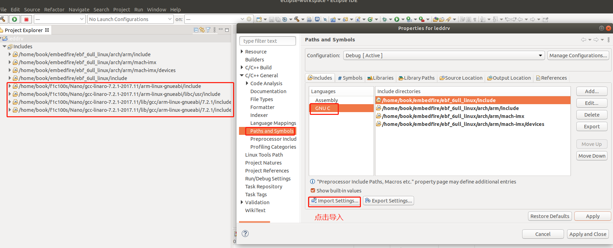

8. Eclipse项目下新建led驱动程序，代码如下

   ```c
   
   ```

   

9. Eclipse项目下新建Makefile文件，内容如下

   ```c
   KERN_DIR = /home/ningjw/linux-3.4.2
    
   all:
   	make -C $(KERN_DIR) M=`pwd` modules 
    
   clean:
   	make -C $(KERN_DIR) M=`pwd` modules clean
   	rm -rf modules.order
    
   obj-m	+= led_drv.o
   ```

   

10. 修改内核代码的顶层Makefile，切记一定要修改，否则下面编译会出错，即使我们编译驱动模块的makefile里面添加了这两句。

    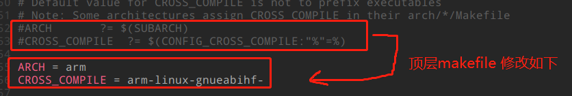

11. 按"Ctrl+B"快捷键,进行编译,可看到成功编译,并生成了led_drv.ko文件,将该文件复制到开发板,执行insmod led_drc.ko 加载该驱动.

 

12. 给Eclipse项目设置过滤

    从上图可以看出，通过make生成的\*.o \*mod\*等等文件都自动添加到项目架构当中了，但这些文件我们又关心，这就可以增加过滤规则，让项目不自动添加这些文件，设置方式如下图所示"Resource->Resource Filter->Exclude all->Add Filter"

    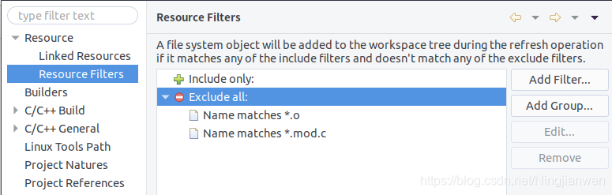

13. 编写应用程序led_test.c

    该应用程序点亮中间的led灯, 写好后通过命令 arm-linux-gcc -o led_test led_test.c 生成可执行文件,复制led_test到开发板上运行,可发现成功点亮l开发板中间的led灯.

    ```c
    #include <sys/types.h>
    #include <sys/stat.h>
    #include <fcntl.h>
    #include <stdio.h>
     
    int main(int argc,char **argv)
    {
    	int fd;
    	char led_val[3];
    	int i;
    	fd = open("/dev/leds",O_RDWR);
    	if (fd < 0){
    		printf("can't open leds\n");
    	} 
    	led_val[0] = 1;
    	led_val[1] = 0;
    	led_val[2] = 1;
    	write(fd, led_val, 3);
    	return 0;
    }
    ```

###  