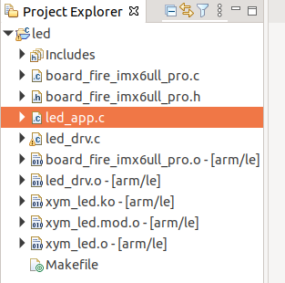
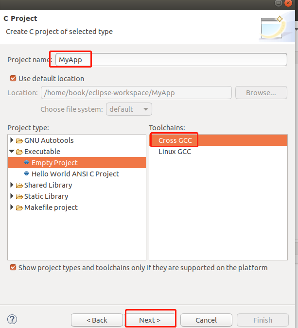
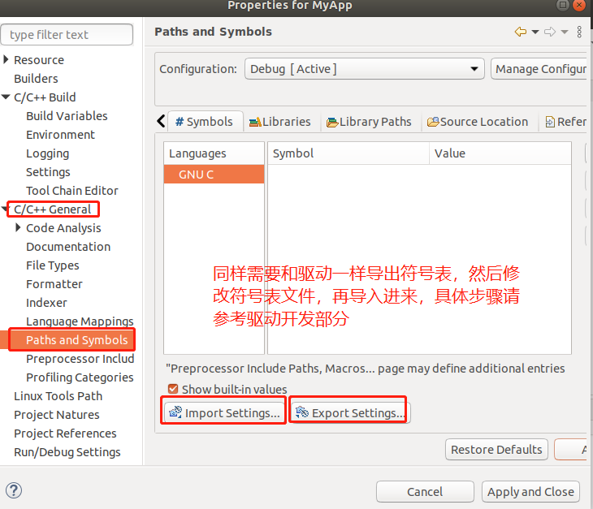
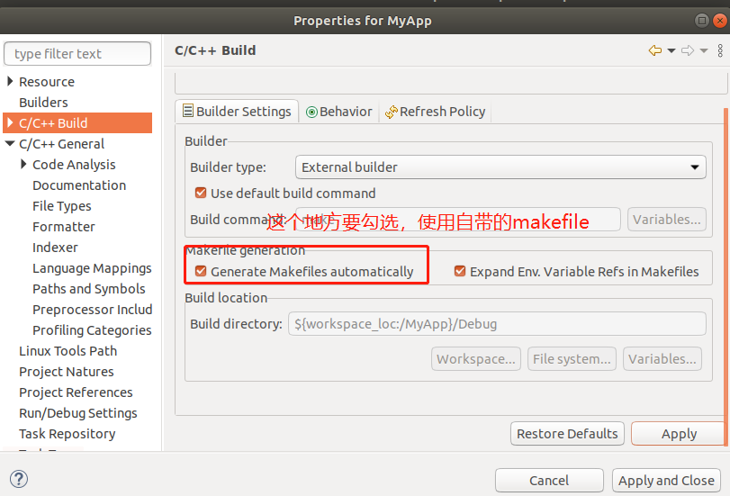
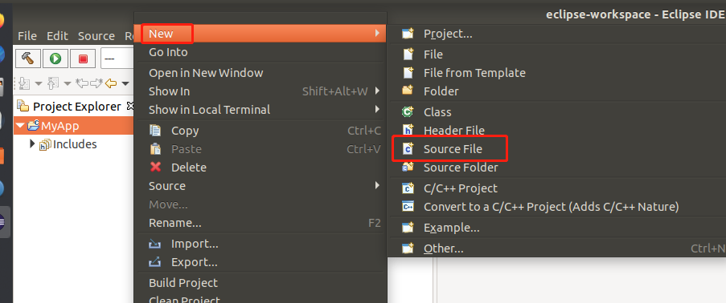
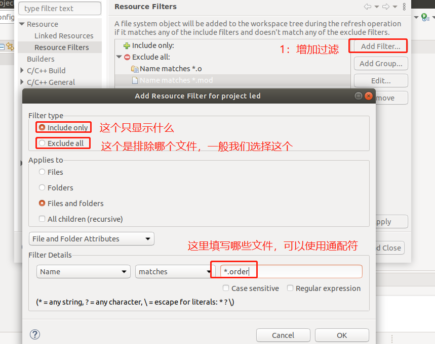
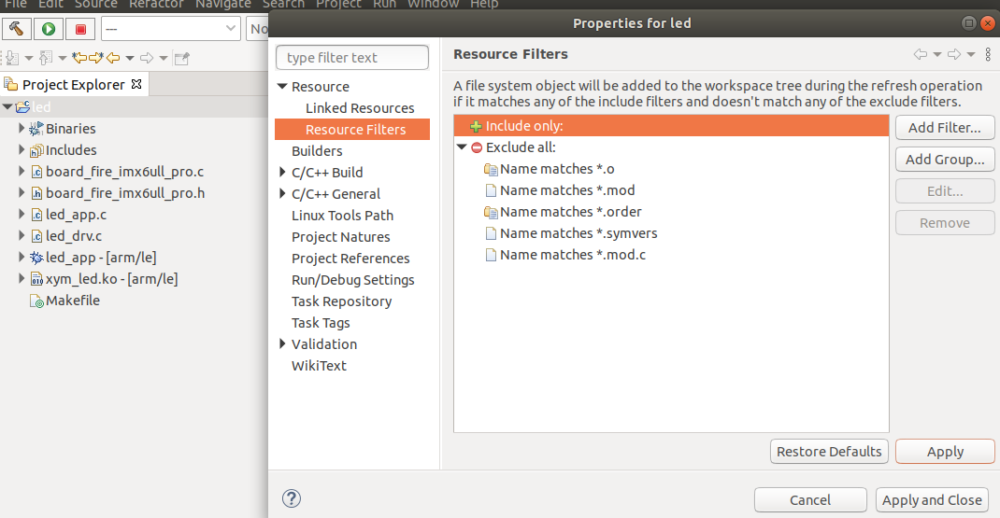
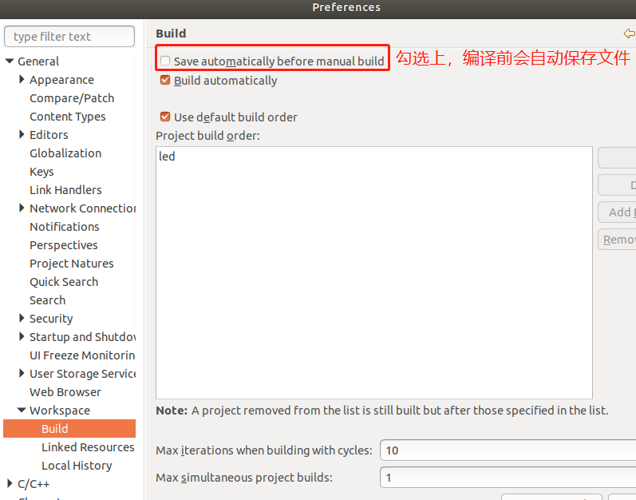
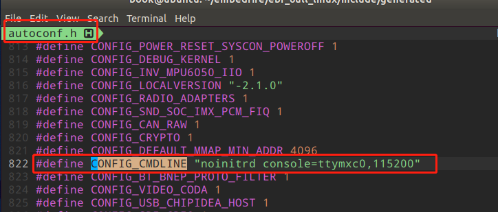

# Ubuntu下Eclipse 开发嵌入式Linux

## Ubuntu安装Eclipse


1. 下载Eclipse：Eclipse官网下载链接: https://www.eclipse.org/downloads/packages/

   

   **解压安装包到 /opt目录下**

   ```bash
   sudo tar -zxvf eclipse-cpp-2020-09-R-linux-gtk-x86_64.tar.gz -C /opt/
   ```

   **创建桌面快捷方式**

   ```c
    
   cd /usr/share/applications
   sudo vim eclipse.desktop
   
   # 文件内容如下：
   [Desktop Entry]
   Encoding=UTF-8
   Name=Eclipse
   Comment=Eclipse
   Exec=/opt/eclipse/eclipse
   Icon=/opt/eclipse/icon.xpm
   Terminal=false
   StartupNotify=true
   Type=Application
   Categories=Application;Development;
   
   # 给文件加权限
   sudo chmod u+x eclipse.desktop
       
   # 在/usr/share/applications目录下将Eclipse图标复制到桌面即可
   ```

   

2. 下载JDK：Eclipse必要的运行环境

   下载地址：http://www.oracle.com/technetwork/java/javase/downloads/jdk8-downloads-2133151.html

   

   **配置JDK**

   ```bash
   sudo mkdir /opt/jvm
   sudo tar zxvf jdk-8u271-linux-x64.tar.gz -C /opt/jvm
   ```

   **配置环境变量**

   ```bash
   sudo vim /etc/profile
   
   # 添加下面的代码
   export JAVA_HOME=/opt/jvm/jdk1.8.0_271
   export JRE_HOME=${JAVA_HOME}/jre
   export CLASSPATH=.:%{JAVA_HOME}/lib:%{JRE_HOME}/lib
   export PATH=${JAVA_HOME}/bin:$PATH
   ```

   验证jdk是否安装成功

   ```bash
   java -version
   ```

## Ubuntu使用Eclipse 开发嵌入式Linux驱动程序

1. 打开Eclipse新建一个C Project，在以下界面需要注意Toolchains栏目选择交叉编译环境Cross GCC 。注意：Linux Gcc是ubuntu自带的编译器。

   

2. 下一步到到Cross GCC Command窗口，做以下配置，选择自己的交叉编译器的安装路径

   

3. 建立好工程后,按"ALT+ENTER"快捷键，调出Properties窗口,选中"C/C++ Build"

   修改：不勾选Generate Makefiles automatically(不自动生成Makefile,使用自己编写的) 

   

4. 添加linux内核头文件，下面以IMX6ull说明。

   

   点击【C/C++ General 】->【 Paths and Symbols】 -> 【Export Setting...】将当前配置导出为symbols.xml文件进行保存(该文件修改好后，还需要从Import Setting导入进来)

   

5. 在 【ebf_6ull_linux/include/generated/ 】目录下执行命令, 完成后在该目录下生成一个symbols_linux.xml文件

   ```bash
   cd ebf_6ull_linux/include/generated/ 
   
   cat autoconf.h |grep define |awk '{print "<macro><name>" $2 "</name><value>" $3 "</value></macro>"}' > symbols_linux.xml
   ```

   执行过程如下

   

   在symbols_linux.xml文件的开头增加语句:

   ```bash
   <macro><name>__KERNEL__</name><value>1</value></macro> 
   ```

   修改后的截图如下：

   

6. 打开之前从eclipse导出的symbols.xml文件如下两处进行修改:

   

   上图中，第一部分修改添加内核头文件，根据自己的情况添加，我的内容如下：

   ```c
   <includepath>/home/book/embedfire/ebf_6ull_linux/include</includepath>
   <includepath>/home/book/embedfire/ebf_6ull_linux/arch/arm/include</includepath>
   <includepath>/home/book/embedfire/ebf_6ull_linux/arch/arm/mach-imx</includepath>
   <includepath>/home/book/embedfire/ebf_6ull_linux/arch/arm/mach-imx/devices</includepath>
   ```

7. 将修改好的symbols.xml文件重新导入Eclipse

   

8. Eclipse项目下新建led驱动程序，代码如下

   - `board_fire_imx6ull_pro.c`

     ```c
     #include <linux/module.h>
     
     #include <linux/fs.h>
     #include <linux/errno.h>
     #include <linux/miscdevice.h>
     #include <linux/kernel.h>
     #include <linux/major.h>
     #include <linux/mutex.h>
     #include <linux/proc_fs.h>
     #include <linux/seq_file.h>
     #include <linux/stat.h>
     #include <linux/init.h>
     #include <linux/device.h>
     #include <linux/tty.h>
     #include <linux/kmod.h>
     #include <linux/gfp.h>
     #include <asm/io.h>
     
     #include "board_fire_imx6ull_pro.h"
     
     static volatile unsigned int *CCM_CCGR1                              ;
     static volatile unsigned int *IOMUXC_SNVS_SW_MUX_CTL_PAD_SNVS_TAMPER3;
     static volatile unsigned int *GPIO5_GDIR                             ;
     static volatile unsigned int *GPIO5_DR                               ;
     
     
      
     
     void hw_led_init(void)
     {
         int val;
         if (!CCM_CCGR1){
             CCM_CCGR1                               = ioremap(0x20C406C, 4);
             IOMUXC_SNVS_SW_MUX_CTL_PAD_SNVS_TAMPER3 = ioremap(0x2290014, 4);
             GPIO5_GDIR                              = ioremap(0x020AC000 + 0x4, 4);
             GPIO5_DR                                = ioremap(0x020AC000 + 0, 4);
         }
     
         /* GPIO5_IO03 */
         /* a. 使能GPIO5
         * set CCM to enable GPIO5
         * CCM_CCGR1[CG15] 0x20C406C
         * bit[31:30] = 0b11
         */
         *CCM_CCGR1 |= (3<<30);
         
         /* b. 设置GPIO5_IO03用于GPIO
         * set IOMUXC_SNVS_SW_MUX_CTL_PAD_SNVS_TAMPER3
         *      to configure GPIO5_IO03 as GPIO
         * IOMUXC_SNVS_SW_MUX_CTL_PAD_SNVS_TAMPER3  0x2290014
         * bit[3:0] = 0b0101 alt5
         */
         val = *IOMUXC_SNVS_SW_MUX_CTL_PAD_SNVS_TAMPER3;
         val &= ~(0xf);
         val |= (5);
         *IOMUXC_SNVS_SW_MUX_CTL_PAD_SNVS_TAMPER3 = val;
         
         /* b. 设置GPIO5_IO03作为output引脚
         * set GPIO5_GDIR to configure GPIO5_IO03 as output
         * GPIO5_GDIR  0x020AC000 + 0x4
         * bit[3] = 0b1
         */
         *GPIO5_GDIR |= (1<<3);
     
     }
     void hw_led_reinit(void)
     {
         if (CCM_CCGR1){
             iounmap(CCM_CCGR1);
             iounmap(IOMUXC_SNVS_SW_MUX_CTL_PAD_SNVS_TAMPER3); 
             iounmap( GPIO5_GDIR);                
             iounmap(GPIO5_DR);                             
         }
         CCM_CCGR1 =NULL;/* 这里切记要清空，要不然下次从新装载驱动的时候由于CCM_CCGR1不为空的话，初始化函数不会从新ioremop */
         IOMUXC_SNVS_SW_MUX_CTL_PAD_SNVS_TAMPER3 =NULL;
         GPIO5_GDIR=NULL;
         GPIO5_DR=NULL;
     
     }
     void hw_led_write (int index, int state) /* 控制LED, which-哪个LED, status:1-亮,0-灭 */
     {
         switch (index){
         case 0:
             if (state) {
                     /* on: output 0*/
                     /* d. 设置GPIO5_DR输出低电平
                     * set GPIO5_DR to configure GPIO5_IO03 output 0
                     * GPIO5_DR 0x020AC000 + 0
                     * bit[3] = 0b0
                     */
                     *GPIO5_DR &= ~(1<<3);
             } else {  
                     /* off: output 1*/
                     /* e. 设置GPIO5_IO3输出高电平
                     * set GPIO5_DR to configure GPIO5_IO03 output 1
                     * GPIO5_DR 0x020AC000 + 0
                     * bit[3] = 0b1
                     */ 
                     *GPIO5_DR |= (1<<3);
             }
         break;
      
         default:
             break;
         }
     
        
     	/*
     	 *   这里要根据次设备号which决定控制哪个灯，用status决定是否亮灭
     	 */
     	printk("%s %s line %d, led %d, %s\n", __FILE__, __FUNCTION__, __LINE__, index, state ? "on" : "off");
      
     }
     
     
      
     
     
     ```

     

   - `board_fire_imx6ull_pro.h`

     ```c
     #ifndef _BOARD_FIRE_IMX6ULL_PRO_H
     #define _BOARD_FIRE_IMX6ULL_PRO_H
     
     void hw_led_init(void);
     void hw_led_write(int index,int state);
     void hw_led_reinit(void);
     #endif
     
     
     ```

     

   - `led_drv.c`

     ```c
     #include <linux/module.h>
     
     #include <linux/fs.h>
     #include <linux/errno.h>
     #include <linux/miscdevice.h>
     #include <linux/kernel.h>
     #include <linux/major.h>
     #include <linux/mutex.h>
     #include <linux/proc_fs.h>
     #include <linux/seq_file.h>
     #include <linux/stat.h>
     #include <linux/init.h>
     #include <linux/device.h>
     #include <linux/tty.h>
     #include <linux/kmod.h>
     #include <linux/gfp.h>
     
     #include "board_fire_imx6ull_pro.h"
     //#include "board_rk3288.h"
     
     struct led_char_dev {
     	dev_t  devid;      		 				/* 字符ID 		*/
     	struct class *class; 	 				/* 类 			*/
     	struct device *device;   				/* 设备		*/
     	int    major;            				/* 主设备号 	*/
     	int    minor;            				/* 次设备号 	*/
     };
     struct led_char_dev g_led_dev; 				/* 定义led设备 */
     
     
     /* 3. 实现对应的open/read/write等函数，填入file_operations结构体                   */
     static ssize_t led_drv_read (struct file *file, char __user *buf, size_t size, loff_t *offset)
     {
     	printk("%s %s line %d\n", __FILE__, __FUNCTION__, __LINE__);
     	return 0;
     }
     
     /* write(fd, &val, 1); */
     static ssize_t led_drv_write (struct file *file, const char __user *buf, size_t size, loff_t *offset)
     {
     
     	unsigned long err;
        	uint8_t status = 0;
     	printk("%s %s line %d\n", __FILE__, __FUNCTION__, __LINE__);
     	err = copy_from_user(&status, buf, 1);
      
     
     	/* 根据次设备号和status控制LED */
     	hw_led_write(0, status);
     	
     	return 1;
     }
     
     static int led_drv_open (struct inode *node, struct file *file)
     {
     	hw_led_init();
     	file->private_data = &g_led_dev;
     	
     	printk("%s %s line %d\n", __FILE__, __FUNCTION__, __LINE__);
     
     	return 0;
     }
     
     static int led_drv_close (struct inode *node, struct file *file)
     {
     	printk("%s %s line %d\n", __FILE__, __FUNCTION__, __LINE__);
     	hw_led_reinit();
     	return 0;
     }
     
     /* 2. 定义自己的file_operations结构体                                              */
     static struct file_operations led_drv = {
     	.owner	 = THIS_MODULE,
     	.open    = led_drv_open,
     	.read    = led_drv_read,
     	.write   = led_drv_write,
     	.release = led_drv_close,
     };
     
     /**
      * @description: led_init - 入口函数
      */
     static int __init led_init(void)
     {
     	/*
     	 *  1： 自动获取主设备号
     	 */
     	
     	g_led_dev.major = register_chrdev(0, "xym_led", &led_drv);        /* 注册字符设备驱动 */
     	g_led_dev.class = class_create(THIS_MODULE, "xym_led_class");
     	if (IS_ERR(g_led_dev.class)) {
     		unregister_chrdev(g_led_dev.major, "xym_led");
     		goto led_init_error;
     	}
     
         /* 
     	 *  2.创建设备
     	 */
     
     	g_led_dev.devid = MKDEV(g_led_dev.major,0);
     	device_create(g_led_dev.class, NULL, g_led_dev.devid, NULL, "xym_led"); /* /dev/xym_led */
     	
     	printk("%s %s line %d:insmod !\n", __FILE__, __FUNCTION__, __LINE__);
     
     	return 0;
     
     led_init_error:
     	
     	printk("%s %s line %d:init error !!!\n", __FILE__, __FUNCTION__, __LINE__);
     	return  -1;
     }
     
     /**
      * @description: led_exit - 出口函数
      */
     static void __exit led_exit(void)
     {
     
         hw_led_reinit();
     	device_destroy(g_led_dev.class, g_led_dev.devid); /* /dev/xym_led */
     	class_destroy(g_led_dev.class);
     	unregister_chrdev(g_led_dev.major, "xym_led");
     	printk("%s %s line %d: rmmod ! \n", __FILE__, __FUNCTION__, __LINE__);
     
     }
     
     
     module_init(led_init);
     module_exit(led_exit);
     
     MODULE_LICENSE("GPL");
     MODULE_AUTHOR("xym_@163.com");
     
     
     ```

     

   - `led_app.c` 

     该应用程序点亮中间的led灯,用来测试上面的驱动文件是否ok

     ```c
     
     #include <sys/types.h>
     #include <sys/stat.h>
     #include <fcntl.h>
     #include <unistd.h>
     #include <stdio.h>
     #include <string.h>
     
     /*
      * ./led_app  on
      * ./led_app  off
      */
     #define led "/dev/xym_led"
     
      // echo none >> /sys/class/leds/cpu/trigger
     #include <stdio.h>
     int main(int argc, char **argv)
     {
     	int fd;
     	char status;
     	
     	/* 1. 判断参数 */
     	if (argc != 2) {
     		printf("Usage: %s <dev> <on | off>\n", argv[0]);
     		return -1;
     	}
     	/* 2. 打开文件 */
     	fd = open(led, O_RDWR);
     	if (fd == -1){
     		return -1;
     	}
     
     	/* 3. 写文件 */
     	if (0 == strcmp(argv[1], "on")){
     		status = 1;
     		write(fd, &status, 1);
     	}else{
     		status = 0;
     		write(fd, &status, 1);
     	}
     	
     	close(fd);
     	
     	return 0;
     }
     
     
     
     ```

     

   

9. Eclipse项目下新建**Makefile**文件，内容如下

   ```c
   
   # 1. 使用不同的开发板内核时, 一定要修改KERN_DIR
   # 2. KERN_DIR中的内核要事先配置、编译, 为了能编译内核, 要先设置下列环境变量:
   # 2.1 ARCH,          比如: export ARCH=arm64
   # 2.2 CROSS_COMPILE, 比如: export CROSS_COMPILE=aarch64-linux-gnu-
   # 2.3 PATH,          比如: export PATH=$PATH:/home/book/100ask_roc-rk3399-pc/ToolChain-6.3.1/gcc-linaro-6.3.1-2017.05-x86_64_aarch64-linux-gnu/bin 
   # 注意: 不同的开发板不同的编译器上述3个环境变量不一定相同,
   #       请参考各开发板的高级用户使用手册
   ARCH=arm  
   CROSS_COMPILE=arm-linux-gnueabihf-
   
   KERN_DIR = /home/book/embedfire/ebf_6ull_linux
   #KERN_DIR = /home/book/100ask_firefly-rk3288/linux-4.4
   PWD = $(shell pwd)
    
   all:
   	make -C $(KERN_DIR) M=$(PWD) modules 
   	$(CROSS_COMPILE)gcc -o led_app led_app.c 
   
   clean:
   	make -C $(KERN_DIR) M=$(PWD) modules clean
   	rm -rf modules.order
   	rm -f led_app
   
   # 参考内核源码drivers/char/ipmi/Makefile
   # 要想把a.c, b.c编译成ab.ko, 可以这样指定:
   # ab-y := a.o b.o
   # obj-m += ab.o
   
   # led_drv.c board_fire_imx6ull.c 编译成 xym_led.ko
   xym_led-y := led_drv.o  board_fire_imx6ull_pro.o
   #xym_led-y := led_drv.o   board_rk3288.o
   
   obj-m	+= xym_led.o
   
   ```

   工程目录结构如下：

   

10. 修改内核代码的顶层Makefile，切记一定要修改，否则下面编译会出错，即使我们编译驱动模块的makefile里面添加了这两句。

    

11. 按"**Ctrl+B**"快捷键，进行编译,可看到成功编译,并生成了**xym_led.ko**文件，将该文件复制到开发板,执行**insmod xym_led.ko** 加载该驱动

## Ubuntu使用Eclipse开发嵌入式Linux应用程序

开发应用程序和开发驱动程序很类似，只不过驱动中我们需要使用自己写的makefile，而应用程序我们可以使用Eclipse再带的makefile，不用我们在写了。

步骤如下：

- 第一步：

  

- 第二步

  

- 第三步

  

- 第四步

  

- 第五步：添加自己的源代码，这些都是根据自己的需求添加

  

  

- 文件添加完毕后，编译即可

  

### Eclipse 应用程序库文件使用


## Ubuntu使用Eclipse开发嵌入式Linux内核

## Eclipse使用小技巧

### 使能自动补全快捷键

【Window-Preferences-c/c++-Editor-Content Assist-Advanced】将未勾选的全部勾选

```bash
Alt + / 快捷键：C++自动补全变量名快捷键
Ctrl +Spase 快捷键： 会自动显示代码
```


###  Eclipse项目设置过滤

通过make生成的**.o 、mod**等等文件都自动添加到项目架构当中了，但这些文件我们又关心，这就可以增加过滤规则，让项目不自动添加这些文件，设置方式如下图所示【Resource->Resource Filter->Exclude all->Add Filter】



**下面是我自己的配置**：




### Eclipse 设置编译器自动保存文件



