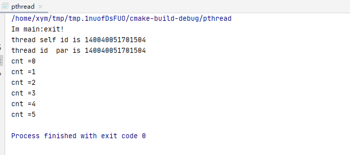
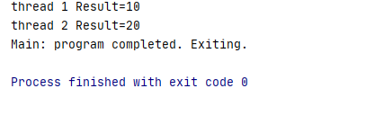
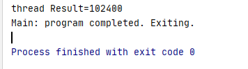
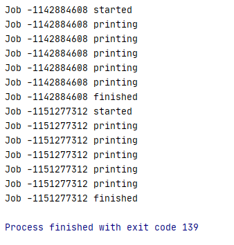
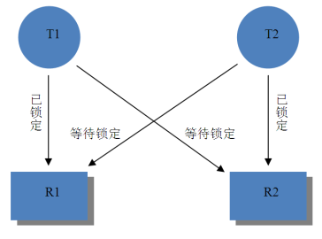
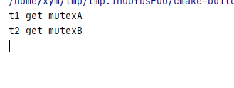

# Linux多线程编程

## 线程基本概念

**线程（ thread）**是进程中的实际运作单位，也是操作系统能够进行调度的最小单位。一个进程中可以并发多条线程，每条线程并行执行不同的任务。

**线程与进程的关系**

 线程与进程的关系可以归结于以下几点：

- 一个线程只能属于一个进程，而一个进程可以有多个线程，但至少有一个主线程；
- 资源分配给进程，同一进程的所有线程共享该进程的所有资源；
- 线程作为调度和分配的基本单位，进程作为拥有资源的基本单位；
- 进程是拥有资源的一个独立单位，线程不拥有系统资源，但可以访问隶属于进程的资源；

- 在创建或撤消进程时，由于系统都要为之分配和回收资源，导致系统的开销大于创建或撤消线程时的开销

**为什么要使用多线程**

 多进程程序结构和多线程程序结构有很大的不同，多线程程序结构相对以多进程程序结构有以下的优势：

1. 方便的通信和数据交换

   线程间有方便的通信和数据交换机制。对不同进程来说，它们具有独立的数据空间，要进行数据的传递只能通过通信的方式进行，这种方式不仅费时，而且很不方便。线程则不然，由于同一进程下的线程之间共享数据空间，所以一个线程的数据可以直接为其它线程所用，这不仅快捷，而且方便。

2. 更高效的利用 CPU

   使用多线程可以提高应用程序响应。这对图形界面的程序尤其有意义，当一个操作耗时很长时，整个系统都会等待这个操作，此时程序不会响应键盘、鼠标、菜单的操作，而使用多线程技术，将耗时长的操作置于一个新的线程，可以避免这种尴尬的情况。同时多线程使多 CPU 系统更加有效。操作系统会保证当线程数不大于 CPU 数目时，不同的线程运行于不同的 CPU 上。

## POSIX Threads 概述

从历史上看， 众多软件供应商都为自己产品实现多线程库专有版本。这些线程库实现彼此独立并有很大差别，导致程序员难以开发可移植的多线程应用程序，因此必须要确立一个规范的编程接口标准来充分利用多线程所提供的优势， POSIX Threads 就是这样一个规范多线程标准接口。POSIX Threads（通常简称为 Pthreads）定义了创建和操纵线程的一套 API 接口。

`pthreads` 接口可以根据功能划分四个组：

- 线程管理
- 互斥量
- 条件变量
- 同步

编写 `pthreads` 多线程程序时源码只需包含 `pthread.h` 头文件就可以使用 pthreads 库中的所有类型及函数：

```c
#include <pthread.h>
```

在编译 Pthread 程序时在编译和链接过程中需要加上-pthread 参数

```c
LDFLAGS += -pthread
```

## 线程管理

线程管理包含了线程的创建、终止、等待、分离、设置属性等操作。

### 线程 ID

线程 ID 可以看作为线程的句柄，用来引用一个线程。

pthreads 线程有一个 `pthread_t` 类型的 ID 来引用。线程可以通过调用 `pthread_self()`函数来获取自己的 ID。 函数原型如下：

```cpp
pthread_t pthread_self(void); // 该函数返回调用线程的线程 ID。
```

使用 `pthread_equal()`来比较两个线程 ID 是否相等。 函数原型如下：

```cpp
int pthread_equal(pthread_t t1, pthread_t t2);//  t1 等于 t2该函数返回一个非 0 值，否则返回 0。
```

 ### 线程创建与终止

 每个线程都有从创建到终止的生命周期。

#### 创建线程

 在进程中创建一个新线程的函数是 `pthread_create()`，线程被创建后将立即运行。

```cpp
/*
 * 成功函数返回 0，
 * 否则返回一个非 0 的错误码
 */
int pthread_create(pthread_t *thread, 				// 线程id 
                   const pthread_attr_t *attr,  	// 线程属性
                   void *(*start_routine) (void *), // 线程执行函数
                   void *arg);						// 线程执行函数参数
```

**返回值错误码说明：**           

| 错误码 | 出错说明                                             |
| ------ | ---------------------------------------------------- |
| EAGAIN | 系统没有创建线程所需要的资源                         |
| EINVAL | attr参数无效                                         |
| EPERM  | 调用程序没有适当的权限来设定调度策略或attr指定的参数 |

#### 终止线程

进程的终止可以通过直接调用 `exit()`、执行 `main()`中的 `return`、或者通过进程的某个其它线程调用 `exit()`来实现。在以上任何一种情况下，所有的线程都会终止。

如果主线程在创建了其它线程后没有任务需要处理，那么它应该阻塞等待所有线程都结束为止，或者应该调用`pthread_exit(NULL)`。

调用 `exit()`函数会使整个进程终止，而调用 `pthread_exit()`只会使得调用线程终止，同时在创建的线程的顶层执行 `return` 线程会隐式地调用 `pthread_exit()`。 

```cpp
/*
* __retval 是一个 void 类型的指针，在pthread_join (, void **__thread_return)* 函数中可以使用__thread_return来接收这个值
*/
void pthread_exit(void *__retval);
```

 

 #### 线程范例

主线程创建完线程后调用 `pthread_exit()`函数退出线程，其子线程打印当前线程的id。当主线程先于其它进程执行 `pthread_exit()`时，进程不会退出，而是最后一个线程完成时才会进程退出。

```cpp
#include <stdio.h>
#include <stdlib.h>
#include <pthread.h>
#include <unistd.h>
#include <sys/time.h>
pthread_t g_thread_id;

void *thread_fun(void *par)
{
    int cnt =0;
    printf("thread self id is %ld \n",pthread_self());
    printf("thread id  par is %ld \n",*((pthread_t*)par));

    while (1){
       sleep(1); // 休眠 1 s
       printf("cnt =%d \n",cnt);
        if(++cnt>5){
            pthread_exit(NULL);
        }
    }

}

int main()
{
  int err = pthread_create(&g_thread_id,NULL,thread_fun,(void*)&g_thread_id);
  if(err){
      printf("Error code is %d \n",err);
  }

  printf("Im main:exit!\n");
  pthread_exit(NULL);
  return 0;
}

```


程序清单的程序运行结果如下图所示，程序中主线程调用了 `pthread_exit()`函数并不会将整个进程终止，而是最后一个线程调用 `pthread_exit()`时程序才完成运行。




### 线程连接与分离

线程可以分为分离线程(DETACHED)和非分离线程(JOINABLE)两种：

- 分离线程是指线程退出时线程将释放它的资源的线程； 
- 非分离线程退出后不会立即释放资源，需要另一个线程为它调用 `pthread_join` 函数或者进程退出时才会释放资源。 

只有非分离线程才是可连接的，而分离线程退出时不会报告线程的退出状态。

#### 线程分离

`pthread_detach()`函数可以将非分离线程设置为分离线程，函数原型如下：

```cpp
int pthread_detach(pthread_t thread);
```

线程可以自己来设置分离，也可以由其它线程来设置分离，以下代码线程可设置自身分离：

```cpp
pthread_detach(pthread_self());
```

成功返回 0 ；失败返回一个非 0 的错误码， 下表列出 pthread_detach 的实现必须检查的错误码。

| 错误码 | 出错描述                               |
| ------ | -------------------------------------- |
| EINVAL | thread参数所表示的线程不是可分离的线程 |
| ESRCH  | 没有找到线程ID为thread的线程           |

#### 线程连接

如果一个线程是非分离线程，那么其它线程可调用 `pthread_join()`函数对非分离线程进行连接。 函数原型如下：

```cpp
int pthread_join(pthread_t thread, void **retval);
```

`pthread_join()` 函数将调用线程挂起，直到第一个参数 `thread` 指定目标线程终止运行为止。

参数 `retval` 为指向线程的返回值的指针提供一个位置， 这个返回值是目标线程调用`pthread_exit()`或者 `return` 所提供的值。当目标线程无需返回时可使用 `NULL` 值，调用线程如果不需对目标线程的返回状态进行检查可直接将 retval 赋值为 NULL。

如果 `pthread_join()` 成功调用，它将返回 0 值，如果不成功， `pthread_join()` 返回一个非 0 的错误码， 下表列出 `pthread_join()` 的实现必须检查的错误码。

| 错误码 | 出错描述                               |
| ------ | -------------------------------------- |
| EINVAL | thread参数所表示的线程不是可分离的线程 |
| ESRCH  | 没有找到线程ID为thread的线程           |

为了防止内存泄露，长时间运行的程序最终应该为每个线程调用 `pthread_detach`或者被 `pthread_join`。

#### 线程范例

```cpp
#include <stdio.h>
#include <stdlib.h>
#include <pthread.h>
#include <stdint.h>
#include <sys/time.h>

typedef struct msg
{
    uint8_t *pucMsg;
    uint32_t ulSize;
}msg_t;

void * thread_fun1(void *p_ars)
{

    msg_t *pMsg = (msg_t *)p_ars;
    pMsg->ulSize =10;
    while (1){
        sleep(5); 				// 休眠 5 s
        pthread_exit(pMsg);  	// 这里使用退出，返回值为pMsg
    }

}
void * thread_fun2(void *p_ars)
{
    msg_t *pMsg = (msg_t *)p_ars;
    pMsg->ulSize =20;
    while (1){
        sleep(2); 				// 休眠 2 s
        return pMsg; 			// 这里使用return，返回值为pMsg
    }

}

pthread_t g_thread_id1;
pthread_t g_thread_id2;

int main (int argc, char *argv[])
{
    msg_t tMsg1={ NULL, 1};
    msg_t tMsg2={ NULL, 2};

    void *pResult;
    msg_t *pMsg;
    /*
     * 创建线程1
     */
    int errCode = pthread_create(&g_thread_id1,NULL,thread_fun1,(void*)&tMsg1);
    if(errCode){
        printf("thread 1 errCode=%d \n",errCode);
    }
    /*
     * 创建线程2
     */
    errCode = pthread_create(&g_thread_id2,NULL,thread_fun2,(void*)&tMsg2);
    if(errCode){
        printf("thread 2 errCode=%d \n",errCode);
    }
    /*
     * 等待线程1返回,返回后才会往下执行
     */
    pthread_join(g_thread_id1,&pResult);
    pMsg = (msg_t *)pResult;
    printf("thread 1 Result=%d \n",pMsg->ulSize);

    /*
     * 等待线程2返回
     */
    pthread_join(g_thread_id2,&pResult);
    pMsg = (msg_t *)pResult;
    printf("thread 2 Result=%d \n",pMsg->ulSize);


    printf("Main: program completed. Exiting.\n");

    pthread_exit(NULL);
}
```

运行结果如下：




### 线程属性

前面介绍的线程创建 `pthread_create()`函数，第二个参数为`pthread_attr_t` 类型， 用于设置线程的属性。

线程基本属性包括： 

- 线程状态
- 栈大小
- 调度策略

通常先创建一个属性对象，然后在属性对象上设置属性的值，再将属性对象传给`pthread_create` 函数的第二个参数用来创建含有该属性的线程。 一个属性对象可以多次传给 `pthread_create()`函数创建多个含有相同属性的线程。 

#### 属性对象 

##### 初始化属性对象

```cpp
int pthread_attr_init(pthread_attr_t *attr); //成功返回0 否则返回一个非 0的错误码
```

##### 销毁属性对象 

```cpp
int pthread_attr_destroy(pthread_attr_t *attr);//成功返回0 否则返回一个非0的错误码
```

#### 线程状态

线程有两种线程状态，取值可能是： 

- `PTHREAD_CREATE_JOINABLE`——非分离线程； 
- `PTHREAD_CREATE_DETACHED`——分离线程。 

##### 获取线程状态

```cpp
/*
 *  detachstate 是获取结果值的指针。成功返回 0 ，否则返回一个非 0 的错误码。
*/
int pthread_attr_getdetachstate(pthread_attr_t *attr, int *detachstate);
```

##### 设置线程状态

```cpp
/*
 *  detachstate 要设置的值。成功返回 0 ，否则返回一个非 0 的错误码。
*/
int pthread_attr_setdetachstate(pthread_attr_t *attr, int detachstate);
```

#### 线程栈

每个线程都有一个独立调用栈，线程的栈大小在线程创建的时候就已经固定下来， Linux系统线程的默认栈大小为 8MB，只有主线程的栈大小会在运行过程中自动增长。用户可以通过属性对象来设置和获取栈大小。 

##### 获取线程栈

```cpp
/* 
* 参数 attr 都是一个指向已初始化的属性对象的指针，
* stacksize 是获取的栈大小的指针。
* 成功返回 0 ，否则返回一个非 0 的错误码
*/
int pthread_attr_getstacksize(pthread_attr_t *attr, size_t *stacksize);
```

##### 设置线程栈

```cpp
/* 
* 参数 attr 都是一个指向已初始化的属性对象的指针， 
* stacksize 是设置的栈大小。
* 成功返回 0，否则返回一个非 0 的错误码
*/
int pthread_attr_setstacksize(pthread_attr_t *attr, size_t stacksize);
```


#### 线程范例

下面举例说明线程创建及线程属性的使用方法

```cpp
#include <pthread.h>
#include <string.h>
#include <stdio.h>
#include <stdlib.h>
#include <stdint.h>
#include <errno.h>
#include <ctype.h>

typedef struct msg
{
    uint8_t *pucMsg;
    uint32_t ulSize;
}msg_t;

void * thread_fun(void *p_ars)
{

    msg_t *pMsg = (msg_t *)p_ars;

    pthread_attr_t *pattr = (pthread_attr_t *)pMsg->pucMsg;

    pthread_attr_getstacksize(pattr,&pMsg->ulSize);

    while (1){
        sleep(5); 				// 休眠 5 s
        pthread_exit(pMsg);  	// 这里使用退出，返回值为pMsg
    }

}

pthread_t g_thread_id;
int main(int argc, char *argv[])
{

    void *pResult;
    msg_t *pMsg;

    pthread_attr_t tAttr;
    msg_t tMsg={ &tAttr, 1};

    int errCode = pthread_attr_init(&tAttr); /* 初始化属性对象 */
    if (errCode){
        printf("Init attr errCode=%d\n",errCode);
        exit(EXIT_FAILURE);
    }

    errCode = pthread_attr_setstacksize(&tAttr, 1024*100); /* 设置属性对象的栈大小 */
    if (errCode){
        printf("set stack size errCode=%d\n",errCode);
        exit(EXIT_FAILURE);
    }

    /*
     * 创建线程1
     */
    errCode = pthread_create(&g_thread_id,NULL,thread_fun,(void*)&tMsg);
    if(errCode){
        printf("thread  errCode=%d \n",errCode);
        exit(EXIT_FAILURE);
    }

    errCode = pthread_attr_destroy(&tAttr); /* 销毁属性对象 */
    if (errCode){
        printf("pthread_attr_destroy errCode=%d \n",errCode);
        exit(EXIT_FAILURE);
    }

    pthread_join(g_thread_id, &pResult); /* 等待线程终止，并获取返回值 */

    pMsg = (msg_t *)pResult;
    printf("thread Result=%d \n",pMsg->ulSize);


    printf("Main: program completed. Exiting.\n");

    exit(EXIT_SUCCESS);
}
```

 


## 线程安全

### 互斥量

互斥量（ Mutex）， 又称为互斥锁， 是一种用来保护临界区的特殊变量， 它可以处于锁定（ locked） 状态， 也可以处于解锁（ unlocked） 状态： 

- 如果互斥锁是锁定的， 肯定有一个特定的线程持有这个互斥锁；
- 如果没有线程持有这个互斥锁，那么这个互斥锁就处于解锁状态。

每个互斥锁内部有一个线程等待队列，用来保存等待该互斥锁的线程。当互斥锁处于解锁状态时，一个线程试图获取这个互斥锁时， 这个线程就可以得到这个互斥锁而不会阻塞。

当互斥锁处于锁定状态时，一个线程试图获取这个互斥锁时，这个线程将阻塞在互斥锁的等待线程队列内。

#### 创建与销毁

##### 静态创建

```c
pthread_mutex_t mutex = PTHREAD_MUTEX_INITIALIZER;
```

##### 动态创建

```c
/*
* 参数 attr 传递 NULL 来初始化一个带有默认属性的互斥量，
* 否则就要用类似于线程属性对象所使用的方法，先创建互斥量属性对象，再用该属性对象来创建互斥量
* 函数成功返回 0，否则返回一个非 0 的错误码
*/
int pthread_mutex_init(pthread_mutex_t *restrict mutex,const pthread_mutexattr_t *restrict attr);
```

| 错误码 | 出错描述                             |
| ------ | ------------------------------------ |
| EAGAIN | 系统缺乏初始化互斥量所需的非内存资源 |
| ENOMEM | 系统缺乏初始化互斥量所需的内存资源   |
| EPERM  | 调用程序没有适当的优先级             |

##### 销毁互斥量

```c
int pthread_mutex_destroy(pthread_mutex_t *mutex);


//eg:下面代码用来释放一个互斥量
int error;
pthread_mutex_t mylock;
error = pthread_mutex_destroy(&mylock)
if (error){
    fprintf(stderr, "Failed to destroy mylock : %s\n", strerror(error));
}
```

#### 加锁与解锁

##### 加锁

```c
/*
* 函数成功返回 0，否则返回一个非 0 的错误码，
* 其中另一个线程已持有锁的情况下，调用pthread_mutex_trylock()函数是错误码为 EBUSY。
*/
int pthread_mutex_lock (pthread_mutex_t *mutex);    // 如果加锁失败会阻塞线程
int pthread_mutex_trylock (pthread_mutex_t *mutex); // 如果加锁失败会立即返回
```

##### 解锁

```c
//函数成功返回 0，否则返回一个非 0 的错误码
int pthread_mutex_unlock (pthread_mutex_t *mutex);
```

##### 线程范例

```c
#include <pthread.h>
#include <string.h>
#include <stdio.h>
#include <stdlib.h>
#include <stdint.h>
#include <errno.h>
#include <ctype.h>
#include<unistd.h>
typedef struct msg
{
    uint8_t *pucMsg;
    uint32_t ulSize;
}msg_t;

pthread_t g_thread_id1;
pthread_t g_thread_id2;
pthread_mutex_t g_lock;

void * thread_fun(void *p_ars)
{

    msg_t *pMsg = (msg_t *)p_ars;
    int tid =  *(pthread_t*)pMsg->pucMsg;
    pthread_mutex_lock(&g_lock); /* 使用互斥量保护临界区 */
    printf("Job %d started\n",tid );
    for (int i = 0; i < 5; i++){
        printf("Job %d printing\n", tid);
        usleep(10);
    }
    printf("Job %d finished\n", tid);
    pthread_mutex_unlock(&g_lock);

}


int main(int argc, char *argv[])
{

    void *pResult;
    msg_t *pMsg;

    msg_t tMsg1={ NULL, 1};
    msg_t tMsg2={ NULL, 2};

    if (pthread_mutex_init(&g_lock, NULL) != 0){ /* 动态初始化互斥量 */
        printf("\n Mutex init failed\n");
        return 1;
    }

    /*
     * 创建线程1
     */
    tMsg1.pucMsg = (uint8_t *)&g_thread_id1;
    int errCode = pthread_create(&g_thread_id1,NULL,thread_fun,(void*)&tMsg1);
    if(errCode){
        printf("thread  1 errCode=%d \n",errCode);
        exit(EXIT_FAILURE);
    }

    /*
     * 创建线程2
     */
    tMsg2.pucMsg = (uint8_t *)&g_thread_id2;
    errCode = pthread_create(&g_thread_id2,NULL,thread_fun,(void*)&tMsg2);
    if(errCode){
        printf("thread  2 errCode=%d \n",errCode);
        exit(EXIT_FAILURE);
    }

    pthread_join(g_thread_id2, &pResult); /* 等待线程终止，并获取返回值 */
    pMsg = (msg_t *)pResult;
    printf("thread Result=%d \n",pMsg->ulSize);


    pthread_join(g_thread_id1, &pResult); /* 等待线程终止，并获取返回值 */
    pMsg = (msg_t *)pResult;
    printf("thread Result=%d \n",pMsg->ulSize);


    pthread_mutex_destroy(&g_lock);


    printf("Main: program completed. Exiting.\n");
    pthread_exit(NULL);

}
```

运行结果



#### 死锁和避免

死锁是指两个或两个以上的执行序在执行过程中， 因争夺资源而造成的一种互相等待的现象。

例如： 一个线程 T1 已锁定了一个资源 R1， 现在在等待R2解锁，而此时另一个线程 T2 已锁定了资源 R2，在等待R1解锁，两个线程都想得到对方的资源，而不愿释放自己的资源，造成两个线程都在等待，而无法执行的情况，如下图所示。



##### 死锁范例

```c

#include<stdio.h>
#include<string.h>
#include<pthread.h>
#include<stdlib.h>
#include<unistd.h>

pthread_t tid[2];
pthread_mutex_t mutexA = PTHREAD_MUTEX_INITIALIZER; /* 静态初始化互斥量 */
pthread_mutex_t mutexB = PTHREAD_MUTEX_INITIALIZER;

void * t1(void *arg) {
    pthread_mutex_lock(&mutexA); /* 线程 1 获取 mutexA */
    printf("t1 get mutexA\n");
    usleep(1000);
    pthread_mutex_lock(&mutexB); /* 线程 1 获取 mutexB */
    printf("t1 get mutexB\n");
    pthread_mutex_unlock(&mutexB); /* 线程 1 释放 mutexB */
    printf("t1 release mutexB\n");
    pthread_mutex_unlock(&mutexA); /* 线程 1 释放 mutexA */
    printf("t1 release mutexA\n");
    return NULL;
}

void * t2(void *arg) {
    pthread_mutex_lock(&mutexB);
    printf("t2 get mutexB\n");
    usleep(1000);
    pthread_mutex_lock(&mutexA);
    printf("t2 get mutexA\n");
    pthread_mutex_unlock(&mutexA);
    printf("t2 release mutexA\n");
    pthread_mutex_unlock(&mutexB);
    printf("t2 release mutexB\n");
    return NULL;
}

int main(void) {
    int err;
    err = pthread_create(&(tid[0]), NULL, &t1, NULL ); /* 创建线程 1 */
    err = pthread_create(&(tid[1]), NULL, &t2, NULL);  /* 创建线程 2 */

    pthread_join(tid[0], NULL);
    pthread_join(tid[1], NULL);
    return 0;
}
```

运行结果



##### 死锁避免

当多个线程需要相同的一些锁， 但是按照不同的顺序加锁， 死锁就很容易发生， 如果能确保所有的线程都是按照相同的顺序获得锁，那么死锁就不会发生。 例如，规定程序内有三个互斥锁的加锁顺序为 mutexA->mutexB->mutexC，则线程 t1、 t2、 t3 线程操作伪代码如下所示

```c
t1                         t2                         t3
lock(mutexA)         lock(mutexA)                  lock(mutexB)
lock(mutexB)         lock(mutexC)                  lock(mutexC)
lock(mutexC)
```

### 条件变量

在多线程编程中仅使用互斥锁来完成互斥是不够用的， 如以下情形：
假设有两个线程 t1 和 t2， 需要这个两个线程循环对一个共享变量 sum 进行自增操作，那么 t1 和 t2 只需要使用互斥量即可保证操作正确完成，线程执行代码如所示：

```c
pthread_mutex_t sumlock= PTHREAD_MUTEX_INITIALIZER;
void * t1t2(void) 
{
    pthread_mutex_lock(&sumlock);
    sum++;
    pthread_mutex_unlock(&sumlock);
}
```

如果这时需要增加另一个线程 t3，需要 t3 在 count 大于 100 时将 count 值重新置 0 值，那么可以 t3 可以实现如下：

```c
void * t3 (void) 
{
    pthread_mutex_lock(&sumlock);
    if (sum >= 100) {
        sum = 0;
        pthread_mutex_unlock(&sumlock);
    } else {
        pthread_mutex_unlock(&sumlock); // 大部分走的是这个分支
        usleep(100); 
    }
}
```

以上代码存在以下问题：

1. sum 在大多数情况下不会到达 100 ， 那么对 t3 的代码来说 , 大多数情况下， 走的是 else 分支， 只是 lock 和 unlock, 然后 `sleep(100)` 。 这浪费了 CPU 处理时间。
2.   为了节省 CPU 处理时间， t3 会在探测到 sum 没到达 100 的时候 usleep() 一段时间。这样却又带来另外一个问题， 亦即 t3 响应速度下降。 可能在 sum 到达 200 的时候， t3 才会醒过来。这样时间与效率出现了矛盾，而条件变量就是解决这个问题的好方法。

#### 创建与销毁

##### 创建条件变量

- 静态初始化

  ```c
  pthread_cond_t cond = PTHREAD_COND_INITIALIZER;
  ```

- 动态初始化

  ```c
  /*
   * 参数attr传递 NULL值时 pthread_cond_init()将 cond 初始化为默认属性的条件变量。
   * 函数成功将返回 0；否则返回一个非 0 的错误码
   */
  int pthread_cond_init (pthread_cond_t *restrict cond, const pthread_condattr_t *restrict attr);
  
  ```

##### 销毁条件变量

```cpp
/*
 * 函数成功调用返回 0 ，否则返回一个非 0 的错误码
 */
int pthread_cond_destroy(pthread_cond_t *cond);
```

#### 等待与通知

##### 等待

条件变量是与条件测试一起使用的，通常线程会对一个条件进行测试，如果条件不满足就会调用条件等待函数来等待条件满足

```c
/*
 *  不满足条件一直等待
 * 函数成功调用返回 0，否则返回非 0 的错误码
 */
int pthread_cond_wait(pthread_cond_t *restrict cond, pthread_mutex_t *restrict mutex);

/*
 *  不满足条件等待一段时间
 *  abstime 是一个指向返回时间的指针，如果条件变量通知信号没有在此等待时间之前出现
 *  等待将超时退出， abstime 是个绝对时间，而不是时间间隔
 * 函数成功调用返回 0，否则返回非 0 的错误码 指定的时间到期，错误码为 ETIMEOUT。
 */
int pthread_cond_timedwait(pthread_cond_t *restrict cond,
    pthread_mutex_t *restrict mutex, const struct timespec *restrict abstime);
```

例如下面的程序使得线程进入等待，直到收到通知并且满足 a 大于等于 b 的条件。

```c
pthread_mutex_lock(&mutex)
while(a < b)
    pthread_cond_wait(&cond, &mutex)
pthread_mutex_unlock(&mutex)
```

##### 通知

当另一个线程修改了某参数可能使得条件变量所关联的条件变成真时，它应该通知一个或者多个等待在条件变量等待队列中的线程。

```c
/*
 * 参数 cond 是一个指向条件变量的指针。函数成功返回 0 ，否则返回一个非 0 的错误码
 */

//唤醒所有在条件变量等待队列等待的线程
int pthread_cond_broadcast(pthread_cond_t *cond); 
 //唤醒一个在条件变量等待队列等待的线程
int pthread_cond_signal(pthread_cond_t *cond);
```

#### 线程范例

```c
#include<stdio.h>
#include<string.h>
#include<pthread.h>
#include<stdlib.h>
#include<unistd.h>

pthread_t tid[3];
int sum = 0;
pthread_mutex_t sumlock       = PTHREAD_MUTEX_INITIALIZER; /* 静态初始化互斥量 */
pthread_cond_t cond_sum_ready = PTHREAD_COND_INITIALIZER; /* 静态初始化条件变量 */

void * t1t2(void *arg)
{
    int i;
    long id = (long)arg;

    for (i = 0; i < 60; i++)
    {
        pthread_mutex_lock(&sumlock); /* 使用互斥量保护临界变量 */
        sum++;
        printf("t%ld: read sum value = %d\n", id + 1 , sum);
        pthread_mutex_unlock(&sumlock);
        if (sum >= 100)
            pthread_cond_signal(&cond_sum_ready); /* 发送条件通知，唤醒等待线程 */
    }
    return NULL;
}
void * t3(void *arg)
{
    pthread_mutex_lock(&sumlock);
    while(sum < 100) /* 不满足条件将一直等待 */
        pthread_cond_wait(&cond_sum_ready, &sumlock); /* 等待条件满足 */

    sum = 0;
    printf("t3: clear sum value\n");
    pthread_mutex_unlock(&sumlock);
    return NULL;
}

int main(void)
{
    long i;
    for (i = 0; i < 2; i++){
        pthread_create(&(tid[i]), NULL, &t1t2, (void *)i); /* 创建线程 1 线程 2 */
    }
    pthread_create(&(tid[2]), NULL, &t3, NULL); /* 创建线程 3 */

    for (i = 0; i < 3; i++){
        pthread_join(tid[i], NULL);
    }

    return 0;
}
```

## 线程通信

请参考[Linux IPC](https://xym.readthedocs.io/en/latest/Doc/01.Linux%E7%9B%B8%E5%85%B3/22.%E5%BA%94%E7%94%A8%E5%BC%80%E5%8F%91/02.Linux%E5%BA%94%E7%94%A8%E7%A8%8B%E5%BA%8F%E5%BC%80%E5%8F%91/%E8%BF%9B%E7%A8%8B%E7%BA%BF%E7%A8%8B%E9%80%9A%E4%BF%A1.html)章节