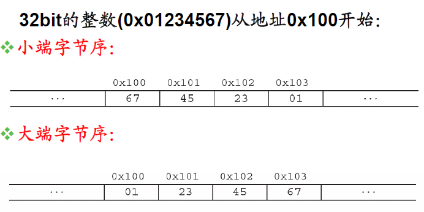
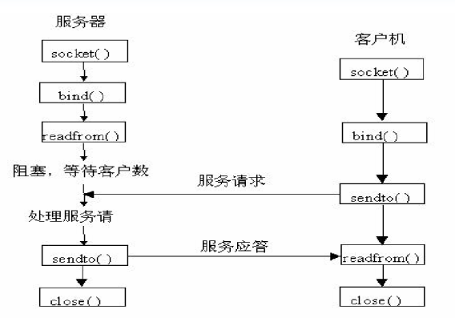

# 网络编程

Linux中的网络编程通过Socket(套接字)接口实现，Socket是一种文件描述符。

## 套接字socket类型

套接字socket有三种类型：

1. 流式套接字（SOCK_STREAM）

   流式的套接字可以提供可靠的、面向连接的通讯流。它使用了TCP协议。TCP保证了数据传输的正确性和顺序性。

2. 数据报套接字（SOCK_DGRAM）

   数据报套接字定义了一种无连接的服务，数据通过相互独立的报文进行传输，是无序的，并且不保证可靠，无差错,它使用数据报协议UDP。

3. 原始套接字

   原始套接字允许对低层协议如IP或ICMP直接访问，主要用于新的网络协议的测试等。

## 地址结构

```c
struct sockaddr
{
	u_short sa_family; // 地址族，采用“AF_xxx”的形式，如：AF_INET。
	char sa_data[14];  // 14字节的特定协议地址
}
```

编程中一般并不直接针对`struct sockaddr`数据结构操作，而是使用r等价的`sockaddr_in`数据结构

```c
struct sockaddr_in
{
    short int sin_family; 			/* Internet地址族*/
    unsigned short int sin_port; 	/* 端口号*/
    struct in_addr sin_addr; 		/* IP地址*/
    unsigned char sin_zero[8]; 		/* 填0 */
}
struct in_addr
{
	unsigned long s_addr; //32位的地址
}

```

### 地址转换

IP地址通常由数字加点(192.168.0.1)的形式表示，而在`struct in_addr`中使用的是IP地址是由32位的整数表示的，为了转换我们可以使用下面两个函数：

- `int inet_aton(const char *cp,struct in_addr *inp)`

  将cp指向的字符串形式的ip地址192.168.0.1转换为32位的整数存放inp里面。

- `char *inet_ntoa(struct in_addr in)`
  将in指向的32位的整数ip地址，转换为字符串形式的ip地址192.168.0.1返回

### 字节序转换

#### 网络传输是大端字节序

- 小端字节序：低字节数据存放在低地址

- 大端字节序：低字节的数据存放在高地址

如图所示：



#### **字节序转换函数**

| 函数  | 功能                                     |
| ----- | ---------------------------------------- |
| htons | 把unsigned short类型从主机序转换到网络序 |
| htonl | 把unsigned long类型从主机序转换到网络序  |
| ntohs | 把unsigned short类型从网络序转换到主机序 |
| ntohl | 把unsigned long类型从网络序转换到主机序  |

## ip和主机名


```c
//在网络上标识一台机器可以用IP，也可以使用主机名。
struct hostent *gethostbyname(const char *hostname)
struct hostent
{
    char *	h_name; 			/* 主机的正式名称*/
    char *	h_aliases; 			/* 主机的别名*/
    int 	h_addrtype; 		/* 主机的地址类型AF_INET*/
    int 	h_length; 			/* 主机的地址长度*/
    char **	h_addr_list; 		/* 主机的IP地址列表*/
}
#define h_addr h_addr_list[0] /* 主机的第一个IP地址*/
```

## 常用函数

进行Socket编程的常用函数有：

- `socket`：创建一个socket。
- `bind`：用于绑定IP地址和端口号到socket
- `connect`该函数用于绑定之后的client端，与服务器建
  立连接
- `listen`：设置能处理的最大连接要求，Listen()并未开始接收连线，只是设置socket为listen模式
- `accept`：用来接受socket连接
- `send`：发送数据
- `recv`：接收数据

## TCP通信


### 基于TCP的服务器

1. 创建一个socket，用函数socket()
2. 绑定IP地址、端口等信息到socket上，用函数bind()
3. 设置允许的最大连接数，用函数listen()
4. 接收客户端上来的连接，用函数accept()
5. 收发数据，用函数send()和recv()，或者read()和write()
6. 关闭网络连接


### 基于TCP的客户端

1. 创建一个socket，用函数socket()
2. 设置要连接的对方的IP地址和端口等属性
3. 连接服务器，用函数connect()
4. 收发数据，用函数send()和recv()，或者read()和write()
5. 关闭网络连接

### 示例代码

```c

```

## UDP通信



### 基于UDP的服务器

1. 创建一个socket，用函数socket()
2. 绑定IP地址、端口等信息到socket上，用函数bind()
3. 循环接收数据，用函数recvfrom()
4. 关闭网络连接

### 基于UDP的客户端

1. 创建一个socket，用函数socket()
2. 绑定IP地址、端口等信息到socket上，用函数bind()
3. 设置对方的IP地址和端口等属性
4. 发送数据，用函数sendto()
5. 关闭网络连接

### 示例代码

```c

```

## TCP并发服务器

TCP并发服务器，思想是每一个客户机的请求并不由服务器直接处理,而是由服务器创建一个子进程来处理。算法如下:

```c
socket(...);
bind(...);
listen(...);
while(1) {
    accept(...);
    if(fork(..)==0) {
        process(...);
        close(...);
        exit(...);
    }
    close(...);
}
```

