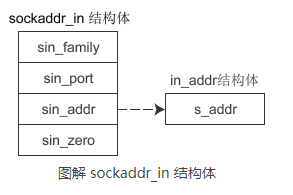
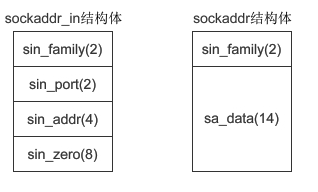
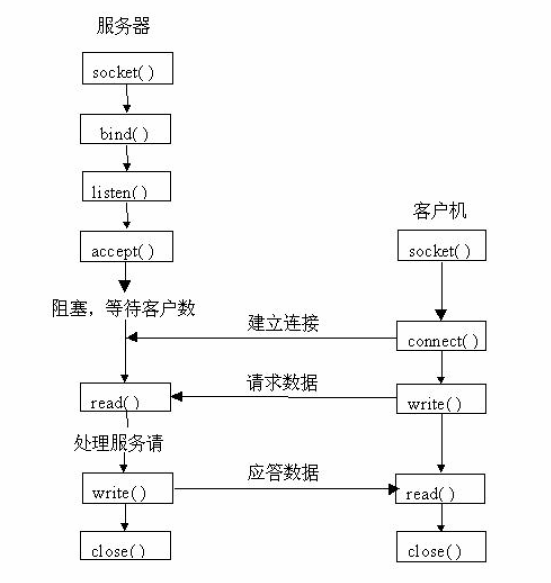

# 网络编程

Linux中的网络编程通过Socket(套接字)接口实现，Socket是一种文件描述符。

## 套接字socket类型

套接字socket有三种类型：

1. 流式套接字（SOCK_STREAM）

   流式的套接字可以提供可靠的、面向连接的通讯流。它使用了TCP协议。TCP保证了数据传输的正确性和顺序性。

2. 数据报套接字（SOCK_DGRAM）

   数据报套接字定义了一种无连接的服务，数据通过相互独立的报文进行传输，是无序的，并且不保证可靠，无差错,它使用数据报协议UDP。

3. 原始套接字SOCK_RAW

   原始套接字允许对低层协议如IP或ICMP直接访问，主要用于新的网络协议的测试等。

## 地址结构

```c
struct sockaddr
{
	u_short sa_family; // 地址族，采用“AF_xxx”的形式，如：AF_INET。
	char sa_data[14];  // 14字节的特定协议地址
}
```

编程中一般并不直接针对`struct sockaddr`数据结构操作，而是使用r等价的`sockaddr_in`数据结构

```c
struct sockaddr_in
{
    short int sin_family; 			/* Internet地址族*/
    unsigned short int sin_port; 	/* 端口号*/
    struct in_addr sin_addr; 		/* IP地址*/
    unsigned char sin_zero[8]; 		/* 填0 */
}
struct in_addr
{
	unsigned long s_addr; //32位的地址
}

```





### 地址转换

IP地址通常由数字加点(192.168.0.1)的形式表示，而在`struct in_addr`中使用的是IP地址是由32位的整数表示的，为了转换我们可以使用下面两个函数：

- `int inet_aton(const char *cp,struct in_addr *inp)`

  将cp指向的字符串形式的ip地址192.168.0.1转换为32位的整数存放inp里面。

- `char *inet_ntoa(struct in_addr in)`
  将in指向的32位的整数ip地址，转换为字符串形式的ip地址192.168.0.1返回

### 字节序转换

#### 网络传输是大端字节序

- 小端字节序：低字节数据存放在低地址

- 大端字节序：低字节的数据存放在高地址

如图所示：


#### **字节序转换函数**

| 函数  | 功能                                     |
| ----- | ---------------------------------------- |
| htons | 把unsigned short类型从主机序转换到网络序 |
| htonl | 把unsigned long类型从主机序转换到网络序  |
| ntohs | 把unsigned short类型从网络序转换到主机序 |
| ntohl | 把unsigned long类型从网络序转换到主机序  |

## ip和主机名


```c
//在网络上标识一台机器可以用IP，也可以使用主机名。
struct hostent *gethostbyname(const char *hostname)
struct hostent
{
    char *	h_name; 			/* 主机的正式名称*/
    char *	h_aliases; 			/* 主机的别名*/
    int 	h_addrtype; 		/* 主机的地址类型AF_INET*/
    int 	h_length; 			/* 主机的地址长度*/
    char **	h_addr_list; 		/* 主机的IP地址列表*/
}
#define h_addr h_addr_list[0] /* 主机的第一个IP地址*/
```

## 常用函数

进行Socket编程的常用函数有：

- `socket`：创建一个socket。

  ```c
  #include <sys/socket.h>
  int socket(int af, int type, int protocol);
  
  参数：
  	af:为地址族（Address Family），也就是 IP 地址类型
      	AF_INET :IPV4
      	AF_INET6:IPV6
      type:为数据传输方式/套接字类型
          SOCK_STREAM:流式的套接字,使用TCP
  		SOCK_DGRAM:数据报套接字 使用UDP
  		SOCK_RAW:原始套接字
     protocol：表示传输协议
          IPPROTO_TCP：TCP 传输协议
          IPPTOTO_UDP：UDP 传输协议
  返回值：
     -1:失败  INVALID_SOCKET宏为-1
     其它正数:成功：socket ID
  注意：
      1.ip 127.0.0.1，它是一个特殊IP地址，表示本机地址，后面的教程会经常用到。
      2.有af和type为什么还需要第三个protocol指定传输协议
        一般情况系统会自动适配传输协议，但是有些情况系统无法适配的时候就要手动指定。
        所以大部分情况下下面的是等价的。
  int tcp_socket = socket(AF_INET, SOCK_STREAM, 0);  //创建TCP套接字
  int udp_socket = socket(AF_INET, SOCK_DGRAM, 0);   //创建UDP套接字
  等价于
  int tcp_socket = socket(AF_INET, SOCK_STREAM, IPPROTO_TCP)
  int udp_socket = socket(AF_INET, SOCK_DGRAM, IPPROTO_UDP
  
  ```

  

- `bind`：用于绑定IP地址和端口号到socket

  ```c
  #include <sys/socket.h>
  int bind(int sock, struct sockaddr *addr, socklen_t addrlen);
  参数：
      sock：socket函数返回的ID
      addr：struct sockaddr类型的指针，一般我们用struct sockaddr_in类型的指针，二者等价
      addrlen：地址长度，sizeof(struct sockaddr)
  返回值：
      0:成功
     -1:失败
        并且设置errno。WSAGETLASTERROR 函数取错误码。错误宏的意思
        	EACCES：这个用户不是超级用户
      	EADDRINUSE： 地址被占用
      	EADDRINUSE： 端口被占用或其他错误自行查询
  ```

  使用示例

  ```c
  struct sockaddr_in server_addr;
  bzero(&server_addr,sizeof(struct sockaddr_in)); // 初始化,置0
  server_addr.sin_family=AF_INET;					// IPV4
  server_addr.sin_addr.s_addr=inet_addr("192.168.0.229");//用于绑定到一个固定IP,inet_addr用于把数字加格式的ip转化为整形ip
  server_addr.sin_port=htons(3333)// (将本机器上的short数据转化为网络上的short数据)端口号
  if(bind(sockfd,(struct sockaddr *)(&server_addr),sizeof(struct sockaddr))==-1) { 
  		fprintf(stderr,"Bind error:%s\n\a",strerror(errno)); 
  		exit(1); 
  } 
  ```

  

- `connect`该函数用于绑定之后的client端，与服务器建立连接
  
  ```c
  int connect(int sock, struct sockaddr *serv_addr, socklen_t addrlen);
  参数和bind函数完全一样
  ```
  
  使用示例
  
  ```c
  /* 客户程序发起连接请求 */
  if(connect(sockfd,(struct sockaddr *)(&server_addr),sizeof(struct sockaddr))==-1){
      fprintf(stderr,"Connect Error:%s\a\n",strerror(errno));
      exit(1);
  }
  ```
  
  
  
- `listen`：设置能处理的最大连接要求，通过 listen() 函数可以让套接字进入被动监听状态。

  ```c
  int listen(int sock, int backlog);
  参数：
      sock：为需要进入监听状态的套接字，
      backlog：为请求队列的最大长度。
  
  ```

  所谓被动监听，是指当没有客户端请求时，套接字处于“睡眠”状态，只有当接收到客户端请求时，套接字才会被“唤醒”来响应请求。

  **请求队列**

  当套接字正在处理客户端请求时，如果有新的请求进来，套接字是没法处理的，只能把它放进缓冲区，待当前请求处理完毕后，再从缓冲区中读取出来处理。如果不断有新的请求进来，它们就按照先后顺序在缓冲区中排队，直到缓冲区满。这个缓冲区，就称为请求队列（Request Queue）。

  缓冲区的长度（能存放多少个客户端请求）可以通过 listen() 函数的 backlog 参数指定，但究竟为多少并没有什么标准，可以根据你的需求来定，并发量小的话可以是10或者20。

  如果将 backlog 的值设置为 SOMAXCONN，就由系统来决定请求队列长度，这个值一般比较大，可能是几百，或者更多。

  当请求队列满时，就不再接收新的请求，对于 Linux，客户端会收到 ECONNREFUSED 错误。

  **注意**：listen() 只是让套接字处于监听状态，并没有接收请求。接收请求需要使用 accept() 函数。

- `accept`：当套接字处于监听状态时，可以通过 accept() 函数来接收客户端请求

  ```c
  int accept(int sock, struct sockaddr *addr, socklen_t *addrlen);
  参数：
      和listen、connect函数相同
  ```

  `accept()` 返回一个新的套接字来和客户端通信，addr 保存了客户端的IP地址和端口号，而 sock 是服务器端的套接字，大家注意区分。后面和客户端通信时，要使用这个新生成的套接字，而不是原来服务器端的套接字。

  最后需要说明的是：listen() 只是让套接字进入监听状态，并没有真正接收客户端请求，listen() 后面的代码会继续执行，直到遇到 accept()。accept() 会阻塞程序执行（后面代码不能被执行），直到有新的请求到来。

- `write`：发送数据

  Linux 不区分套接字文件和普通文件，使用 write() 可以向套接字中写入数据，使用 read() 可以从套接字中读取数据。

  ```c
  ssize_t write(int fd, const void *buf, size_t nbytes);
  参数：
      fd ：为要写入的文件的描述符
      buf ：为要写入的数据的缓冲区地址
      nbytes ：为要写入的数据的字节数
  返回值：
      成功则返回写入的字节数，失败则返回 -1
  ```

  

- `read`：接收数据

  ```c
  ssize_t read(int fd, void *buf, size_t nbytes);
  参数：
  	fd :为要读取的文件的描述符
      buf :为要接收数据的缓冲区地址
      nbytes: 为要读取的数据的字节数
  返回值：
        成功则返回读取到的字节数（但遇到文件结尾则返回0）
        失败则返回 -1。
  ```

  

## TCP通信



### 基于TCP的服务器

1. 创建一个socket，用函数socket()
2. 绑定IP地址、端口等信息到socket上，用函数bind()
3. 设置允许的最大连接数，用函数listen()
4. 接收客户端上来的连接，用函数accept()
5. 收发数据，用函数send()和recv()，或者read()和write()
6. 关闭网络连接


### 基于TCP的客户端

1. 创建一个socket，用函数socket()
2. 设置要连接的对方的IP地址和端口等属性
3. 连接服务器，用函数connect()
4. 收发数据，用函数send()和recv()，或者read()和write()
5. 关闭网络连接

### 示例代码

1. tcp_server.c

   ```c
   #include <stdlib.h> 
   #include <stdio.h> 
   #include <errno.h> 
   #include <string.h> 
   #include <netdb.h> 
   #include <sys/types.h> 
   #include <netinet/in.h> 
   #include <sys/socket.h> 
   
   #define portnumber 3333
   
   int main(int argc, char *argv[]) 
   { 
   	int sockfd,new_fd; 
   	struct sockaddr_in server_addr; 
   	struct sockaddr_in client_addr; 
   	int sin_size; 
   	char hello[]="Hello! Are You Fine?\n"; 
   	
   
   	/* 服务器端开始建立sockfd描述符 */ 
   	if((sockfd=socket(AF_INET,SOCK_STREAM,0))==-1) // AF_INET:IPV4;SOCK_STREAM:TCP
   	{ 
   		fprintf(stderr,"Socket error:%s\n\a",strerror(errno)); 
   		exit(1); 
   	} 
   
   	/* 服务器端填充 sockaddr结构 */ 
   	bzero(&server_addr,sizeof(struct sockaddr_in)); // 初始化,置0
   	server_addr.sin_family=AF_INET;                 // Internet
   	//server_addr.sin_addr.s_addr=htonl(INADDR_ANY);  // (将本机器上的long数据转化为网络上的long数据)和任何主机通信  //INADDR_ANY 表示可以接收任意IP地址的数据，即绑定到所有的IP
   	server_addr.sin_addr.s_addr=inet_addr("192.168.0.229");  //用于绑定到一个固定IP,inet_addr用于把数字加格式的ip转化为整形ip
   	server_addr.sin_port=htons(portnumber);         // (将本机器上的short数据转化为网络上的short数据)端口号
   	
   	/* 捆绑sockfd描述符到IP地址 */ 
   	if(bind(sockfd,(struct sockaddr *)(&server_addr),sizeof(struct sockaddr))==-1) 
   	{ 
   		fprintf(stderr,"Bind error:%s\n\a",strerror(errno)); 
   		exit(1); 
   	} 
   
   	/* 设置允许连接的最大客户端数 */ 
   	if(listen(sockfd,5)==-1) 
   	{ 
   		fprintf(stderr,"Listen error:%s\n\a",strerror(errno)); 
   		exit(1); 
   	} 
   
   	while(1) 
   	{ 
   		/* 服务器阻塞,直到客户程序建立连接 */ 
   		sin_size=sizeof(struct sockaddr_in); 
   		if((new_fd=accept(sockfd,(struct sockaddr *)(&client_addr),&sin_size))==-1) 
   		{ 
   			fprintf(stderr,"Accept error:%s\n\a",strerror(errno)); 
   			exit(1); 
   		} 
   		fprintf(stderr,"Server get connection from %s\n",inet_ntoa(client_addr.sin_addr)); // 将网络地址转换成.字符串
   		
   		if(write(new_fd,hello,strlen(hello))==-1) 
   		{ 
   			fprintf(stderr,"Write Error:%s\n",strerror(errno)); 
   			exit(1); 
   		} 
   		/* 这个通讯已经结束 */ 
   		close(new_fd); 
   		/* 循环下一个 */ 
   	} 
   
   	/* 结束通讯 */ 
   	close(sockfd); 
   	exit(0); 
   } 
   
   ```

2. tcp_client.c

   ```c
   #include <stdlib.h> 
   #include <stdio.h> 
   #include <errno.h> 
   #include <string.h> 
   #include <netdb.h> 
   #include <sys/types.h> 
   #include <netinet/in.h> 
   #include <sys/socket.h> 
   
   #define portnumber 3333
   
   int main(int argc, char *argv[]) 
   { 
   	int sockfd; 
   	char buffer[1024]; 
   	struct sockaddr_in server_addr; 
   	struct hostent *host; 
   	int nbytes; 
   
           /* 使用hostname查询host 名字 */
   	if(argc!=2) 
   	{ 
   		fprintf(stderr,"Usage:%s hostname \a\n",argv[0]); 
   		exit(1); 
   	} 
   
   	if((host=gethostbyname(argv[1]))==NULL) 
   	{ 
   		fprintf(stderr,"Gethostname error\n"); 
   		exit(1); 
   	} 
   
   	/* 客户程序开始建立 sockfd描述符 */ 
   	if((sockfd=socket(AF_INET,SOCK_STREAM,0))==-1) // AF_INET:Internet;SOCK_STREAM:TCP
   	{ 
   		fprintf(stderr,"Socket Error:%s\a\n",strerror(errno)); 
   		exit(1); 
   	} 
   
   	/* 客户程序填充服务端的资料 */ 
   	bzero(&server_addr,sizeof(server_addr)); // 初始化,置0
   	server_addr.sin_family=AF_INET;          // IPV4
   	server_addr.sin_port=htons(portnumber);  // (将本机器上的short数据转化为网络上的short数据)端口号
   	server_addr.sin_addr=*((struct in_addr *)host->h_addr); // IP地址
   	
   	/* 客户程序发起连接请求 */ 
   	if(connect(sockfd,(struct sockaddr *)(&server_addr),sizeof(struct sockaddr))==-1) 
   	{ 
   		fprintf(stderr,"Connect Error:%s\a\n",strerror(errno)); 
   		exit(1); 
   	} 
   
   	/* 连接成功了 */ 
   	if((nbytes=read(sockfd,buffer,1024))==-1) 
   	{ 
   		fprintf(stderr,"Read Error:%s\n",strerror(errno)); 
   		exit(1); 
   	} 
   	buffer[nbytes]='\0'; 
   	printf("I have received:%s\n",buffer); 
   
   	/* 结束通讯 */ 
   	close(sockfd); 
   	exit(0); 
   } 
   
   ```

   

3. tcp_server_fork.c

   ```c
   #include <stdlib.h> 
   #include <stdio.h> 
   #include <errno.h> 
   #include <string.h> 
   #include <netdb.h> 
   #include <sys/types.h> 
   #include <netinet/in.h> 
   #include <sys/socket.h> 
   
   #define MY_PORT 3333
   
   int main(int argc ,char **argv)
   {
    int listen_fd,accept_fd;
    struct sockaddr_in     client_addr;
    int n;
    
    if((listen_fd=socket(AF_INET,SOCK_STREAM,0))<0)
     {
           printf("Socket Error:%s\n\a",strerror(errno));
           exit(1);
     }
    
    bzero(&client_addr,sizeof(struct sockaddr_in));
    client_addr.sin_family=AF_INET;
    client_addr.sin_port=htons(MY_PORT);
    client_addr.sin_addr.s_addr=htonl(INADDR_ANY);
    n=1;
    /* 如果服务器终止后,服务器可以第二次快速启动而不用等待一段时间  */
    setsockopt(listen_fd,SOL_SOCKET,SO_REUSEADDR,&n,sizeof(int));
    if(bind(listen_fd,(struct sockaddr *)&client_addr,sizeof(client_addr))<0)
     {
           printf("Bind Error:%s\n\a",strerror(errno));
           exit(1);
     }
     listen(listen_fd,5);
     while(1)
     {
      accept_fd=accept(listen_fd,NULL,NULL);
      if((accept_fd<0)&&(errno==EINTR))
             continue;
      else if(accept_fd<0)
       {
           printf("Accept Error:%s\n\a",strerror(errno));
           continue;
       }
     if((n=fork())==0)
      {
           /* 子进程处理客户端的连接 */
           char buffer[1024];
   
           close(listen_fd);
           n=read(accept_fd,buffer,1024);
           write(accept_fd,buffer,n);
           close(accept_fd);
           exit(0);
      }
      else if(n<0)
           printf("Fork Error:%s\n\a",strerror(errno));
      close(accept_fd);
     }
   } 
   
   ```

   

## UDP通信


### 基于UDP的服务器

1. 创建一个socket，用函数socket()
2. 绑定IP地址、端口等信息到socket上，用函数bind()
3. 循环接收数据，用函数recvfrom()
4. 关闭网络连接

### 基于UDP的客户端

1. 创建一个socket，用函数socket()
2. 绑定IP地址、端口等信息到socket上，用函数bind()
3. 设置对方的IP地址和端口等属性
4. 发送数据，用函数sendto()
5. 关闭网络连接

### 示例代码

1. udp_client.c

   ```c
   #include <stdlib.h>
   #include <stdio.h>
   #include <errno.h>
   #include <string.h>
   #include <unistd.h>
   #include <netdb.h>
   #include <sys/socket.h>
   #include <netinet/in.h>
   #include <sys/types.h>
   #include <arpa/inet.h>
   
   #define SERVER_PORT 8888 
   #define MAX_BUF_SIZE 1024 
   
   void udpc_requ(int sockfd,const struct sockaddr_in *addr,int len) 
   { 
   	char buffer[MAX_BUF_SIZE]; 
   	int n; 
   	while(1) 
   	{ 	/* 从键盘读入,写到服务端 */ 
   		printf("Please input char:\n");
   		fgets(buffer,MAX_BUF_SIZE,stdin); 
   		sendto(sockfd,buffer,strlen(buffer),0,addr,len); 
   		bzero(buffer,MAX_BUF_SIZE); 
   	} 
   } 
   
   int main(int argc,char **argv) 
   { 
   	int sockfd; 
   	struct sockaddr_in addr; 
   
   	if(argc!=2) 
   	{ 
   		fprintf(stderr,"Usage:%s server_ip\n",argv[0]); 
   		exit(1); 
   	}
   
   	/* 建立 sockfd描述符 */ 
   	sockfd=socket(AF_INET,SOCK_DGRAM,0); 
   	if(sockfd<0) 
   	{ 
   		fprintf(stderr,"Socket Error:%s\n",strerror(errno)); 
   		exit(1); 
   	} 
   
   	/* 填充服务端的资料 */ 
   	bzero(&addr,sizeof(struct sockaddr_in)); 
   	addr.sin_family=AF_INET; 
   	addr.sin_port=htons(SERVER_PORT);
   	if(inet_aton(argv[1],&addr.sin_addr)<0)  /*inet_aton函数用于把字符串型的IP地址转化成网络2进制数字*/ 
   	{ 
   		fprintf(stderr,"Ip error:%s\n",strerror(errno)); 
   		exit(1); 
   	} 
   
   	udpc_requ(sockfd,&addr,sizeof(struct sockaddr_in)); // 进行读写操作
   	close(sockfd); 
   } 
   
   ```
   

2. udp_server.c

   ```c
   #include <stdlib.h>
   #include <stdio.h>
   #include <errno.h>
   #include <string.h>
   #include <unistd.h>
   #include <netdb.h>
   #include <sys/socket.h>
   #include <netinet/in.h>
   #include <sys/types.h>
   #include <arpa/inet.h>
   
   #define SERVER_PORT 8888 
   #define MAX_MSG_SIZE 1024 
   
   void udps_respon(int sockfd) 
   { 
   	struct sockaddr_in addr; 
   	int addrlen,n; 
   	char msg[MAX_MSG_SIZE]; 
   
   	while(1) 
   	{	/* 从网络上读,并写到网络上 */ 
   		bzero(msg,sizeof(msg)); // 初始化,清零
   		addrlen = sizeof(struct sockaddr); 
   		n=recvfrom(sockfd,msg,MAX_MSG_SIZE,0,(struct sockaddr*)&addr,&addrlen); // 从客户端接收消息
   		msg[n]=0; 
   		/* 显示服务端已经收到了信息 */ 
   		fprintf(stdout,"Server have received %s",msg); // 显示消息
   	} 
   } 
   
   int main(void) 
   { 
   	int sockfd; 
   	struct sockaddr_in addr; 
   
   	/* 服务器端开始建立socket描述符 */ 
   	sockfd=socket(AF_INET,SOCK_DGRAM,0); 
   	if(sockfd<0) 
   	{ 
   		fprintf(stderr,"Socket Error:%s\n",strerror(errno)); 
   		exit(1); 
   	} 
   
   	/* 服务器端填充 sockaddr结构 */ 
   	bzero(&addr,sizeof(struct sockaddr_in)); 
   	addr.sin_family=AF_INET; 
   	addr.sin_addr.s_addr=htonl(INADDR_ANY); 
   	addr.sin_port=htons(SERVER_PORT); 
   
   	/* 捆绑sockfd描述符 */ 
   	if(bind(sockfd,(struct sockaddr *)&addr,sizeof(struct sockaddr_in))<0) 
   	{ 
   		fprintf(stderr,"Bind Error:%s\n",strerror(errno)); 
   		exit(1); 
   	} 
   
   	udps_respon(sockfd); // 进行读写操作
   	close(sockfd); 
   } 
   
   ```

   

## TCP并发服务器

TCP并发服务器，思想是每一个客户机的请求并不由服务器直接处理,而是由服务器创建一个子进程来处理。算法如下:

```c
socket(...);
bind(...);
listen(...);
while(1) {
    accept(...);
    if(fork(..)==0) {
        process(...);
        close(...);
        exit(...);
    }
    close(...);
}
```

