# 进程控制

## 内存分配

- 单片机在程序存储和运行时的内存分配

  程序默认存储在片内Flash上，运行时会把Flash上的RW_Data拷贝到RAM中，并把程序中未初始化的全局变量或者初始化为0的全局变量，或者未初始化的static变量，或者初始化为0的static变量放在RAM的BSS端，并全部清0。

  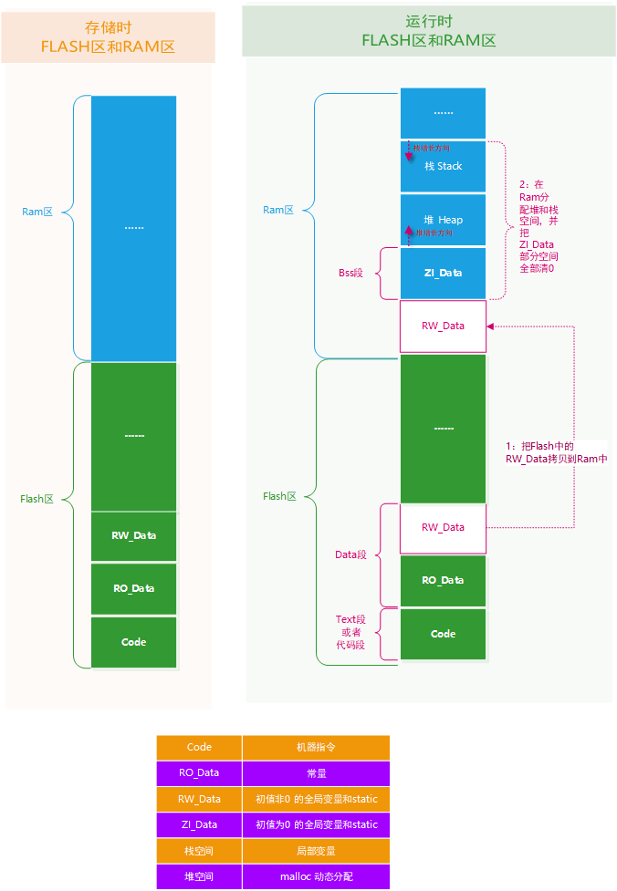

- Linux应用程序内存分配：内核空间和用户空间

  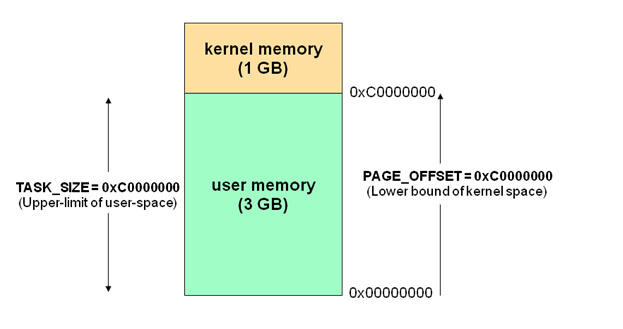

  对于32位操作系统而言，它的寻址空间（虚拟存储空间）为4G（2^32次方）。操作系统的核心是内核，独立于普通的应用程序，可以访问受保护的内存空间，也有访问底层硬件设备的权限。为了保证用户进程不能直接操作内核，保证内核安全，操作系统将虚拟空间划分为两部分，一部分是内核空间，一部分是用户空间。针对Linux操作系统，将最高的1G字节（从虚拟地址0xC0000000到0xFFFFFFFF）供内核使用，称为内核空间（window os占用2G），而其他的（3G）字节（从虚拟地址0x00000000到0xBFFFFFFF），供各个进程使用，称为用户空间。每个进程都可以通过系统调用进入到内核。其中在Linux系统中，进程的用户空间是独立的，而内核空间是共有的（每个进程都认为自己有4G的空间），进程切换时，用户空间切换，内核空间不变。

  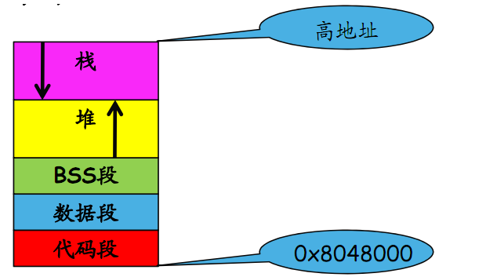

  - 从低地址到高地址分别为：代码段、数据段、BSS段、堆、栈

  - 堆向高内存地址生长，栈向低内存地址生长

  - linux中所有的应用程序都是这个布局，每个应用程序都是从`0x80480000`这个地址开始的，这样冲突吗?不冲突，因为这个地址是一个虚拟地址，linux中每个应用程序都有自己的虚拟地址空间。

    

  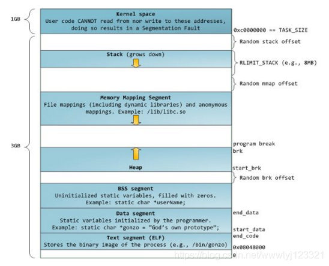

Linux内存实例：`pthread.c`

```c
#include <stdio.h>
#include <stdlib.h>

int A;              //全局未初始化变量     bss
int B = 2;          //全局初始化变量       data
int static C;       //全局静态未初始化变量  bss
int static D = 4;   //全局静态初始化变量    data
int const E = 5;    //全局常量            code

int main()
{
    int *m_addr;     

    int a;           //局部未初始化变量     stack
    int b = 2;       //局部初始化变量       stack
    int static c;    //局部静态未初始化变量  bss
    int static d = 4;//局部静态初始化变量    data
    int const e =5;  //局部常量            stack

    m_addr = malloc(sizeof(int));         //heap

    printf("A_global_addr = %0x\n",&A);
    printf("B_global_init_addr = %0x\n",&B);
    printf("C_global_static_addr = %0x\n",&C);
    printf("D_global_static_init_addr = %0x\n",&D);
    printf("E_global_const_addr = %0x\n",&E);

    printf("\n");

    printf("a_addr = %0x\n",&a);
    printf("b_init_addr = %0x\n",&b);
    printf("c_static_addr = %0x\n",&c);
    printf("d_static_initaddr = %0x\n",&d);
    printf("e_const_addr = %0x\n",&e);

    printf("m_addr = %p\n",m_addr);

    while(1);

    return 0;
}

```

运行结果如下：

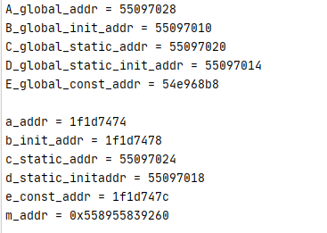

使用cat命令查看应用程序内存分配如下

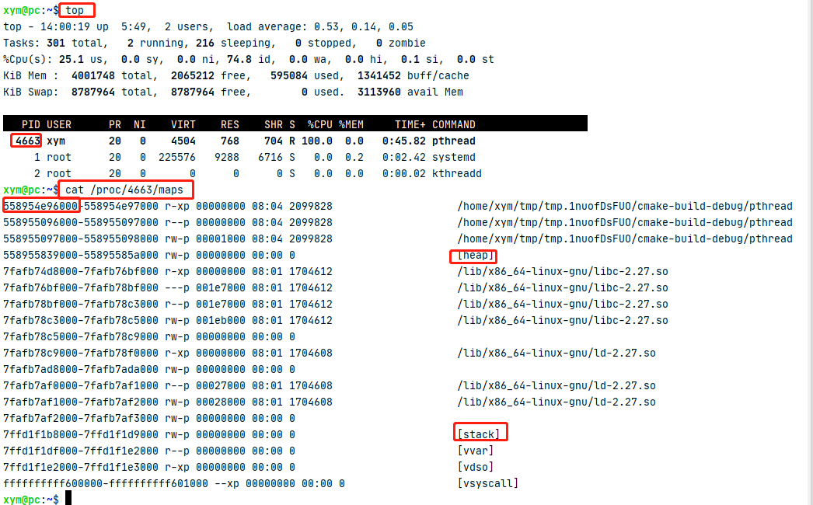

通过上面的运行结果得到如下结论：

| 分类     | 属性                       | 变量名                                         | 说明                                                         |
| -------- | -------------------------- | ---------------------------------------------- | ------------------------------------------------------------ |
| 代码段   | r-xp                       | E                                              | 通常是指用来存放程序执行代码的一块内存区域。这部分区域的大小在程序运行前就已经确定，并且内存区域属于只读。有些常量也存放在这里：例如C语言中使用`char *p = "linux"`定义字符串时，字符串`"linux"`实际被分配在代码段 |
| rodata段 | r--p                       |                                                | 该段是常量数据段，用于存放常量数据。但是注意并不是所有的常量都是放在常量数据段的，其特殊情况如下：有些立即数与指令编译在一起直接放在代码段， 对于字符串常量，编译器会去掉重复的常量，让程序的每个字符串常量只有一份，有些系统中rodata段是多个进程共享的，目的是为了提高空间的利用率 |
| 数据段   | rw-p                       | A、B、C、D、c、d                               | 存放程序中已显式初始化为**非零**的【全局变量和static修饰的变量】。即占用运行时的内存空间也占用程序文件的存储空间。它与bss段在内存中是共用一段内存的，不同的是，bss段数据不占用程序的存储空间，而data段数据占用文件储存空间。 |
| bss段    | rw-p                       | A、C、c                                        | 未初始化或显式初始化为0的全局变量和static变量放在bss段。     |
| 堆       | 用户自己申请释放           | m_addr本身在栈里面，但是指向的内存地址在堆里面 | 由程序员申请分配和释放，需要写代码去申请malloc和释放free；堆是从低地址位向高地址位增长（虚拟地址），采用链式存储结构。频繁的 malloc/free造成内存空间的不连续，产生碎片。当申请堆空间时库函数是按照一定的算法搜索可用的足够大的空间。因此堆的效率比栈要低的多。 |
| 栈       | 系统自动管理，无需人为干预 | a、b、e                                        | 运行时自动分配、自动回收：栈是自动管理的，不许程序员干预；栈区是从高地址位向低地址（虚拟地址）位增长的，是一块连续的内存区域，最大容量是由系统预先定义好的，申请的栈空间超过这个界限时会提示溢出，用户能从栈中获取的空间较小。 |

## 进程基本概念

### 进程ID

每个进程都有个唯一的进程ID叫pid，父进程的ID叫ppid。

```C
#include <unistd.h>
pid_t getpid(void);    //获取进程ID
pid_t getppid(void);  //获取父进程ID
uid_t getuid(void);    //获取用户ID
uid_t geteuid(void);    //获取有效用户ID

gid_t getgid(void);    //获取组ID
gid_t getegid(void);    //获取有效组ID
```

### 进程状态

- 进程的三态模型

  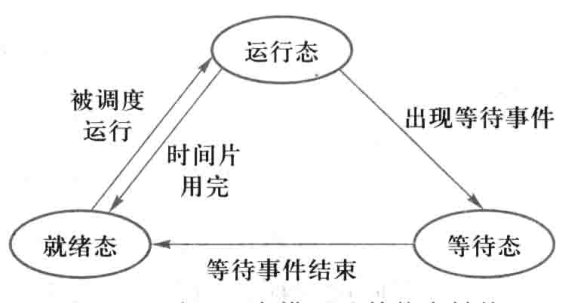

- 进程五态模型

  五态模型在三态模型的基础上增加了新建态（new）和终止态（exit）

  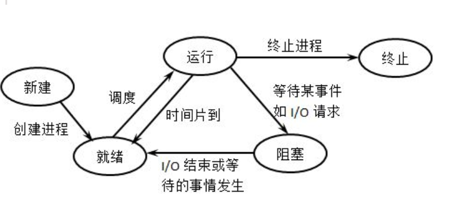

- 进程七态模型

  三态模型和五态模型都是假设所有进程都在内存中的事实上有序不断的创建进程，当系统资源尤其是内存资源已经不能满足进程运行的要求时，必须把某些进程挂起（suspend），对换到磁盘对换区中，释放它占有的某些资源，暂时不参与低级调度。起到平滑系统操作负荷的目的.

  七态模型在五态模型的基础上增加了挂起就绪态（ready suspend）和挂起等待态（blocked suspend）

  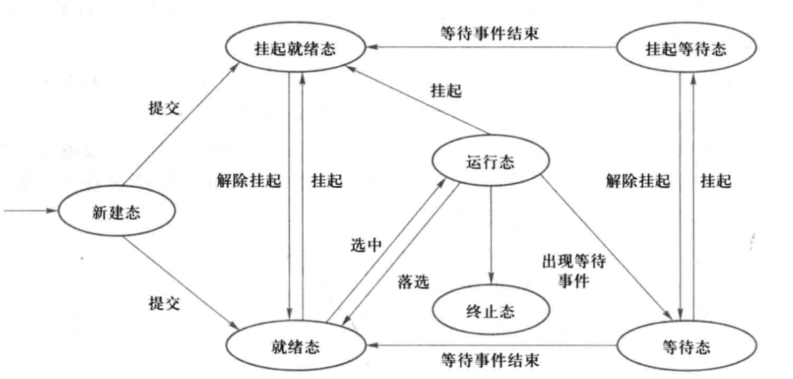

### 进程常用命令

```bash
#常用命令总结 

ps -l   					# 列出与本次登录有关的进程信息；
ps -aux   					# 查询内存中进程信息；
ps -aux | grep 【进程名字】   #查询【进程名字】进程的详细信息；
top   						#查看内存中进程的动态信息；
kill -9 pid   				#杀死进程。
```

## 进程创建

### fork

**示例1：**

```c
#include <sys/types.h>
#include <unistd.h>

int	main( int argc, char **argv )
{
    pid_t pid;

    printf("Current process's PID = [%d]\n", getpid() );

    pid = fork();

    /*
     * 从这里以后，程序会执行两边，
     * 1.父进程会往下执行，此时的pid>0
     * 2.子进程往下执行，此时pid=0
     * 所以可以根据pid的值区分父进程和子进程，
     * 注意：父进程和子进程到底哪个先执行，不确定，随机的
     */
    if( pid == 0 ){
        printf("This is child process, PID = [%d], my parrent PID = [%d]\n", getpid(), getppid() );
    }else if( pid != -1 ){
        printf("This is parent process, PID = [%d]\n", getpid() );
    }else{
        printf("There was an error with forking!\n");
    }
    return 0;


```

运行结果如下：

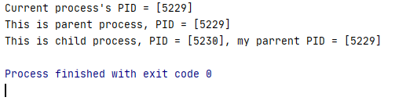

**示例2：**

```c
#include <sys/types.h>
#include <unistd.h>

int	main( int argc, char **argv )
{
    pid_t pid;
    int cont = 0;

    printf("Current process's PID = [%d] cont =%d \n", getpid() ,cont);

    pid = fork(); // 注意：fork会把父进程的资源重新复制一份，所以子进程有自己的运行空间，比如此时的cont=0 在下面父进程和子进程中，互不影响

    if( pid == 0 ){
        cont++;
        printf("This is child process, PID = [%d], my parrent PID = [%d] cont=%d \n",getpid(), getppid(),cont);

    }else if( pid >0 ){
        cont++;
        printf("This is parent process, PID = [%d], child PID = [%d] cont=%d\n", getpid(), pid,cont);
    }else{
        printf("There was an error with forking!\n");
    }
    return 0;
}


```

运行结果：

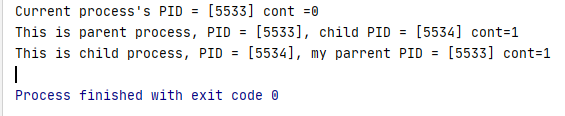

### vfork

`vfork`和`fork`区别如下：

1. fork 子进程拷贝父进程的数据段，代码段
   vfork 子进程与父进程共享数据段
2.  fork 父子进程的执行次序不确定
    vfork 保证子进程先运行，在调用exec 或exit 之前与父进程数据是共享的,在它调用exec或exit 之后父进程才可能被调度运行。
3. vfork 保证子进程先运行，在它调用exec 或exit 之后父进程才可能被调度运行。如果在
     调用这两个函数之前子进程依赖于父进程的进一步动作，则会导致死锁。

如果把上面的代码仅仅改为vfok，

```c
    pid = vfork();  // 改为vfork
```

运行结果如下，发现和不改的时候一样，不是说共享数据段吗，cont为什么不是2。

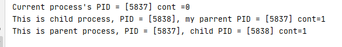

原因如下：fork和vfork的区别在于vfork 保证子进程先运行，在她调用exec 或exit 之
后父进程才可能被调度运行。如果在调用这两个函数之前子进程依赖于父进程的进一步动
作，则会导致死锁。

上面程序中的fork 改成vfork后，vfork创建子进程并没有调用exec 或exit，所以最终将导致死锁。

故而我们只需在子进程添加exit函数即可。修改后的代码如下：

```c
#include <sys/types.h>
#include <unistd.h>
#include <stdio.h>
int	main( int argc, char **argv )
{
    pid_t pid;
    int cont = 0;

    printf("Current process's PID = [%d] cont =%d \n", getpid() ,cont);

    pid = vfork(); // 注意：vfork会共享父进程的资源

    if( pid == 0 ){
        cont++;
        printf("This is child process, PID = [%d], my parrent PID = [%d] cont=%d \n",getpid(), getppid(),cont);

        _exit(0);// 使用vfork的时候这里要有返回
    }else if( pid >0 ){
        cont++;
        printf("This is parent process, PID = [%d], child PID = [%d] cont=%d\n", getpid(), pid,cont);
    }else{
        printf("There was an error with forking!\n");
    }
    return 0;
}


```

运行结果如下：


### exec函数族

fork创建子进程后执行的是和父进程相同的程序（但有可能执行不同的代码分支），子进程往往要调用一种exec函数以执行另一个程序。当进程调用一种exec函数时，该进程的用户空间代码和数据完全被新程序替换，从新程序的启动例程开始执行。调用exec并不创建新进程，所以调用exec前后该进程的id并未改变。

将当前进程的`.text、.data`替换为所要加载的程序的`.text、.data`，然后让进程从新的`.text`第一条指令开始执行，但进程ID不变，换核不换壳。

所谓exec函数族，其实有六种以exec开头的函数，统称exec函数：

```c
/*
 * path：被执行程序名，含完整路径
 * arg ：命令行参数，含程序名，以空指针结束
 */
int execl(const char *path, const char *arg, ...);

/*
 * path：被执行程序名，不含完整路径（从系统PATH环境变量里面找）
 * arg ：命令行参数，含程序名，以空指针结束
 */
int execlp(const char *file, const char *arg, ...);
/*
 * path：被执行程序名，含完整路径 ）
 * argv ：被执行程序所需的命令行参数数组
 */
int execv(const char *path, char *const argv[]);

int execle(const char *path, const char *arg, ..., char *const envp[]);

int execvp(const char *file, char *const argv[]);

int execve(const char *path, char *const argv[], char *const envp[]);
```

#### exec函数族一般规律

exec函数一旦调用成功即执行新的程序，不返回。**只有失败才返回，错误值-1**。所以通常我们直接在exec函数调用后直接调用`perror()`和`exit()`，无需`if`判断。

exec函数族名字很相近，使用起来也很相近，它们的一般规律如下：

l (list)              命令行参数列表

p (path)            搜素file时使用path变量

v (vector)          使用命令行参数数组

e (environment)    使用环境变量数组,不使用进程原有的环境变量，设置新加载程序运行的环境变量

#### 带l的exec函数

这类函数有：`execl，execlp，execle`

具体说明：表示后边的参数以可变参数的形式给出且都以一个空指针结束。这里特别要说明的是，程序名也是参数，所以第一个参数就是程序名。

```c
#include <stdio.h>
#include <unistd.h>
 
int main()
{
	printf("process begin...\n");
	execl("/bin/ls", "ls", NULL);
	printf("process end...\n");
	return 0;
}
```

#### 带p的exec函数

这类函数有：`execlp，execvp`

具体说明：表示第一个参数无需给出具体的路径，只需给出函数名即可，系统会在PATH环境变量中寻找所对应的程序，如果没找到的话返回－1。

```c
#include <stdio.h>
#include <unistd.h>
 
int main()
{
	printf("process begin...\n");
	execlp("ls", "ls", "-l", NULL);
	printf("process end...\n");
	return 0;
}
```

#### 带v的exec函数

这类函数有：`execv，execvp`

具体说明：表示命令所需的参数以`char *arg[]`形式给出且arg最后一个元素必须是NULL

```c
#include <stdio.h>
#include <unistd.h>
 
int main()
{
	printf("process begin...\n");
	char *argv[] = {"ls", "-a", "-l", NULL};
	execvp("ls", argv);
	printf("process end...\n");
	return 0;
}
```

#### 带e的exec函数

这类函数有：`execle`

具体说明：将环境变量传递给需要替换的进程，原来的环境变量不再起作用。

```c
//execle程序
 
#include <stdio.h>
#include <unistd.h>
 
int main()
{
	printf("process begin...\n");
	char *envp[] = {"AA=11", "BB=22", NULL};
	execle("./env", "env", NULL, envp);
	printf("process end...\n");
	return 0;
}
```

```c
//env程序
 
#include <stdio.h>
 
/* environ本质是{"HOME=/home/alvin", "SHELL=/bin/bash", ...} */
extern char **environ;
 
int main()
{
	int i = 0;
 
	for (i = 0; environ[i] != NULL; i++)
		printf("%s\n", environ[i]);
	
	return 0;
}
```

事实上，只有`execve`是真正的系统调用，其它五个函数最终都调用`execve`，所以`execve`在man手册第2节，其它函数在man手册第3节。这些函数之间的关系如下图所示。

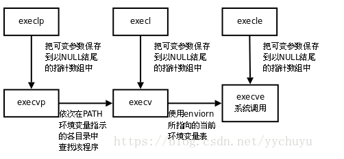

#### system函数

`int system(const char * string)`会调用`fork`产生子进程，由子进程来调用`/bin/sh-c string`来执行参数string字符串所代表的命令，此命令执行完后随即返回原调用的进程。在调用system期间SIGCHLD 信号会被暂时搁置，SIGINT和SIGQUIT 信号则会被忽略

```c
#include <stdlib.h>
int main( int argc, char **argv )
{
    system("ls -al /etc/passwd");
}
```

## 进程等待

wait和waitpid出现的原因：阻塞该进程，直到等待某个子进程退出，
**SIGCHLD**

- 当子进程退出的时候，内核会向父进程SIGCHLD信号，子进程的退出是个异步事件（子进程可以在父进程运行的任何时刻终止）
- 子进程退出时，内核将子进程置为僵尸状态，这个进程成为僵尸进程，它只保留最小的一些内核数据结构，以便父进程查询子进程的退出状态
- 父进程查询子进程的退出状态可以用wait/waitpid函数

wait获取staus后检测处理

| 宏定义              | 描述                                   |
| ------------------- | -------------------------------------- |
| WIFEXITED(status)   | 如果进程子进程正常结束，返回一个非零值 |
| WEXITSTATUS(status) | 如果WIFEXITED非零，返回子进程退出码    |
| WIFSIGNALED(status) | 子进程因为捕获信号而终止，返回非零值   |
| WTERMSIG(status)    | 如果WIFSIGNALED非零，返回信号代码      |
| WIFSTOPPED(status)  | 如果进程被暂停，返回一个非零值         |
| WSTOPSIG(status)    | 如果WIFSTOPPED非零，返回信号代码       |

​      

```c
#include <stdio.h>
#include <stdlib.h>
#include <string.h>
#include <unistd.h>
#include <errno.h>
#include <sys/types.h>
#include <sys/wait.h>

int main(int arg,char *args[])
{
    pid_t pid=fork();
    if(pid==-1){
        printf("fork() failed ! error message:%s\n",strerror(errno));
        return -1;
    }

    if(pid>0){
        int status=0;
        printf("父进程 进入等待\n");
        wait(&status);
        if(WIFEXITED(status)){//WIFEXITED宏的释义： wait if exit ed{
            printf("子进程返回信息码:%d\n",WEXITSTATUS(status));
        }else if(WIFSIGNALED(status)){
            printf("子进程信号中断返回信息码:%d\n",WTERMSIG(status));
        }else if(WIFSTOPPED(status)){
            printf("子进程暂停返回信息码:%d\n",WSTOPSIG(status));
        }else{
            printf("其他退出信息！\n");
        }
    }else if(pid==0){
        printf("i am child !\n");
       /*
        * 下面两种，任选其一
        */
        abort();
      //  exit(100);
    }
    printf("game is over!\n");
    return 0;
}
```

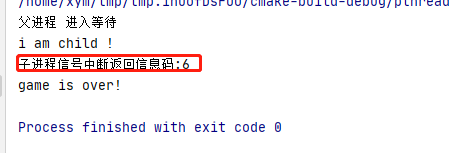

如果把子进程返回改为下面的

```c
    else if(pid==0){
        printf("i am child !\n");
       /*
        * 下面两种，任选其一
        */
        //abort();
        exit(100);
    }
```

运行结果如下：

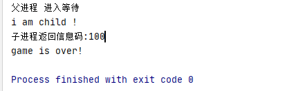


waitpid示例程序

```c
#include <stdio.h>
#include <sys/types.h>
#include <sys/wait.h>
#include <unistd.h>
#include <errno.h>
#include <stdlib.h>
int	main( int argc, char **argv )
{
    int status;
    pid_t pid;
    pid_t pid_c;

    pid = fork();

    if( pid == 0 ){
        printf("Child process will sleep 5 seconds.\n");
        sleep(5);
        printf("Child PID [%d] will exit with status 3.\n", getpid() );
        exit(3);
    }else if( pid != -1 ){
        do{
            pid_c = waitpid( pid, &status, WNOHANG );
            if( pid_c == 0 ){
                printf("Not child process exit\n");
                sleep(1);
            }
        }while( pid_c == 0 );
        if(WIFEXITED(status)){
            /* 如果WIFEXITED返回非零值 */
            printf("the child process %d exit normally.\n",pid_c);
            printf("the return code is %d.\n",WEXITSTATUS(status));
        }else{
            /* 如果WIFEXITED返回零 */
            printf("the child process %d exit abnormally.\n",pid_c);
        }
    }else{
        printf("There was an error with forking!\n");
    }
    return 0;
}

```

运行结果

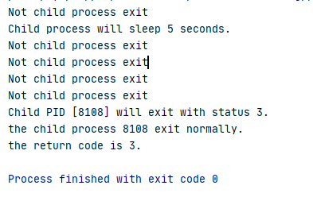