# Linux IPC

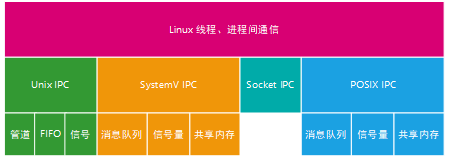

## 管道

**隶属Uinx IPC**。通常用于**进程间通信**。管道单向的、先进先出的，它把一个进程的输出和另外一个进程的输入连接在一起，一个进程（写进程）在管道尾部写入数据，另一个进程（读进程）从管道的头部读出数据。

管道又分为有名管道和无名管道。

- 无名管道是一种半双工的通信方式,数据只能单向流动，只能用于父子之间通信；
- 命名管道，也叫FIFO，也是一种半双工的通信方式，但是它允许无亲缘关系进程间的通信。

### 无名管道pipe

#### 特点

1. 它是半双工的（即数据只能在一个方向上流动），具有固定的读端和写端。
2. 它只能用于具有亲缘关系的进程之间的通信（也是父子进程或者兄弟进程之间）。
3. 它可以看成是一种特殊的文件，对于它的读写也可以使用普通的read、write 等函数。但是它不是普通的文件，并不属于其他任何文件系统，并且只存在于内存中。

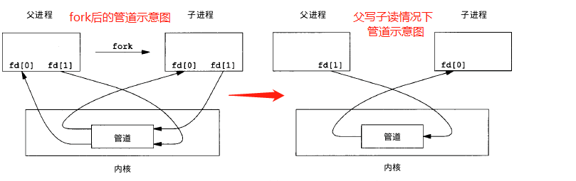

#### 原型

```c
#include <unistd.h>
/*
* filedis[0]用于读管道
* filedis[1]用于写管道
*/
int pipe(int filedis[2]); // 创建无名管道 返回值：若成功返回0，失败返回-1
    
```

#### 示例

子进程写数据，父进程读数据

```c
#include<stdio.h>
#include<unistd.h>
#include <wait.h>
#include <stdlib.h>
 
int main()
{
    int fd[2];  // 两个文件描述符
    pid_t pid;
    char buff[20];

    if(pipe(fd) < 0) {// 创建管道
        printf("Create Pipe Error!\n");
    }


    if((pid = fork()) < 0){ // 创建子进程
        printf("Fork Error!\n");
    }


    if(pid > 0) {  // 父进程
        close(fd[1]); // 关写端
        wait(NULL);
        read(fd[0], buff, 20);
        printf("%s\n", buff);
    }else if(pid==0){
        close(fd[0]); // 关读端
        write(fd[1], "hello pipe !", 13);
        exit(0);
    }

    return 0;
}
```

**运行结果**：

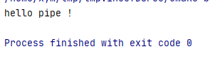

### FIFO命名管道

FIFO，也称为命名管道，它是一种文件类型。

#### 特点

1. FIFO可以在无关的进程之间交换数据，与无名管道不同。
2. FIFO有路径名与之相关联，它以一种特殊设备文件形式存在于文件系统中。

#### 原型

```C
#include <sys/stat.h>
// 返回值：成功返回0，出错返回-1
int mkfifo(const char *pathname, mode_t mode);
```

其中的 mode 参数与`open`函数中的 mode 相同。一旦创建了一个 FIFO，就可以用一般的文件I/O函数操作它。

当 open 一个FIFO时，是否设置非阻塞标志（`O_NONBLOCK`）的区别：

- 若没有指定`O_NONBLOCK`（默认），只读 open 要阻塞到某个其他进程为写而打开此 FIFO。类似的，只写 open 要阻塞到某个其他进程为读而打开它。
- 若指定了`O_NONBLOCK`，则只读 open 立即返回。而只写 open 将出错返回 -1 如果没有进程已经为读而打开该 FIFO，其errno置ENXIO。

#### 示例

FIFO的通信方式类似于在进程中使用文件来传输数据，只不过FIFO类型文件同时具有管道的特性。在数据读出时，FIFO管道中同时清除数据，并且“先进先出”。

读进程`read_fifo.c`

```c
#include<stdio.h>
#include<stdlib.h>
#include<errno.h>
#include<fcntl.h>
#include<sys/stat.h>
#include <pthread.h>
#include <unistd.h>
int main()
{
    int fd;
    int len;
    char buf[1024];

    if(mkfifo("fifo1", 0666) < 0 && errno!=EEXIST){// 创建FIFO管道
        perror("Create FIFO Failed");
    }
    if((fd = open("fifo1", O_RDONLY)) < 0){  // 以读打开FIFO
        perror("Open FIFO Failed");
        exit(1);
    }

    while((len = read(fd, buf, 1024)) > 0){ // 读取FIFO管道
        printf("Read message: %s", buf);
    }
    close(fd);  // 关闭FIFO文件
    return 0;
}
```

写进程`write_fifo.c`

```c
#include<stdio.h>
#include<stdlib.h>   // exit
#include<fcntl.h>    // O_WRONLY
#include<sys/stat.h>
#include<time.h>     // time
#include <pthread.h>
#include <unistd.h>
int main()
{
    int fd;
    int n, i;
    char buf[1024];
    time_t tp;

    printf("I am %d process.\n", getpid()); // 说明进程ID

    if((fd = open("fifo1", O_WRONLY)) < 0){ // 以写打开一个FIFO
        perror("Open FIFO Failed");
        exit(1);
    }

    for(i=0; i<10; ++i){
        time(&tp);  // 取系统当前时间
        n=sprintf(buf,"Process %d's time is %s",getpid(),ctime(&tp));
        printf("Send message: %s", buf); // 打印
        if(write(fd, buf, n+1) < 0){  // 写入到FIFO中
            perror("Write FIFO Failed");
            close(fd);
            exit(1);
        }
        sleep(1);  // 休眠1秒
    }

    close(fd);  // 关闭FIFO文件
    return 0;
}
```

运行结果

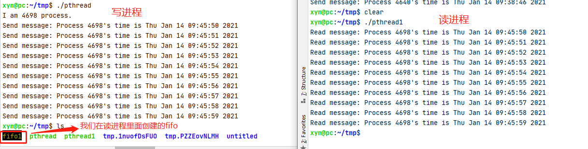

## 信号

信号（signal）**隶属Unix系统**最为古老的**进程间通信**。

### 信号本质

​    信号是软件中断，是在软件层次上对中断机制的一种模拟，在原理上，一个进程收到一个信号与处理器收到一个中断请求可以说是一样的。信号是异步的，一个进程不必通过任何操作来等待信号的到达，事实上，进程也不知道信号到底什么时候到达。

### 信号来源

1. 硬件来源；

   -  用户按终端键，引起终端产生的信号（比如Ctrl + C键产生SIGINT）；
   -  硬件异常产生信号：除数为0、无效的内存引用等。这些条件通常由硬件检测到，并将其通知内核。然后内核为该条件发生时正在运行的进程产生相应的信号。

2. 软件来源

    最常用发送信号的系统函数是kill, raise, alarm和setitimer以及sigqueue函数。

### linux常见信号

可以使用`kill -l`命令查看linux的信号类型。Linux信号的编号是从1-64，其中32和33空缺，没有对应的信号。

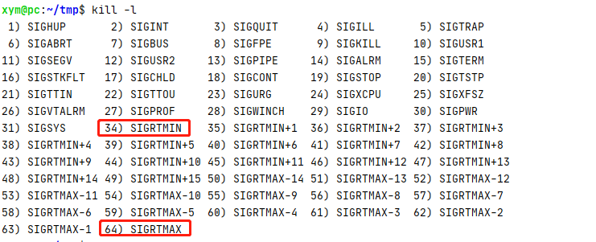

**注意**

- 1~31之间的信号叫做不可靠信号, 不支持排队, 信号可能会丢失, 也叫做非实时信号。

- 34~64之间的信号叫做可靠信号, 支持排队, 信号不会丢失, 也叫做实时信号。

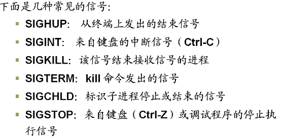


### 信号响应方式

- 忽略信号SIG_IGN ,但有两种信号不能被忽略SIGKILL，SIGSTOP。
- 捕捉信号处理，即用户自定义的信号处理函数来处理。
- 采用系统默认处理SIG_DFL,执行缺省操作

### 信号发送

1. kill函数：即可向自身发送信号，也可以向其他进程发送信号；
2. raise函数向进程自身发送信号。
3. alarm函数：设置一个时间，时间到了产生SIGALRM信号，如果不捕捉该信号，默认动作为终止该进程。

```c
#include <sys/types.h>
#include <signal.h>
int kill(pid_t pid,int signo)
int raise(int signo)
    
    
#include<unistd.h>
unsigned int alarm(unsigned int seconds)// 经过seconds秒后产生SIGALRM信号
```

pause函数使调用进程挂起直至捕捉到一个信号

```c
#include <unistd.h>
int pause(void) // 只有执行一个信号处理函数后，挂起才结束
```

### 信号处理

在`#include<signal.h>`头文件中可以找到信号的原型：

```c
typedef void (*__sighandler_t) (int);
__sighandler_t signal (int __sig, __sighandler_t __handler)
/* 其中__handler可能取值如下：
*   1.SIG_IGN：忽略此信号
*   2.SIG_DEL：按系统默认方式处理
*   3.信号处理函数名：使用用户自己定义的函数数量
*/
```

### 示例

```c
#include <stdarg.h>
#include <stdio.h>
#include <sys/types.h>
#include <unistd.h>
#include <signal.h>

extern char **environ;


/*信号处理函数*/
void	signal_handler( int signo )
{
    int ret;


    switch( signo ){
        case SIGUSR2:
            printf("PID=%d Signal SIGUSR2 received\n",getpid());
            break;
        case SIGTERM:
            printf("PID=%d Signal SIGTERM received\n",getpid());
            break;
        case SIGINT:
            printf("PID=%d Signal SIGINT received\n",getpid());
            break;
        default:
            printf("PID=%d Signal [%d] received\n",getpid(), signo);
            break;
    }
}

int	main( int argc, char **argv )
{
    int i;


    signal( SIGUSR2, signal_handler );    /* 注册SIGUSR2信号*/
    signal( SIGTERM, signal_handler );    /* 注册SIGTERM信号*/
    signal( SIGINT , signal_handler );    /* 注册SIGINT信号*/
    printf("PID=%d wait signal \n",getpid());


    pause();                              /* 等待信号，当上面三个信号任意一个信号到来都会调用 signal_handler处理函数 然后接着往下执行 */
    raise( SIGUSR2 );                     /* 通过raise 函数发送信号 */
    sleep( 1 );
    raise( SIGTERM );
    sleep( 1 );
    printf("PID=%d raise SIGKILL\n",getpid());
    raise( SIGKILL );

    return 0;
}

```

运行结果：

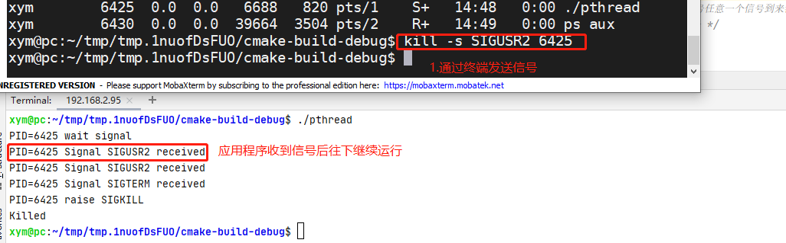

## 信号量

### SystemV IPC信号量

信号量（semaphore）与已经介绍过的 IPC 结构不同，它是一个计数器。信号量用于实现进程间的互斥与同步，而不是用于存储进程间通信数据。

#### 特点

1. 信号量用于进程间同步，若要在进程间传递数据需要结合共享内存。
2. 信号量基于操作系统的 PV 操作，程序对信号量的操作都是原子操作。
3. 每次对信号量的 PV 操作不仅限于对信号量值加 1 或减 1，而且可以加减任意正整数。
4. 支持信号量组。

#### 原型

最简单的信号量是只能取 0 和 1 的变量，这也是信号量最常见的一种形式，叫做二值信号量（Binary Semaphore）。而可以取多个正整数的信号量被称为通用信号量。

Linux 下的信号量函数都是在通用的信号量数组上进行操作，而不是在一个单一的二值信号量上进行操作。

```c
#include <sys/sem.h>
/*
 * 描述:创建或获取一个信号量组 
 * sem_flags:IPC_CREATE:表示若信号量已存在，返回该信号量标识符
 *           IPC_EXCL:表示若信号量已存在，返回错误
 * 返回值：相应的信号量标识符，失败返回-1
 */
int semget(key_t key, int num_sems, int sem_flags);
/*
 * 描述： 对信号量组进行操作，改变信号量的值
 * semid:信号量集ID
 * sem_opa :是一个操作组，表明要进行什么操作，内容如下
 *    struct sembuf
 *     {
 *         // 信号量组中对应的序号，0～sem_nums-1
 *          short sem_num;
 *          // 信号量值在一次操作中的改变量通常是两个数，一个是-1，即P（等待）操作，  一个是+1，即V（发送信号）操作。
 *          short sem_op;   
*           // IPC_NOWAIT, SEM_UNDO 通常为SEM_UNDO,使操作系统跟踪信号，并在进程没有释放该信号量而终止时，操作系统释放信号量
  *         short sem_flg;    
  *      }
 * numops：sem_opa所指向的数组的元素的个数
 * 返回值：成功返回0，失败返回-1
 */
int semop(int semid, struct sembuf *sem_opa, size_t numops);
// 控制信号量的相关信息
int semctl(int semid, int sem_num, int cmd, ...);
```

当`semget`创建新的信号量集合时，必须指定集合中信号量的个数（即`num_sems`），通常为1； 如果是引用一个现有的集合，则将`num_sems`指定为 0 。

其中 `struct sembuf`里面的`sem_op` 是一次操作中的信号量的改变量：

- 若`sem_op > 0`，表示进程释放相应的资源数，将 `sem_op` 的值加到信号量的值上。如果有进程正在休眠等待此信号量，则唤醒它们。
- 若`sem_op < 0`，请求 `sem_op` 的绝对值的资源。
  - 如果相应的资源数可以满足请求，则将该信号量的值减去sem_op的绝对值，函数成功返回。
  - 当相应的资源数不能满足请求时，这个操作与`sem_flg`有关。
    - `sem_flg` 指定`IPC_NOWAIT`，则`semop`函数出错返回`EAGAIN`。
    - `sem_flg` 没有指定`IPC_NOWAIT`，则将该信号量的`semncnt`值加1，然后进程挂起直到下述情况发生：
      1. 当相应的资源数可以满足请求，此信号量的`semncn`t值减1，该信号量的值减去`sem_op`的绝对值。成功返回；
      2. 此信号量被删除，函数`smeop`出错返回`EIDRM`；
      3. 进程捕捉到信号，并从信号处理函数返回，此情况下将此信号量的`semncnt`值减1，函数`semop`出错返回`EINTR`
- 若`sem_op == 0`，进程阻塞直到信号量的相应值为0：
  - 当信号量已经为0，函数立即返回。
  - 如果信号量的值不为0，则依据sem_flg决定函数动作：
    - `sem_flg`指定`IPC_NOWAIT`，则出错返回`EAGAIN`。
    - `sem_flg`没有指定`IPC_NOWAIT`，则将该信号量的`semncnt`值加1，然后进程挂起直到下述情况发生：
      1. 信号量值为0，将信号量的`semzcnt`的值减1，函数`semop`成功返回；
      2. 此信号量被删除，函数`smeop`出错返回`EIDRM`；
      3. 进程捕捉到信号，并从信号处理函数返回，在此情况将此信号量的`semncnt`值减1，函数`semop`出错返回`EINTR`

在`semctl`函数中的命令有多种，这里就说两个常用的：

- `SETVAL`：用于初始化信号量为一个已知的值。所需要的值作为联合`semun`的val成员来传递。在信号量第一次使用之前需要设置信号量。
- `IPC_RMID`：删除一个信号量集合。如果不删除信号量，它将继续在系统中存在，即使程序已经退出，它可能在你下次运行此程序时引发问题，而且信号量是一种有限的资源。

#### 示例

例子如果不加信号量，则父进程会先执行完毕。这里加了信号量让父进程等待子进程执行完以后再执行。

```c
#include<stdio.h>
#include<stdlib.h>
#include<sys/sem.h>
#include <pthread.h>
#include <unistd.h>
// 联合体，用于semctl初始化
union semun
{
    int              val; /*for SETVAL*/
    struct semid_ds *buf;
    unsigned short  *array;
};

// 初始化信号量
int init_sem(int sem_id, int value)
{
    union semun tmp;
    tmp.val = value;
    if(semctl(sem_id, 0, SETVAL, tmp) == -1)
    {
        perror("Init Semaphore Error");
        return -1;
    }
    return 0;
}

// P操作:
//    若信号量值为1，获取资源并将信号量值-1
//    若信号量值为0，进程挂起等待
int sem_p(int sem_id)
{
    struct sembuf sbuf;
    sbuf.sem_num = 0; /*序号*/
    sbuf.sem_op = -1; /*P操作*/
    sbuf.sem_flg = SEM_UNDO;

    if(semop(sem_id, &sbuf, 1) == -1)
    {
        perror("P operation Error");
        return -1;
    }
    return 0;
}

// V操作：
//    释放资源并将信号量值+1
//    如果有进程正在挂起等待，则唤醒它们
int sem_v(int sem_id)
{
    struct sembuf sbuf;
    sbuf.sem_num = 0; /*序号*/
    sbuf.sem_op = 1;  /*V操作*/
    sbuf.sem_flg = SEM_UNDO;

    if(semop(sem_id, &sbuf, 1) == -1)
    {
        perror("V operation Error");
        return -1;
    }
    return 0;
}

// 删除信号量集
int del_sem(int sem_id)
{
    union semun tmp;
    if(semctl(sem_id, 0, IPC_RMID, tmp) == -1){
        perror("Delete Semaphore Error");
        return -1;
    }
    return 0;
}


int main()
{
    int sem_id;  // 信号量集ID
    key_t key;
    pid_t pid;

    // 获取key值
    if((key = ftok(".", 'z')) < 0){
        perror("ftok error");
        exit(1);
    }

    // 创建信号量集，其中只有一个信号量
    if((sem_id = semget(key, 1, IPC_CREAT|0666)) == -1){
        perror("semget error");
        exit(1);
    }

    // 初始化：初值设为0资源被占用
    init_sem(sem_id, 0);

    if((pid = fork()) == -1)
        perror("Fork Error");
    else if(pid == 0){ /*子进程*/
        sleep(2);
        printf("Process child: pid=%d release sem\n", getpid());
        sem_v(sem_id);  /*释放资源*/
    }else{  /*父进程*/
        printf("Process father: pid=%d wait sem\n", getpid());
        sem_p(sem_id);   /*等待资源*/
        printf("Process father: pid=%d get sem\n", getpid());
        sem_v(sem_id);   /*释放资源*/
        del_sem(sem_id); /*删除信号量集*/
    }
    return 0;
}
```

运行结果如下：

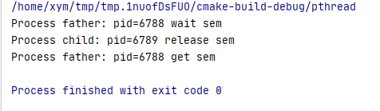

### POSIX IPC信号量

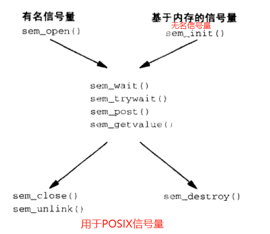

#### 常用函数

```c
#include<semaphore.h>
#include<sys/stat.h>
#include<fcntl.h>
sem_open()        //初始化并打开有名信号量
sem_init()        //创建/获得无名信号量
sem_wait()/sem_trywait()/sem_timedwait()/sem_post()/sem_getvalue()    //操作信号量
sem_close()       //退出有名信号量
sem_unlink()      //销毁有名信号量
sem_destroy()     //销毁无名信号量
```

- sem_open()

  ```c
  /* 创建/打开一个有名信号量，成功返回新信号量的地址，失败返回SEM_FAILED设errno
   * <semaphore.h>
   * #define SEM_FAILED	((sem_t *) 0
   * #define SEM_VALUE_MAX 	(2147483647)
   * Link with -pthread.
   *
   * 
   * name :必须是 "/test" 类型的形式  我们可以在 ls -l /dev/shm/ 目录下查看 sem.test 的信号
   * oflag:O_CREAT 信号量不存在就创建信号量
   * 			信号量UID被设为调用进程的effective UID，GID被设为调用 程序的GID，
   * 			O_EXCL和O_CREAT连用，确保可以创建新的信号量，如果已存在就报错
   * mode ：指定权限
   * value :配合O_CREAT使用，设置信号量的初始值
   */
  sem_t *sem_open(const char *name, int oflag);
  sem_t *sem_open(const char *name, int oflag, mode_t mode, unsigned int value);
  ```

- sem_init()

  ```c
  /* 
   *  功能：创建一个无名信号量并初始化它的值。一个无名信号量在被使用前必须先初始化
   *
   *  参数：
   *   sem：信号量的地址。
   *   pshared：等于 0，信号量在线程间共享（常用）；不等于0，信号量在进程间共享。
   *   value：信号量的初始值。
  *
  * 返回值：
  *    成功：0
   *   失败：-1
  */
  
  int sem_init(sem_t *sem, int pshared, unsigned int value);
  ```

- sem_wait()/sem_trywait()/sem_timedwait()

  ```c
  /* 
   * 将信号量的值减 1。操作前，先检查信号量（sem）的值是否为 0，
   * 若信号量为 0此函数会阻  塞，直到信号量大于 0 时才进行减 1 操作
   *
   * 成功:返回降低后的信号量的值，
   *  失败:返回-1设errno
   */
  int sem_wait(sem_t *sem);
  
  /* 
   * 将信号量的值减 1。操作前，若信号量为0立即返回
   *
   * 成功:返回降低后的信号量的值，
   *  失败:返回-1设errno
   */
  int sem_trywait(sem_t *sem);
  
  //试图占用信号量
  //如果信号量=0,就block abs_timeout那么久，从 Epoch, 1970-01-01 00:00:00 +0000 (UTC).开始按纳秒计
  //如果时间到了信号量还没>0，报错
  int sem_timedwait(sem_t *sem, const struct timespec *abs_timeout);
  ```

  ```c
  struct timespec {
      time_t 	tv_sec;      /* Seconds */
      long   	tv_nsec;     /* Nanoseconds [0 .. 999999999] */
  };
  ```

  

- sem_post()

  ```c
  //归还信号量，成功返回0,失败返回-1设errno
  //Link with -pthread.
  int sem_post(sem_t *sem);
  ```

  

- sem_getvalue()

  ```c
  //获得信号量sem的当前的值，放到sval中。如果有线程正在block这个信号量，sval可能返回两个值，0或“-正在block的线程的数目”，Linux返回0
  //成功返回0,失败返回-1设errno
  //Link with -pthread.
  int sem_getvalue(sem_t *sem, int *sval);
  ```

  

- sem_close()

  ```c
  //关闭有名信号量，成功返回0,失败返回-1设errno
  //Link with -pthread.
  int sem_close(sem_t *sem);
  ```

  

- sem_unlink()

  ```c
  //试图销毁信号量，一旦所有占用该信号量的进程都关闭了该信号量，那么就会销毁这个信号量
  //成功返回0,失败返回-1设errno
  //Link with -pthread.
  int sem_unlink(const char *name);
  ```

  

- sem_destroy()

  ```c
  //销毁信号量，成功返回0,失败返回-1设errno
  //Link with -pthread.
  int sem_destroy(sem_t *sem);
  ```

#### 有名信号量示例

释放信号进程`post_sem.c`

```c
#include <fcntl.h>
#include <sys/stat.h>
#include <semaphore.h>
#include <stdio.h>
#include <errno.h>
#include <stdlib.h>
#include <unistd.h>
 
/* man 7 sem_overview */
 
int main()
{
    /* 创建和打开信号量 */
    char *name = "/test"; /* 必须是这种格式/somename */
    unsigned int value = 0;
    sem_t *sem = sem_open(name, O_RDWR | O_CREAT | O_EXCL, 0777, value);
    if (sem == SEM_FAILED) {
        perror("sem_open create failed");
        sem = sem_open(name, O_RDWR);
        if (sem == SEM_FAILED) {
            perror("sem_open open failed");
            exit(EXIT_FAILURE);
        }
    }
    printf("sem_open %s success\n", name);
 
    int i = 0;
    int num = 5; /* 释放5次信号 */
    for (i; i<num; i++) {
        if (sem_post(sem) != -1) {
            printf("sem_post success, ");
        }
        int value = 0;
        if (sem_getvalue(sem, &value) != -1) {
            printf("the semaphore value = %d\n", value);
        }
    }
 
    sem_close(sem);
 
    return 0;
}
```

等待信号进程`wait_sem.c`

```c
#include <fcntl.h>
#include <sys/stat.h>
#include <semaphore.h>
#include <stdio.h>
#include <errno.h>
#include <stdlib.h>
#include <unistd.h>
 
/* man 7 sem_overview */
 
int main()
{
    /* 创建和打开信号量 */
    char *name = "/test"; /* 必须是这种格式/somename */
    unsigned int value = 0;
    sem_t *sem = sem_open(name, O_RDWR | O_CREAT | O_EXCL, 0777, value);
    if (sem == SEM_FAILED) {
        perror("sem_open create failed");
        sem = sem_open(name, O_RDWR);
        if (sem == SEM_FAILED) {
            perror("sem_open open failed");
            exit(EXIT_FAILURE);
        }
    }
    printf("sem_open %s success\n", name);
 
    while (1) {
        if (sem_wait(sem) != -1) {
            int value = 0;
            if (sem_getvalue(sem, &value) != -1) {
                printf("sem_wait success, the semaphore value = %d\n", value);
            }
        }
    }
 
    return 0;
}
```

运行结果如下：

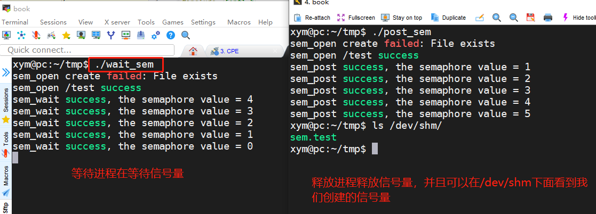

#### 无名信号量示例

线程间互斥

```c
#include <stdio.h>
#include <pthread.h>
#include <unistd.h>
#include <semaphore.h>
 
/* 定义一个信号量 */
sem_t sem;
 
void* call_back(void* arg)
{
    sem_wait(&sem);  //减一操作，后面的线程会阻塞在这里
 
    char* str = (char*)arg;
    
    while(*str != '\0')
    {
        putchar(*str);
        str++;
    }
    putchar(' ');
 
    sem_post(&sem);  //加一操作，后面的线程可以从sem_wait()开始往下执行
}
 
int main()
{
    pthread_t pthrd1,pthrd2;
 
    sem_init(&sem, 0, 1);    //初始化一个信号量
 
    pthread_create(&pthrd1,NULL,call_back,"hello");
    pthread_create(&pthrd2,NULL,call_back,"world");
    
    pthread_join(pthrd1,NULL);
    pthread_join(pthrd2,NULL);
 
    sem_destroy(&sem);    //销毁一个信号量
 
    return 0;
}
```

运行结果如下：（如果不互斥，这几个字母就会乱序输出）


线程间同步

```c
#include <stdio.h>
#include <pthread.h>
#include <unistd.h>
#include <semaphore.h>
 
sem_t sem1, sem2;
 
void* call_back1(void* arg)
{
    sem_wait(&sem1);    //检测sem1是否非零，非零则不阻塞，并进行减操作
 
    char* str = (char*)arg;
    
    printf("%s ",str);
 
    sem_post(&sem2);    //对sem2进行加操作
}
 
void* call_back2(void* arg)
{
    sem_wait(&sem2);    //检测sem2是否为零，为零则阻塞在这里，直到sem2在其他线程被加操作变为非零
 
    char* str = (char*)arg;
    
    printf("%s ",str);
 
    sem_post(&sem1);    //对sem1进行加操作
}
 
int main()
{
    pthread_t pthrd1,pthrd2;
 
    /* 初始化两个信号量 */
    sem_init(&sem1, 0, 1);
    sem_init(&sem2, 0, 0);
 
    pthread_create(&pthrd1,NULL,call_back1,"hello");
    pthread_create(&pthrd2,NULL,call_back2,"world");
    
    pthread_join(pthrd1,NULL);
    pthread_join(pthrd2,NULL);
 
    /* 销毁两个信号量 */
    sem_destroy(&sem1);
    sem_destroy(&sem2);
 
    return 0;
}
```

运行结果如下：

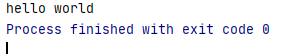

### SystemV IPC信号量和POSIX IPC信号量区别

> 简要的说，Posix是“可移植操作系统接口（Portable Operating System Interface ）的首字母简写，但它并不是一个单一的标准，而是一个电气与电子工程学会即IEEE开发的一系列标准，它还是由ISO（国际标准化组织）和IEC（国际电工委员会）采纳的国际标准。而System v是Unix操作系统众多版本的一个分支，它最初是由AT&T在1983年第一次发布，System v一共有四个版本，而最成功的是System V Release 4，或者称为SVR4。这样看来，一个是Unix 的标准之一（另一个标准是Open Group），一个是Unix众多版本的分支之一（其他的分支还有Linux跟BSD），应该来说，Posix标准正变得越来越流行，很多厂家开始采用这一标准。

那么两者有什么区别，或者说，应用场景：

1. POSIX信号量常用于线程；system v信号量常用于进程的同步；
2. 从使用的角度，System V 信号量的使用比较复杂，而 POSIX 信号量使用起来相对简单；
3. 对 POSIX 来说，信号量是个非负整数。而 System V 信号量则是一个或多个信号量的集合，它对应的是一个信号量结构体，这个结构体是为 System V IPC 服务的，信号量只不过是它的一部分；
4. Posix信号量是基于内存的，即信号量值是放在共享内存中的，它是由可能与文件系统中的路径名对应的名字来标识的。而System v信号量则是基于内核的，它放在内核里面；
5. POSIX 信号量的头文件是 <semaphore.h>，而 System V 信号量的头文件是 <sys/sem.h>；
6. Posix还有有名信号量，一般用于进程同步, 有名信号量是内核持续的。

## 消息队列

### SytemV IPC消息队列

消息队列，是消息的链接表，存放在内核中。一个消息队列由一个标识符（即队列ID）来标识。

#### 特点

1. 消息队列是面向记录的，其中的消息具有特定的格式以及特定的优先级。
2. 消息队列独立于发送与接收进程。进程终止时，消息队列及其内容并不会被删除。
3. 消息队列可以实现消息的随机查询,消息不一定要以先进先出的次序读取,也可以按消息的类型读取。

#### 原型

```c
#include <sys/msg.h>
// 创建或打开消息队列：成功返回队列ID，失败返回-1
int msgget(key_t key, int flag);
// 添加消息：成功返回0，失败返回-1
int msgsnd(int msqid, const void *ptr, size_t size, int flag);
// 读取消息：成功返回消息数据的长度，失败返回-1
int msgrcv(int msqid, void *ptr, size_t size, long type,int flag);
// 控制消息队列：成功返回0，失败返回-1
int msgctl(int msqid, int cmd, struct msqid_ds *buf);
```

在以下两种情况下，`msgget`将创建一个新的消息队列：

- 如果没有与键值key相对应的消息队列，并且flag中包含了`IPC_CREAT`标志位。
- key参数为`IPC_PRIVATE`。

函数`msgrcv`在读取消息队列时，type参数有下面几种情况：

- `type == 0`，返回队列中的第一个消息；
- `type > 0`，返回队列中消息类型为 type 的第一个消息；
- `type < 0`，返回队列中消息类型值小于或等于 type 绝对值的消息，如果有多个，则取类型值最小的消息。

可以看出，type值非 0 时用于以非先进先出次序读消息。也可以把 type 看做优先级的权值。（其他的参数解释，请自行Google之）

#### 示例

下面写了一个简单的使用消息队列进行IPC的例子，服务端程序一直在等待特定类型的消息，当收到该类型的消息以后，发送另一种特定类型的消息作为反馈，客户端读取该反馈并打印出来。

`msg_server.c`

```c
#include <stdio.h>
#include <stdlib.h>
#include <sys/msg.h>

// 用于创建一个唯一的key
#define MSG_FILE "/etc/passwd"

// 消息结构
struct msg_form {
    long mtype;
    char mtext[256];
};

int main()
{
    int msqid;
    key_t key;
    struct msg_form msg;

    // 获取key值
    if((key = ftok(MSG_FILE,'z')) < 0){
        perror("ftok error");
        exit(1);
    }

    // 打印key值
    printf("Message Queue - Server key is: %d.\n", key);

    // 创建消息队列
    if ((msqid = msgget(key, IPC_CREAT|0777)) == -1){
        perror("msgget error");
        exit(1);
    }

    // 打印消息队列ID及进程ID
    printf("My msqid is: %d.\n", msqid);
    printf("My pid is: %d.\n", getpid());

    // 循环读取消息
    for(;;){
        msgrcv(msqid, &msg, 256, 888, 0);// 返回类型为888的第一个消息
        printf("Server: receive msg.mtext is: %s.\n", msg.mtext);
        printf("Server: receive msg.mtype is: %d.\n", msg.mtype);

        msg.mtype = 999; // 客户端接收的消息类型
        sprintf(msg.mtext, "hello, I'm server %d", getpid());
        msgsnd(msqid, &msg, sizeof(msg.mtext), 0);
    }
    return 0;
}
```

`msg_client.c`

```c
#include <stdio.h>
#include <stdlib.h>
#include <sys/msg.h>

// 用于创建一个唯一的key
#define MSG_FILE "/etc/passwd"

// 消息结构
struct msg_form {
    long mtype;
    char mtext[256];
};

int main()
{
    int msqid;
    key_t key;
    struct msg_form msg;

    // 获取key值
    if ((key = ftok(MSG_FILE, 'z')) < 0){
        perror("ftok error");
        exit(1);
    }

    // 打印key值
    printf("Message Queue - Client key is: %d.\n", key);

    // 打开消息队列
    if ((msqid = msgget(key, IPC_CREAT|0777)) == -1){
        perror("msgget error");
        exit(1);
    }

    // 打印消息队列ID及进程ID
    printf("My msqid is: %d.\n", msqid);
    printf("My pid is: %d.\n", getpid());

    // 添加消息，类型为888
    msg.mtype = 888;
    sprintf(msg.mtext, "hello, I'm client %d", getpid());
    msgsnd(msqid, &msg, sizeof(msg.mtext), 0);

    // 读取类型为999的消息
    msgrcv(msqid, &msg, 256, 999, 0);
    printf("Client: receive msg.mtext is: %s.\n", msg.mtext);
    printf("Client: receive msg.mtype is: %d.\n", msg.mtype);
    return 0;
}
```

### POSIX IPC消息队列

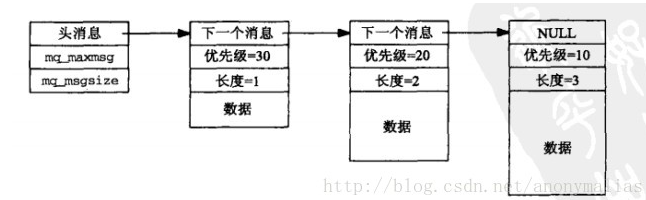

#### 创建消息队列

```c

#include <fcntl.h>           /* For O_* constants */
#include <sys/stat.h>        /* For mode constants */
#include <mqueue.h>

mqd_t mq_open(const char *name, int oflag);
mqd_t mq_open(const char *name, int oflag, mode_t mode,struct mq_attr *attr)

参数:
name:posix IPC名字， 即将要被打开或创建的消息队列对象，为了便于移植，需要指定为“/name”的格式。
oflag:必须要有O_RDONLY（只读）、标志O_RDWR(读写)， O_WRONLY（只写）之一，除此之外还可以指定O_CREAT（没有该对象则创建）、O_EXCL（如果O_CREAT指定，但name不存在，就返回错误），O_NONBLOCK（以非阻塞方式打开消息队列，在默认情况下mq_receive和mq_send函数会阻塞的地方，使用该标志打开的消息队列会返回EAGAIN错误）。
当操作一个新队列时，使用O_CREAT标识，此时后面两个参数需要被指定，参数mode为指定权限位，attr指定新创建队列的属性。
    

oflag：标志。

标志——————————作用
O_CREAT———————没有该对象则创建
O_EXCL————————如果O_CREAT指定，但name不存在，就返回错误
O_NONBLOCK—————以非阻塞方式打开消息队列
O_RDONLY———————只读
O_RDWR————————读写
O_WRONLY———————只写

 

mode：
权限——————作用
S_IWUSR——用户主写
S_IRUSR——用户主读
S_IWGRP——组成员写
S_IRGRP——组成员读
S_IWOTH——其他用户写
S_IROTH——其他用户读
```

#### 关闭消息队列

```c
#include <mqueue.h>
int mq_close(mqd_t mqdes); // 若成功则为0，若出错则为-1

关闭之后调用进程不在使用该描述符，但消息队列不会从系统中删除
进程终止时，会自动关闭已打开的消息队列，和调用mq_close一样。
```

#### 删除消息队列

```c
#include <mqueue.h>
int mq_unlink(const char *name); //若成功则为0，若出错则为-1

删除会马上发生，即使该队列的描述符引用计数仍然大于0
```

#### 设置和获取消息队列属性

`mq_setattr()`和`mq_getattr()`函数分别设置和和获取消息队列属性。

```c
#include <mqueue.h>
int mq_getattr(mqd_t mqdes, struct mq_attr *attr);
int mq_setattr(mqd_t mqdes, struct mq_attr *newattr,  struct mq_attr *oldattr); 

参数 mqdes为mq_open()函数返回的消息队列描述符。
参数attr、newattr、oldattr为消息队列属性结构体指针
struct mq_attr {
  long mq_flags;       /* Flags: 0 or O_NONBLOCK */
  long mq_maxmsg;      /* Max. # of messages on queue */
  long mq_msgsize;     /* Max. message size (bytes) */
  long mq_curmsgs;     /* # of messages currently in queue */
};
注意：
    1. mq_setattr函数只允许设置struct mq_attr结构的mq_flags成员，其它三个成员被忽略
    2. 指向某个mq_attr结构的指针可作为mq_open的第四个参数传递，每个队列的最大消息数和每个消息的最大字节数只能在创建队列时设置，而且这两者必须同时指定。
    3. 消息队列中的当前消息数则只能获取不能设置。
```

#### 发送消息

```c
#include <mqueue.h>
int mq_send(mqd_t mqdes, const char *msg_ptr,size_t msg_len, unsigned msg_prio);
 
#include <time.h>
#include <mqueue.h>
int mq_timedsend(mqd_t mqdes, const char *msg_ptr,
                  size_t msg_len, unsigned msg_prio,
                  const struct timespec *abs_timeout);

mq_send的prio参数是待发送消息的优先级，其值必须小于MQ_PRIO_MAX。如果应用不必使用优先级不同的消息，那就给mq_send指定值为0的优先级，给mq_reveive指定一个空指针作为其最后一个参数
```

#### 接收消息

```c
#include <mqueue.h>
ssize_t mq_receive(mqd_t mqdes, char *msg_ptr,
                          size_t msg_len, unsigned *msg_prio);
 
#include <time.h>
#include <mqueue.h>
 
ssize_t mq_timedreceive(mqd_t mqdes, char *msg_ptr,
                          size_t msg_len, unsigned *msg_prio,
                          const struct timespec *abs_timeout);

mq_receive总是返回所指定队列中最高优先级的最早消息，而且该优先级能随该消息的内容及其长度一同返回。
mq_receive的len参数的值不能小于能加到所指定队里中的消息的最大大小（该队列mq_attr结构的mq_msgsize成员）。要是len小于该值，mq_reveive就立即返回EMSGSIZE错误。这意味着使用Posix消息队列的大多数应用程序必须在打开某个队列后调用mq_getattr确定最大消息大小，然后分配一个或多个那样大小的读缓冲区
```

#### 示例

##### 无关系进程间消息队列通信

发送端`mq_send.c`

```c
#include <fcntl.h>
#include <sys/stat.h>
#include <mqueue.h>
#include <stdio.h>
#include <errno.h>
#include <stdlib.h>
#include <string.h>

int main()
{
    struct mq_attr attr;
    attr.mq_maxmsg = 5; 	/* 设置消息队列的最大消息个数 */
    attr.mq_msgsize = 1024; /* 设置每个消息的最大字节数 */

    char *name = "/temp.mq"; /* linux必须是/filename这种格式，不能出现二级目录 */
    mqd_t mqd = mq_open(name, O_RDWR |O_CREAT|O_EXCL, 0666, &attr);
    if (mqd == -1) {
        perror("create failed");
        mqd = mq_open(name, O_RDWR);
        if (mqd == -1) {
            perror("open failed");
            exit(EXIT_FAILURE);
        }
    }
    printf("mq_open %s success\n", name);

    /* 打开成功，获取当前属性 */
    mq_getattr(mqd, &attr);
    printf("max msg = %ld, max bytes = %ld, currently = %ld\n",
           attr.mq_maxmsg, attr.mq_msgsize, attr.mq_curmsgs);

    char *msg_ptr1 = "hello world1";
    char *msg_ptr2 = "hello world2";
    char *msg_ptr3 = "hello world3";
    size_t msg_len1 = strlen(msg_ptr1);
    size_t msg_len2 = strlen(msg_ptr2);
    size_t msg_len3 = strlen(msg_ptr3);

    /* 先发送优先级低的 */
    mq_send(mqd, msg_ptr1, msg_len1, 1);
    mq_send(mqd, msg_ptr2, msg_len2, 2);
    mq_send(mqd, msg_ptr3, msg_len3, 3);

    printf("mq_send success\n");
    if (mq_close(mqd) != -1)
        printf("mq_close %s success\n", name);


    return 0;
}
```

接收端`mq_rev.c`

```c
#include <fcntl.h>
#include <sys/stat.h>
#include <mqueue.h>
#include <stdio.h>
#include <errno.h>
#include <stdlib.h>
#include <string.h>

int main()
{
    char *name = "/temp.mq"; /* linux必须是/filename这种格式，不能出现二级目录 */
    mqd_t mqd = mq_open(name, O_RDWR);
    if (mqd == -1) {
        perror("open failed");
        exit(EXIT_FAILURE);
    }
    printf("mq_open %s success\n", name);

    struct mq_attr attr;
    if (mq_getattr(mqd, &attr) == -1) {
        perror("mq_getattr failed");
        exit(EXIT_FAILURE);
    }

    char *msg_ptr;
    size_t msg_len = attr.mq_msgsize;
    unsigned msg_prio;
    msg_ptr = (char *)malloc(msg_len);

    while (1) {
        bzero(msg_ptr, msg_len);
        int res = mq_receive(mqd, msg_ptr, msg_len, &msg_prio);
        if (res != -1) {
            printf("msg is:%s, msg_prio:%d\n", msg_ptr, msg_prio);
        } else {
            perror("mq_receive failed");
            break;
        }
    }

    if (mq_close(mqd) != -1)
        printf("mq_close %s success\n", name);

    if (mq_unlink(name) != -1){
        printf("mq_unlink %s success\n", name);
    }
    return 0;
}
```

运行结果：

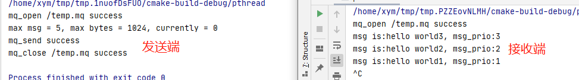

**注意**：POSIX消息队列的大小是有限制的。如下图，总共是819200字节，也就是800K。不仅仅是`attr.mq_maxmsg*attr.mq_msgsize`的大小，还包括消息队列的额外开销。

POSIX消息队列在实现上还有另外两个限制：

- MQ_OPEN_MAX：一个进程能同时打开的消息队列的最大数目，POSIX要求最多为8；
- MQ_PRIO_MAX：消息的最大优先级，POSIX要求最大为32；


##### 父子进程间的消息队列通信

```c
#include <iostream>
#include <cstring>
#include <errno.h>
 
#include <unistd.h>
#include <fcntl.h>
#include <mqueue.h>
 
using namespace std;
 
int main()
{
    mqd_t mqID;
    mqID = mq_open("/anonymQueue", O_RDWR | O_CREAT | O_EXCL, 0666, NULL);
 
    if (mqID < 0)
    {
        if (errno == EEXIST)
        {
            mq_unlink("/anonymQueue");
            mqID = mq_open("/anonymQueue", O_RDWR | O_CREAT, 0666, NULL);
        }
        else
        {
            cout<<"open message queue error..."<<strerror(errno)<<endl;
            return -1;
        }
    }
 
    if (fork() == 0)
    {
        mq_attr mqAttr;
        mq_getattr(mqID, &mqAttr);
 
        char *buf = new char[mqAttr.mq_msgsize];
 
        for (int i = 1; i <= 5; ++i)
        {
            if (mq_receive(mqID, buf, mqAttr.mq_msgsize, NULL) < 0)
            {
                cout<<"receive message  failed. ";
                cout<<"error info:"<<strerror(errno)<<endl;
                continue;
            }
 
            cout<<"receive message "<<i<<": "<<buf<<endl;   
        }
        exit(0);
    }
 
    char msg[] = "yuki";
    for (int i = 1; i <= 5; ++i)
    {
        if (mq_send(mqID, msg, sizeof(msg), i) < 0)
        {
            cout<<"send message "<<i<<" failed. ";
            cout<<"error info:"<<strerror(errno)<<endl;
        }
        cout<<"send message "<<i<<" success. "<<endl;   
 
        sleep(1);
    }
}                     
```

##### 同一进程下的不同线程间的消息队列的通信

```

```


## 共享内存

### SystemV 共享内存

共享内存（Shared Memory），指两个或多个进程共享一个给定的存储区。

#### 特点

1. 共享内存是最快的一种 IPC，因为进程是直接对内存进行存取。
2. 因为多个进程可以同时操作，所以需要进行同步。
3. 信号量+共享内存通常结合在一起使用，信号量用来同步对共享内存的访问。

#### 原型

```c
#include <sys/shm.h>
// 创建或获取一个共享内存：成功返回共享内存ID，失败返回-1
int shmget(key_t key, size_t size, int flag);
// 连接共享内存到当前进程的地址空间：成功返回指向共享内存的指针，失败返回-1
void *shmat(int shm_id, const void *addr, int flag);
// 断开与共享内存的连接：成功返回0，失败返回-1
int shmdt(void *addr);
// 控制共享内存的相关信息：成功返回0，失败返回-1
int shmctl(int shm_id, int cmd, struct shmid_ds *buf);
```

当用`shmget`函数创建一段共享内存时，必须指定其 size；而如果引用一个已存在的共享内存，则将 size 指定为0 。

当一段共享内存被创建以后，它并不能被任何进程访问。必须使用`shmat`函数连接该共享内存到当前进程的地址空间，连接成功后把共享内存区对象映射到调用进程的地址空间，随后可像本地空间一样访问。

`shmdt`函数是用来断开`shmat`建立的连接的。注意，这并不是从系统中删除该共享内存，只是当前进程不能再访问该共享内存而已。

`shmctl`函数可以对共享内存执行多种操作，根据参数 cmd 执行相应的操作。常用的是`IPC_RMID`（从系统中删除该共享内存）。

#### 示例

下面这个例子，使用了【共享内存+信号量+消息队列】的组合来实现服务器进程与客户进程间的通信。

- 共享内存用来传递数据；
- 信号量用来同步；
- 消息队列用来 在客户端修改了共享内存后 通知服务器读取。

`server.c`

```c
#include<stdio.h>
#include<stdlib.h>
#include<sys/shm.h>  // shared memory
#include<sys/sem.h>  // semaphore
#include<sys/msg.h>  // message queue
#include<string.h>   // memcpy

// 消息队列结构
struct msg_form {
    long mtype;
    char mtext;
};

// 联合体，用于semctl初始化
union semun
{
    int              val; /*for SETVAL*/
    struct semid_ds *buf;
    unsigned short  *array;
};

// 初始化信号量
int init_sem(int sem_id, int value)
{
    union semun tmp;
    tmp.val = value;
    if(semctl(sem_id, 0, SETVAL, tmp) == -1)
    {
        perror("Init Semaphore Error");
        return -1;
    }
    return 0;
}

// P操作:
//  若信号量值为1，获取资源并将信号量值-1
//  若信号量值为0，进程挂起等待
int sem_p(int sem_id)
{
    struct sembuf sbuf;
    sbuf.sem_num = 0; /*序号*/
    sbuf.sem_op = -1; /*P操作*/
    sbuf.sem_flg = SEM_UNDO;

    if(semop(sem_id, &sbuf, 1) == -1)
    {
        perror("P operation Error");
        return -1;
    }
    return 0;
}

// V操作：
//  释放资源并将信号量值+1
//  如果有进程正在挂起等待，则唤醒它们
int sem_v(int sem_id)
{
    struct sembuf sbuf;
    sbuf.sem_num = 0; /*序号*/
    sbuf.sem_op = 1;  /*V操作*/
    sbuf.sem_flg = SEM_UNDO;

    if(semop(sem_id, &sbuf, 1) == -1)
    {
        perror("V operation Error");
        return -1;
    }
    return 0;
}

// 删除信号量集
int del_sem(int sem_id)
{
    union semun tmp;
    if(semctl(sem_id, 0, IPC_RMID, tmp) == -1)
    {
        perror("Delete Semaphore Error");
        return -1;
    }
    return 0;
}

// 创建一个信号量集
int creat_sem(key_t key)
{
    int sem_id;
    if((sem_id = semget(key, 1, IPC_CREAT|0666)) == -1)
    {
        perror("semget error");
        exit(-1);
    }
    init_sem(sem_id, 1);  /*初值设为1资源未占用*/
    return sem_id;
}


int main()
{
    key_t key;
    int shmid, semid, msqid;
    char *shm;
    char data[] = "this is server";
    struct shmid_ds buf1;  /*用于删除共享内存*/
    struct msqid_ds buf2;  /*用于删除消息队列*/
    struct msg_form msg;  /*消息队列用于通知对方更新了共享内存*/

    // 获取key值
    if((key = ftok(".", 'z')) < 0)
    {
        perror("ftok error");
        exit(1);
    }

    // 创建共享内存
    if((shmid = shmget(key, 1024, IPC_CREAT|0666)) == -1)
    {
        perror("Create Shared Memory Error");
        exit(1);
    }

    // 连接共享内存
    shm = (char*)shmat(shmid, 0, 0);
    if((int)shm == -1)
    {
        perror("Attach Shared Memory Error");
        exit(1);
    }


    // 创建消息队列
    if ((msqid = msgget(key, IPC_CREAT|0777)) == -1)
    {
        perror("msgget error");
        exit(1);
    }

    // 创建信号量
    semid = creat_sem(key);

    // 读数据
    while(1)
    {
        msgrcv(msqid, &msg, 1, 888, 0); /*读取类型为888的消息*/
        if(msg.mtext == 'q')  /*quit - 跳出循环*/
            break;
        if(msg.mtext == 'r')  /*read - 读共享内存*/
        {
            sem_p(semid);
            printf("%s\n",shm);
            sem_v(semid);
        }
    }

    // 断开连接
    shmdt(shm);

    /*删除共享内存、消息队列、信号量*/
    shmctl(shmid, IPC_RMID, &buf1);
    msgctl(msqid, IPC_RMID, &buf2);
    del_sem(semid);
    return 0;
}
```

`client.c`

```c
#include<stdio.h>
#include<stdlib.h>
#include<sys/shm.h>  // shared memory
#include<sys/sem.h>  // semaphore
#include<sys/msg.h>  // message queue
#include<string.h>   // memcpy

// 消息队列结构
struct msg_form {
    long mtype;
    char mtext;
};

// 联合体，用于semctl初始化
union semun
{
    int              val; /*for SETVAL*/
    struct semid_ds *buf;
    unsigned short  *array;
};

// P操作:
//  若信号量值为1，获取资源并将信号量值-1
//  若信号量值为0，进程挂起等待
int sem_p(int sem_id)
{
    struct sembuf sbuf;
    sbuf.sem_num = 0; /*序号*/
    sbuf.sem_op = -1; /*P操作*/
    sbuf.sem_flg = SEM_UNDO;

    if(semop(sem_id, &sbuf, 1) == -1)
    {
        perror("P operation Error");
        return -1;
    }
    return 0;
}

// V操作：
//  释放资源并将信号量值+1
//  如果有进程正在挂起等待，则唤醒它们
int sem_v(int sem_id)
{
    struct sembuf sbuf;
    sbuf.sem_num = 0; /*序号*/
    sbuf.sem_op = 1;  /*V操作*/
    sbuf.sem_flg = SEM_UNDO;

    if(semop(sem_id, &sbuf, 1) == -1)
    {
        perror("V operation Error");
        return -1;
    }
    return 0;
}


int main()
{
    key_t key;
    int shmid, semid, msqid;
    char *shm;
    struct msg_form msg;
    int flag = 1; /*while循环条件*/

    // 获取key值
    if((key = ftok(".", 'z')) < 0)
    {
        perror("ftok error");
        exit(1);
    }

    // 获取共享内存
    if((shmid = shmget(key, 1024, 0)) == -1)
    {
        perror("shmget error");
        exit(1);
    }

    // 连接共享内存
    shm = (char*)shmat(shmid, 0, 0);
    if((int)shm == -1)
    {
        perror("Attach Shared Memory Error");
        exit(1);
    }

    // 创建消息队列
    if ((msqid = msgget(key, 0)) == -1)
    {
        perror("msgget error");
        exit(1);
    }

    // 获取信号量
    if((semid = semget(key, 0, 0)) == -1)
    {
        perror("semget error");
        exit(1);
    }

    // 写数据
    printf("***************************************\n");
    printf("*                 IPC                 *\n");
    printf("*    Input r to send data to server.  *\n");
    printf("*    Input q to quit.                 *\n");
    printf("***************************************\n");

    while(flag)
    {
        char c;
        printf("Please input command: ");
        scanf("%c", &c);
        switch(c)
        {
            case 'r':
                printf("Data to send: ");
                sem_p(semid);  /*访问资源*/
                scanf("%s", shm);
                sem_v(semid);  /*释放资源*/
                /*清空标准输入缓冲区*/
                while((c=getchar())!='\n' && c!=EOF);
                msg.mtype = 888;
                msg.mtext = 'r';  /*发送消息通知服务器读数据*/
                msgsnd(msqid, &msg, sizeof(msg.mtext), 0);
                break;
            case 'q':
                msg.mtype = 888;
                msg.mtext = 'q';
                msgsnd(msqid, &msg, sizeof(msg.mtext), 0);
                flag = 0;
                break;
            default:
                printf("Wrong input!\n");
                /*清空标准输入缓冲区*/
                while((c=getchar())!='\n' && c!=EOF);
        }
    }

    // 断开连接
    shmdt(shm);

    return 0;
}
```

注意：当`scanf()`输入字符或字符串时，缓冲区中遗留下了`\n`，所以每次输入操作后都需要清空标准输入的缓冲区。但是由于 gcc 编译器不支持`fflush(stdin)`（它只是标准C的扩展），所以我们使用了替代方案：

```c
 while((c=getchar())!='\n' && c!=EOF);
```

### POSIX IPC共享内存


## 套接字

待写

## 通讯方式总结

1. 管道：速度慢，容量有限，只有父子进程能通讯 ；
2. FIFO：任何进程间都能通讯，但速度慢；
3. 消息队列：容量受到系统限制，且要注意第一次读的时候，要考虑上一次没有读完数据的问题； 
4. 信号量：不能传递复杂消息，只能用来同步；
5. 共享内存区：能够很容易控制容量，速度快，但要保持同步，比如一个进程在写的时候，另一个进程要注意读写的问题，相当于线程中的线程安全，当然，共享内存区同样可以用作线程间通讯，不过没这个必要，线程间本来就已经共享了同一进程内的一块内存。

 