# Win下CLion交叉编译嵌入式linux应用程序

## CLion安装破解汉化

### 下载安装CLion

下载地址：[Download CLion](https://www.jetbrains.com/clion/download/#section=windows)

一路默认安装即可。

### 破解

[破解补丁下载路径](https://macwk.com/article/jetbrains-crack)

1. 拖拽破解文件到CLion的欢迎界面，会提示重新启动，点击重启后，会出现激活窗口。

   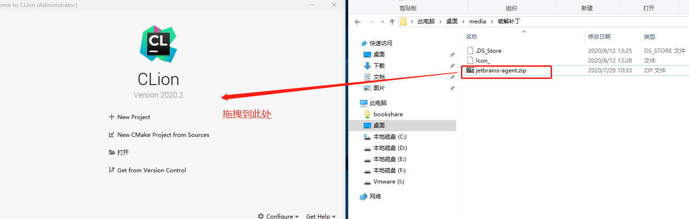

2. 在激活窗口输入下面的激活码，然后会提示重启，自己手动重启即可。

   ```
   Qr7EpuKzNtnTuEmGcLg/YnYyVEcnvR4iflCYTHc6dwuB8Jbx7e6E43CPRA+KjL2O/D/C+hj/rDFrwCNgGAvLcJd3bcaJ8UTMh8FPxd2EfjDt0eopoRIRQKtw8Ua3hlm2i+GvhYnaJ5/F1XN7H/8uEtYqFQlJc9auMxAL3gdnsmY
   
   ```

   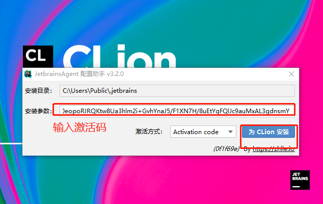

3. 启动后新建工程，在帮助窗口点击Register，可弹出激活状态。

   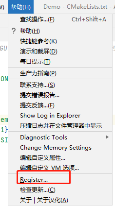

   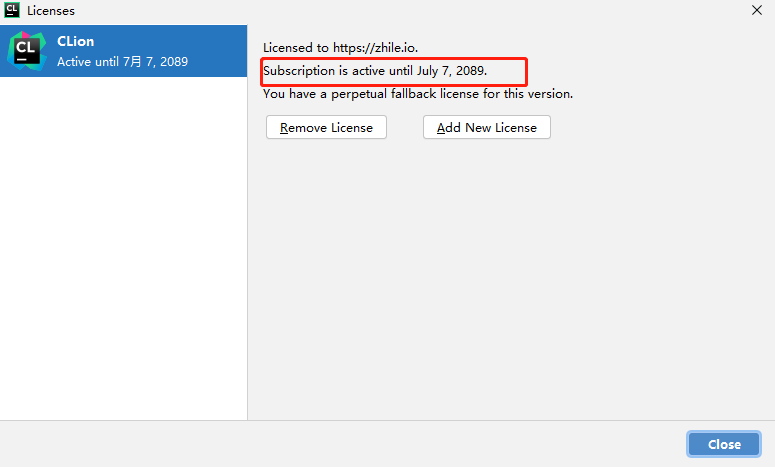

## 配置

1. 打开【文件-设置-构建，执行，部署】选项卡

   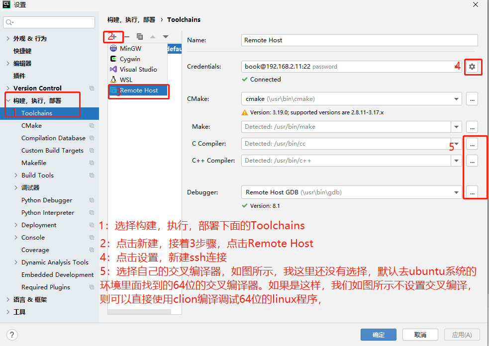

   **ssh设置如下：**

   

2. 下图是设置过交叉编译环境的截图

   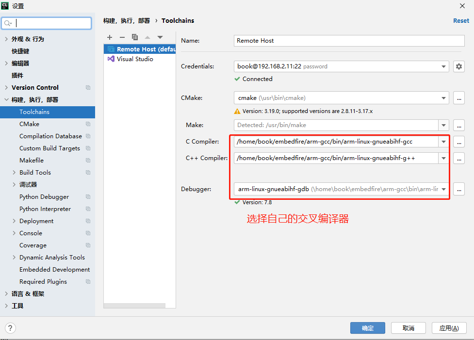

   有同学会疑问，不是可以在顶层的CMakeLists.txt里面指定交叉编译器吗，设置如下。

   ```bash
   ################## 交叉编译环境设置相关 ################
   
   SET(CMAKE_SYSTEM_NAME Linux)
   SET(CMAKE_SYSTEM_PROCESSOR arm)
   SET(TOOLCHAIN_PATH     /home/book/embedfire/arm-gcc)
   SET(CMAKE_C_COMPILER   ${TOOLCHAIN_PATH}/bin/arm-linux-gnueabihf-gcc) #设置C编译器
   SET(CMAKE_CXX_COMPILER ${TOOLCHAIN_PATH}/bin/arm-linux-gnueabihf-g++) #设置c++编译器
   
   SET(CMAKE_FIND_ROOT_PATH  /home/book/embedfire/arm-gcc)
   
   SET(CMAKE_FIND_ROOT_PATH_MODE_PROGRAM NEVER)
   
   ##下面的三个选项表示只在交叉环境中查找库和头文件
   SET(CMAKE_FIND_ROOT_PATH_MODE_LIBRARY ONLY)
   SET(CMAKE_FIND_ROOT_PATH_MODE_INCLUDE ONLY)
   SET(CMAKE_FIND_ROOT_PATH_MODE_PACKAGE ONLY)
   #################### 交叉编译环境设置相关 ####################################
   
   ```

   这样设置肯定没有问题。在使用命令行编译的情况下，完全可以.

   ```
   cd cmake_demo
   mkdir build
   cd build
   cmake ..
   make
   
   ```

   但是既然使用CLion IDE了，我们可以省略在顶层的CMakeLists.txt里面设置的步骤，直接在CLion IDE指明即可。实际上当我们指明的时候，CLion帮我们做了这部分工作，可以打开下图看看，它在cmke阶段给加了两行参数，用来设置编译器的，和在顶层的CMakeLists.txt里面设置是一个效果。所以二种方式大家选择其一即可。

   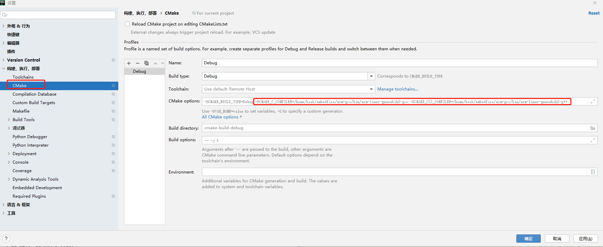

3. 设置工程映射

   我们在win下用CLion新建的工程默认是存放在win目录的，实际CLion用ssh连接ubuntu后，即使在win下我们点击CLion的编译按钮编译，实际这个过程是在ubuntu下完成编译的，所以CLion会在我们修改文件的时候，实时的把代码上传到ubuntu的的某一个位置，供在ubuntu下编译，那么这个位置在哪，是否可以修改呢？答案是肯定可以修改的，同样打开【文件-设置-构建，执行，部署】选项卡。

   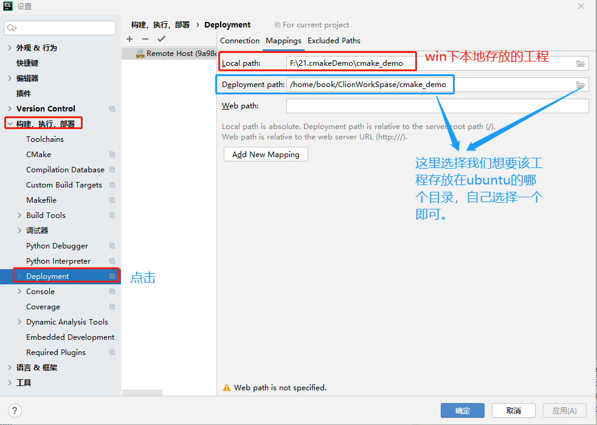

   按照上图设置完成后在ubuntu下我们会得到一份一模一样的工程。当我们在win下修改源代码的时候，CLion会实时的把修改传到Ubuntu下，如果出现不同步的情况(很少出现)，我们还可以手动上传到ubuntu，如下图

   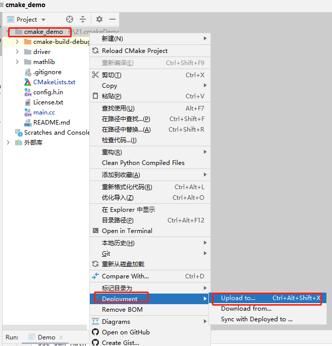

   

4. 设置系统头文件和系统库的路径。

   一般我们写嵌入式linux需要包含一些系统的头文件和使用系统的库，这些头文件一般在内核代码和交叉编译器里面，而交叉编译器里面的路径系统会自动帮我们搜索，所以，我们不需要指定路径，故而只需在顶层的CMakeLists.txt里面指定linux内核的头文件路径即可。修改顶层的CMakeLists.txt，添加蓝色和红色框的内容，自己根据自己的平台和路径添加即可，如下：

   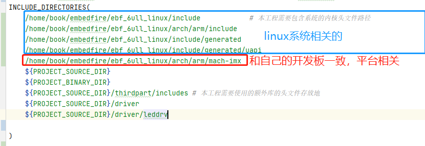

   这样我们在写代码的时候当需要包含系统头文件，如下代码的时候，CLion自己会去上图中的路径下找，并且我们可以ctrl+鼠标左键点击这些头文件进去查看。

   ```c
   #include <stdio.h>
   #include <pthread.h>
   
   ```

   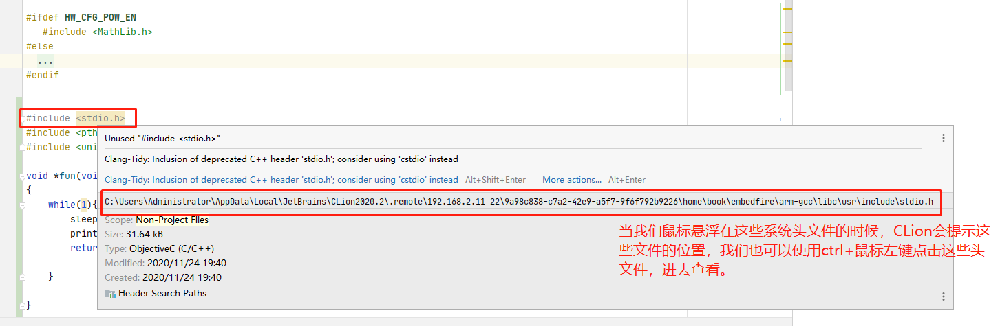

5. 打开ssh工具可以使用linux终端

   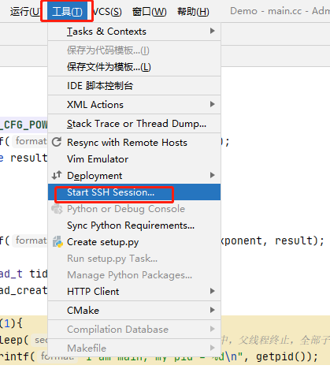

   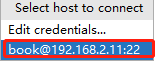

   接下来就可以在CLion使用linux终端了，再也不用再找第三方ssh工具了。

   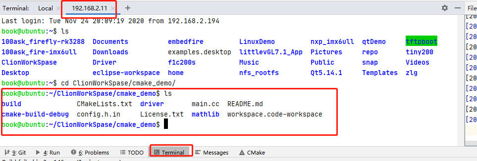

6. 修复系统头文件不对应的问题

   如果上面步骤都没有问题，恭喜你，成功搭建了Win下使用CLion开发嵌入式linux程序了。如果发现系统头文件提示找不到，那就要往下看继续

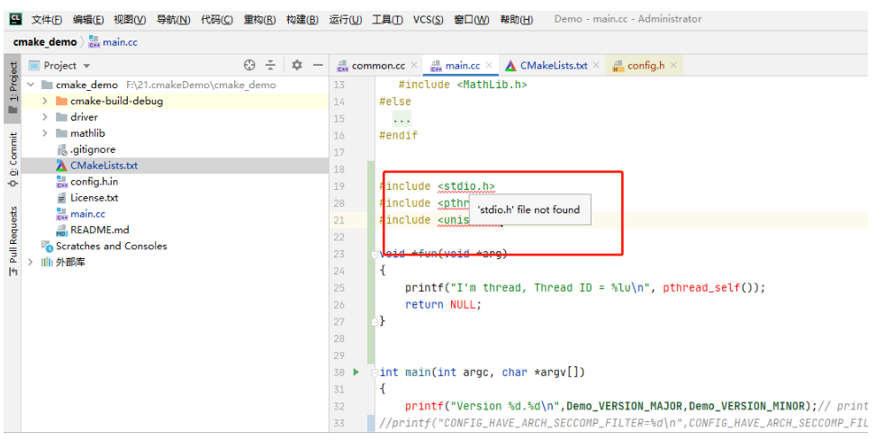

**解决方案**

根据自己的路径，找到下面的文件夹，把里面的东西全部删除，然后从新编译下工程即可。从这里我们也可以看出，这些系统头文件CLion的ssh也会根据我们顶层的CMakeLists.txt设置的包含路径从ubuntu下拷贝一份到win下。导致该问题出现的原因就是，二者没有同步好，我们只需删除掉win下的这些文件从新执行编译，同步下即可。

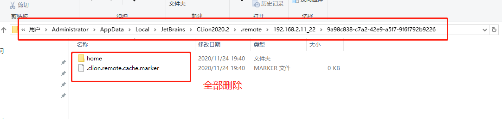