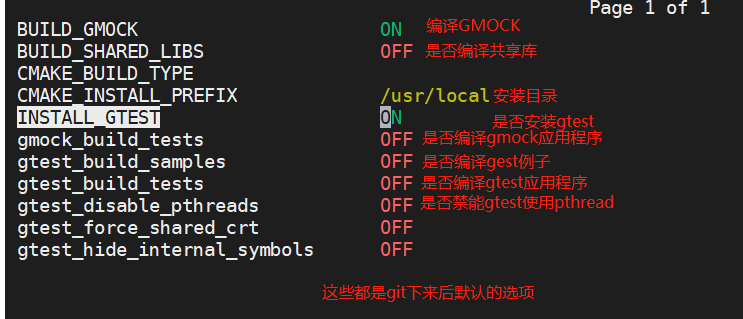
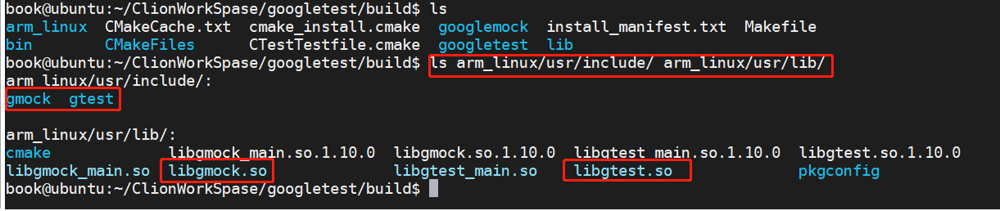

# gtest测试框架

## 下载资源

```bash
git clone https://github.com/RobotFly/googletest.git
```


## 编译选项介绍

```bash
cd googletest
mkdir build
cd build
cmake ..
ccmake ..    # 执行完后会显示下图的配置选项
```

默认编译选项，我们可以在这里直接修改，也可以在cmake阶段使用-D选项指定。



-D选项如下：

```bash
-DBUILD_GMOCK=ON
-DINSTALL_GTEST=ON
-Dgmock_build_tests=OFF
-Dgtest_build_samples=OFF
-Dgtest_build_tests=OFF
-DCMAKE_INSTALL_PREFIX=/user/local
-DBUILD_SHARED_LIBS=ON
#下面是交叉编译器相关的，在arm平台使用的时候需要指定
-DCMAKE_SYSTEM_NAME=Linux 
-DCMAKE_SYSTEM_PROCESSOR=arm
-DCMAKE_C_COMPILER=/home/book/embedfire/arm-gcc/bin/arm-linux-gnueabihf-gcc
-DCMAKE_CXX_COMPILER=/home/book/embedfire/arm-gcc/bin/arm-linux-gnueabihf-g++

```

## ubuntu下安装gtest

这里默认安装目录是`/usr/local`目录

```bash
cd build
cmake -DBUILD_SHARED_LIBS=ON -DCMAKE_INSTALL_PREFIX=/usr/local ..
make
sudo make install
```

安装完后可以看到在`/usr/local`下会有`gmock`和`gtest`的头文件和库文件。


## arm平台交叉编译gtest

这里默认安装目录自己指定，我这里`./arm_linux/usr`

```bash
cd build
cmake -DBUILD_SHARED_LIBS=ON -DCMAKE_SYSTEM_NAME=Linux -DCMAKE_SYSTEM_PROCESSOR=arm -DCMAKE_C_COMPILER=/home/book/embedfire/arm-gcc/bin/arm-linux-gnueabihf-gcc -DCMAKE_CXX_COMPILER=/home/book/embedfire/arm-gcc/bin/arm-linux-gnueabihf-g++  -DCMAKE_INSTALL_PREFIX=./arm_linux/usr ..
make
sudo make install
```

执行完命令后，可以看到在当前目录`/arm_linux/usr/`存放交叉编译后的库和头文件，我们在写程序的时候，需要把`.so`文件和头文件拷贝到我们的工程源码里面，供使用。在arm板子上需要把下面的lib目录下的所有`.so`拷贝到开发板子上的`/usr/lib`下，供应用程序运行时使用。



## 应用程序使用gtest库文件

和平常应用使用库是一样的，无需多讲。

## 应用程序直接嵌入gtest源代码

