# Quick 学习笔记

## qml 语言基础

### 对象

例如下面的代码就是一个qml内置的Button对象。内置对象还有很多：Rectangle、Lable等等。

```qml
Button {
	text: "button1"
	style:  btnStyle
}
```


### 表达式

例如下面的代码，边框颜色，可以根据`control.hovered`不同而不同。

```qml
Component {
	id: btnStyle
	ButtonStyle {
		background: Rectangle {
			border.color: (control.hovered || control.pressed) ? "red" : "green" // 表达式
		}
	}
}
```

### 属性

属性类似于C++的成员变量。

#### 属性类型

可以在QML中使用的属性有大致三种：

- 有QML语言本身提供的类型；
- 有QML模块（比如Qt Quick）提供的类型；
- 导出到QML环境中的C++类型。

先看QML提供的基本类型

##### 基本类型

QML支持 int、real、double、bool、string、color、list、font等。例如下面的代码，有`string`和`bool`类型的。并且QML提供这些类型检测，如果不正确，会自动报错。QML还导入了QT的很多类型：Qtobject、Component、Connections、Binding等。

```qml
Button {
     text: "button1"  // string
     style:  btnStyle  
     visible:true     // bool
 }
```

##### id属性

一个对象只有一个id，且首字母必须小写，不能包含字母数字下划线以外的字符。

```qml
Component {
	id: btnStyle // id 属性
}
```

##### 列表属性

列表属性是list类型的，length提供列表的数量，可以用下标访问列表项。

```qml
	 Item{
		children:[
			Text{text:"on"},
			Text{text:"off"},
			Text{text:"open"}
		]
		Component.onCompleted:{
			for(var i=0;i<children.length;++i){             // length 可以得到列表的长度
				console.log("text ",i,":",children[i].text) // 可以用数组下标去访问列表对象
			}
	}
```

##### 信号处理

例如下面的代码，当按钮点击的时候，会自动执行 `Qt.quit()`函数。

```qml
    Button {
         text: "button1"   
         style:  btnStyle     
		 onClicked:{    // 信号
		    Qt.quit()
		 }
     }
```

##### 分组属性

有些时候使用一个`"."`或者使用分组的形式形成一个逻辑组，如下代码所示。

```qml
    Text{
       font.pixelSize: 18;
       font.bold: true;
    }

    Text{
       font{
           pixelSize: 18;
           bold:true
       }

    }
```

##### 附加属性

QML中有个附加属性（attached properties）的概念，这是附加到对象上的一个额外属性。

```qml
Item{
    width:100
    height: 100
    focus: true
    Keys.enabled: true  // Keys就是Qt Quick提供给Item处理按键事件的附加属性。
}
```

## Quick入门

### 基本元素

#### Rectangle

用来绘制填充矩形，下面的代码运行效果

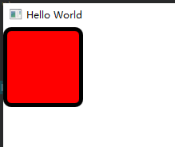

```qml
    Rectangle {
         width: 100
         height: 100
         color: "red"
         border.color: "black"
         border.width: 5
         radius: 10
     }
```

#### 颜色

颜色的指定方式如下：

```qml
color: "red"     // red blue green transparent
color: "#00AA00"   // 指定十六进制 #RRGGBB
color: "#8000AA00" // 带透明通道的 #AARRGGBB
color: Qt.rgba(0.8,0.6,0.4,1.0)
```

##### 渐变色

QML的渐变用Gradient，用GradientStop指定位置，范围是0.0-1.0 只能垂直方向渐变。

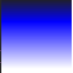

```qml
    Rectangle {
         width: 100
         height: 100
         gradient: Gradient{
            GradientStop{position: 0.0;  color: "#202020"}   
            GradientStop{position: 0.33; color: "blue"}
            GradientStop{position: 1.0;  color: "#ffffff"}

         }

     }
```

**注意**：如果想要水平方向渐变，需要使用**rotation** 达到效果。rotation是来自Rectangle的父类Item的属性。

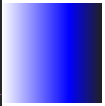

```qml

    Rectangle {
         width: 100
         height: 100
         rotation:90  // 更改方向
         gradient: Gradient{
            GradientStop{position: 0.0;  color: "#202020"}
            GradientStop{position: 0.33; color: "blue"}
            GradientStop{position: 1.0;  color: "#ffffff"}

         }

     }
```

##### Item

Item是Quick所有可视元素的基类，虽然Item自己什么也不绘制，但是它定义了绘制图元所需的大部分通用属性，比如x、y、width、height、锚点（anchoring）和按键处理。Item除了xy属性外，还有个z属性，用来指定图元在场景中的Z序，z属性的类型是real，数值越小，图元就越垫底，（离我们越远），数值越大，图元靠我们越近。Item的属性opacity可以指定一个图元的透明度，范围在0.0-1.0之间。

下面的代码显示了z和opacity属性


```qml
    Rectangle {
         width:  300
         height: 200
         Rectangle {
              x:20
              y:20
              width: 150
              height: 100
              color: "#000080"
              z:0.5

         }
         Rectangle {
              x:100
              y:70
              width: 100
              height: 100
              color: "#00c000"
              z:1.0
              opacity: 0.6

          }
     }
```

Item的clip属性（bool型），根据自己的位子和大小来裁剪子对象的显示范围，如果clip为true，那么子对象在父对象的中，多余的部分会被裁剪。如果为false，子对象可以在父对象的外面。

Item的属性比较多，除了前面提到的，还有scale、smooth、anchors、antialiasing、enabled、visible、
state、states、children、transitions等。虽然它本省不可见，但是可以用Item来分组其它的可视图元。

例如可以通过Item的`visibleChildren`或者`Children`属性访问孩子元素。

```qml
import QtQuick 2.12
import QtQuick.Window 2.12
import QtQuick.Controls 2.12
import QtQuick.Controls.Styles 1.4
import QtQuick.Controls 1.4

Window {
    visible: true
    width: 640
    height: 480
    title: qsTr("Hello World")
Item{

    id:gradientGroup

    Rectangle {
         x:100
         y:70
         width: 100
         height: 100
         color: "#00c000"
         z:1.0
         opacity: 0.6

     }
    Rectangle {
         x:20
         y:20
         width: 150
         height: 100
         color: "#000080"
         z:0.5

    }

    Component.onCompleted:{
            for(var i=0;i<gradientGroup.children.length;++i){          // 通过gradientGroup访问子对象
                console.log("children ",i,"x=",gradientGroup.children[i].x) // 可以用数组下标去访问列表对象
            }
    }

}
```

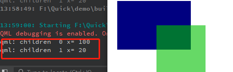

##### 锚点

每个视图都有7条不可见的锚线，left(左边界)、horizontalCenter(垂直中心线)、right(右边界)、top(上边界)、verticalCenter(水平中心线)、bottom（下边界）和baseLine(基准线)。基准线是定位文本的，如果没有文本，基准线和top线一致。

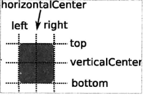

当然对象和父对象也有四个方向的间距。

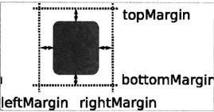

下面是使用的锚点进行布局


```qml
import QtQuick 2.12
import QtQuick.Window 2.12
import QtQuick.Controls 2.12
import QtQuick.Controls.Styles 1.4
import QtQuick.Controls 1.4

Window {
    visible: true
    width: 640
    height: 480
    title: qsTr("Hello World")

    Rectangle {
        id:rect1
        anchors.left: parent.left // 设置rect1 相对 父对象左边对齐
        anchors.leftMargin: 10    // 设置rect1 相对 父对象左边间隔10
        anchors.top: parent.top   // 设置rect1 相对 父对象上边对齐
        anchors.topMargin: 10     // 设置rect1 相对 父对象上边间隔10
        width: 100
        height: 100
        color: "#00c000"
        z:1.0
        opacity: 0.6

        Rectangle{
            id:rect11
            anchors.fill: parent  // 填充整个父对象，此时下面定义的宽度和高度已经无意义
            width: 10
            height: 10
            color: "red"
        }
        Rectangle{
            id:rect12
            anchors.centerIn:  parent  // 相对父对象为中心对齐
            width: 50
            height: 50
            color: "#00000c"
        }

     }
    Rectangle {
        id:rect2
         anchors.left: rect1.right // 设置rect2 相对 rect1右边对齐
         anchors.leftMargin: 20    // 设置rect2 相对 rect1右边对齐间隔是20
         anchors.top: rect1.top    // 设置rect2 相对 rect1上边对齐
         anchors.topMargin: 0      // 设置rect2 相对 rect1上边对齐间隔是0  实际就是和rect1一样高

         width: 150
         height: 100
         color: "#000080"
         z:0.5

  }
}
```

##### 响应按键

Item可以处理按键，所有从Item集成的元素都可以处理按键，比如Rectangle、Button等。

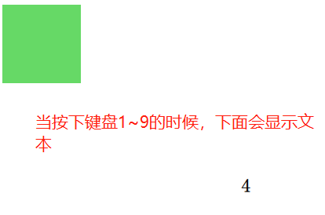

```qml
import QtQuick 2.2
import QtQuick.Window 2.12
import QtQuick.Controls 2.12
import QtQuick.Controls.Styles 1.4
import QtQuick.Controls 1.4

Window {
    visible: true
    width: 640
    height: 480
    title: qsTr("Hello World")

    Rectangle {
        id:rect1
        anchors.left: parent.left // 设置rect1 相对 父对象左边对齐
        anchors.leftMargin: 10    // 设置rect1 相对 父对象左边间隔10
        anchors.top: parent.top   // 设置rect1 相对 父对象上边对齐
        anchors.topMargin: 10     // 设置rect1 相对 父对象上边间隔10
        width: 100
        height: 100
        color: "#00c000"
        z:1.0
        opacity: 0.6

        focus: true                     // 切记一定要使能聚焦，否则不会响应按键的
        Keys.enabled: true
        Keys.onEscapePressed: Qt.quit()
        Keys.onBackPressed: Qt.quit()
        Keys.onPressed: {
            switch(event.key){
            case Qt.Key_0:
            case Qt.Key_1:
            case Qt.Key_2:
            case Qt.Key_3:
            case Qt.Key_4:
            case Qt.Key_5:
            case Qt.Key_6:
            case Qt.Key_7:
            case Qt.Key_8:
            case Qt.Key_9:
                event.accepted=true;
                keyView.text = event.key -Qt.Key_0;
                break;

            }
        }
     }
     Text{
        id:keyView
        font.bold: true
        font.pixelSize:24
        text:qsTr("text")
        anchors.centerIn: parent


     }
}
```

##### Text
文本或者富文本显示框：font、text、color、elide、textFormat、wrapMode、horizontalAlignment、verticalAlignment等属性。当不指定textFormat时候，默认为AutoText，即会自动检测是普通文本还是富文本。

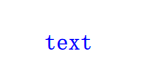

```qml
 Text{
	id:keyView
	font.bold: true
	font.pixelSize:24
	text:qsTr("text")
	anchors.centerIn: parent
	color:"blue"
 }

```


Text文字的style有几种风格：Text.Outline、Text.Raised、Text.Sunken，可以使用styleColor属性和style配合使用（如果style指定，styleColor也不会生效）。


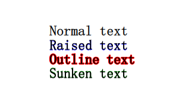

```qml
import QtQuick 2.2
import QtQuick.Window 2.12
import QtQuick.Controls 2.12
import QtQuick.Controls.Styles 1.4
import QtQuick.Controls 1.4

Window {
    visible: true
    width: 640
    height: 480
    title: qsTr("Hello World")

     Text{
        id:text1
        font.bold: true
        font.pixelSize:24
        text:qsTr("Normal text")
        anchors.centerIn: parent
     }

     Text{
         id:text2
        font.bold: true
        font.pixelSize:24
        text:qsTr("Raised text")
        anchors.top:  text1.bottom
        anchors.left:text1.left
        style:Text.Raised
        styleColor:"blue"
     }

     Text{
        id:text3
        font.bold: true
        font.pixelSize:24
        text:qsTr("Outline text")
        anchors.top:  text2.bottom
        anchors.left:text2.left
        style:Text.Outline
        styleColor:"red"
     }
     Text{
        id:text4
        font.bold: true
        font.pixelSize:24
        text:qsTr("Sunken text")
        anchors.top:  text3.bottom
        anchors.left:text3.left
        style:Text.Sunken
        styleColor:"green"
     }
}
```


##### Button

属性如下：
- text:指定名字
- checkable：如果可选：checked保存选中状态
- iconName：指定图标的名字，如果平台的图标主题中存在该名字对应的资源，则加载显示它，iconSource是通过URL指定icon的位置，iconname属性优先级高于iconSource
- isDefault 指定是否为默认按钮，如果为默认，用户按下Enter建就会触发按钮的clicked()信号。
- pressed 保存按钮按下状态
- menu 允许你给按钮设置个菜单，用户点击按钮时候弹出菜单，默认NULL
- action 允许设置按钮的action，可以是checked、text、tooltip、iconSource等属性。还可以绑定按钮的clicked信号默认为NULL
- activeFocusOnPress 按钮被按下时候是否获取焦点，默认是false
- style 一般和ButtonStyle结合使用，定制按钮个性化风格
- ButtonStyle 有三个属性：background、control、label
	- background 属性类型是Component 用来绘制按钮的背景
	- label 属性类型也是Component，用来设置按钮的文本
	- control可以访问按钮的各种状态。

```qml
import QtQuick 2.2
import QtQuick.Window 2.12
import QtQuick.Controls 2.12
import QtQuick.Controls.Styles 1.4
import QtQuick.Controls 1.4

Window {
    visible: true
    width: 640
    height: 480
    title: qsTr("Hello World")
    Button{
        width: 80
        height: 80
        anchors.centerIn: parent
        style: ButtonStyle{
            background: Rectangle{
                implicitHeight: 80
                implicitWidth: 80
                color: (control.hovered||control.pressed)?"green":"#888888"; // 悬浮或者按下的时候是green，否则就是#888888颜色
            }
        }
    }
}
```

当有多个按钮的时候可以使用组件来管理

```qml
import QtQuick 2.2
import QtQuick.Window 2.12
import QtQuick.Controls 2.12
import QtQuick.Controls.Styles 1.4
import QtQuick.Controls 1.4

Window {
    visible: true
    width: 640
    height: 480
    title: qsTr("Hello World")

    Component{
        id:styleBtn
        ButtonStyle{
           background: Rectangle{
               implicitHeight: 80
               implicitWidth: 80
               color: (control.hovered||control.pressed)?"green":"#888888"; // 悬浮或者按下的时候是green，否则就是#888888颜色

           }
        }
    }

    Button{
        id:btn1
        width: 80
        height: 80
        anchors.centerIn: parent
        style:styleBtn   // 当有过个按钮的时候可以通过 组件Component实现统一代码
    }


    Button{
        id:btn2
        width: 80
        height: 80
        anchors.left: btn1.right
        anchors.leftMargin:50
        anchors.top: btn1.top
        style:styleBtn
    }
}
```

##### Image

Image可以加载qt支持的所有图片包括网络图片，如果是gif默认加载第一帧图片，要显示动画请用AnimatedSprite和AnimatedImage。
加载方式默认是阻塞的，所以如果图片资源比较大或者从网络加载可能会发生，可以开启异步加载`asynchronous`属性为`true`开启异步加载模式，在这种模式下，会启动一个线程来加载图片，我们可以使用Image的`status`属性判断是否异步加载完成，加载进度为Image的progress属性(范围0.0~1.0)。
加载状态status(枚举类型)可以是`Image.Ready Image.Loading Image.Error`
Image可以使用width和height设置图片的尺寸，填充模式fillMode Image.Stretch(拉伸)、Image.PreserveAspectfit(等比缩放)、Image.PreserveAspectCrop(等比缩放 最大填充，必要时裁剪图片)、image.TileVertically(垂直平铺) 、Image.TileHorizontally(水平平铺)，Image.Pad(保持图片原样不做变换)等模式

下面是一个具有等待图元的加载网络图片的例子

```qml
import QtQuick 2.2
import QtQuick.Window 2.12
import QtQuick.Controls 2.12
import QtQuick.Controls.Styles 1.4
import QtQuick.Controls 1.4

Window {
    visible: true
    width: 640
    height: 480
    title: qsTr("")

    BusyIndicator{ // 等待图元，进行一些耗时的操作时候可以显示动画 只有running和style两种属性
        id:busy
        running:false
        anchors.centerIn: parent
        z:2
    }
    Text{
         id:stateLable
         visible: false               // 默认不可见
         anchors.centerIn: parent
         z:3
    }
    Image {
        id: imageView
        asynchronous: true // 开启同步加载模式
        cache: false
        anchors.fill: parent
        fillMode: Image.PreserveAspectFit
        onStateChanged: {
            if(imageView.status==Image.Loading){     // 加载中，设置旋转小图标在运行，设置stateLable不可见
              busy.running=true
              stateLable.visible = false
            }else if(imageView.status==Image.Ready){ // 加载完成，设置旋转小图标在停止
                   busy.running=false
            }else if(imageView.status==Image.Error){ // 加载出错，设置旋转小图标在停止 设置stateLable可见，显示ERROR错误文本
                busy.running=false
                stateLable.visible = true
                stateLable.text = "ERROR"
            }


        }
    }

    Component.onCompleted: {
        imageView.source="http://g.hiphotos.bdimg.com/album/s%3D1100%3Bq%3D90/sign=1681e6319e3df8dca23d8b90fd2149fa/d6ca7bcb0a46f21fd847b695f7246b600d33ae81.jpg?v=tbs"

    }

}
```

##### FileDialog

FileDialog是QtQuick中的文件对话框，它可以选择已有的文件，文件夹(可以多选)也可以在保存文件的时候让用户提供名字来创建文件或文件夹。

FileDialog的实现是和平台相关的，如果没有可用的原生文件对话框，则会尝试创建一个QFileDialog，如果失败，怎使用默认的QML对话框。要想在QtQuick中使用FileDialog，首先我们得导入包

```
import QtQuick.Dialogs 1.21
```

`filedialog`常用的属性：

- title：对话框标题
- folder：用户选择的文件目录
- selectExisting：选择已有文件或文件夹，默认值为true。当设置为false时候意味着创建文件或者文件夹
- selectFolder：表示选择文件，默认值为false。当为true的时候表示选择文件夹
- selectMultiple:默认值false，表示单选。为true时表示多选。设置该属性selectExisting的值必须为true
- nameFilters：文件过滤列表
- fileUrl：用户选择的文件路径，如果选择多个文件该属性为空
- fileUrls：选择文件路径列表
- visible：默认false，如果要显示对话框需要把手动指定该属性为true或者调用open方法。

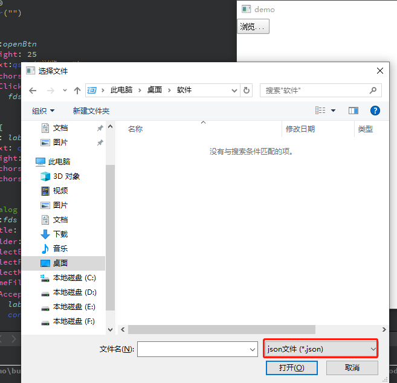

```qml
import QtQuick 2.2
import QtQuick.Window 2.12
import QtQuick.Controls 2.12
import QtQuick.Controls.Styles 1.4
import QtQuick.Controls 1.4
import QtQuick.Dialogs 1.2

Window {
    visible: true
    width: 640
    height: 480
    title: qsTr("")

    Button {
            id:openBtn
            height: 25
            text:qsTr("浏览...")
            anchors.leftMargin: 10
            onClicked: {
                fds.open();   // 当按钮点击的时候触发文件对话框，让用户选择一个文件
            }
        }
        Label {
            id: labels
            text: qsTr("")
            height: 25
            anchors.left:openBtn.right
            anchors.leftMargin: 10
        }

        FileDialog {
            id:fds
            title: "选择文件"
            folder: shortcuts.desktop   // 默认用户桌面
            selectExisting: true        // 使能只能打开已经存在的
            selectFolder: false         // 表示选择文件
            selectMultiple: false       // 表示单选
            nameFilters: ["json文件 (*.json)"] // 文件过滤
            onAccepted: {
                labels.text = fds.fileUrl;
                console.log("You chose: " + fds.fileUrl);
            }

            onRejected: {
                labels.text = "";
                console.log("Canceled");
                Qt.quit();
            }

        }

}
```

## 组件与动态对象

**Component**是Qt框架或者开发者封装好的、只暴露必要接口的QML类型，可以重复使用。要在QML中嵌入Component的定义，需要使用Component对象。

- Component只能包含一个顶层的Item，而且在这个Item之外不能定义任何的数据，除了Id；
- Component通常用来给一个View提供图形化组件；
- Component不是Item的派生类，而是从QQmlComponent继承而来的，虽然它通过自己的顶层Item为其他的View提供可视化组件，但它本身不是可见元素。

Loader用来动态加载QML组件。属性介绍如下

- **source**属性，加载一个QML文档。
- **sourceComponent**属性，加载一个Component对象。
- 当**source**或**sourceComponent**属性发生变化时，它之前的对象会被销毁，新对象会被加载。
- 当**source**设置为空串，或者**sourceComponent**设置为**undefined**，将会销毁当前对象，相关资源也会被释放，**Loader**对象会变成一个空对象。
- **item**属性指向他加载的组件的顶层Item,比如下面的示例**item**就为**Rectangle**。

### 使用Component在QML中嵌入组件 

当点击删除按钮的时候，会把自己删除掉

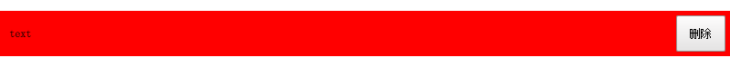

```qml
import QtQuick 2.0
import QtQuick.Window 2.0
import QtQuick.Controls 1.4

Window {
    width: 800
    height: 600
    visible: true

    Rectangle {
        id: mainRect
        anchors.fill: parent

        // 加载器
        Loader {
            id: loader1
            sourceComponent: itemCompont
            anchors.top: parent.top
            anchors.topMargin: 10
            width: mainRect.width
            height: 50

            function onDisDeleteThis() {
                loader1.sourceComponent = undefined
            }
            onLoaded: {
                item.color = 'red'
                loader1.item.deleteThis.connect(loader1.onDisDeleteThis)
            }
        }
	// 下面的例子就是直接在qml文件中嵌入组件
        Component {
            id: itemCompont
            Rectangle {
                id: compontRect
                color: 'blue'
                implicitWidth: 200
                implicitHeight: 50

                signal deleteThis()

                Text {
                    id: interText
                    anchors.left: parent.left
                    anchors.leftMargin: 10
                    anchors.verticalCenter: parent.verticalCenter
                    text: qsTr("text")
                }
                Button {
                    anchors.margins: 5
                    anchors.top: parent.top
                    anchors.bottom: parent.bottom
                    anchors.right: parent.right
                    text: '删除'

                    onClicked: {
                        compontRect.deleteThis()
                    }
                }
            }
        }
    }
}

```

### 在文件中定义组件

很多时候我们把QML文件定义在一个文件中，方便被其他的QML文件调用。可以直接使用文件名作为组件的名称，在其他的QML文件中使用。上面组件中的代码可以单独定义在一个文件中，本示例的文件名为**TestCompont.qml**

运行效果如图，当按下按钮的时候会自动删除自己

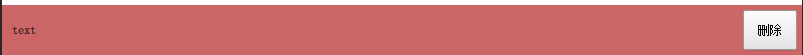

在工程新增`qrc:/TestCompont.qml`文件，内容如下

```
import QtQuick 2.0
import QtQuick.Window 2.0
import QtQuick.Controls 1.4

Rectangle {
    id: compontRect
    color: Qt.rgba(0.8, 0.4, 0.4, 1.0)
    implicitWidth: 200
    implicitHeight: 50
    property var currentObject: ''

    signal deleteThis(var obj)

    // 设置文字的内容
    function setCurrentText(textName) {
        interText.text = textName
    }

    Text {
        id: interText
        anchors.left: parent.left
        anchors.leftMargin: 10
        anchors.verticalCenter: parent.verticalCenter
        text: qsTr("text")
    }
    Button {
        anchors.margins: 5
        anchors.top: parent.top
        anchors.bottom: parent.bottom
        anchors.right: parent.right
        text: '删除'

        onClicked: {
            compontRect.deleteThis(compontRect)
        }
    }

    Component.onCompleted: {
        compontRect.currentObject = parent
    }
}

```

`qrc:/main.qml`内容如下：

```qml
import QtQuick 2.0
import QtQuick.Window 2.0
import QtQuick.Controls 1.4

Window {
    width: 800
    height: 600
    visible: true

    Rectangle {
        id: mainRect
        anchors.fill: parent

        Loader {
            id: loader2
            source: 'qrc:/TestCompont.qml'
            anchors.top: loader1.bottom
            anchors.topMargin: 10
            width: mainRect.width
            height: 50

            function onDisDeleteThis() {
                loader2.source = ''
            }

            onLoaded: {
                loader2.item.deleteThis.connect(loader2.onDisDeleteThis)
            }
        }

    }
}

```

### 使用js动态创建和删除组件

QML支持使用JavaScript动态创建/销毁对象,有两种方式动态创建对象：

- 使用**Qt.createComponent()**动态创建一个组件对象，然后使用**Component**的**createObject()**方法创建对象。
- 使用**Qt.createQmlObject()**从一个QML字符串直接创建一个对象。

如果QML文件中嵌入Component，可以直接使用这个组件的**createObject()**方法创建组件;使用Component的**destroy()**方法删除已经创建的组件。**destroy()**方法可以指定一个延时，不过不指定，他会在适当的时候删除。
下面是一个简单的示例：

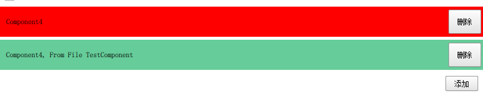

```qml
import QtQuick 2.0
import QtQuick.Window 2.0
import QtQuick.Controls 1.4

Window {
    width: 800
    height: 600
    visible: true

    Rectangle {
        id: mainRect
        anchors.fill: parent
        property var mainRectComponent: null

        Column {
            id: mainColumn
            spacing: 5

            width: parent.width
            property var count: 0

            function deleteItems(object) {
                object.destroy()
            }

            function createItem() {
                var color = 'red'
                if (mainColumn.count % 3 === 1)
                    color = 'yellow'
                else if (mainColumn.count % 3 === 2)
                    color = 'blue'
                mainColumn.count++

                // 创建一个组件
                var obj = itemCompont.createObject(mainColumn, {"color": color, "width": mainRect.width})
                //obj.setCurentObject(obj)
                obj.setCurrentText('Component' + mainColumn.count.toString())
                obj.deleteThis.connect(mainColumn.deleteItems)

                // 创建文件中的组件
                var obj2 = mainRect.mainRectComponent.createObject(mainColumn,
                                                        {'color': Qt.rgba(0.4, 0.8, 0.6, 1.0)
                                                        ,'width': mainRect.width})
                obj2.setCurrentText('Component' + mainColumn.count.toString() + ', From File TestComponent')
                obj2.deleteThis.connect(mainColumn.deleteItems)
            }
        }

        Button {
            anchors.top: mainColumn.bottom
            anchors.topMargin: 10
            anchors.right: mainRect.right
            anchors.rightMargin: 10
            text: '添加'

            onClicked: {
                mainColumn.createItem()
            }
        }

        Component.onCompleted: {
            if (mainRectComponent == null)
                mainRectComponent = mainRectComponent = Qt.createComponent('qrc:/TestCompont.qml')
        }

        Component {
            id: itemCompont
            Rectangle {
                id: compontRect
                color: 'blue'
                implicitWidth: 200
                implicitHeight: 50
                property var currentObject: ''

                signal deleteThis(var obj)

                // 设置文字的内容
                function setCurrentText(textName) {
                    interText.text = textName
                }

                Text {
                    id: interText
                    anchors.left: parent.left
                    anchors.leftMargin: 10
                    anchors.verticalCenter: parent.verticalCenter
                    text: qsTr("text")
                }
                Button {
                    anchors.margins: 5
                    anchors.top: parent.top
                    anchors.bottom: parent.bottom
                    anchors.right: parent.right
                    text: '删除'

                    onClicked: {
                        compontRect.deleteThis(compontRect)
                    }
                }

                Component.onCompleted: {
                    compontRect.currentObject = parent
                }
            }
        }
    }
}

```

## QML和C++混合编程

### QML中使用C++类和对象

我们知道， QML 其实是对 JavaScript 的扩展，融合了Qt Object系统，它是一种新的解释型的语言，QML 引擎虽然由 Qt C++ 实现，但 QML 对象的运行环境，说到底和 C++ 对象的上下文环境是不同的，是平行的两个世界。如果你想在 QML中访问 C++ 对象，那么必然要找到一种途径来在两个运行环境之间建立沟通桥梁。

Qt 提供了两种在 QML 环境中使用 C++ 对象的方式：

- 在 C++ 中实现一个类，注册到 QML 环境中，QML 环境中使用该类型创建对象；
- 在 C++ 中构造一个对象，将这个对象设置为 QML 的上下文属性，在 QML 环境中直接使用改属性

不管哪种方式，对要导出的C++类都有要求，不是一个类的所有方法、变量都可以被 QML 使用。要想将一个类或对象导出到 QML 中，和使用信号与槽的前提条件一样，下列前提条件必须满足：

- 从 QObject 或 QObject 的派生类继承；
- 使用 Q_OBJECT 宏。

##### 信号和槽
只要是信号或者槽，都可以在 QML 中访问，你可以把 C++ 对象的信号连接到 QML 中定义的方法上，也可以把 QML 对象的信号连接到 C++ 对象的槽上，还可以直接调用 C++ 对象的槽或信号……所以，这是最简单好用的一种途径。

#####   成员函数
在定义一个类的成员函数时使用 Q_INVOKABLE 宏来修饰，就可以让该方法被元对象系统调用。这个宏必须放在返回类型前面。在 QML 中就可以用 ${Object}.${method} 来访问该成员函数

##### 枚举Q_ENUMS

使用 Q_ENUMS 宏将C++类中的枚举注册到元对象系统中，就可以在qml中用${CLASS_NAME}.${ENUM_VALUE} 的形式来访问。

##### 成员变量

`Q_PROPERTY` 宏用来定义可通过元对象系统访问的属性，通过它定义的属性，可以在 QML 中访问、修改，也可以在属性变化时发射特定的信号。要想使用 Q_PROPERTY 宏，你的类必须是 QObject 的后裔，必须在类首使用 Q_OBJECT 宏。

下面是 Q_PROPERTY 宏的原型：

~~~qml
Q_PROPERTY(type name
           (READ getFunction [WRITE setFunction] |MEMBER memberName [(READ getFunction | WRITE setFunction)])
           [RESET resetFunction]
           [NOTIFY notifySignal]
           [REVISION int]
           [DESIGNABLE bool]
           [SCRIPTABLE bool]
           [STORED bool]
           [USER bool]
           [CONSTANT]
           [FINAL])
~~~

可以为一个属性命名，设定的选项数超过10个，实际上我们在实际使用中，很少能够用全 Q_PROPERTY 的所有选项，

```qml
Q_PROPERTY(int x READ getX)  // 定义一个类型为int，名字为x的属性, 通过getX()的成员函数来访问
```

下面详细介绍下Q_PROPERTY里面的参数含义

- `type name` ： type 是属性的类型，可以是 `int / float / QString / QObject / QColor / QFont` 等等， name 就是属性的名字。

- `READ`   ：如果你没有为属性指定 MEMBER 标记，则 READ 标记必不可少；声明一个读取属性的函数，该函数一般没有参数，返回定义的属性。
- `WRITE`  ：可选。声明一个设定属性的函数。它指定的函数，只能有一个与属性类型匹配的参数，必须返回 void 。
- `NOTIFY` ：可选。给属性关联一个信号（该信号必须是已经在类中声明过的），当属性的值发生变化时就会触发该信号。信号的参数，一般就是你定义的属性。

#### 案例分析

`colormaker.cpp`文件源码

```c++
#include "colormaker.h"
#include <QTimerEvent>
#include <QDateTime>
#include <QDebug>

ColorMaker::ColorMaker(QObject *parent) : QObject(parent)
{

}

ColorMaker::~ColorMaker()
{

}

QColor ColorMaker::getColor() const
{
    qDebug()<<"ColorMaker::getColor() is Called ";
    return this->m_currentColor;
}

void ColorMaker::setColor(const QColor &color)
{
    qDebug()<<"ColorMaker::setColor emit  colorChanged ";
    this->m_currentColor = color;
    emit colorChanged(m_currentColor);

}


 ColorMaker::COLOR_MAKE_PACKET_TYPE ColorMaker::getPacketType() const
{
     qDebug()<<"ColorMaker::getPacketType is callded";
    return this->m_packet_type;
}

void ColorMaker::setPacketType(COLOR_MAKE_PACKET_TYPE packetType)
{
    this->m_packet_type = packetType;
    qDebug()<<"ColorMaker::setPacketType is callded:"<<packetType;
}

void ColorMaker::changeName(QString newName)
{

    qDebug()<<"ColorMaker::changeName slot is callded:"<<newName;
}


```

`colormaker.h`文件源码

```c++
#ifndef COLORMAKER_H
#define COLORMAKER_H

#include <QObject>
#include <QColor>

class ColorMaker : public QObject
{
    Q_OBJECT

    Q_ENUMS(COLOR_MAKE_PACKET_TYPE)
    Q_PROPERTY(QColor color READ getColor WRITE setColor NOTIFY colorChanged) // 定义个color的属性，且添加得到和设置该属性的函数接口 属性信号


public:
    explicit ColorMaker(QObject *parent = nullptr);
    ~ColorMaker();

    enum COLOR_MAKE_PACKET_TYPE{
        COLOR_MAKE_PACKET_1,
        COLOR_MAKE_PACKET_2,
        COLOR_MAKE_PACKET_3,
        COLOR_MAKE_PACKET_4,
        COLOR_MAKE_PACKET_5
    };

    QColor getColor() const;
    void   setColor(const QColor & color);

    Q_INVOKABLE COLOR_MAKE_PACKET_TYPE getPacketType() const;
    Q_INVOKABLE void                   setPacketType(COLOR_MAKE_PACKET_TYPE packetType);


signals:
    void colorChanged(const QColor & color);

public slots:
    void changeName(QString newName);


private:
    COLOR_MAKE_PACKET_TYPE m_packet_type;
    QColor                 m_currentColor;


};

#endif // COLORMAKER_H

```

`main.qml`文件源码

```qml
import QtQuick 2.0
import QtQuick.Window 2.0
import QtQuick.Controls 1.4
import com.xym.colorMaker 1.0

Window {
    width: 800
    height: 600
    visible: true

       ColorMaker {
           id: colorMaker;
           color: Qt.green;
       }

       Button {
           id: changeName;
           text: "changeName";
           anchors.left: parent.left;
           anchors.leftMargin: 4;
           anchors.bottom: parent.bottom;
           anchors.bottomMargin: 4;
           onClicked: {
               colorMaker.changeName("new name");  // C++类槽函数：类似qml按钮信号绑定到C++类的信号槽上一样
           }
       }


       Component.onCompleted: {
           colorMaker.color = Qt.rgba(0,180,120, 255);               // C++类属性,会自动调用属性color的ColorMaker::setColor(const QColor &color)写函数完成赋值
           colorMaker.setPacketType(ColorMaker.COLOR_MAKE_PACKET_1); // C++类枚举和成员函数
       }


       Connections {
           target: colorMaker;
           onColorChanged:{                   // 使用C++类信号，在ColorMaker::setColor(const QColor &color)里面会发射信号ColorMaker::colorChanged,这里会被自动触发
               console.log("C++ signals colorChanged emit:",colorMaker.color); // 这里会自动调用属性color的ColorMaker::gettColor()读函数
           }
       }


}

```

`main.cpp`文件源码

```c++
#include <QGuiApplication>
#include <QQmlApplicationEngine>

#include "colormaker.h"

int main(int argc, char *argv[])
{
    QCoreApplication::setAttribute(Qt::AA_EnableHighDpiScaling);
    /*
     *  注册类 ColorMaker 使其在qml中使用，第一个参数是在qml导入的名字，第二个参数和第三个参数分别是主次版本号，第四个参数是在qml使用中定义对象的类名
     * 在qml中使用前就可以这样
     *  import ColorMaker 1.0
     *
     *  ColorMaker {
     *      id: colorMaker;
     *      color: Qt.green;
     *  }
     */

    qmlRegisterType<ColorMaker>("com.xym.colorMaker", 1,0, "ColorMaker");

    QGuiApplication app(argc, argv);

    QQmlApplicationEngine engine;
    const QUrl url(QStringLiteral("qrc:/main.qml"));
    QObject::connect(&engine, &QQmlApplicationEngine::objectCreated,
                     &app, [url](QObject *obj, const QUrl &objUrl) {
        if (!obj && url == objUrl)
            QCoreApplication::exit(-1);
    }, Qt::QueuedConnection);
    engine.load(url);

    return app.exec();
}

```

运行情况如下：

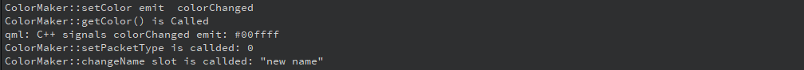

### C++类对象调用QML

 在C++中也可以访问QML中的属性、函数和信号。在C++中加载QML文件可以用QQmlComponent或QQuickView，然后就可以在C++中访问QML对象。QQuickView提供了一个显示用户界面的窗口，而QQmlComponent没有。

#### 案例

main.cpp源码

```c++
#include <QGuiApplication>
#include <QQmlApplicationEngine>
#include <QtQml>
//#include "colormaker.h"

int main(int argc, char *argv[])
{
    QCoreApplication::setAttribute(Qt::AA_EnableHighDpiScaling);

    QGuiApplication app(argc, argv);

    QQmlApplicationEngine engine;

    /*
     *  C++ 使用QML属性
     */
    QQmlComponent component(&engine, QUrl(QStringLiteral("qrc:/main.qml")));
    QObject* object = component.create();
    qDebug() << "width value is" << object->property("width").toInt();

    object->setProperty("width", 500);//设置window的宽
    qDebug() << "width value is" << object->property("width").toInt();
    qDebug() << "height value is" << QQmlProperty::read(object, "height").toInt();

    QQmlProperty::write(object, "height", 300);//设置window的高
    qDebug() << "height value is" << QQmlProperty::read(object, "height").toInt();


    /*
     *  C++使用QML中信号与函数
     */

    //调用QML中函数
     QVariant returnedValue;
     QVariant message = "Hello from C++";
     QMetaObject::invokeMethod(object, "qmlFunction",
                               Q_RETURN_ARG(QVariant, returnedValue),
                               Q_ARG(QVariant, message));

     qDebug() << "returnedValue is" << returnedValue.toString(); // function from qml


     QObject *pButton = object->findChild<QObject *>("quitButton");
     if(pButton){
         QObject::connect(pButton,SIGNAL(clicked()),object,SLOT(test()));

     }


   //   engine.rootContext()->setContextObject("makeColor",&makecolor); 设置上下文的方式访问c++类
    return app.exec();
}

```

mian.qml源代码

```qml
import QtQuick 2.0
import QtQuick.Window 2.0
import QtQuick.Controls 1.4

Window {
    width: 800
    height: 600
    visible: true
    objectName: "rootRect";
    Text {
        objectName: "textLabel";
        text: "Hello World";
        anchors.centerIn: parent;
        font.pixelSize: 26;
    }

    Button {
        anchors.right: parent.right;
        anchors.rightMargin: 4;
        anchors.bottom: parent.bottom;
        anchors.bottomMargin: 4;
        text: "quit";
        objectName: "quitButton";
    }

    function  test()
    {
       console.log("test ok!");
    }

    //定义函数
   function qmlFunction(parameter) {
       console.log("qml function parameter is", parameter)
       return "function from qml"
   }
}


```


## QML动画实现方法

在QML中，实现动画最常用的是State(状态)&Transactions(过渡) 与 Animating Properyty Changes（属性改变动画）这两种方法。

### State & Transactions(状态与过渡)

QML可以在组件中声明各种State(状态)，在状态中可以包含该组件所需修改的属性值，当我们想改变组件的属性值时，只需该组件的State即可。Transaction(过渡)用来设置状态改变时的动画，常与State配合使用。创建一个Transaction对象，然后将其添加到组件的transcation属性中。使用方法如下：

以下代码展示的是使用State&Transactions方法实现一个页面切换的动画效果。

```qml
 Window {
    visible: true
    width: 400; height: 300
    title: "Animation"
 
    Rectangle { anchors.fill: parent; color: "green" }
 
    Rectangle {
        id: pageA
        color: "red"
        width: parent.width; height: parent.height
         
        // 创建2个状态"show","hide"分别表示显示界面和隐藏界面
        states: [
            // 将PageA的属性y赋值为0，opacity赋值为1以实现显示的效果
            State {
                name: "show"; PropertyChanges { target: pageA; y: 0; opacity: 1 }
           },
            // 将PageA的属性y赋值为-height，opaticy赋值为0以实现窗口向上移动并消失的效果
            State {
                name: "hide"; PropertyChanges { target: pageA; y: -height; opacity: 0 }
           }
        ]
 
       state: "show"
 
       transitions: Transition {
           PropertyAnimation { properties: "y,opacity"; duration: 1000; easing.type: Easing.InOutBack }
             }
        }
    }
 
    MouseArea {
        anchors.fill: parent
        onClicked: {
            if(pageA.state == "show")
                pageA.state = "hide"
            else
                pageA.state = "show"
        }
    } 
}       
```

当pageA的状态由`show`改变为`hide`时，`PropertyChanges{target:pageA;y:-height;opacity:0}`执行，将属性y改为-height，opacity改为0。

当属性改变时，`PropertyAnimation{properties:"y,opacity";duration:1000;easing.type:Easing.InOutBack}`被执行，产生动画效果。

### Animating Property Changes（属性改变动画）

在属性上使用Behaviors（行为）关键字，指定在该属性改变时使用动画。修改以上代码使用Behaviors实现相同的效果。

```qml
Window {
    visible: true
    width: 400
    height: 300
    title: qsTr("Animation")

    Rectangle {
        id: pageB
        color: "green"
        anchors.fill: parent
    }

    Rectangle {
       id: pageA
       color: "red"
       width: parent.width
       height: parent.height
    // 给y属性改变安装动画 
       Behavior on y { PropertyAnimation { duration: 1000; easing.type: Easing.InOutBack } }
    // 给opacity属性改变安装动画
       Behavior on opacity { PropertyAnimation{ duration: 1000 } }
    }

    MouseArea {
        anchors.fill: parent
        onClicked: {
            if (pageA.y == 0) {
                pageA.y = -pageA.height
                pageA.opacity = 0
            } else {
                pageA.y = 0
                pageA.opacity = 1
            }
        }
}
```

有些情况下还可以通过enabled属性来停用Behavior。注意这里的PropertyAnimation的from和to属性是不需要定义的，因为这些值已经提供了，分别是Rectangle的当前值和onClicked处理器中设置的新值。

### 其他动画使用方法

#### 动画作为属性值的来源

一个动画被应用为属性值的源（property value source），要使用“动画on属性”语法。

```qml
Window {
    visible: true
    width: 400
    height: 300
    title: qsTr("Animation")
 
    Rectangle {
        id: pageB
        color: "green"
        anchors.fill: parent
    }
 
    Rectangle {
        width: 100;
        height: 100
        color: "red"
        //启动后开始动画
        PropertyAnimation on x {to: 50; duration: 1000; loops: Animation.Infinite}
        PropertyAnimation on y {to: 50; duration: 1000; loops: Animation.Infinite}
    }
}
```

#### 在信号处理器中创建一个动画，并在接收到信号时触发

```qml
Window {
    visible: true
    width: 400
    height: 300
    title: qsTr("Animation")

    Rectangle {
        id: pageB
        color: "green"
        anchors.fill: parent
    }

    Rectangle {
        id: rect
        width: 100;
        height: 100
        color: "red"

        MouseArea {
            anchors.fill: parent
            onClicked: PropertyAnimation {
                target: rect
                properties: "x,y"
                to: 50
                duration: 1000
            }
        }
    }
}
```

因为动画没有绑定到一个特定的对象或者属性，所以必须指定target和property（或者targets和properties）属性的值。而且还需要使用to属性来指定新的x和y的值。

####  独立动画

动画也可以像一个普通的QML对象一样进行创建，而不需要绑定到任何特定的对象和属性。

```qml
Window {
    visible: true
    width: 400
    height: 300
    title: qsTr("Animation")

    Rectangle {
        id: pageB
        color: "green"
        anchors.fill: parent
    }

    Rectangle {
        id: rect
        width: 100;
        height: 100
        color: "red"

        PropertyAnimation {
            id: animation
            duration: 1000
        }

        MouseArea {
            anchors.fill: parent
            onClicked: {
                animation.target = rect
                animation.properties = "x,y"
                animation.to = 50
                animation.start()
            }
        }
    }
}
```

一个独立的动画对象默认是没有运行的，必须使用running属性或者start()和stop()函数来明确地运行它。因为动画没有绑定到一个特殊得对象或属性上，所以必须定义target和property（或者targets和properties）属性的值。也需要用to属性来指定新的x和y值。对于动画在不是一对一对象属性进行动画而且动画需要明确开始和停止的情况下是非常有用的。

### 动画元素

所有的动画都继承自Animation元素，尽管无法直接创建Animation对象，不过它为动画元素提供了必要的属性和函数。它允许使用running属性和start()和stop()函数来控制动画的开始和停止，也可以通过loops属性定义动画的循环次数。

PropertyAnimation是用来为属性提供动画的最基本的动画元素，可以用来为real、int、color、rect、point、size和vector3d等属性设置动画，被NumberAnimation、colorAnimation、RotationAnimation和Vector3dAnimation等元素继承。NumberAnimation对real和int属性提供了更高效的实现；Vector3dAnimation对vector3d属性提供了更高效的支持；而ColorAnimation和RotationAnimation分别对color和rotation属性变化动画提供了特定的属性支持。

- ColorAnimation允许颜色值设置from和to属性。

```qml
Rectangle {
        id: rect
        width: 100;
        height: 100
        color: "green"
    // 启动运行，由绿色变为红色
        ColorAnimation on color { from: "green"; to: "red"; duration: 1000 }
}
```

- RotationAnimation允许设定旋转的方向。

```qml
Rectangle {
        id: rect
        width: 100;
        height: 100
        color: "red"
        anchors.centerIn: parent
    // 启动运行，顺时针旋转90°
        RotationAnimation on rotation { to: 90; duration: 1000; direction: RotationAnimation.Clockwise }
    }
```

-  SmoothedAnimation: 它是一个专门的NumberAnimation，当目标值改变时在动画中为其提供了一个平滑的变化；
- SpringAnimation: 提供了一个像弹簧一样的动画，可以设置mass、damping和epsilon等属性
-  ParentAnimation: 用来在改变父项目时产生动画（对应ParentChange元素）
- AchorAnimation: 用来在改变锚时产生动画（对应AnchorChanges元素）
- 对于任何基于PropertyAnimation的动画都可以通过设置easing属性来控制在属性值动画中使用的缓和曲线。它们可以影响这些属性值的动画效果，提供一些如反弹、加速和减速等视觉效果。OutBounce来创建一个动画到达目标值时的反弹效果。

### 组合动画

多个动画可以组合成一个单一的动画，这可以使用ParallelAnimation或者SequentialAnimation动画组元素中的一个实现。在ParallelAnimation中的动画会同时进行，而在SequentialAnimation中的动画会一个个地运行。想要运行多个动画，可以在一个动画组中定义。以下代码分别表示串行动画和并行动画。

```qml
Window {
    visible: true
    width: 400
    height: 300
    title: qsTr("Animation")

    Rectangle {
        id: pageB
        color: "green"
        anchors.fill: parent
    }

    Rectangle {
        id: rect
        width: 100
        height: 100
        color: "red"
        // 串行动画
        SequentialAnimation {
            id: animation
            //
            NumberAnimation {
                target: rect
                properties: "x,y"
                to: 50
                duration: 1000
            }

            ColorAnimation {
                target: rect
                properties: "color"
                to: "blue"
                duration: 1000
            }
        }

        MouseArea {
            anchors.fill: parent
            onClicked: animation.start()
        }
    }
}
```

### 其他画元素

QML还为动画提供了其他一些有用的元素

-  PauseAnimation： 在动画中间进行暂停
- ScriptAnimation: 允许在动画中执行JavaScript，也可以和StateChangeScript一起使用来重用已经存在的脚本