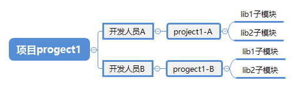
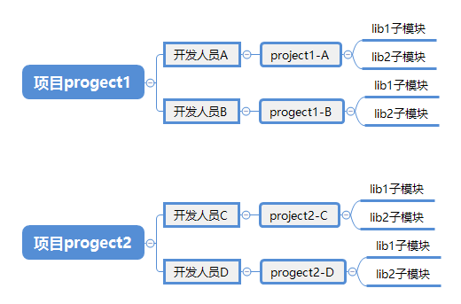
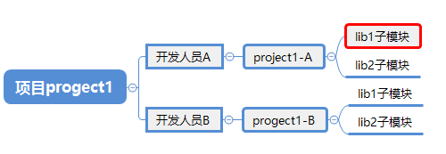

# git 子模块应用

## 单项目组子模块应用



### 项目添加子模块

现在项目组人员A要为project1工程添加lib1和lib2作为其子模块

```bash
【project1 目录】
git submodule add [要添加子模块的远程仓库地址]  [本地路径]

eg:
# 为工程project1添加lib1子模块，并提交远程仓库
git submodule add  ../../repos/lib1.git  libs/lib1 

git commit -a -m "project1 新增lib1子模块"

git push


此时在project1目录下会有个.gitmodules文件，用来记录子模块信息，内容如下：

[submodule "libs/lib1"]
	path = libs/lib1
	url = ../../repos/lib1.git

	
```


### Clone带有Submodule的仓库
现在项目组人员B要clone下progect1带有子模块的项目，并存放在project1-B目录下

```bash
方法一：
git clone ../repos/project1.git project1-B
cd project1-B
git submodule
git submodule init
git submodule update

方法二：
git clone --recursive ../repos/project1.git
```
### 修改Submodule
现在项目组人员B发现lib1里面有bug。要修复下提交，cd到libs/lib1目录后发现，HEAD处于游离状态，如下：
```bash
【project1-B 目录】
project1-B/libs/lib1 ((6e60852...))
$ git status
HEAD detached at 6e60852
nothing to commit, working tree clean

```
其实就算是项目组成员A在project1里面查看libs/lib1 也是一样的情况。为什么不是默认的master分支？

Git对于Submodule有特殊的处理方式，在一个主项目中引入了Submodule其实Git做了3件事情：

- 记录引用的仓库地址
- 记录主项目中Submodules的目录位置
- 记录引用Submodule的commit id

在project1中push之后其实就是更新了引用的commit id，
然后project1-B在clone的时候获取到了submodule的commit id，当执行git submodule update的时候，
git就获取submodule的commit id，最后获取submodule的文件，所以clone之后不在任何分支上；
但是master分支的commit id和HEAD保持一致。我们可以用git log命令查看验证下：

```bash
【project1-B/libs/lib1 目录】
$ git log
commit 6e60852976c613302f98371141bd1c36c55eb7ea (HEAD, origin/master, origin/HEAD, master)
Author: FlyRobot <xyan_m@163.com>
Date:   Thu Sep 24 09:41:35 2020 +0800

    lib1 新增readme


```

现在我们要修改lib1的文件**需要先切换到lib1的maste**r分支，修改后再push到远程仓库
```bash
【project1-B/libs/lib1 目录】
git checkout master
修复bug
git add .
git commit -m "developer B 修改lib1 bug"


注意：
此时如果我们查看project1-B的状态，会发现下面的提示：说明lib1有个新的提交。

【project1-B 目录】
$ git status
On branch master
Your branch is up to date with 'origin/master'.

Changes not staged for commit:
  (use "git add <file>..." to update what will be committed)
  (use "git checkout -- <file>..." to discard changes in working directory)

        modified:   libs/lib1 (new commits)

no changes added to commit (use "git add" and/or "git commit -a")


注意：如果现在在project1-B (master)工程下执行了git submodule update操作那么libs/lib1的commit id又会还原到以前的版本，

这样的话刚刚的修改是不是就丢死了呢？不会，因为lib1修改已经提交到了master分支，只要在libs/lib1 下执行git checkout master即可。


现在我们可以提交lib1的修改到远程仓库了
【project1-B/libs/lib1 目录】
cd project1-B/libs/lib1 (master)
git push 

切换到project1-B目录，把project1-B工程引用lib1的id更新到刚才提交的版本
【project1-B 目录】
git add .

git commit -m "修复lib1 bug，developer B更新 lib1 id到最新版本"


```
### 更新主项目的Submodules
项目组人员A要更新子模块内容，怎么操作
```bash
【project1 目录】
git pull
git submodule init
git submodule update


```


**注意**：当需要更新子模块的内容时请先确保已经运行过`git submodule init`。

## 总结


### 针对单一项目不同成员对子模块的修改步骤如下：

例如开发人员A想修改lib1子模块的内容，并提交到远端，且更新自己仓库关于lib1的到刚提交的最新版本

- cd project1-A/lib1子模块
  - git checkout master
  - 修改内容
  - git add .
  - git commit -m "日志"
  - git push 

- cd project1-A
  - git add .
  - git commit -m "修改子模块id"
  - git push

### 针对单一项目不同成员对子模块同步到最新步骤如下：

例如开发人员A提交了lib1到远程仓库，开发人员B想同步下来：

- cd project1-B
- git pull
- git submodule init
- git submodule update

## 假如有另外一个项目project2也要用到lib1和lib2



情景1：现在项目开发人员C在自己的project2-C下修改了lib1子模块，并提交到远端。如果同项目组的开发人员D向同步下项目组人员C提交的关于lib1的修改，上面已经讲到如何更新（`git pull`、 `git submodule init` 、`git submodule update`）。

情景2：假如现在另外一个项目组的开发人员A想同步下lib1的最新版本，此时A和C根本处于两个项目组，我们不可能在project1-A项目里面执行`git pull`、 `git submodule init` 、`git submodule update`了。

此时项目组progect1开发人员A操作步骤如下：

- cd project1-A/lib1
- git checkout master
- git pull
- cd project1-A
- git add . 
- git commit m "拉取最新的lib1"
- git push                                             #推送到远端

试想一下，如果项目中有N个子模块，我们难道都要一一的执行上面操作完成子模块的更新吗，显然很不现实。故而，我们可以下面的命令完成所有子模块的更新。

```bash
git submodule foreach git pull
```

该命令意思是：递归去找该项目下的所有子模块，并拉取最新的代码到本地，一行命令搞定，是否很爽。

不过需要注意的是：项目本身需要再次执行`git add .`、 `git commit`才能把项目中刚更新到最新版本的子模块id给记住。

## 子模块删除

假如要删除项目progect1-A里面的lib1子模块



步骤如下：

- cd progect1-A
- git rm -r --cached lib1
- rm -rf lib1
- 删除掉.gitmodules关于lib1的内容
- 删除.git/config的submodule配置关于 lib1内容
- 删除.git/modules的关于 lib1内容
- 提交本次修改即可

