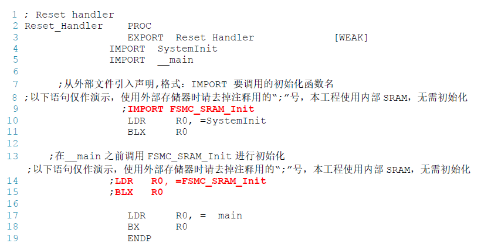

# 分散加载

硬件资源：

1. mcu内部flash起始地址是`0x08000000`，大小是`0x00080000`；
2. 内部Ram起始地址`0x20000000`，大小是`0x00005000`；
3. 外扩Ram起始地址`0x60005000`，大小`0x00007000`。

目的：使用分散加载技术达到程序优先使用内部ram，堆分配在外部ram的目的。

修改步骤：

1. 修改启动文件，进入`main`前需要初始化`FSMC_SRAM_Init`函数，确保SRAM能用。

   

2. 修改分散加载文件，确保`*.o(HEAP)`在外部SRAM里面，并且新建EXRAM节区在外部的SRAM中

   ```s
   LR_IROM1 0x08000000 0x00080000{ ; load region size_region
       ER_IROM1 0x08000000 0x00080000{ 	; load address = execution address
           *.o (RESET, +First)
           *(InRoot$$Sections)
           .ANY (+RO)
       }
   
       RW_IRAM1 0x20000000 0x00005000 { 	; 内部SRAM
        	.ANY (+RW +ZI) 					;其余的RW/ZI-data 都分配到这里
        }
        RW_ERAM1 0x60005000 0x00007000{ 	; 外部SRAM
        	*.o(HEAP) 						;选择堆区
        	.ANY (EXRAM) 					;选择EXRAM 节区
        }
   }
   ```

3. 应用程序例程

   ```c
   #define __EXRAM __attribute__ ((section ("EXRAM")))//使用宏封装，设置变量定义到“EXRAM”节区的宏
   uint32_t testValue __EXRAM =7 ;  //使用该宏定义变量到“指定的存储空间” 该变量肯定在外部SRAM中存放
   
   uint32_t testValue2 =7  //定义变量到内部SRAM
   
   uint32_t *pointer = (uint32_t*)malloc(sizeof(uint32_t)*3); //使用malloc 从外部SRAM 中分配空间
   ```
