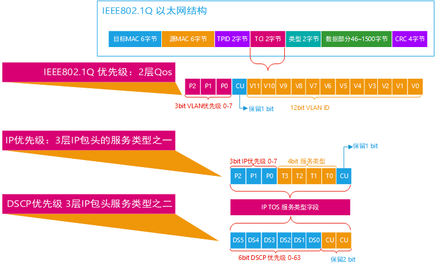
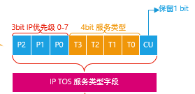
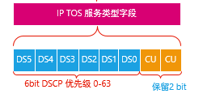

# IP优先级和DSCP之间的关系

DiffServ体系定义的DS字段，取代IPv4中ToS字段作出有关数据包分类和流量调节功能的策略。

## ToS字段

在IPv4的报文头中，TOS字段是1字节，根据RFC1122的定义，IP优先级（IPPrecedence）使用最高3Bit，可定义8个等级，8个优先级的定义如下：

- 111：Network Control 网络控制
- 110：Internetwork Control 网间控制
- 101：Critic 关键
- 100：FlashOverride 疾速
- 011：Flash 闪速
- 010：Immediate 快速
- 001：Priority 优先
- 000：Routine 普通

优先级6和7一般保留给网络控制数据使用，比如路由。
优先级5推荐给语音数据使用。
优先级4由视频会议和视频流使用。
优先级3给语音控制数据使用。
优先级1和2给数据业务使用。
优先级0为缺省标记值。
在标记数据时，既可以使用数值，也可以使用名称（英文名称）。

## DSCP

默认DSCP为000 000，DSCP与IP优先级向后兼容，在IP优先级和DSCP之间转换时，匹配最高3位,例如ip优先级是5（101），映射到DSCP上就是40（101000）。