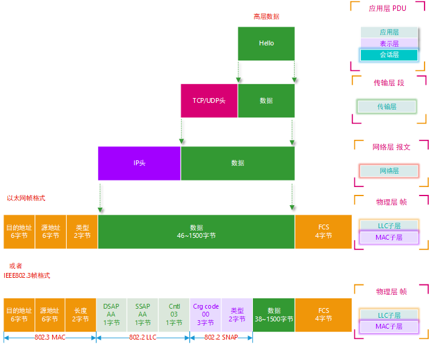
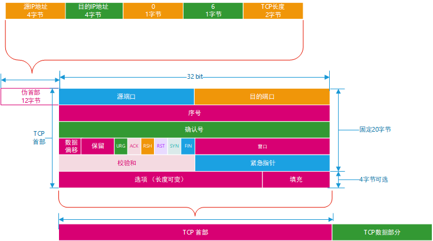
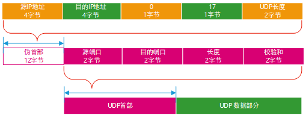
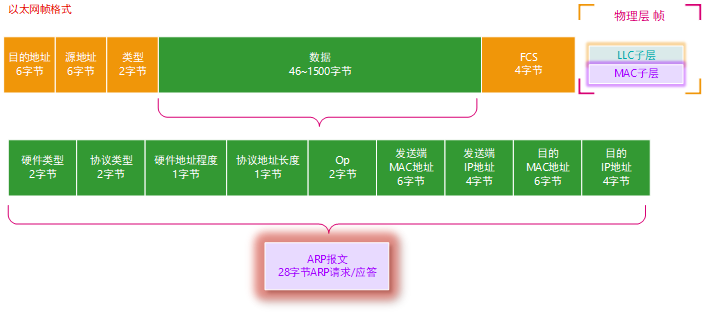
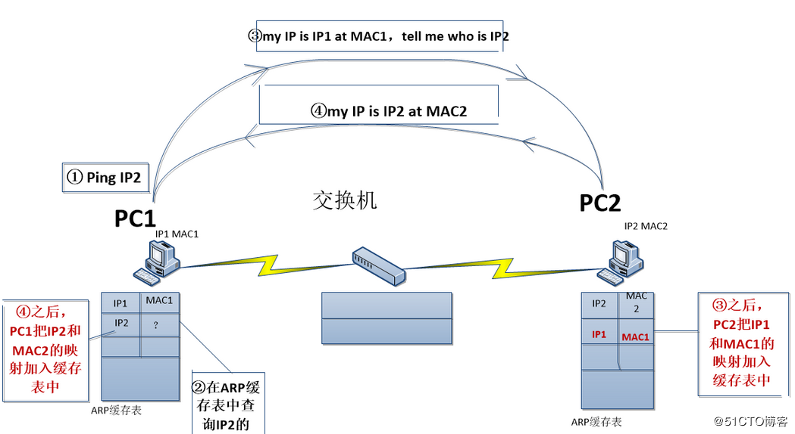
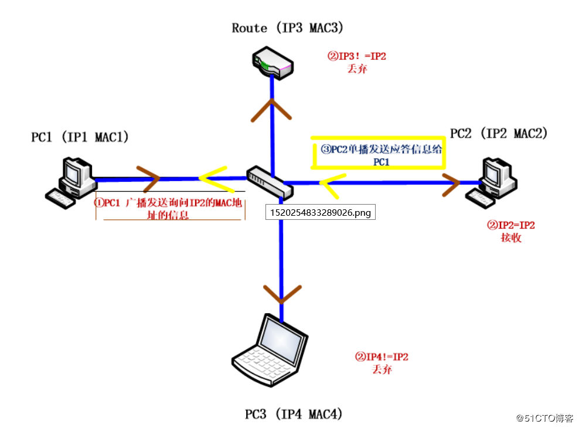
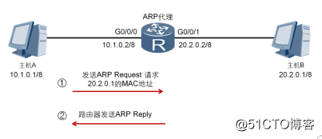
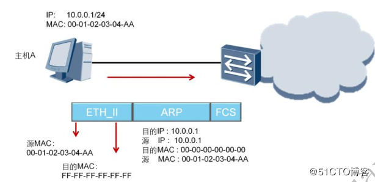
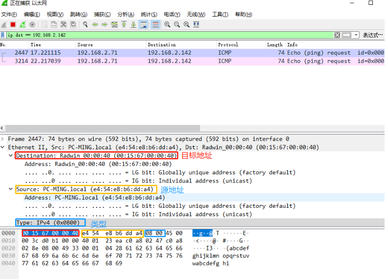
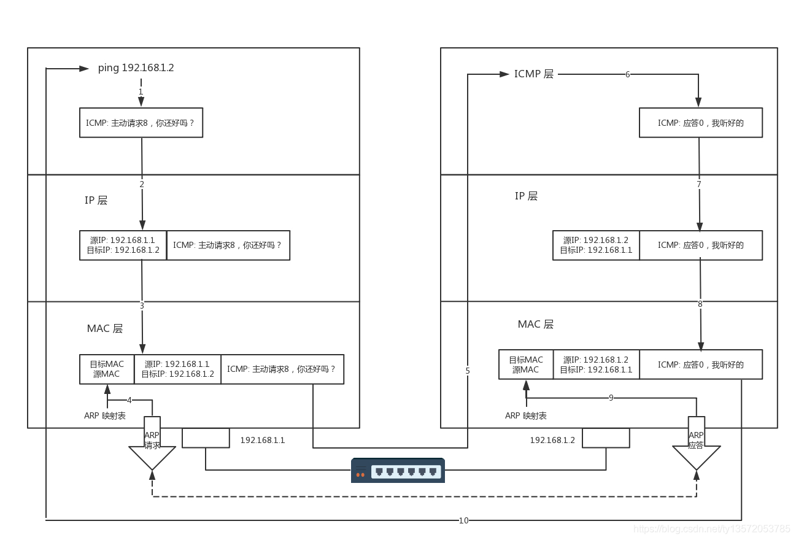

# OSI参考模型和TCP/IP参考模型





## TCP



TCP 报文段的报头有 20字节必需的和 4字节可选。所以报头至少为 20 字节。报头后面的数据是可选项。

- 源端口（16位）：标识发送报文的计算机端口或进程。一个 TCP 报文段必须包括源端口号，使目的主机知道应该向何处发送确认报文；

- 目的端口（16位）：标识接收报文的目的主机的端口或进程；

- 序号（也叫序列号）（32位）：用于标识每个报文段，使目的主机可确认已收到指定报文段中的数据。当源主机用于多个报文段发送一个报文时，即使这些报文到达目的主机的顺序不一样，序列号也可以使目的主机按顺序排列它们；

  在 SYN 标志未置位时，该字段指示了用户数据区中第一个字节的序号；在 SYN 标志置位时，该字段指示的是初始发送的序列号；在建立连接时发送的第一个报文段中，双方都提供一个初始序列号。TCP 标准推荐使用以 4ms 间隔递增 1 的计数器值作为这个初始序列号的值。使用计数器可以防止连接关闭再重新连接时出现相同的序列号。

  对于那些包含数据的报文段，报文段中第一个数据字节的数量就是初始序列号，其后数据字节按顺序编号。如果源主机使用同样的连接发送另一个报文段，那 么这个报文段的序列号等于前一个报文段的序列号与前一个报文段中数据字节的数量之和。例如，假设源主机发送 3 个报文段，每个报文段有 100 字节的数据，且第一个报文段的序列号是 1000，那么第二个报文段的序列号就是 1100（1000 + 100），第三个报文段的序列号就是 1200（1100 + 100）。如果序列号增大至最大值将复位为 0。

- 确认号（32位）

  目的主机返回确认号，使源主机知道某个或几个报文段已被接收。如果 ACK 控制位被设置为 1，则该字段有效。确认号等于顺序接收到的最后一个报文段的序号加 1，这也是目的主机希望下次接收的报文段的序号值。返回确认号后，计算机认为已接收到小于该确认号的所有数据。

   

  例如，序列号等于前一个报文段的序列号与前一个报文段中数据字节的数量之和。例如，假设源主 机发送 3 个报文段，每个报文段有 100 字节的数据，且第一个报文段的序列号是 1000，那么接收到第一个报文段后，目的主机返回含确认号1100 的报头。接收到第二个报文段（其序号为 1100 ）后，目的主机返回确认号 1200。接收到第三个报文段后，目的主机返回确认号 1300 。

   

  目的主机不一定在每次接收到报文段后都返回确认号。在上面的例子中，目的主机可能等到所有 3 个报文段都收到后，再返回一个含确认号 1300 的报文段，表示已接收到全部 1200 字节的数据。但是如果目的主机再发回确认号之前等待时间过长，源主机会认为数据没有到达目的主机，并自动重发。
  上面的例子中，如果目的主机接收到了报文段号为 1000 的第一个报文段以及报文段号为 1200 的最后一个报文段，则可返回确认号 1100，但是再返回确认号 1300 之前，应该等待报文段号为 1100 的中间报文段。

- 数据偏移（首部长度）（4位）：TCP 报文段的数据起始处距离 TCP 报文段的起始处有多远，即首部长度。 由于 TCP 报头的长度随 TCP 选项字段内容的不同而变化，因此报头中包含一个指定报头字段的字段。该字段以 32 比特为单位，所以报头长度一定是 32 比特的整数倍，有时需要在报头末尾补 0 。如果报头没有 TCP 选项字段，则报头长度值为 5 ，表示报头一个有 160 比特，即 20 字节。

- 保留位（6位）：由跟在数据偏移字段后的 6 位构成， 全部为 0 

- 控制位（6位）：

  - 紧急 URG：此位置 1，表明紧急指针字段有效，它告诉系统此报文段中有紧急数据，应尽快传送。
  - 确认 ACK：仅当 ACK = 1 时确认号字段才有效，TCP 规定，在连接建立后所有传达的报文段都必须把 ACK 置 1。
  - 推送 PSH： 当两个应用进程进行交互式的通信时，有时在一端的应用进程希望在键入一个命令后立即就能够收到对方的响应。在这种情况下，TCP 就可以使用推送（push）操作，这时，发送方 TCP 把 PSH 置 1 ，并立即创建一个报文段发送出去，接收方收到 PSH = 1 的报文段，就尽快地（即“推送”向前）交付给接收应用进程，而不再等到整个缓存都填满后再向上交付。
  - 复位 RST：用于复位相应的 TCP 连接
  - 同步 SYN：仅在三次握手建立 TCP 连接时有效。当 SYN = 1 而 ACK = 0 时，表明这是一个连接请求报文段，对方若同意建立连接，则应在相应的报文段中使用 SYN = 1 和 ACK = 1。因此，SYN 置 1 就表示这是一个连接请求或连接接受报文。
  - 终止 FIN：用来释放一个连接。当 FIN = 1 时，表明此报文段的发送方的数据已经发送完毕，并要求释放运输连接。

- 窗口（16位）：此字段用来进行流量控制，这个值是本机期望一次接收的字节数，即发送数据的窗口大小。告诉对方在不等待确认的情况下，可以发来多大的数据。这里表示的最大长度是2^16 – 1 = 65535，如需要使用更大的窗口大小，需要使用选项中的窗口扩大因子选项。指发送本报文段的一方的接收窗口（而不是自己的发送窗口）。

- 校验和（16位）：源主机和目的主机根据 TCP 报文段以及伪报头的内容计算校验和。在伪报头中存放着来自 IP 报头以及 TCP 报文段长度信息。与 UDP 一样，伪报头并不在网络中传输，并且在校验和中包含伪报头的目的是为了防止目的主机错误地接收存在路由的错误数据报。

  伪首部， 又称为伪包头（Pseudo Header）：是指在 TCP 的分段或 UDP 的数据报格式中，在数据报首部前面增加源 IP 地址、目的 IP 地址、IP 分组的协议字段、TCP 或 UDP 数据报的总长度等共12字节，所构成的扩展首部结构。此伪首部是一个临时的结构，它既不向上也不向下传递，仅仅只是为了保证可以校验套接字的正确性。

- 紧急指针（16位）：仅在 URG = 1 时才有意义，它指出本报文段中的紧急数据的字节数（紧急数据结束后就是普通数据），即指出了紧急数据的末尾在报文中的位置，注意：即使窗口为零时也可发送紧急数据。

  如果 URG 为 1 ，则紧急指针标志着紧急数据的结束。其值是紧急数据最后 1 字节的序号，表示报文段序号的偏移量。例如，如果报文段的序号是 1000，前 8 个字节都是紧急数据，那么紧急指针就是 8 。紧急指针一般用途是使用户可中止进程。

- 选项、填充字段：可能包括“窗口扩大因子”、“时间戳”等选项。长度可变，最长可达 40 字节，当没有使用选项时，TCP 首部长度是 20 字节。填充用于保证任选项为 32bit 的整数倍。

- 数据（长度可变）：TCP 首部结束之后的部分

## UDP



UDP首部由8个字节构成，每个字段都是两个字节。

- 源端口：源端口号，需要对方回信时选用，不需要时置0；
- 目标端口：目的端口号，在终点交付报文时需要用到；
- 头部长度：UDP的数据报长度（包含首部和数据），最小值为8字节（只有首部）；
- 校验和：检测UDP数据在传输中是否出错，有错则丢弃。该字段可选，当源主机不想计算校验和，则置0，当传输层从IP层收到UDP数据报时，根据首部中的目标端口，把UDP数据通过相应的端口交给应用进程。若接收方UDP发现收到的报文中目的端口号不正确，就丢弃该报文，由ICMP发送“端口不可达”报错给发送方。

在计算校验和时，在UDP数据报前加12字节的伪首部，并不是UDP真正的首部。只是在计算校验和时临时添加在UDP数据报的前面得到的临时数据报，后校验临时数据报。伪首部既不向下传送，也不向上递交，仅仅为了计算校验和。这样，即检查了UDP的数据报，又对IP数据报源IP地址和目标地址进行了校验。

UDP校验和的计算方法和IP数据报首部校验和的计算方法类似，都使用二进制反码运算求和再求和再取反。不同的是：IP数据报校验和只校验IP数据报的首部，但UDP校验和是把首部和数据一起校验。

## IP


IP 报头的最小长度为 20 字节，上图中每个字段的含义如下：

- 版本（version）:占 4 位，表示 IP 协议的版本。通信双方使用的 IP 协议版本必须一致。目前广泛使用的IP协议版本号为 4，即 IPv4；

- 首部长度（网际报头长度IHL）：占 4 位，可表示的最大十进制数值是 15。这个字段所表示数的单位是 32 位字长（1 个 32 位字长是 4 字节）。因此，当 IP 的首部长度为 1111 时（即十进制的 15），首部长度就达到 60 字节。当 IP 分组的首部长度不是 4 字节的整数倍时，必须利用最后的填充字段加以填充。

  数据部分永远在 4 字节的整数倍开始，这样在实现 IP 协议时较为方便。首部长度限制为 60 字节的缺点是，长度有时可能不够用，之所以限制长度为 60 字节，是希望用户尽量减少开销。最常用的首部长度就是 20 字节（即首部长度为 0101），这时不使用任何选项。

- 区分服务（tos）：也被称为服务类型，占 8 位，用来获得更好的服务。这个字段在旧标准中叫做服务类型，但实际上一直没有被使用过。1998 年 IETF 把这个字段改名为区分服务（Differentiated Services，DS）。只有在使用区分服务时，这个字段才起作用。

- 总长度（totlen）：首部和数据之和，单位为字节。总长度字段为 16 位，因此数据报的最大长度为 2^16-1=65535 字节。

- 标识（identification）：用来标识数据报，占 16 位。IP 协议在存储器中维持一个计数器。每产生一个数据报，计数器就加 1，并将此值赋给标识字段。当数据报的长度超过网络的 MTU，而必须分片时，这个标识字段的值就被复制到所有的数据报的标识字段中。具有相同的标识字段值的分片报文会被重组成原来的数据报。

-  标志（flag）：占 3 位。第一位未使用，其值为 0。第二位称为 DF（不分片），表示是否允许分片。取值为 0 时，表示允许分片；取值为 1 时，表示不允许分片。第三位称为 MF（更多分片），表示是否还有分片正在传输，设置为 0 时，表示没有更多分片需要发送，或数据报没有分片。

- 片偏移（offsetfrag）：占 13 位。当报文被分片后，该字段标记该分片在原报文中的相对位置。片偏移以 8 个字节为偏移单位。所以，除了最后一个分片，其他分片的偏移值都是 8 字节（64 位）的整数倍。

- 生存时间（TTL）：表示数据报在网络中的寿命，占 8 位。该字段由发出数据报的源主机设置。其目的是防止无法交付的数据报无限制地在网络中传输，从而消耗网络资源。

  路由器在转发数据报之前，先把 TTL 值减 1。若 TTL 值减少到 0，则丢弃这个数据报，不再转发。因此，TTL 指明数据报在网络中最多可经过多少个路由器。TTL 的最大数值为 255。若把 TTL 的初始值设为 1，则表示这个数据报只能在本局域网中传送。 

- 协议：表示该数据报文所携带的数据所使用的协议类型，占 8 位。该字段可以方便目的主机的 IP 层知道按照什么协议来处理数据部分。不同的协议有专门不同的协议号。

  例如，TCP 的协议号为 6，UDP 的协议号为 17，ICMP 的协议号为 1。

- 首部检验和（checksum）：用于校验数据报的首部，占 16 位。数据报每经过一个路由器，首部的字段都可能发生变化（如TTL），所以需要重新校验。而数据部分不发生变化，所以不用重新生成校验值。

- 源地址：表示数据报的源 IP 地址，占 32 位。

- 目的地址：表示数据报的目的 IP 地址，占 32 位。该字段用于校验发送是否正确。

- 可选字段：该字段用于一些可选的报头设置，主要用于测试、调试和安全的目的。这些选项包括严格源路由（数据报必须经过指定的路由）、网际时间戳（经过每个路由器时的时间戳记录）和安全限制。

- 填充：由于可选字段中的长度不是固定的，使用若干个 0 填充该字段，可以保证整个报头的长度是 32 位的整数倍。

- 数据部分：表示传输层的数据，如保存 TCP、UDP、ICMP 或 IGMP 的数据。数据部分的长度不固定。

#### 实例

下面是一个TCP的SYN数据包,大家可以分析一下:

```c
4500002C2A690000-4006B7580A616750-7CACAAAD24DE0E89-12DE958000000000-60023908EA4D0000-020405B4
```

- 版本:4,即IPv4;
- 首部长度:5,即5*8=20B,说明没有可变部分;
- 服务:00;
- 总长度:002C,44B;
- 标识:2A69;
- 标志+片偏移:0000;
- 生存时间:40,即64;
- 协议:06,传输控制协议,也就是TCP;
- 首部校验和:B758;
- 源地址:0A616750;
- 目的地址:7CACAAAD.

 

后面的数据时TCP的头部,这里先简单列出来,后面会详细分析:

 

- 源端口:24DE;
- 目的端口:0E89;
- 序号:12DE9580;
- 确认号:00000000;
- 数据偏移:6,即偏移24B.TCP的头部默认是20B,我们分析的数据包有一个TCP选项,占4B;
- 保留+控制位:002,表明这是一个SYN包;
- 窗口值:3908,14600,即发送者的接收窗口值;
- 校验和:EA4D;
- 紧急指针:0000;
- 选项类型:02,最大报文段长度;
- 选项长度:04;
- 选项数据:05B4,即1355.

 

## ARP 协议

### 引入

当网络设备要发送数据给另一台设备时，必须要知道对方的IP地址和MAC地址，IP地址由网络层来提供，因此发送端还必须获取到目的MAC地址。通过目的IP地址而获取目的MAC地址的过程是由ARP协议来实现的。
ARP协议是TCP/IP协议簇中的重要组成部分，ARP能够通过目的IP地址发现目标设备的MAC地址，从而实现数据链路层的可达性。

 


ARP 协议最总在物理层报文格式如图所示:




**以太网首部说明：**

| 字段     | 长度 | 默认值 | 备注                      |
| -------- | ---- | ------ | ------------------------- |
| 目的地址 | 6    |        | 广播时：ff-ff-ff-ff-ff-ff |
| 源地址   | 6    |        |                           |
| 类型     | 2    |        | *0x0806*是*ARP*帧的类型值 |

**ARP 报文部分说明**

总长度为 28 字节，其中，每个字段的含义如下:

| 字段         | 长度 | 默认值 | 备注                                                         |
| ------------ | ---- | ------ | ------------------------------------------------------------ |
| 硬件类型     | 2    | 0x1    | 以太网类型值                                                 |
| 协议类型     | 2    | 0x0800 | 上层协议为*IP*协议                                           |
| 硬件地址长度 | 1    | 0x6    | 以太网*MAC*地址长度为 *6*                                    |
| 协议地址长度 | 1    | 0x4    | *IP*地址长度为 *4*                                           |
| OP           | 2    |        | ARP 请求为 1 ARP 响应为 2 RARP 请求为 3 RARP 响应为 4        |
| 发送方MAC    | 6    |        |                                                              |
| 发送端IP     | 4    |        |                                                              |
| 目的MAC      | 6    |        |                                                              |
| 目的IP       | 4    |        |                                                              |
| 填充数据     | 18   |        | 因为物理帧最小长度为*64*字节*,*前面的*42*字节再加上*4*个*CRC*校验字节*,*还差*18*个字节 |


ARP 数据包分为请求包和响应包，对应报文中的某些字段值也有所不同。

- ARP 请求包报文的操作类型（op）字段的值为 request(1)，目的 MAC 地址字段的值为  00：00：00_00：00：00(00：00：00：00：00：00)（广播地址）。
- ARP 响应包报文中操作类型（op）字段的值为 reply(2)，目标 MAC 地址字段的值为目标主机的硬件地址。

### ARP工作过程

ARP简单请求应答，当两台计算机在同一局域网通信，我们以ping命令为例，该命令使用ICMP协议



PC1依据OSI模型①依次从上至下对数据进行封装，包括对ICMP Date加IP包头的封装，但是到了封装MAC地址的时候，②PC1首先查询自己的ARP缓存表，发现没有IP2和他的MAC地址的映射，这个时候MAC数据帧封装失败。我们使用ping命令的时候，是指定PC2的IP2的，计算机是知道目的主机的IP地址，能够完成网络层的数据封装，因为设备通信还需要对方的MAC地址，但是PC1的缓存表里没有，所以在MAC封装的时候填入不了目的MAC地址。

那么PC1为了获取PC2的MAC地址，③PC1要发送询问信息，询问PC2的MAC地址，询问信息包括PC1的IP和MAC地址、PC2的IP地址，这里我们想到一个问题，即使是询问信息，也是需要进行MAC数据帧的封装，那这个询问信息的目的MAC地址填什么呢，规定当目的MAC地址为ff-ff-ff-ff-ff-ff时，就代表这是一个询问信息，也即使后面我要说的广播。

PC2收到这个询问信息后，将这里面的IP1和MAC1（PC1的IP和MAC）添加到本地的ARP缓存表中，然后④PC2发送应答信息，对数据进行IP和MAC的封装，发送给PC2，因为缓存表里已经有PC1的IP和MAC的映射了呢。这个应答信息包含PC2的IP2和MAC2。PC1收到这个应答信息，理所应当的就获取了PC2的MAC地址，并添加到自己的缓存表中。

经过这样交互式的一问一答，PC1和PC2都获得了对方的MAC地址，值得注意的是，目的主机先完成ARP缓存，然后才是源主机完成ARP缓存。之后PC1和PC2就可以真正交流了。

```
上图面的图解是不完全的ARP协议，因为在局域网里边不会只有两台主机，这里就要考虑如何在局域网众多主机里获得目的主机的MAC。
```



和上面的一样，刚开始PC1并不知道PC2的MAC地址，同样需要发送ARP请求，但是这个局域网里主机很多，怎么唯独获取PC2的MAC呢，①我们想到和一群陌生人交流一样，可以挨着询问一遍，这就是我们要说的广播，首先PC1广播发送询问信息（信息和上一张图介绍的一样），在这个普通交换机上连接的设备都会受到这个PC1发送的询问信息。

接下来②需要做的是，所有在这个交换机上的设备需要判断此询问信息，如果各自的IP和要询问的IP不一致，则丢弃，如图PC3、Route均丢弃该询问信息，而对于PC2判断该询问信息发现满足一致的要求，则接受，同样的写入PC1的IP和MAC到自己的ARP映射表中。

最后，③PC2单播发送应答信息给PC1，告诉PC1自己的IP和MAC地址。

### ARP代理



上图中，主机A需要与主机B通信时，目的IP地址与主机的IP地址位于不同网络，但由于主机A未设置网关，所以他将会以广播的形式发送ARP Request报文，请求B的MAC地址，但是广播报文无法被路由器转发，所以主机B无法收到主机A的请求报文。
在路由器上启用代理ARP功能，就可以解决这个问题。启用代理后，路由器接收到这样的请求，会查找路由表，如果存在主机B的路由表项，路由器会将自己的G0/0/0接口的MAC地址回应该ARP Requestrian。主机A收到ARP Reply后，将一路有油漆的G0/0/0接口MAC地址作为目的MAC地址进行数据转发。
小结：1如果两台主机在同一个网段，则直接发送ARP Request报文就好。
2 如果在不同网段，（1）主机A设置了网关，ARP协议可以正常使用。
（2）主机A没有设置网关，这种情况下，我们要开启ARP代理，路由器来重新封装，转发报文

### 免费ARP



主机A将ARP Request 广播报文中的目的IP地址字段设置为自己的IP地址，该网络中的所有主机都会接受到此报文。当目的IP地址已经被某一个主机或网管室友是，该主机或网关就会回应ARP reply 报文，通过这种方式主机A就能探测到IP地址冲突了。

### ARP 示例分析

本机IP：192.168.0.1 (c0 a8 00 01)
 本机MAC：00-50-56-c0-00-01

 目标IP：192.168.0.2 (c0 a8 00 02)
 目标MAC：00-0c-29-0b-42-7e

 1、 Ping 目标主机192.168.0.2时，本机发送的ARP数据包为
 00000000 : ff ff ff ff ff ff 00 50 56 c0 00 01 08 06 00 01
 00000010 : 08 00 06 04 00 01 00 50 56 c0 00 01 c0 a8 00 01
 00000020 : 00 00 00 00 00 00 c0 a8 00 02

 以太网数据包发送目的地：ff ff ff ff ff ff（全网）
 以太网数据包发送源：00 50 56 c0 00 01（本机）
 以太网数据包数据包内容类型：08 06（ARP数据包）
 ARP数据包类型：00 01（Request）
 数据内容：告诉IP为c0 a8 00 02的目标主机，本机的IP为c0 a8 00 01，MAC为
 00 50 56 c0 00 01，请更新，并将你的MAC发送给我。

 目标主机回应本机的ARP数据包为
 00000000 : 00 50 56 c0 00 01 00 0c 29 0b 42 7e 08 06 00 01
 00000010 : 08 00 06 04 00 02 00 0c 29 0b 42 7e c0 a8 00 02
 00000020 : 00 50 56 c0 00 01 c0 a8 00 01

 以太网数据包发送目的地：00 50 56 c0 00 01
 以太网数据包发送源： 00 0c 29 0b 42 7e
 以太网数据包数据包内容类型：08 06（ARP数据包）
 ARP数据包类型：00 02（Reply）
 数据内容：告诉MAC为  00 50 56 c0 00 01 的主机，你的IP和MAC我已经收到，我的MAC和IP为00 0c 29 0b 42 7e 和c0 a8 00 02，请保存更新。

 

 2、 修改系统IP时（未发生IP冲突的情况下），发送的ARP数据包为
 00000000 : ff ff ff ff ff ff 00 0c 29 0b 42 7e 08 06 00 01
 00000010 : 08 00 06 04 00 01 00 0c 29 0b 42 7e c0 a8 00 03
 00000020 : 00 00 00 00 00 00 c0 a8 00 03

 以太网数据包发送目的地：ff ff ff ff ff ff（全网）
 以太网数据包发送源：00 0c 29 0b 42 7e（本机）
 以太网数据包数据包内容类型：08 06（ARP数据包）
 ARP数据包类型：00 01（Request）
 数据内容：告诉IP为c0 a8 00 03的主机，本机的MAC和IP为00 0c 29 0b 42 7e 和c0 a8 00 03。由于网络内没有c0 a8 00 03 主机，所以此数据包将不会有回应，此时，局域网交换机将会刷新缓存，使你的IP和MAC对应起来。

 3、 修改系统IP时（发生IP冲突的情况下），发送的ARP数据包为
 00000000 : ff ff ff ff ff ff 00 0c 29 0b 42 7e 08 06 00 01
 00000010 : 08 00 06 04 00 01 00 0c 29 0b 42 7e c0 a8 00 01
 00000020 : 00 00 00 00 00 00 c0 a8 00 01

 以太网数据包发送目的地：ff ff ff ff ff ff（全网）
 以太网数据包发送源：00 0c 29 0b 42 7e
 以太网数据包数据包内容类型：08 06（ARP数据包）
 ARP数据包类型：00 01（Request）
 数据内容：告诉IP为c0 a8 00 01的主机，本机的MAC和IP为00 0c 29 0b 42 7e 和c0 a8 00 01。由于网络内已经有c0 a8 00 01 主机，将会发生冲突。这时将收到ARP Reply数据包。

 接收的ARP数据包为
 00000000 : 00 0c 29 0b 42 7e 00 50 56 c0 00 01 08 06 00 01
 00000010 : 08 00 06 04 00 02 00 50 56 c0 00 01 c0 a8 00 01
 00000020 : 00 0c 29 0b 42 7e c0 a8 00 01

 以太网数据包发送目的地：00 0c 29 0b 42 7e
 以太网数据包发送源：00 50 56 c0 00 01
 以太网数据包数据包内容类型：08 06（ARP数据包）
 ARP数据包类型：00 02（Reply）
 数据内容：告诉MAC为00 0c 29 0b 42 7e的主机，本机的MAC和IP为00 50 56 c0 00 01和 c0 a8 00 01。这时MAC 为42 7e c0 a8 00 01的主机收到这个包后，并知道他的IP与其它主机冲突了。

 4、 伪造ARP数据包
 向目标MAC发送伪造的ARP Reply，告知一个假的信息，达到欺骗的目的。
 本机真实IP为：192.168.0.1(c0 a8 00 01)
 本机真实MAC为：00-50-56-c0-00-01
 伪造的MAC为：11-11-11-11-11-11

 欺骗目标：
 IP为：192.168.0.2(c0 a8 00 02)
 MAC：00-0c-29-0b-42-7e

 伪造的数据包如下：
 Packet length： 60
 00000000 : 00 0c 29 0b 42 7e 11 11 11 11 11 11 08 06 00 01
 00000010 : 08 00 06 04 00 02 11 11 11 11 11 11 c0 a8 00 01
 00000020 : 00 0c 29 0b 42 7e c0 a8 00 02（剩余部分用0填补）

ICMP 抓包过程如下：



