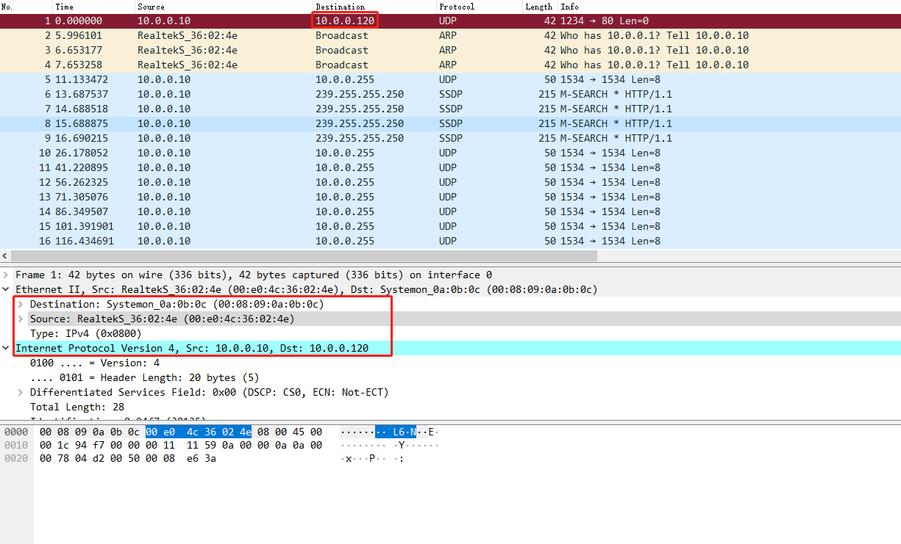
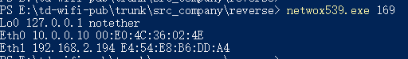

# netwox使用说明

netwox可以创建任意的TCP\UDP和IP数据报文，以实现网络欺骗。

## 下载及安装

下载地址： https://sourceforge.net/projects/ntwox/

在解压的文件夹中找到对应的应用程序文件 installwindows.exe。双击该文件进行安装。

- 启动netwox，可以看到菜单栏

  ```
  0：退出 netwox 工具。
  3：搜索工具，用来搜索与指定信息相关的模块。
  4：显示指定模块的帮助信息。
  5：在命令行中输入指定模块的参数选项并运行。
  6：从键盘输入指定模块的参数选项并运行。
  a：显示信息。
  b：显示网络协议下相关的模块。
  c：显示应用程序协议下相关的模块。
  d：显示与嗅探数据包相关的模块。
  e：显示与创建和发送数据包相关的模块。
  f：显示与进行数据包记录相关的模块。
  g：显示与客户端相关的模块。
  h：显示与服务器相关的模块。
  i：显示与检测主机连通性相关的模块。
  j：显示与路由跟踪相关的模块。
  k：显示与扫描计算机和端口相关的模块。
  l：显示与审计相关的模块。
  m：显示与暴力破解相关的模块。
  n：显示与远程管理相关的模块。
  o：显示其他模块。
  ```

  

-  使用快捷键 e，查看创建和发送数据包的相关模块

  ```
  Select a node (key in 03456abcdefghijklmno): e
  
  ############# spoof (create and send packets) ##############
  #创建和发送数据包模块
  0 - leave netwox
  1 - go to main menu
  2 - go to previous menu
  3 - search tools
  4 - display help of one tool
  5 - run a tool selecting parameters on command line
  6 - run a tool selecting parameters from keyboard
  a + Ethernet spoof
  b + IP spoof         # 创建ip 数据包 快捷键b，即可创建
  c + UDP spoof		# 创建UDP 数据包 快捷键c
  d + TCP spoof		# 创建TCP 数据包 快捷键d
  e + ICMP spoof		# 创建ICMP 数据包 快捷键e
  f + ARP spoof		# 创建ARP 数据包 快捷键f
  ```

  

- 使用搜索功能

  - 在主菜单输入3，进入搜索选项，比如我们搜索UDP关键字；

  - 可以从提示信息看出，有关UDP的模块ID 是35-184；

  - 假如我们要使用35号模块即：`35:Spoof EthernetIp4Udp packet`；

  - 我们在主菜单输入5，进入命令运行模式

  - 然后输入刚刚查到的ID：35，就进入了命令模式，

    ```bash
    ######################## MAIN MENU #########################
     0 - leave netwox
     3 - search tools
     4 - display help of one tool
     5 - run a tool selecting parameters on command line
     6 - run a tool selecting parameters from keyboard
     a + information
     b + network protocol
     c + application protocol
     d + sniff (capture network packets)
     e + spoof (create and send packets)
     f + record (file containing captured packets)
     g + client
     h + server
     i + ping (check if a computer if reachable)
     j + traceroute (obtain list of gateways)
     k + scan (computer and port discovery)
     l + network audit
     m + brute force (check if passwords are weak)
     n + remote administration
     o + tools not related to network
    Select a node (key in 03456abcdefghijklmno): 3    # 1.输入3进入搜索模式
    Enter search string: udp                          # 2.输入udp 
    
    ############ list of tools containing this text ############
    Tools containing "udp":
      35:Spoof EthernetIp4Udp packet
      39:Spoof Ip4Udp packet
      53:Ping UDP
      54:Ping UDP (EthIp spoof)
      61:Traceroute UDP
      62:Traceroute UDP (EthIp spoof)
      69:Scan UDP
      70:Scan UDP (EthIp spoof)
      88:UDP client
      90:UDP server
      92:UDP server multiclients
      141:Spoof EthernetIp6Udp packet
      145:Spoof Ip6Udp packet
      157:Network performance measurement : UDP server
      158:Network performance measurement : UDP client
      184:UDP relay
    Press any key to continue                   # 3.这里按任意键返回到主菜单
    
    ######################## MAIN MENU #########################
     0 - leave netwox
     3 - search tools
     4 - display help of one tool
     5 - run a tool selecting parameters on command line
     6 - run a tool selecting parameters from keyboard
     a + information
     b + network protocol
     c + application protocol
     d + sniff (capture network packets)
     e + spoof (create and send packets)
     f + record (file containing captured packets)
     g + client
     h + server
     i + ping (check if a computer if reachable)
     j + traceroute (obtain list of gateways)
     k + scan (computer and port discovery)
     l + network audit
     m + brute force (check if passwords are weak)
     n + remote administration
     o + tools not related to network
    Select a node (key in 03456abcdefghijklmno): 5   # 4.输入5 运行模块
    Select tool number (between 1 and 223)> 35       # 5.输入刚刚查询的模块ID 35
    
    ################## running tool number 35 ##################
    Title: Spoof EthernetIp4Udp packet
    +------------------------------------------------------------------------+
    | This tool sends a fake packet on the network.                          |
    | Each parameter name should be self explaining.                         |
    |                                                                        |
    | This tool may need to be run with admin privilege in order to spoof.   |
    +------------------------------------------------------------------------+
    Synonyms: frame, hping, mac, send
    Usage: netwox 35 [-d device] [-a eth] [-b eth] [-c uint32] [-e uint32] [-f|+f] [-g|+g] [-h|+h] [-i uint32] [-j uint32] [-k uint32] [-l ip] [-m ip] [-n ip4opts] [-o port] [-p port] [-q mixed_data] [-r uint32] [-s uint32] [-t uint32] [-u uint32] [-v uint32] [-w uint32]
    Parameters:
     -d|--device device             device for spoof {Eth0}
     -a|--eth-src eth               Ethernet src {00:E0:4C:36:02:4E}
     -b|--eth-dst eth               Ethernet dst {0:8:9:a:b:c}
     -c|--ip4-tos uint32            IP4 tos {0}
     -e|--ip4-id uint32             IP4 id (rand if unset) {0}
     -f|--ip4-reserved|+f|--no-ip4-reserved IP4 reserved
     -g|--ip4-dontfrag|+g|--no-ip4-dontfrag IP4 dontfrag
     -h|--ip4-morefrag|+h|--no-ip4-morefrag IP4 morefrag
     -i|--ip4-offsetfrag uint32     IP4 offsetfrag {0}
     -j|--ip4-ttl uint32            IP4 ttl {0}
     -k|--ip4-protocol uint32       IP4 protocol {0}
     -l|--ip4-src ip                IP4 src {10.0.0.10}
     -m|--ip4-dst ip                IP4 dst {5.6.7.8}
     -n|--ip4-opt ip4opts           IPv4 options
     -o|--udp-src port              UDP src {1234}
     -p|--udp-dst port              UDP dst {80}
     -q|--udp-data mixed_data       mixed data
     -r|--eth-type uint32           Ethernet type {2048}
     -s|--ip4-ihl uint32            IP4 ihl {5}
     -t|--ip4-totlen uint32         IP4 totlen {0}
     -u|--ip4-checksum uint32       IP4 checksum {0}
     -v|--udp-len uint32            UDP length {0}
     -w|--udp-checksum uint32       UDP checksum {0}
    Example: netwox 35
    Enter optional tool parameters and press Return key.
    netwox 35  #6.接着可以根据上面的提示输入命令测试udp包
    
    
    ```

    

  - 接着我们输入提示的参数，即可完成发送。

    源MAC:`00:e0:4c:36:02:4e`

    源ip:     `10.0.0.10`

    目标ip：`10.0.0.120`

    ```
    netwox 35 -a 00:e0:4c:36:02:4e -l 10.0.0.10 -m 10.0.0.120
    Ethernet________________________________________________________.
    | 00:E0:4C:36:02:4E->00:08:09:0A:0B:0C type:0x0800              |
    |_______________________________________________________________|
    IP______________________________________________________________.
    |version|  ihl  |      tos      |            totlen             |
    |___4___|___5___|____0x00=0_____|___________0x001C=28___________|
    |              id               |r|D|M|       offsetfrag        |
    |_________0x94F7=38135__________|0|0|0|________0x0000=0_________|
    |      ttl      |   protocol    |           checksum            |
    |____0x00=0_____|____0x11=17____|____________0x1159_____________|
    |                            source                             |
    |___________________________10.0.0.10___________________________|
    |                          destination                          |
    |__________________________10.0.0.120___________________________|
    UDP_____________________________________________________________.
    |          source port          |       destination port        |
    |__________0x04D2=1234__________|___________0x0050=80___________|
    |            length             |           checksum            |
    |___________0x0008=8____________|_________0xE63A=58938__________|
    
    Command returned 0 (OK)
    ```

    抓包如下：

    

## netwox简单使用

1. 显示计算机上网络适配器信息

   ```
   PS E:\td-wifi-pub\trunk\src_company\reverse> netwox539.exe 169
   Lo0 127.0.0.1 notether
   Eth0 10.0.0.10 00:E0:4C:36:02:4E
   Eth1 192.168.2.194 E4:54:E8:B6:DD:A4
   PS E:\td-wifi-pub\trunk\src_company\reverse>
   ```

   

2. 根据ip显示对应的MAC地址

   ```
    netwox 5 -i 192.168.59.133
   ```

3. 显示局域网中所有主机的 MAC 地址

   ```
   netwox 5 -i 192.168.59.0/24
   
   netwox 5 -i 192.168.59.0/24 -u      -u选项，显示未发现主机的 MAC 地址的信息
   ```

4. 已知mac地址，显示该主机的其他信息

   ```
   netwox 4 -e 00:0C:29:CA:E4:66
   ```

5. 如果在显示信息时只想显示 IP 地址信息，可以使用 `--ip`选项

   ```
   netwox 4 -e 00:0C:29:CA:E4:66 --ip
   ```

6. 如果在显示信息时只想显示主机名信息，可以使用 `--host`

   ```
   netwox 4 -e 00:0C:29:CA:E4:66 --host
   ```

7. 如果在显示信息时只想显示标题信息，可以使用 `--title`选项

   ```
   netwox 4 -e 00:0C:29:CA:E4:66 --title
   ```

8. 显示网络信息

   ```
   netwox 1
   ```

   

9. 


## 构建以太网帧

- 查看以太网数据帧

  ```
  C:\Users\Administrator>netwox539 32
  Ethernet________________________________________________________.
  | 20:0D:B0:1E:2B:8D->00:08:09:0A:0B:0C type:0x0000              |
  |_______________________________________________________________|
  
  注解：
  源MAC :20:0D:B0:1E:2B:8D
  目标MAC:00:08:09:0A:0B:0C
  以太网类型 ：0x0000
  ```

- 构建以太网帧时，指定源和目标MAC地址

  ```
  netwox539 32 -a 00:0c:29:c4:8a:de -b 01:02:03:04:05:06
  ```

  

- 为了不被其他主机发现，在构造数据包时，可以指定假的源MAC地址。但是，每构造一次只能发送一个数据包。如果需要发送多个数据包，就需要构造多次。为了方便，可以使用 macchanger 工具临时修改 MAC 地址，这样就不需要每次构造假的源 MAC 地址了。例如，将当前主机的 MAC 地址修改为00:0c:29:aa:e0:28，执行命令如下：

  ```
  
  ```

  

-  以太帧洪水攻击

  交换机为了方便数据传输，通常会存储每个端口所对应的 MAC 地址，形成一张表。当交换机收到计算机发来的以太帧时，就会查看帧中的源 MAC 地址，并查找存储的表：

  - 如果表中存在该 MAC 地址，就直接转发数据；
  - 如果没有，则将该 MAC 地址存入该表中。

  
  当其他计算机向这个 MAC 地址发送数据时，可以快速决定向哪个端口发送数据。由于该表不可能是无穷大的，所以当达到一定数量时，将不会储存其他新的 MAC 地址。再有新的主机发来数据帧时，部分交换机将不再查找对应的端口，而是以广播的形式转发给所有的端口。这样，就使其他主机可以接收到该数据帧了。

  netwox 工具提供编号为 75 的模块，用来实现以太帧洪水攻击功能。它可以伪造大量的以太网数据包，填满交换机的存储表，使交换机失去正确的转发功能。

  实施以太帧洪水攻击，执行命令如下：

  root@daxueba:~# netwox 75

  执行命令后没有任何输出信息，但是会发送大量的以太网数据包。

  使用 Wireshark 工具进行抓包，如图所示。图中捕获的数据包为以太帧洪水攻击产生的数据包。

## 构建 IP 数据包

```bash
-l：指定源ip
-m：指定目标ip

netwox 38 -l 192.168.59.132 -m 192.168.12.101

```

命令如下：

```bash
PS D:\Program Files (x86)\netw\netw539> .\netwox539.exe 38 -l 192.168.2.194 -m 192.168.2.150
IP______________________________________________________________.
|version|  ihl  |      tos      |            totlen             |
|___4___|___5___|____0x00=0_____|___________0x0014=20___________|
|              id               |r|D|M|       offsetfrag        |
|_________0xE875=59509__________|0|0|0|________0x0000=0_________|
|      ttl      |   protocol    |           checksum            |
|____0x00=0_____|____0x00=0_____|____________0x4BCC_____________|
|                            source                             |
|_________________________192.168.2.194_________________________|
|                          destination                          |
|_________________________192.168.2.150_________________________|
PS D:\Program Files (x86)\netw\netw539>
```

抓包过程如下：


### 基于 Ethernet 层构造 IP 数据包


```bash
-a：源mac地址
-b：目标mac地址
netwox 34 -a 00:0C:29:C4:8A:DE -b 00:0C:29:D0:21:23
```


## 构造 ARP 报文

查看 本机ARP 缓存表

```
arp -a
```

构造 ARP 请求包，请求目标主机 192.168.12.102

```
netwox 33 -i 192.168.12.102
```


### 免费 ARP 包的结构

免费 ARP 报文与普通 ARP 请求报文的区别在于报文中的目标 IP 地址。普通 ARP 报文中的目标 IP 地址是其他主机的 IP 地址；而免费 ARP 的请求报文中，目标 IP 地址是自己的 IP 地址。

**作用**

- 免费 ARP 数据包有以下 3 个作用。
- 该类型报文起到一个宣告作用。它以广播的形式将数据包发送出去，不需要得到回应，只为了告诉其他计算机自己的 IP 地址和 MAC 地址。
- 可用于检测 IP 地址冲突。当一台主机发送了免费 ARP 请求报文后，如果收到了 ARP 响应报文，则说明网络内已经存在使用该 IP 地址的主机。
- 可用于更新其他主机的 ARP 缓存表。如果该主机更换了网卡，而其他主机的 ARP 缓存表仍然保留着原来的 MAC 地址。这时，可以发送免费的 ARP 数据包。其他主机收到该数据包后，将更新 ARP 缓存表，将原来的 MAC 地址替换为新的 MAC 地址。

**构造免费 ARP 包**

用户可以使用 netwox 工具中编号为 33 的模块构造免费的 ARP 数据包。

1) 构造免费的 ARP 数据包，设置源 IP 地址和目标 IP 地址为 192.168.59.132，执行命令如下：

```
netwox 33 -g 192.168.59.132 -i 192.168.59.132
```

输出信息如下：

```
Ethernet________________________________________________________.
| 00:0C:29:AA:E0:27->00:08:09:0A:0B:0C type:0x0806        |
|_______________________________________________________________  |
ARP Request_____________________________________________________.
| this address : 00:0C:29:AA:E0:27 192.168.59.132           |
| asks     : 00:00:00:00:00:00 192.168.59.132              |
|_______________________________________________________________  |
```

