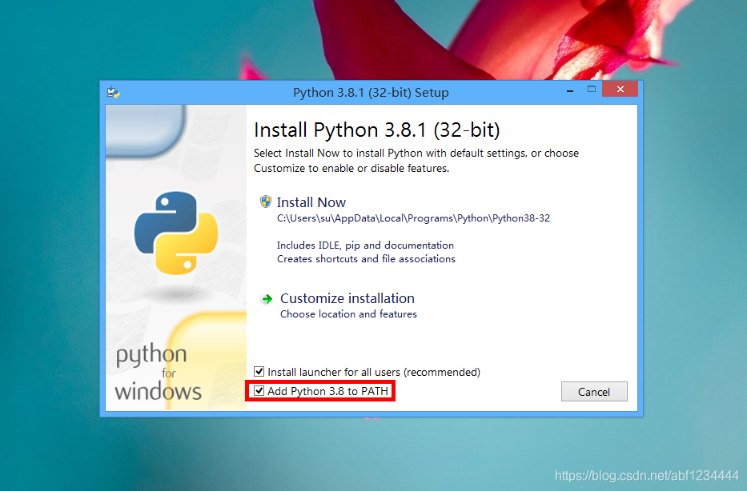
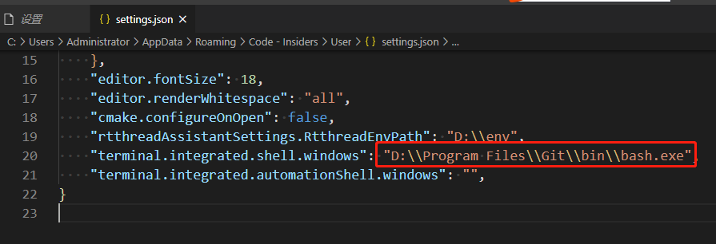
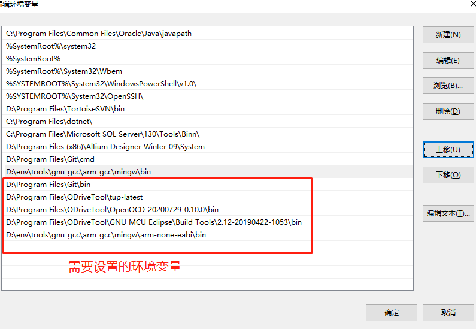
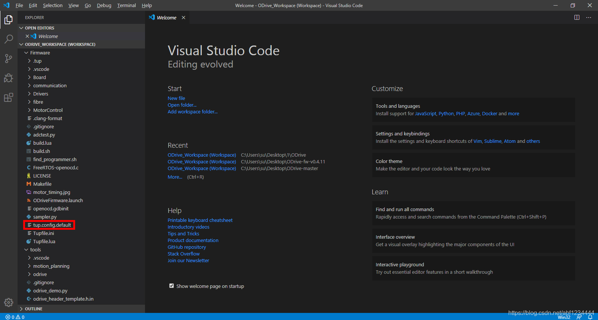
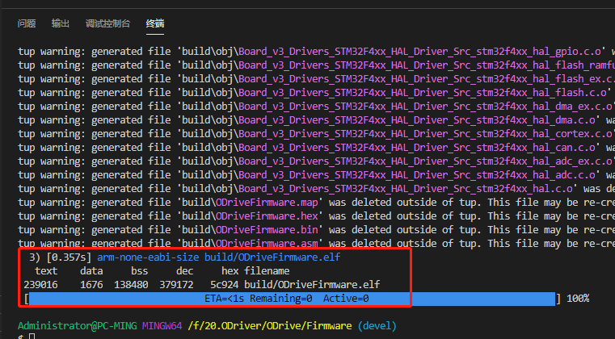

# ODrive 软件开发环境搭建

## 准备要用到的开发工具

使用到的ODrive开发工具为：

1. **Python**: 用于运行工程构建脚本，请用户自行下载；
2. **Git for Windows**: 用于版本管理和使用它的bash终端，请自行下载；
3. **Visual Studio Code**: 轻量级但功能强大的源代码编辑器，请自行下载；
4. **ST-Link/V2 Drivers**: STLink/v2编程器的驱动；
5. **Tup**: 用于调用编译命令的构建系统；
6. **ARM GNU Compiler**: 用于交叉编译代码；
7. **OpenOCD**: 用与使用STLink/v2编程器对ODrive进行烧录；
8. **GNU MCU Eclipse’s Windows Build Tools**: 用于工程构建。

4-8工具打包下载地址如下：
链接：https://pan.baidu.com/s/1XmcqF8QcqrKNknEMFJIlIg 
提取码：swtg 

### 安装 Python

双击运行`python-3.8.1.exe`然后按照提示保持默认安装即可。

***注意：*** 勾选上图中的 `Add Python 3.8 to PATH` 如下图：




### 安装 ST-Link/V2 Drivers

解压 `ST-Link_Drivers.zip` 生成 `ST-Link_Drivers` 文件夹，进入文件夹双击运行 `dpinst_amd64.exe` 按照提示保持默认安装即可。

### 安装 Git for Windows

双击运行 `Git-2.25.0-64-bit.exe` 按照提示保持默认安装即可。

### 安装 Visual Studio Code

双击运行 `VSCodeUserSetup-x64-1.42.0.exe` 按照提示保持默认安装即可。

也可去官方网站下载最新的版本。

### 安装 Visual Studio Code 扩展插件

- 所需扩展插件:
  - C/C++
  - Cortex-Debug
- 推荐安装的扩展插件:
  - Include Autocomplete
  - Path Autocomplete
  - Auto Comment Blocks

### 配置 Visual Studio Code 默认终端

配置 Visual Studio Code 默认终端为 git bash。设置步骤如下：【设置】-》搜索【*terminal.integrated.shell.windows*】-》打开【在settings.json】，修改如下：



***注意： 【D:\\\Program Files\\\Git\\\bin\\\bash.exe】为自己安装git的目录，用户需要切换到自己的安装目录即可，且配置完成后请关闭 Visual Studio Code 再进行下边的步骤***

### 配置 Tup

解压 `tup-latest.zip` 到任意位置，然后将 `tup-latest` 地址添加到系统环境变量 **Path** 中即可。

### 配置 ARM GNU Compiler

解压 `gcc-arm-none-eabi-7-2018-q2-update-win32.zip` 到任意位置，然后将 `gcc-arm-none-eabi-7-2018-q2-update-win32\bin` 地址添加到系统环境变量 **Path** 中即可。

### 配置 OpenOCD

解压 `OpenOCD.zip` 到任意位置，然后将 `OpenOCD\0.10.0-13\bin` 地址添加到系统环境变量 **Path** 中即可

### 配置 GNU MCU Eclipse’s Windows Build Tools

解压 `gnu-mcu-eclipse-windows-build-tools-2.12-20190422-1053-win64.zip` 到任意位置，然后将 `GNU MCU Eclipse\Build Tools\2.12-20190422-1053\bin` 地址添加到系统环境变量 **Path** 中即可。

以上所有步骤执行完后的环境变量如下：



## 编译固件源码

### 下载源码

```bash
git clone https://github.com/madcowswe/ODrive.git
```

vscode 打开源码：双击 `ODrive_Workspace.code-workspace` 选择使用 Visual Studio Code 打开

单击红框中的 `tup.config.default` 文件，配置硬件版本，修改为如下代码：

```c
# Copy this file to tup.config and adapt it to your needs
# make sure this fits your board
CONFIG_BOARD_VERSION=v3.5-24V
CONFIG_USB_PROTOCOL=native
CONFIG_UART_PROTOCOL=ascii
CONFIG_DEBUG=false
CONFIG_DOCTEST=false

# Uncomment this to error on compilation warnings
#CONFIG_STRICT=true

```

然后将 `tup.config.default` 文件重命名为 `tup.config` 然后保存。

### 安装`jsonschema`插件

在vscode终端，安装

```c
pip install jsonschema
```

### 编译

```bash
make -j4
```



### 清除编译

```bash
make clean
```

**注意**：ODrive在编译前会自动检测git版本，如果不想检测，需要修改【tools/odrive/version.py】文件里面的`get_version_from_git`函数。

```python
def get_version_from_git():
    script_dir = os.path.dirname(os.path.realpath(__file__))
    try:
        # Determine the current git commit version
        git_tag = subprocess.check_output(["git", "describe", "--always", "--tags", "--dirty=*"],
            cwd=script_dir)
        git_tag = git_tag.decode(sys.stdout.encoding).rstrip('\n')

        (major, minor, revision, is_prerelease) = version_str_to_tuple(git_tag)

        # if is_prerelease:
        #     revision += 1
        return git_tag, major, minor, revision, is_prerelease

    except Exception as ex:
        print(ex)
        return "[unknown version]", 0, 0, 0, 1
1234567891011121314151617
```

修改后：

```python
def get_version_from_git():
    return "fw-v0.4.11-19-g1c947631*", 0, 4, 11, True
12
```


## 烧录固件

VSCode配置会在此终端中运行命令`make flash`，来烧录固件。

## 调试

Cortex-Debug 扩展插件，专门用于调试ARM Cortex项目。 您可以在此处阅读有关Cortex-Debug的更多信息：https://github.com/Marus/cortex-debug

- 确保将固件源码文件夹作为当前文件夹
- 用最新固件加载到ODrive (如果使用调试模式可以不需要此操作)
- 点击Debug -> Start Debugging (或键盘 F5)
- 处理器将重置并进入暂停
- 设置断点。注意: 您只能在处理器暂停时设置断点，如果在运行模式下设置断点，则不会应用它们
- 运行 (F5)
- Stepping over/in/out, 重新运行, 按下`pause` (F6) 按钮然后重新设置断点等
- 当调试完毕后，您可以按下`stop` (Shift+F5) 停止调试。同时它会自动关闭openOCD